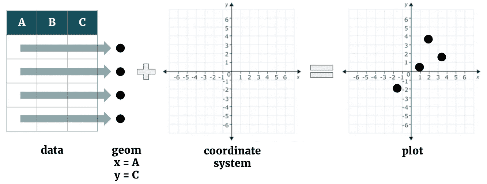
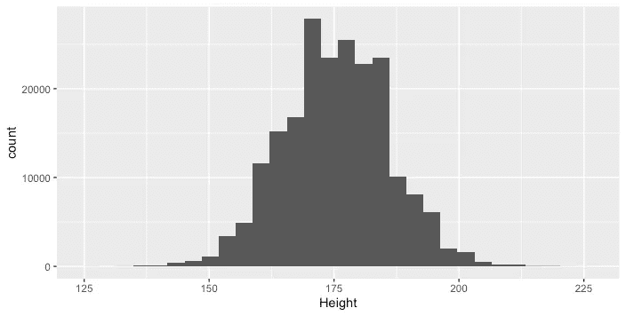
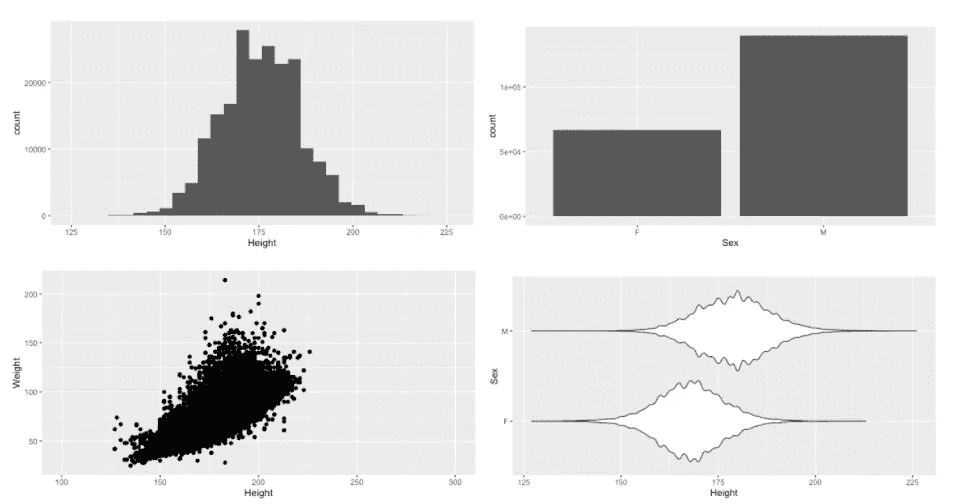
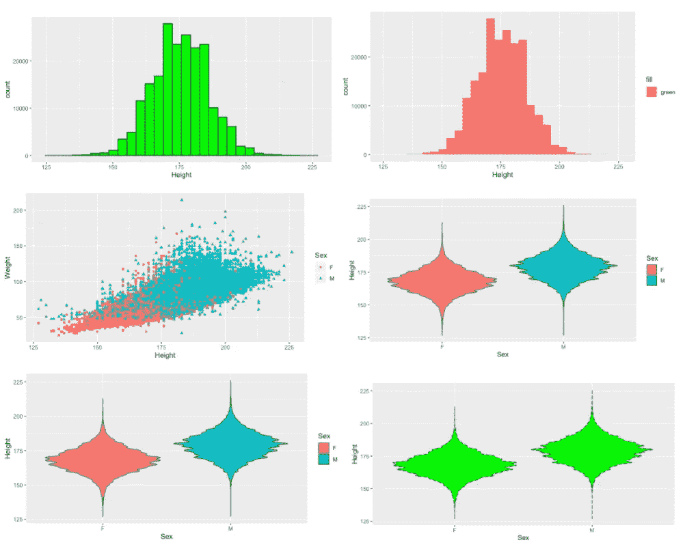
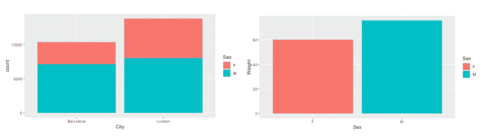
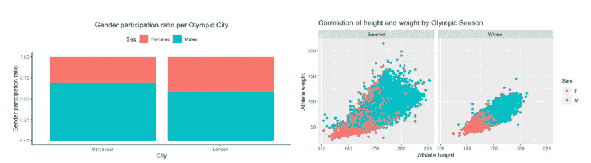

# ggplot2 快速介绍

> 原文：<https://towardsdatascience.com/a-quick-introduction-to-ggplot2-d406f83bb9c9?source=collection_archive---------24----------------------->

## 理解图形的语法将如何帮助你用 ggplot2 构建任何图形

哈桑·阿尔马西在 [Unsplash](/s/photos/layer?utm_source=unsplash&utm_medium=referral&utm_content=creditCopyText) 上的照片

**ggplot2** 是 R 中广泛使用的图形库，也是 [tidyverse](https://www.tidyverse.org/) 的一部分。tidyverse 是一个 R 包的集合，它们共享一个公共的设计哲学、语法和数据结构。例如，tidyverse 中的其他包是 dplyr 或 purrr。

# 图形的语法

ggplot2 建立在图形的**语法之上。ggplot2 的开发者之一 Hadely Wickham 将语法描述为**

> “艺术或科学的基本原则或规则”。

因此，图形的语法是一种描述和创造大范围情节的方法。在 ggplot2 中，所有图都是使用图层创建的，其中每个图层都代表图形的一个组成部分。

在 ggplot2 的快速介绍中，您将了解“gg-plot”是如何构造和构建的。我确信一旦你理解了它的基本结构，你就可以在这些基础上构建未来的任何情节。因此，让我们深入研究，看看我们需要哪些层来使用 ggplot2 创建一个基本的绘图。

# 基础知识

ggplot2 中的每个图形至少使用以下三个组件构建:

1.  **数据**以及数据点如何相互映射
2.  一组**几何对象**也称为**几何图形**(表示数据点的视觉标记，如条、点或线)
3.  一个**坐标系**

除了基本图层之外，ggplot2 还提供了许多其他图层，通过着色、缩放、分面或向数据添加统计变换来调整绘图。

ggplot2 的基础层。图片作者。

让我们建立我们的第一个情节，以更好地理解上面的解释。为此，我将利用 [Kaggle](https://www.kaggle.com/heesoo37/120-years-of-olympic-history-athletes-and-results) 上的*奥运数据集*。开始打印前，请确保安装了库“ggplot2”。此外，我将到处使用 *dplyr* 库进行数据操作。

作为第一个例子，我们绘制了参加奥运会的运动员的身高(数据)的直方图(几何)。该图包括所有必要的组成部分:数据+几何+坐标系。

直方图显示参加奥运会运动员的身高分布。图片作者。

## 几何对象(geoms)

可用几何图形根据显示的变量的*维度*和*类型而变化。例如，在我们的第一个图中，我们绘制了一个变量(高度)，它是连续的。我强烈推荐打开 RStudio 的 ggplot2 [备忘单](https://rstudio.com/wp-content/uploads/2015/03/ggplot2-cheatsheet.pdf)，因为它提供了可用 geoms 的摘要。让我们绘制不同维度和不同类型的变量来了解一下:*

左上:图 1 (1 个变量，连续)，右上:图 2 (1 个变量，离散)，左下:图 3 (2 个变量，都是连续的)，右下:图 4 (2 个变量，一个连续，一个离散)。图片作者。

在不同的几何图形旁边，我们可以观察到另一件事:第二个图(1D，离散)显示一个图**仍然显示**，即使 *coord_cartesian()* 没有添加到代码中。第三个图(2D，两个都是连续的)显示，如果您想根据需要调整坐标系，则 *coord_cartesian()* 是强制的。在下文中，我将把我们的四个基本地块称为地块 1、地块 2、地块 3 和地块 4。

## 添加一些颜色和形状

在上面的例子中，所有的图形看起来都有点暗淡，可以用一些颜色或形状来改善。让我们通过调整**美学属性**让剧情变得更有趣。

美学属性可以用不同的方式来调整。 *aes()* 可以传递给 *ggplot()* 或特定层，如 geom 层。尤其是在处理一维数据时，这会对您的绘图产生影响。

顶行:对基本图 1 的调整。美学属性需要传递给几何层，以获得想要的结果。中间一排(左):调整到基本情节 3。添加了形状和颜色。底行和中间行(右):调整至图 4。图片作者。

在图 1 的调整二中，我们可以看到“绿色”被视为常量变量。这是因为 [*aes 的前两个参数(x，y..*)](https://ggplot2.tidyverse.org/reference/aes.html)被期望的变量。处理二维数据时，情况有所不同(参见图 4 的调整一和调整二)。在这里， *aes()* 可以无影响地传递给 *ggplot()* 或 geom 层。

## 统计变换

除了*几何*层，数据点还可以使用*统计*层映射到坐标系。此外，您可能需要对绘图数据进行统计转换，而不是使用原始数据(stat="identity ")。然后你可以将*几何*层的统计参数设置为“计数”或“汇总”。让我们在图中看到统计如何影响你的图表。

左图:用 stat_layer **计算**运动员人数创建的图。右图:平均重量用作可变重量的统计转换。图片作者。

第一张图显示了每个奥运城市的运动员数量，按性别分类。与此相比，stat_plot2 使用转换“summary”按性别显示运动员的平均体重。

## 位置、标题、图例和网格

现在，您已经了解了 ggplot2 的基础知识。然而，额外的图层可以很容易地添加进去，并极大地影响你的绘图质量:标题、图例、位置或网格。使用 *labs()* 添加图层以调整绘图标题或轴标题，使用 *theme()* 或 *scale_fill_discrete()* 添加图例，或使用 *facet_grid()* 添加网格。

左图:每个奥运城市的性别比例，添加图层以调整标题、图例和条形图。右图:通过添加层来添加网格和标题，按季节显示运动员的身高和体重之间的相关性。

现在你已经有了在 **ggplot2、**中构建一个基本剧情所需的所有工具，在我看来，也有了构建任何更复杂剧情的要求。通过理解《T21》背后的哲学，并将每一次调整视为另一层，你已经成功了一半。密谋愉快！

**资源**

*   [https://rpubs.com/aelhabr/tidyverse-basics](https://rpubs.com/aelhabr/tidyverse-basics)
*   [https://www.tandfonline.com/doi/abs/10.1198/jcgs.2009.07098](https://www.tandfonline.com/doi/abs/10.1198/jcgs.2009.07098)
*   [https://cfss.uchicago.edu/notes/grammar-of-graphics/](https://cfss.uchicago.edu/notes/grammar-of-graphics/)
*   [https://r studio . com/WP-content/uploads/2015/03/gg plot 2-cheat sheet . pdf](https://rstudio.com/wp-content/uploads/2015/03/ggplot2-cheatsheet.pdf)