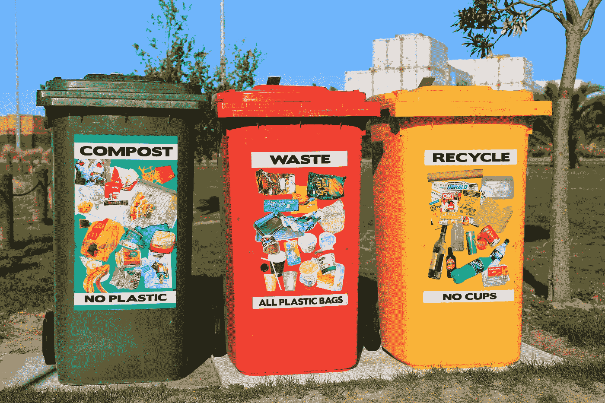

# 关于图及其下游任务的公式的快速注释

> 原文：<https://towardsdatascience.com/a-quick-note-on-graphs-and-the-formulation-of-their-downstream-tasks-d8a8c808c93f?source=collection_archive---------14----------------------->

## 一些重要的任务包括:节点分类、链接预测、社区检测、图分类和三重分类

Robynne Hu 在 [Unsplash](https://unsplash.com/s/photos/network?utm_source=unsplash&utm_medium=referral&utm_content=creditCopyText) 上的照片

G raph 数据结构已经被证明可以有效地捕获复杂的非欧几里得数据，如生物和社交网络(欧几里得数据是图像、文本或简单的数字数据)。

我们成功地使用图形作为输入来建立预测模型，并且将各种深度学习技术应用于图形，在某些情况下，增强了图形机器学习模型的性能。

那么，我们可以使用图形预测什么，以及如何从如此复杂的数据结构中构建预测模型呢？

在这篇文章中，我将解释一些与图相关的任务的公式，这些任务也称为图下游任务。这些任务的公式化通常发生在我们学习了图形实体的数字表示之后。

# 图及其不同类型

照片由 [Alina Grubnyak](https://unsplash.com/@alinnnaaaa?utm_source=unsplash&utm_medium=referral&utm_content=creditCopyText) 在 [Unsplash](https://unsplash.com/s/photos/networks?utm_source=unsplash&utm_medium=referral&utm_content=creditCopyText) 上拍摄

我们使用图形来模拟现实生活中的交互或网络，根据上下文，我们可以使用不同类型的图形结构，例如:

1.  **无向图**:就像一个朋友的社交网络，节点代表个人，边代表他们的友谊。在这里，边没有定向的性质。
2.  **有向图**:这里，我们观察边的有向性质。例如，Instagram 追随者的网络，其中节点是个人账户，边是追随者。比如，我追随埃隆·马斯克，但埃隆并没有追随我。这将向作为关系方向的边添加一个属性。
3.  **单关系图**:这里所有的节点和边都代表一种属性，可以是友谊、互动等，本质上可以是有向的，也可以是无向的。
4.  **多关系图**:这里，节点和边可以有不同的属性，一个简单的例子是代表不同类型朋友的社交网络，比如学校朋友、大学朋友等。知识图(目前非常流行)是多关系图的一个很好的例子。

> 注意:这不是一个详尽的列表。

通常，在图形机器学习中，第一步是使用一组称为低维嵌入或简单的图形实体的数字表示的数字来捕获网络信息。

现在，让我们来谈谈图下游的任务。

# 节点分类

[纳蕾塔·马丁](https://unsplash.com/@splashabout?utm_source=unsplash&utm_medium=referral&utm_content=creditCopyText)在 [Unsplash](https://unsplash.com/s/photos/separation?utm_source=unsplash&utm_medium=referral&utm_content=creditCopyText) 上的照片

图中的节点可以被标记，对于大型图来说，丢失一些标记是常有的事。节点分类被公式化为二元分类任务(在 2 种不同类型标签的情况下)或多类分类任务(> 2 个标签)。

这里，预测机器学习模型的输入特征是节点嵌入或简单的数字表示，例如像节点度、图着色数等图属性。

对于这个分类任务，您可以使用标准的机器学习算法或神经网络方法，如[图形神经网络](/a-beginners-guide-to-graph-neural-networks-using-pytorch-geometric-part-2-cd82c01330ab)。

# 链接预测

这是图机器学习的重要任务之一。链接预测的任务是预测图中缺失的边或链接，以及预测预期的边(在[动态图](/what-are-dynamic-graphs-and-why-they-are-interesting-180b9fab9229)的情况下，边基于图的时间点消失和形成)。

在像蛋白质-蛋白质相互作用这样的生物网络背景下，使用标准的实验室实验，很难识别所有可能的蛋白质-蛋白质相互作用。因此，链接预测在这个领域变得至关重要。

根据图形的类型，链路预测可以用不同的方式表示:

1.  **作为二分类任务**:对于二分类，我们需要两个标签，比如正标签和负标签。我们采用图中存在的边来创建正标签的实例，并且我们可以随机采样一些负边来创建负标签的实例。由于边由两个实体(两个节点)组成，我们对节点嵌入(对应于边)进行逐元素乘法，以获得每个实例(正或负)的一个特征向量。现在，这些特征和标签被用来建立预测模型。[图形神经网络](https://docs.dgl.ai/en/0.6.x/new-tutorial/4_link_predict.html)可用于解决作为二进制分类问题的链路预测问题。
2.  **计分基础法**:思路很简单。我们使用评分函数来学习嵌入，使得我们在具有边缘的情况下得分较高，而在边缘不存在的情况下得分较低。给定分数的阈值，我们可以识别两个给定节点之间的预期边的可能性。在知识图链接预测的情况下，通常采用[基于等级的评估方法](https://pykeen.readthedocs.io/en/stable/tutorial/understanding_evaluation.html)。此外，知识图中的三元组可以被建模为头部预测(？，r，t)和尾部预测(h，r，)模特。这完全取决于使用链路预测任务构建的用例。

# 社区检测/图形聚类

照片由[内森·杜姆劳](https://unsplash.com/@nate_dumlao?utm_source=unsplash&utm_medium=referral&utm_content=creditCopyText)在 [Unsplash](https://unsplash.com/s/photos/community-detection?utm_source=unsplash&utm_medium=referral&utm_content=creditCopyText) 上拍摄

这是一个无监督的聚类任务，目标是找到一组重要的具有相似属性的实体。有几种算法可以找到聚类，我们也可以使用机器学习技术来达到这个目的。

在生物蛋白质-蛋白质网络中，这种聚类也被称为复杂检测。我们确定了蛋白质复合物，它是一种重要的生物机器。

# 图形分类

给定一个较大的图，它可以包含属于某一类的一些较小的图簇。图分类是旨在预测较大图中较小集群/社区的标签或类别的任务。

这类任务的一个示例数据集是一组图表，如来自多特蒙德大学的[蛋白质数据集](https://stellargraph.readthedocs.io/en/stable/demos/graph-classification/dgcnn-graph-classification.html)。数据集中的每张图都有一个标签，标明它是酶还是非酶。总共有 1113 个图，每个图平均有 39 个节点和 73 条边。由于我们有 2 个标签，这是一个二元分类的任务。

# 三重分类

由 [NASA](https://unsplash.com/@nasa?utm_source=unsplash&utm_medium=referral&utm_content=creditCopyText) 在 [Unsplash](https://unsplash.com/s/photos/network?utm_source=unsplash&utm_medium=referral&utm_content=creditCopyText) 上拍摄的照片

[知识图](/why-you-should-pay-more-attention-to-knowledge-graphs-ea88ba38e6c1)中的实体被视为三元组。三重分类归结为二元分类任务，其中有两个标签，即阳性和阴性。正三元组是知识图的一部分，负三元组不是知识图的一部分。

一般来说，学习图形实体的高质量嵌入对于图形机器学习是必要的，显然，对于三分类任务也是如此。我们生成的嵌入应该能够获得比负三元组更高的正三元组分数。我们随后定义了一个阈值来区分正三元组和负三元组。

随着知识图不断增长，越来越多的三元组被添加到其中，可能存在质量差的数据被注入到数据库中的问题。不属于知识图的损坏的三元组可能被注入到知识图中，并且识别这种质量差的数据的一种方式是通过使用三元组分类。

图下游任务的使用更多地依赖于领域和为解决相应的领域问题而构建的用例。请记住，图是对复杂的现实生活场景进行建模的优秀工具，这些场景可能与空间、生物、电信、娱乐业(电影、歌曲推荐)等领域相关，每个领域都可能有数百个问题，并且可能使用图机器学习来解决这些问题。

如果你看到了这篇文章的这一部分，感谢你的阅读和关注。我希望你觉得这篇文章内容丰富，并且可以通过 [LinkedIn](https://www.linkedin.com/in/rohithteja/) 、 [Twitter](https://twitter.com/RohithTeja15) 或 [GitHub](https://github.com/rohithteja) 联系到我。