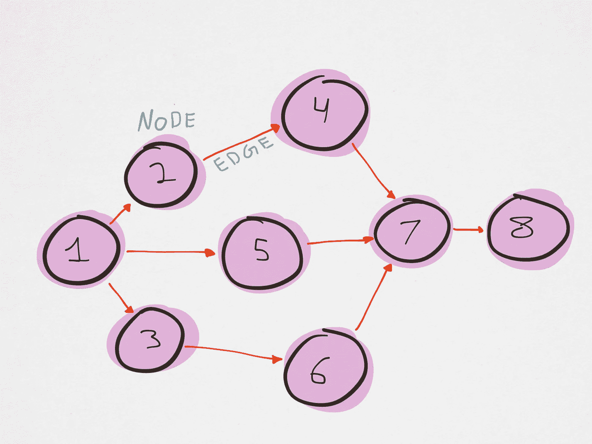
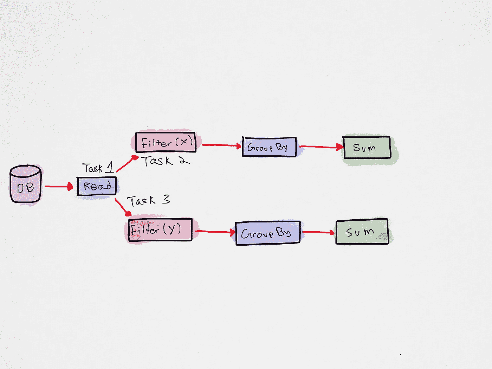
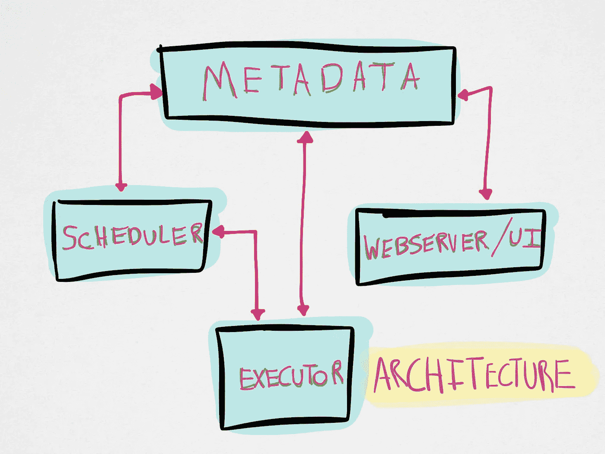
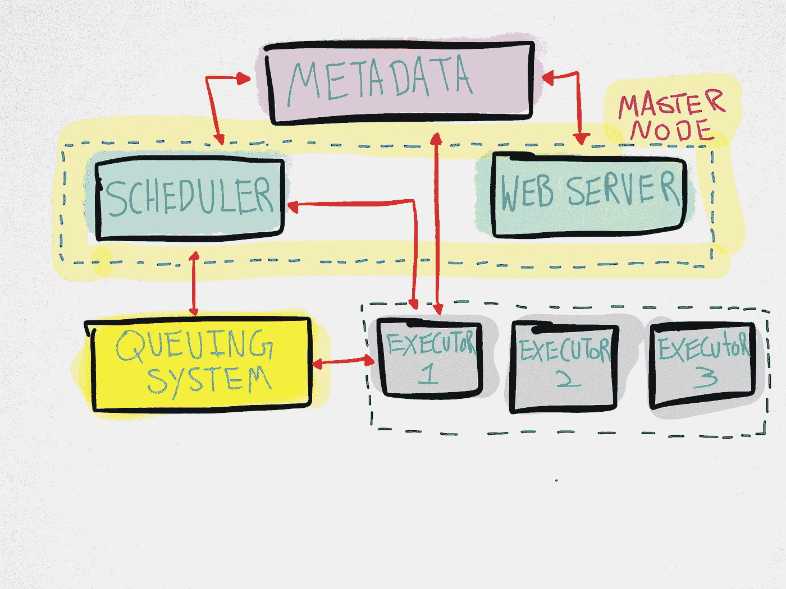

# 阿帕奇气流快速入门

> 原文：<https://towardsdatascience.com/a-quick-primer-on-apache-airflow-d941fe52d8f?source=collection_archive---------11----------------------->

Airflow 是一个用于创作、调度和监控工作流的平台。它本质上是一个运行在元数据数据库上的排队系统和一个运行任务的调度程序。工作流被写成有向无环图(Dag)。工作流和 DAG 可以互换。

## 什么是 Dag？

DAG 是您要运行的任务的集合，其组织方式说明了任务之间的依赖关系和关系。

下图显示了 DAG 是一个单向的非循环图，其中图中的每个节点都是一个任务，边定义了任务之间的依赖关系。在任何情况下，您都不应该能够从前向节点返回到已经执行的节点。

显示节点间非循环关系的图表。除非另有说明，所有图片均由作者提供。

DAG 可以被分解成越来越小的作业，并通过生成用代码编写的动态管道来赋予用户完全的控制权。气流 Dag 也是可扩展的和可伸缩的。Dag 功能强大，因为它们允许协作、可管理和可测试的工作流。额外的好处是 Airflow 是用 python 开发的，可以与任何 python API 接口。

并行运行的气流任务

上图显示了气流如何将任务分成分支，这样，如果一个分支失败，另一个分支仍有输出。此外，随着并行计算的出现，处理时间也减少了。由于每项任务都是独立的，因此失败的可能性总体上会降低。

## 任务是如何执行的？

*   操作符代表工作流中的单个任务，有助于执行您的任务(例如运行 python 函数)。
*   操作员决定当您的 dag 运行时实际要做什么。
*   任务在实例化时是一个操作符。这是工人努力的方向。

**气流架构:**

上图展示了气流工作流程的一般架构。

*   **元数据** —是一个关系数据库，包含任务状态信息，例如消耗内存最多的前十个任务，它包含与当前运行的任务相关的所有数据以及历史数据。
*   **调度器** —决定运行哪个任务、何时运行以及以什么顺序运行。
*   **Web 服务器** —本质上是一个与元数据对话的 flask 应用程序的 UI。
*   **执行者** —在地面执行任务。执行器是一个消息队列进程，它计算出哪个工人将执行哪个任务。默认的是顺序执行器——它不能并行运行任务——这意味着它不能用于生产级代码。也可以使用本地执行器，它将运行任务，直到服务器上的所有资源都达到最大容量。这对于中等数量的 Dag 来说很好。这两者都用于单节点群集中，因此不能用于扩展。
*   **多节点集群** —具有相同的组件，只有调度程序和 web 服务器放在同一个节点(主节点)中，工作程序放在单独的实例中。这种设置工作得很好，因为它允许通过添加更多的多节点集群来进行扩展(celery 是 python 这里选择的执行器)。

如果您不处理万亿字节的数据，那么最好将调度器、web 服务器和执行器一起放在主节点/集群中。缺点是这种单一集群方法在同一台机器上运行所有内容，因此如果您对 DAG/scheduler 进行了更改，那么您需要重新启动整个工作流，甚至是正在执行的任务。芹菜避免了这一点。

分布式气流架构

如果您确实用 celery 构建了一个分布式工作流，那么就需要一个排队系统组件(比如 Redis)。对于本地工作流，排队由系统处理。

## 任务的生命周期

1.  排定程序会定期检查 DAG 文件夹，查看是否有任何需要运行的 DAGS。
2.  如果发现任何 DAGS 等待执行，调度器为其创建图表，这是 DAG 的实时实例化。
3.  调度程序将在元数据中将 DAG 状态更新为正在运行，任务将会执行。
4.  然后，调度程序读取 DAG，并将任务按执行顺序以消息的形式放入排队系统。每个消息都包含像 DAG ID、任务 ID 和要执行的功能这样的信息。
5.  此时，这些任务的状态会更改为“排队”。
6.  然后，执行器开始执行任务，并向元数据发送任务的失败/成功消息。
7.  当所有任务运行成功或失败时，调度程序最终更新图表的状态。