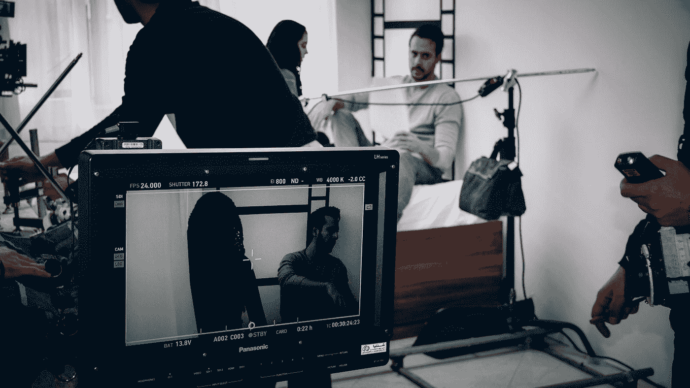

# 对创造性人工智能的一些伦理含义的快速思考

> 原文：<https://towardsdatascience.com/a-quick-reflection-on-some-ethical-implications-of-creative-ai-adba63acdd47?source=collection_archive---------33----------------------->

尼克·莫里森在 [Unsplash](https://unsplash.com?utm_source=medium&utm_medium=referral) 上拍摄的照片

## 人工智能正越来越多地应用于更具创造性的领域，引发了人们对知识产权保护的担忧。

*免责声明:我不是律师，因此，这篇文章不应被用作法律建议，所以把它作为一个新兴技术和市场变化的经验丰富的观察者的个人意见。*

最近，我开始分析一种趋势，这种趋势将人工智能带向一个更具“创造性”的空间，与人类的创造力相结合。

随着人工智能内容生成能力的提高，它开始更经常地应用于更多样化的领域，引发了人们对其内容如何作为知识产权受到保护的担忧。

让我们考虑一下所有依靠知识产权来创造和获取价值的行业和部门。这一系列包括软件、电子产品、消费品、药品、医疗设备、视频游戏、电影和电视、新闻和新闻媒体以及音乐。

这些行业的市场价值和单个参与者的利润与知识产权保护密切相关。

随着人工智能的贡献越来越大，而人类对所产生的价值的贡献越来越小，我们可以预计很快就会看到围绕知识产权是否受到保护的更明显的模糊性。

短期来看，政策环境似乎不会有太大变化。目前的趋势似乎是重申人类作为发明者和作者以及专利和版权办公室在保护人类创造力免受人工智能生成内容影响方面的作用。

照片由 [Sam Moqadam](https://unsplash.com/@itssammoqadam?utm_source=medium&utm_medium=referral) 在 [Unsplash](https://unsplash.com?utm_source=medium&utm_medium=referral) 拍摄

# 人工智能辅助的内容与人工智能生成的内容

在人工智能辅助的努力中，人类正在做出创造性的贡献——通常是当前的艺术状态——人工智能将被视为一种工具，不需要被列为共同发明人，而那些团队成员将被列为发明人和作者。

但一个重要的问题不是人工智能能否成为生产者，而是人工智能的产出能否获得版权。

增强特定技能的人工智能通常不会有显著的不同。然而，当我们有更多的人工智能能力成为相关学术或企业角色的**或 [**作者**](https://en.wikipedia.org/wiki/Author) 时，专利将会增加。希望人工智能辅助的[和人工智能生成的](https://osf.io/preprints/lawarxiv/np2jd/download)输出之间有所区别。**

**如果我们开始想象特定人工智能生成的工作场景——人工智能在没有任何人类干预的情况下找到数据，训练自己，并“创造”特定的输出——我们可以想象它会如何对现有的知识产权规则施加压力。**

**在人工智能创造发明的情况下，我们将看到人类作为中间人，对发明创造提出[可疑的主张](https://www.technologyreview.com/2020/01/08/102298/ai-inventor-patent-dabus-intellectual-property-uk-european-patent-office-law/)，并在知识产权保护有效性的更大不确定性状态下运作。**

**我们会遇到一些奇怪的情况，人工智能的产出将大大超过人类能够创造的东西——不仅仅是像“[额头的汗水](https://en.wikipedia.org/wiki/Sweat_of_the_brow)这样的作品，而是真正的莎士比亚级别的[小说](https://en.wikipedia.org/wiki/Novelty_(patent))——但在最严格的法律解释下，不值得知识产权保护。**

**这里提出了一个伦理困境…谁拥有权利和责任，例如，如果我们有一个仍在运行并自主产生发明的人工智能，但开发该人工智能的所有原始团队成员都死了？**

**在这种情况下，编辑或团队的公司将仍然拥有人工智能。尽管如此，其雇员在专利申请中对专利权的任何主张都是牵强附会的，不是吗？**

**还有一个问题是，如果没有杰出的人或公司控制这样的人工智能，谁来为自主人工智能从事有问题的行为承担责任，例如[专利侵权](https://www.raconteur.net/risk-management/ai-ip-rights)。**

**在回答谁将被视为对人工智能系统编写的信息负责时，[圣巴勃罗 CEU 大学传播学院教授、**Idoia Ana Salazar garcía 确认经理将负责媒体事务。最终，这台机器会像另一名雇员一样，给记者提供报道角度的建议。**](https://sciencemediahub.eu/2019/10/08/the-use-of-ai-in-data-journalism-what-are-the-ethical-implications/)**

****这就是为什么我们必须教育媒体经理和编辑，让他们知道算法的决定如何能够产生重大的社会影响。****

****当然，版权和专利是不同的情况。目前，美国只为[人类创作的作品](https://www.uspto.gov/sites/default/files/documents/Intellectual%20Property%20Owners%20Associatio_RFC-84-FR-58141.pdf)注册版权(即使考虑 AI 辅助)。与此同时，英国、印度、新西兰、南非和香港等其他国家已经建立了保护计算机生成作品的框架和先例，但作者仍需是人类。然而，著作权被分配给安排创作作品的人。****

********

****照片由[附身摄影](https://unsplash.com/@possessedphotography?utm_source=medium&utm_medium=referral)在 [Unsplash](https://unsplash.com?utm_source=medium&utm_medium=referral) 上拍摄****

# ****但是谁来保护 AI 的权利呢？****

****人工智能本身如何受到保护与它的输出如何受到保护是一个不同的问题。****

****人工智能的某些方面可以通过[专利](https://www.wipo.int/edocs/pubdocs/en/wipo_pub_1055.pdf)和[版权](https://www.uspto.gov/sites/default/files/documents/Intellectual%20Property%20Owners%20Associatio_RFC-84-FR-58141.pdf)得到保护。有些元素——比如数据集和算法——非常适合作为商业秘密。****

****随着人工智能变得越来越有价值，我们将看到窃取敏感人工智能技术的企图显著增加。反过来，人工智能公司将需要用网络安全解决方案和程序来捍卫它们皇冠上的宝石。****

****还有一个问题是，人工智能是否可以在音乐等受保护的内容上接受训练，这在法律中还没有完全解决。****

****虽然版权所有者通常持有[衍生作品](https://www.copyright.gov/circs/circ14.pdf)的权利，但如果经过训练的算法[没有降低](https://theblog.adobe.com/copyrights-in-the-era-of-ai/)原创作品的价值，并且经过训练的人工智能的材料很少，那么使用受保护的数据来训练算法[可能属于合理使用](https://www.uspto.gov/sites/default/files/documents/Intellectual%20Property%20Owners%20Associatio_RFC-84-FR-58141.pdf)。****

****相比之下，如果人工智能出于比较的目的保留受保护材料的数据库(例如，用于监控的面部识别)，[这可能是不道德的使用](https://www.uspto.gov/sites/default/files/documents/Intellectual%20Property%20Owners%20Associatio_RFC-84-FR-58141.pdf)，正如美国知识产权所有者协会(IPO)在 2020 年确认的那样。****

****一些国家正在探索在人工智能培训中使用版权材料的明确豁免——日本已经更新了法律。****

********

****[杆长](https://unsplash.com/@rodlong?utm_source=medium&utm_medium=referral)在[未飞溅](https://unsplash.com?utm_source=medium&utm_medium=referral)上拍照****

# ****结论****

****这个领域的可能性是无穷无尽的，而我们只是处在这场创造性革命的开端。****

****目前，没有任何即将出台的政策来抑制或影响人工智能著作权或专利局，只要它们符合当前法规设定的准则。****

****这意味着，在完全由人工智能产生的发明中，我们将在一个更大的不确定性状态下运作，在很长一段时间内，知识产权保护的有效性仍然是一个开放的问题:****

****谁拥有人工智能产生的发明的权利和责任？****

# ****还有一件事…****

****如果你想阅读更多关于创造性人工智能以及如何开始学习它的内容，你可能也想阅读以下文章:****

**** [## 创造性人工智能概述

### 分析一种趋势，这种趋势正在将人工智能带向一个与人类创造力相结合的更具“创造性”的空间。

medium.com](https://medium.com/towards-artificial-intelligence/an-overview-of-creative-ai-3fb2e6d2706b)  [## 定义人类和人工智能的简单方法

### 在你开始担心人工智能之前，你应该考虑分析人类智能和人工智能之间的关系。

medium.com](https://medium.com/towards-artificial-intelligence/a-simple-approach-to-define-human-and-artificial-intelligence-4d91087d16ff)  [## 今天学习人工智能、人工智能和数据科学的最佳免费课程。

### 60 多门课程，有评分，有简要总结(当然是 AI 做的)。

medium.com](https://medium.com/dataseries/my-favorite-free-or-free-to-audit-courses-to-learn-ai-ml-and-data-science-f15f614a84e5) 

此外，我刚刚在亚马逊 上出版了一本新的电子书 [**，今年我已经在着手出版一些其他的了……让我们保持联系，一起努力吧。**](https://www.amazon.com/Jair-Ribeiro/e/B08RW788MS?ref_=dbs_p_ebk_r00_abau_000000)

 [## 贾伊尔·里贝罗

### Jair Ribeiro 出生于巴西，自 1998 年以来曾在多个国家居住过；三个女儿的父亲，他住在…

www.amazon.com](https://www.amazon.com/Jair-Ribeiro/e/B08RW788MS) 

# 参考

1.  人工智能在数据新闻中的应用:什么是伦理…[https://science media hub . eu/2019/10/08/the-use-of-ai-in-data-journalism-what-is-the-ethical-implications/](https://sciencemediahub.eu/2019/10/08/the-use-of-ai-in-data-journalism-what-are-the-ethical-implications/)
2.  开发人员人工智能伦理指南。[https://www . emerald . com/insight/content/doi/10.1108/JICES-12-2019-0138/full/html](https://www.emerald.com/insight/content/doi/10.1108/JICES-12-2019-0138/full/html)
3.  探索最终用户许可协议。[https://alexjohnlucas.com/type/eula](https://alexjohnlucas.com/type/eula)
4.  创造性人工智能概述—[https://medium . com/forward-artificial-intelligence/an-Overview-of-Creative-AI-3 fb2 e6d 2706 b](https://medium.com/towards-artificial-intelligence/an-overview-of-creative-ai-3fb2e6d2706b)
5.  人工智能，伦理和版权。[https://hughstephensblog . net/2020/03/16/ai-ethics-and-copyright/](https://hughstephensblog.net/2020/03/16/ai-ethics-and-copyright/)
6.  人工智能|塑造欧洲的数字未来。[https://EC . Europa . eu/digital-single-market/en/artificial-intelligence](https://ec.europa.eu/digital-single-market/en/artificial-intelligence)
7.  邪教委员会研究-人工…[https://www . europal . Europa . eu/RegData/etudes/BRIE/2020/629220/IPOL _ BRI(2020)629220 _ en . pdf](https://www.europarl.europa.eu/RegData/etudes/BRIE/2020/629220/IPOL_BRI(2020)629220_EN.pdf)****