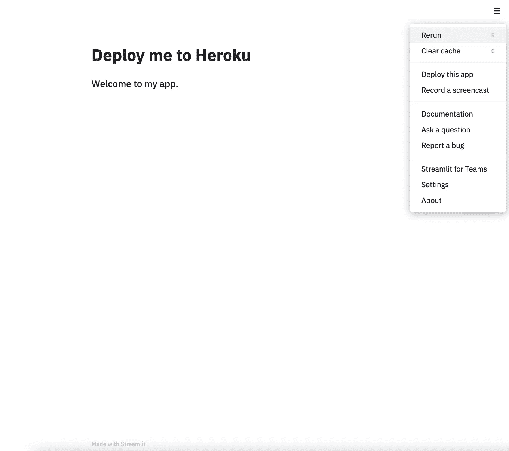
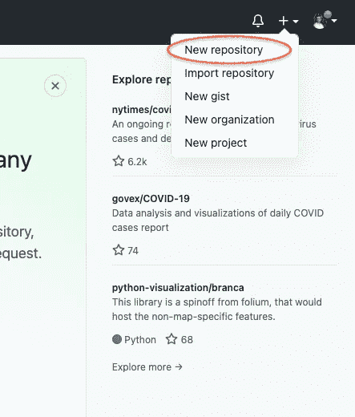
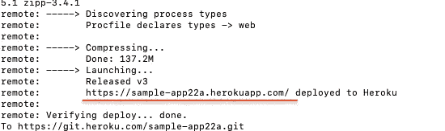

# 关于如何将您的 Streamlit 应用程序部署到 Heroku 的快速教程。

> 原文：<https://towardsdatascience.com/a-quick-tutorial-on-how-to-deploy-your-streamlit-app-to-heroku-874e1250dadd?source=collection_archive---------5----------------------->

## 关于如何在 Heroku 上托管您的 Streamlit 应用程序的终极指南。


凯文·Ku 在 [Unsplash](/s/photos/code?utm_source=unsplash&utm_medium=referral&utm_content=creditCopyText) 上的照片

欢迎学习如何将您的 Streamlit 应用程序部署到 Heroku 的分步教程。在过去的两周里，我一直在使用 Streamlit，它的功能给我留下了深刻的印象。它非常适合与全世界分享您的数据科学项目，因为它非常简单。在本教程中，我假设您已经完成了您的应用程序，并且处于部署项目的最后阶段。根据我过去两周的经验，您会认为您可以使用 Streamlit Sharing 立即部署您的项目。但是，您需要申请该功能，他们可能需要几天时间向您发送邀请。更糟糕的是，我甚至听说过这样的故事，人们等了一个星期才收到邀请，以利用 Streamlit 共享。如果你不能等待，你可以将你的应用程序部署到 Heroku 或其他主机上。在本指南中，我将只介绍如何将你的应用程序部署到 Heroku 和**上。注意，如果你想将它托管在 AWS 或其他地方，下面的步骤将不起作用。**

# 步骤 1:在本地运行您的 Streamlit 应用程序

第一步是确保您有一个 python 文件。如果您正在使用 Jupyter 笔记本，请确保将您的文件下载为. py 文件。如果你想用 Streamlit 在本地运行你的代码，然后把它推送到 Heroku，这是必要的。我已经创建了一个样本 Streamlit 应用程序，所以我们可以跟着这里。我的 python 脚本的名称是 app.py。要在本地运行代码，请使用命令行界面(CLI)转到保存脚本的目录。进入目录后，运行以下命令。

```
streamlit run app.py
```

你的浏览器会自动打开一个窗口，如下图所示。



作者图片

瞧，您已经在本地机器上运行了您的 Streamlit 应用程序。

# 步骤 2:创建 GitHub 存储库

下一步是为你的应用程序创建一个 GitHub repo。登录您的 GitHub 帐户，按照以下步骤操作:



作者图片

键入您的存储库名称，然后单击“创建存储库”


作者图片

现在，您已经创建了回购，是时候进行第一次提交并推动回购了。在您的终端中，移动到 app.py 所在的目录，并复制粘贴以下代码。

```
echo "# streamlit-to-heroku-tutorial" >> README.md
git init
git add README.md
git commit -m "first commit"
git branch -M master
git remote add origin https://github.com/your_username/your_repo_name.git
git push -u origin master
```

我在上面的代码中初始化我的目录，添加一个 README.md 文件，一个带有你在上面看到的 URL 的远程源，并进行我的第一次推送。

# 步骤 3:创建 requirements.txt、setup.sh 和 Procfile。

下一步是至关重要的，你要确保你没有任何错别字或任何错误。否则，Heroku 将在您部署应用程序时运行错误。在继续之前，请确保您的目录中有 app.py 和 README.md 文件。

**requirements.txt** :创建一个 requirements.txt 文件(**没有大写字母！**)并将所有库添加到您在 python 脚本中使用的文件中。在我的 app.py 示例中，我只是导入了以下库:

```
import streamlit as st
```

因此，我在 requirements.txt 文件中添加了“ *streamlit* ”。Heroku 需要这个文件来知道它需要哪些库来运行您的应用程序。

**setup.sh** :下一个文件是 setup.sh 文件。这是一个 shell 文件，您需要在文件中添加以下 shell 命令。将下面的代码复制粘贴到文件中:

```
mkdir -p ~/.streamlit/echo "\
[server]\n\
headless = true\n\
port = $PORT\n\
enableCORS = false\n\
\n\
" > ~/.streamlit/config.toml
```

如果不添加此文件，当您将应用程序部署到 Heroku 时，将会收到一条错误消息。因此，请确保您创建这个应用程序，并按照我上面写的那样命名。**没有大写字母！**

**Procfile** :在您的目录中，创建一个文本文件，并将其命名为“Procfile”在该文件中，复制粘贴以下代码:

```
web: sh setup.sh && streamlit run app.py
```

“web”意味着它是一个 web 应用程序。一旦你在 Heroku 上运行这个应用程序，Procfile 就能很好地指定命令。我们指定上面创建的 shell 文件，然后调用 Streamlit 来运行 app.py。

一旦你创建了上面的文件，回顾这些步骤，确保你按照我上面的命名来命名这些文件。不用说，如果你的应用程序有更多的库，你需要在 requirements.txt 文件中列出它们。您要导入的任何库都需要在该文件中。

# 第三步:连接到 Heroku

一旦你创建了所有需要的文件，现在是时候设置你的应用程序，以便它可以与 Heroku 交互。

你要做的第一件事是确保你已经在你的机器上安装了 Heroku 并创建了一个免费帐户。请参见下面的链接创建一个帐户。

[](https://www.heroku.com/) [## 云应用平台| Heroku

### 无论您是在构建简单的原型还是关键业务产品，Heroku 的全托管平台都能为您提供…

www.heroku.com](https://www.heroku.com/) 

根据文档，Heroku CLI 需要 Git。因此，如果你没有 Heroku，点击下面的链接，你可以安装它。

[](https://devcenter.heroku.com/articles/heroku-cli) [## Heroku CLI

### Heroku 命令行界面(CLI)使得直接从终端创建和管理您的 Heroku 应用程序变得非常容易…

devcenter.heroku.com](https://devcenter.heroku.com/articles/heroku-cli) 

当您在机器上安装了 Heroku 并创建了一个帐户后，就该从终端登录您的 Heroku 帐户了。在您的终端中运行以下命令:

```
heroku login
```

终端返回以下行:

' ' heroku:按任意键打开浏览器登录或按 q 退出:''

只需点击任意键，你的浏览器就会自动打开。您应该看到以下内容:


作者图片

接下来，单击登录并输入您的凭据。之后，您将看到以下内容:


作者图片

如上图所说，你可以关闭窗口，返回 CLI。下一步是创建 Heroku 应用程序。键入以下命令:

```
heroku create sample_app22a
```

在这里，我正在创建一个名为“sample_app22a”的应用程序。如果不指定名称，它将创建一个随机编号的应用程序。因此，我建议为你的应用程序选择一个名字。最后一步是将我们的文件推送到 Heroku。由于 Heroku 使用的是 git，所以命令行会很容易理解。键入以下内容:

```
git push heroku master
```

一旦你执行了上面的命令，Heroku 需要几秒钟来安装所有的库并设置你的应用。您将在输出中看到一个 URL，这将是您的应用程序的 URL。请见下文，以供参考。



作者图片

我们没有收到错误消息，现在是时候检查应用程序了。点击下面的链接，你可以在 Heroku 上看到我们的 Streamlit 应用。

 [## 细流

### 编辑描述

sample-app22a.herokuapp.com](https://sample-app22a.herokuapp.com/) 

好了，伙计们。现在你的应用程序开始工作了，你想把你的改变也推送到你的回购中。

```
git add -A
git commit -m "Type in a message"
git push 
```

# 最终意见:

我建议等到收到 Streamlit 共享邀请，这样你就可以利用那个特性，而不是把它部署到 Heroku。我自己创建了一个应用程序，我将在接下来的几天里写一写。当使用 Heroku 的时候，渲染时间对于一些情节来说会稍微长一点。然而，如果你没有时间并且需要尽快部署，Heroku 也会完成这项工作。

希望本文能让您更好地理解如何将您的 Streamlit 应用程序部署到 Heroku。如果你对这个话题有任何问题或有任何反馈，请告诉我。如果你喜欢这篇文章，如果你能在任何社交媒体平台上分享它，我将非常感激。我将在下一篇文章中向您介绍我用 Streamlit 创建的 Covid19-Dashboard web 应用程序及其共享功能。敬请关注！直到下一个 time️ ✌️

[](https://www.navidma.com/) [## 纳维德·马辛奇作品集

### 我是 Navid Mashinchi，是加利福尼亚州萨克拉门托的一名数据科学家。我一直在分析领域工作…

www.navidma.com](https://www.navidma.com/)