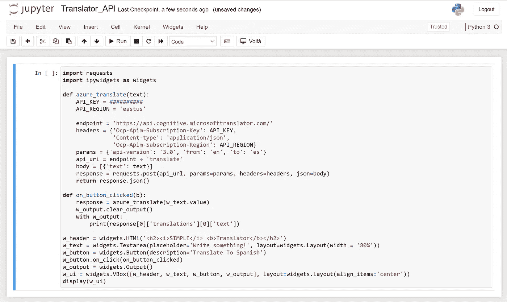
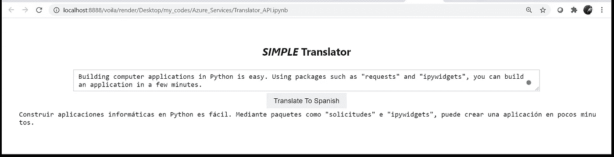

# 用 Python 构建应用程序的快速方法

> 原文：<https://towardsdatascience.com/a-quick-way-to-build-applications-in-python-51d5ef477d88?source=collection_archive---------3----------------------->

## 编程；编排

## 用几行代码构建 MVP


[HalGatewood.com](https://unsplash.com/@halacious?utm_source=unsplash&utm_medium=referral&utm_content=creditCopyText)在 [Unsplash](https://unsplash.com/s/photos/design?utm_source=unsplash&utm_medium=referral&utm_content=creditCopyText) 上拍照

构建具有图形用户界面并执行复杂任务的 Python 应用程序可能看起来很困难。在最近发表的一篇文章中(见下面的链接)，我提到了开始构建应用程序只需要 7 个 Python 库。

[](/build-your-first-data-science-application-9f1b816a5d67) [## 构建您的首个数据科学应用

### 七个 Python 库，打造你的第一个数据科学 MVP 应用。

towardsdatascience.com](/build-your-first-data-science-application-9f1b816a5d67) 

本文将用几行代码向您展示如何构建一个简单的翻译应用程序。我只使用两个 Python 库:requests 和 ipywidgets。

# 基础

我选择编写一个翻译器应用程序作为示例，向您展示用 Python 构建应用程序是多么容易。这个应用程序获得一个英语文本，并显示其西班牙语翻译。非常简单明了。

为此，我们需要应用程序中的两个部分。第一部分是执行翻译的后端，第二部分是与用户交互的前端或图形用户界面(GUI )(获取输入文本并显示输出文本)。

对于后端，我使用 Azure 翻译 API。如果你不熟悉 API(应用编程接口)的概念，我试着用一种毫不费力的方式来解释。API 是一种向服务提供商(通常是服务器)请求服务(例如翻译)的方式(即协议)。例如，您可以使用 Google Maps API 来获取两个位置之间的行驶距离。想象一下，如果 Google Maps API 不存在，那么您应该编写自己的代码来计算基于道路数据库的行驶距离。简单地说，API 阻止你重新发明轮子。有时候第三方 API 是免费的，但是大多数时候，你必须支付一点点费用(特别是如果你经常使用它们的话)。出于本文的目的，我们使用 Microsoft Azure Translator API，它是免费的，可以有限地使用。如果您没有 Azure 帐户，请阅读下一部分；否则可以跳过。

# 如何创建免费的 Azure 帐户

如果你没有 Azure 帐户，你可以注册一个免费的。按照以下链接中的说明进行操作。它很简单，让你可以免费使用数十种令人敬畏的 API 和服务。

[](https://docs.microsoft.com/en-us/learn/modules/create-an-azure-account/) [## 创建 Azure 帐户-了解

### 使用 Azure 的第一步是注册。你可以在微软的帮助下直接通过 Azure.com 注册

docs.microsoft.com](https://docs.microsoft.com/en-us/learn/modules/create-an-azure-account/) 

创建一个免费的 Azure 账户后，你需要给你的账户添加 Azure Translator API。还是那句话，洒脱。您需要遵循以下链接中的步骤。

[](https://docs.microsoft.com/en-us/azure/cognitive-services/translator/translator-how-to-signup) [## 入门-翻译- Azure 认知服务

### 没有户口？你可以创建一个免费的帐户免费进行实验。已经有账户了？在…之后登录

docs.microsoft.com](https://docs.microsoft.com/en-us/azure/cognitive-services/translator/translator-how-to-signup) 

如果你做的一切都正确，你必须有一个 API 密匙(即认证密匙)。密钥只是一个字符串，让你可以使用 Azure Translator API。您需要将它放入您的 Python 程序中(下一节)。记住，永远不要和任何人(包括你的用户)分享你的 API 密匙。

# A)部分 API

现在你已经有了 Azure Translator 的 API 密匙(恭喜你！)，让我们看看如何通过 Python 与 API 对话。

使用 API 的最流行的 Python 库之一是“请求”您可以使用安装它

```
pip install requests
```

或者

```
conda install -c anaconda requests
```

以下 Python 函数获取文本，并向 Azure Translator API 发送请求。

在继续之前，我必须告诉你一个重要的观点(尤其是对初学者)。事实是:

> 每个 API 都有一组请求服务的规则。使用谷歌地图 API 不同于 Azure Translator API。要使用 API，您必须阅读文档。

让我们回到我们的代码…

在代码中，您必须输入您的 API 键(参见`API_KEY`)并指定您的 API 区域(参见`API_REGION`)。`requests.post`向 Azure Translator API 发送 POST 请求。要发送请求，需要传递 URL 地址、参数、头和主体。URL 地址是一个 web 地址，Azure 服务器会持续监控该地址是否有任何即将到来的请求。一旦服务器看到您的请求，首先，它检查您在头部的凭证。如果您的凭证有效，它会查看您的参数以了解您的请求。例如，在这种情况下，我请求将 3.0 版的翻译程序从英语(即`en`)翻译成西班牙语(即`es`)。如果参数有效，那么 API 服务器获取主体(即本例中的 JSON 对象)并处理我的请求。最后，`requests.post`返回给我一个 JSON 对象，我将其命名为`response`。

你可以用一个简单的例子来检验这个函数。在代码末尾添加以下几行，然后运行它。

```
if __name__ == '__main__':
    print(azure_translate('Hello world.'))
```

您必须看到这样的输出。

```
[{'translations': [{'text': 'Hola mundo.', 'to': 'es'}]}]
```

这是响应您的请求的 JSON(或 Python 字典)对象。如果仔细观察，您会看到翻译以及一些附加信息，如翻译的语言(即西班牙语或`es`)。

同样，这里所说的一切都是基于文档的，在阅读文档之后，您必须能够使用任何 API。如果你不读它，你永远不知道如何与一个 API 通信，以及应该用什么数据结构传递什么参数。

# B)部分图形用户界面

现在您已经准备好了后端，是时候构建前端了。正如我之前提到的( [link](/build-your-first-data-science-application-9f1b816a5d67) )，ipywidgets 和 Jupyter 笔记本是为浏览器构建简单用户界面的良好组合。

对于我的简单应用程序，我只需要用户界面中的一些元素。这些要素是:

1.  显示应用程序名称的标题(装饰性功能)。
2.  用于输入英文文本的文本区小工具。
3.  点击后请求翻译的按钮。
4.  打印西班牙语译文的空白区域。

Ipywidgets 有一组小部件来创建不同种类的用户界面和仪表板。对于这个应用程序，我将使用一个用于标题的`HTML`小部件、一个用于输入文本的`Textarea`小部件、一个用于请求翻译的`Button`小部件和一个用于打印结果的`Output`小部件。然后我用一个`VBox`小部件将它们垂直对齐放入一个容器中。

唯一的技巧是当用户点击翻译按钮时如何请求翻译服务。在点击事件时定义这个动作很简单。为此，我定义了一个函数，并将其传递给按钮的`on_click`方法。当用户点击翻译按钮时，指定的函数将运行并向 Azure Translator API 发送请求。简单吧？

下面的代码显示了应用程序的前端部分。

# 最终产品

现在，是时候把所有东西放在一个 Jupyter 笔记本文件中了。将这两部分放入 Jupyter 笔记本文件并保存(例如 Translator_API.ipynb)。



图片由作者提供。

由于 Ipywidgets 与 Chrome 配合得非常好，所以请检查您的默认浏览器是否是 Chrome。将默认浏览器设置为 Chrome 后，打开终端，通过 Voila 运行 Jupyter 笔记本代码。

```
voila Translator_API.ipynb
```

几秒钟后，您一定会看到您的应用程序在浏览器中自动打开。像我在这里做的那样测试一下。



图片由作者提供。

瞧啊。！！！！只需几个步骤，您就完成了简单的翻译应用程序。您可以通过使用 **ipyvuetify** 来改善您的 GUI 外观，这是一个充满现代外观小部件的库。你也可以使用 **ngrok** 和其他人分享你的 MVP(最小可行产品)(详情阅读下面的文章)。

[](/how-to-share-your-jupyter-notebook-in-3-lines-of-code-with-ngrok-bfe1495a9c0c) [## 如何用 Ngrok 用 3 行代码分享你的 Jupyter 笔记本

### 想象一下，让你的朋友在远程机器上使用你的本地 Jupyter 笔记本

towardsdatascience.com](/how-to-share-your-jupyter-notebook-in-3-lines-of-code-with-ngrok-bfe1495a9c0c) 

# 摘要

用 Python 构建应用程序既简单又快速。您可以使用 API 来避免重新发明轮子并构建您的后端。您还可以使用简单的库，如 ipywidgets 或 ipyvuetify，为您的应用程序构建一个简单的 GUI。在本文中，我向您展示了如何用几行代码构建一个简单的翻译应用程序。同样的方法可以应用于更复杂的 MVP 应用程序。

在[媒体](https://tamimi-naser.medium.com/)和[推特](https://twitter.com/TamimiNas)上关注我的最新消息。