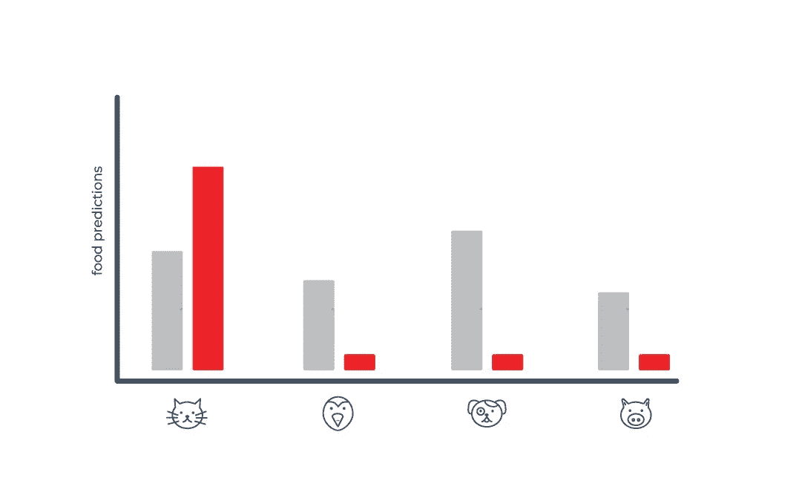
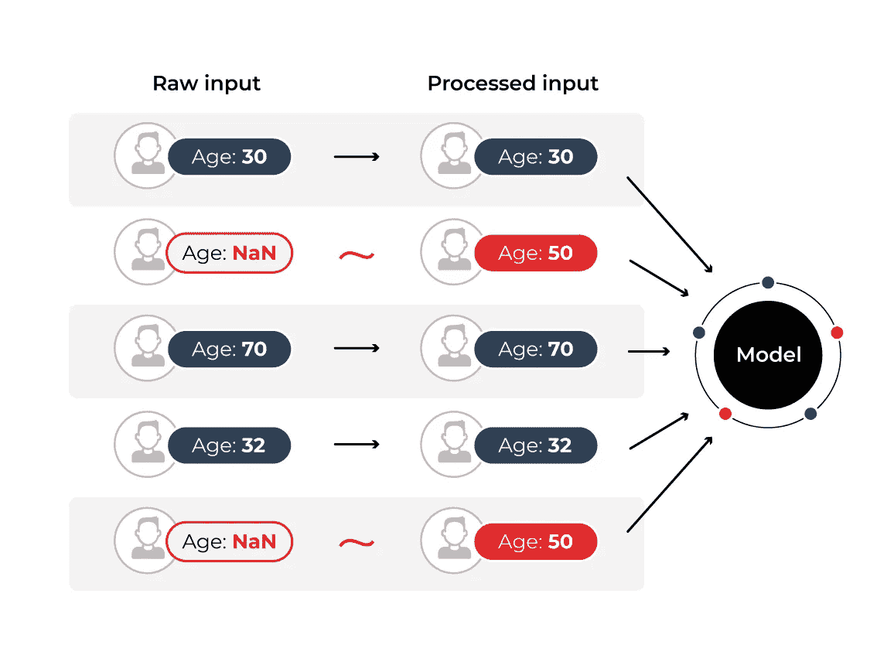
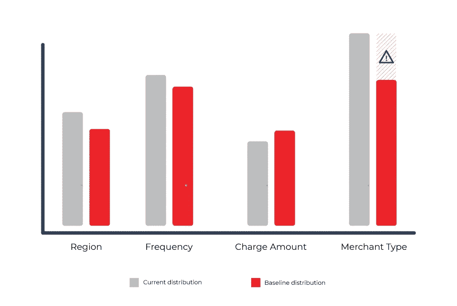

# 机器学习数据质量监控快速入门

> 原文：<https://towardsdatascience.com/a-quickstart-guideto-high-quality-data-4112ee8c498b?source=collection_archive---------11----------------------->

## [行业笔记](https://towardsdatascience.com/tagged/notes-from-industry)

作者图片

数据正迅速成为我们当前技术的生命线，使公司能够为客户构建、衡量和改善新体验。今天，这不仅仅局限于尖端技术；相反，收集和利用数据在许多商业领域变得非常普遍。

现在，随着机器学习的兴起使新的客户体验成为可能，对数据的重新依赖正在出现。在 ML 驱动的系统的新环境中，构建和维护高质量的数据源变得前所未有的重要。今天的 ML 系统需要大量的数据才能良好运行，处理如此大量的数据给采用这些技术的公司带来了真正的问题。

在今天的实践中，一个模型的好坏往往取决于它所训练的数据。**数据质量在模型被训练后并没有停止变得重要，而是在模型被部署到生产中时仍然重要。**模型预测的质量在很大程度上取决于支持模型功能的数据源的质量。在这篇文章中，我将解释为什么您的团队应该密切关注您的数据质量以及对您的模型最终性能的影响。

# 我们所说的数据质量是指什么？

数据质量是一个宽泛的术语，可以涵盖数据中的各种问题。首先，让我们定义一下这篇文章中我们不会谈论的内容。在这篇文章中，我们不打算关注“缓慢出血”故障，例如数据随时间的逐渐漂移。如果你有兴趣了解这个极其重要的话题，你可以看看我们早期的一些作品，在这些作品中，我们围绕这个进行了更深入的[。](https://arize.com/ml-model-problems/)

那还剩下什么？嗯，这大体上留下了数据管道中硬故障的概念。为了更深入地挖掘，让我们打破分类数据流和数字数据流的概念。

# 分类数据

分类数据就像它听起来的那样，是一系列类别，比如某人拥有的宠物类型:狗、猫、鸟、猪？等等。

## 基数变化

首先，分类数据流可能出错的地方是类别分布的突然变化。更极端地说，假设你的模型预测为你的宠物用品店买哪种宠物食品，开始看到数据说人们现在只养猫。这可能会导致你的模型只购买猫粮，而你所有养狗的潜在客户将不得不去街上的宠物用品店。

作者图片

## 数据类型不匹配

除了分类数据中基数的突然变化之外，数据流还可能开始返回对该类别无效的值。很简单，这是您的数据流中的一个错误，并且违反了您在数据和模型之间建立的契约。发生这种情况有多种原因:您的数据源不可靠、您的数据处理代码出错、一些下游模式更改等等。在这一点上，无论从您的模型中产生什么都是未定义的行为，您需要确保保护自己免受类型不匹配的影响，就像在分类数据流中一样。

## 缺失数据

从业者遇到的一个令人难以置信的常见场景是丢失数据的问题。随着用于计算现代 ML 模型的大特征向量的数据流数量的增加，这些值中的一些将为零的可能性比以往任何时候都高。那么你能做些什么呢？

您肯定可以做的一件事是，在培训环境中举手放弃该行，或者在生产环境中在应用程序中抛出一个错误。虽然这将帮助您避免这个问题，但它可能不是最实用的。如果您有数百、数千或数万个数据流用于为您的模型计算一个特征向量，那么丢失其中一个数据流的可能性非常高！

接下来，我们将讨论如何填充这个缺失值，通常称为**插补**。对于分类数据，您可以选择历史上在您的数据中看到的最常见的类别，或者您可以使用现有的值来预测这个丢失的值可能是什么。

# 数据

数字数据流也是不言自明的。数字数据是用数字表示的数据，例如银行帐户中的金额，或者室外的温度(华氏或摄氏)。

## 超出范围违规

首先，数字数据流可能出错的地方是越界。例如，如果年龄是模型的一个输入，而您希望年龄在 0-120 之间，但突然收到一个 300 多的值，这将被视为超出范围。

## 类型不匹配

类型不匹配也会影响数字数据。对于一个特定的数据流，如果你期望得到一个温度读数，你可能会得到一个分类数据点，你必须适当地处理它。默认行为可能是将这个分类值转换为一个数字，尽管现在有效，但已经完全失去了它的语义，现在是数据中的一个错误，难以跟踪。

## 缺失数据

对于数字数据，您有更多的插补选项，例如对该特定值采用平均值、中值或其他一些分布度量。这个问题的解决方案的复杂性完全取决于您的应用程序场景，但是要知道这里没有完美的解决方案。

# 当今监控数据质量面临的挑战

既然我们已经对您可能遇到的数据质量问题有了更好的了解，现在让我们简单地探讨一下从业者在试图跟踪他们的数据质量时遇到的一些常见挑战。

在我们开始之前，重要的是要注意，这不同于数据可观测性的广义产品空间。数据可观测性工具主要关注于监控表和数据仓库的质量，而 ML 可观测性主要关注于监控模型的输入和输出。这些模型是一致发展的，特性被增加和改变，因此模型的数据质量监控必须能够与模型的模式一起发展。

## 需要监控的数据太多

对于许多当前的 ML 实践者来说，这些天来许多模型依赖大量的特性来执行它们的任务并不奇怪。根据统计学习理论的最新进展，一个经验法则表明，一个模型可以有效地学习训练集中每 100 个样本的大约一个特征。随着训练集的规模激增到数亿甚至数十亿，特征向量长度在数万或数十万的模型并不罕见。

这将我们引向从业者今天面临的一个主要挑战。为了支持这些难以置信的大特征向量，团队已经将越来越大的数据流投入到特征生成中。编写代码来监控每个数据流的质量从根本上来说是站不住脚的，而现实情况是，随着团队实验改进模型，这种数据模式将不可避免地经常发生变化。

最终，没有人愿意坐在那里手动配置阈值、基线，并为输入模型的每个数据流设置自定义数据监控系统。添加一个特性、删除一个特性、改变它的计算方式是很常见的，在 ML 开发循环中增加更多的工作只会减慢你和你的团队的速度。

# 现在怎么办？

既然我们已经了解了当前在监控和修复数据质量问题方面的一些挑战，我们能做些什么呢？首先，团队需要开始跟踪他们的数据质量如何影响他们模型的最终性能。

## 利用历史信息

最终，模型的性能才是我们所关心的，很有可能某些数据的质量比其他数据的质量更有价值。为了避免为每个数据流手动创建基线和阈值，团队需要从训练集或历史生产数据中查看数据的历史。

作者图片

一旦确定了这些历史分布，您的监控系统就可以更好地了解应该将数值流中的异常值视为什么，并在分类流严重偏离其历史分布时生成警报。从这些分布中，可以创建智能基线和阈值来平衡这些警报的“嘈杂”程度或可能触发的程度，从而为模型团队提供平衡风险与回报的能力。

除了为所有数据流设置自动警报系统之外，您的数据质量监控系统还应该允许您执行类型检查，以防止模型中的下游错误，并避免潜在的类型转换问题。

## 使用模型性能爬山

最后，通过跟踪您的模型的最终性能，您的监控系统还应允许您测试不同的数据插补方法，并为您提供这种新插补策略的性能影响。这使您确信您所做的选择会对模型的最终性能产生积极的影响。

随着机器学习的快速发展并进入我们最重要的产品和服务，支持这些体验的工具已经落后了。现代数据质量监控系统的这些核心特征将控制带回给了 ML 工程师，并消除了大量的猜测，不幸的是，这些猜测已经在生产机器学习的艺术中蔓延得非常深了

## 联系我们

如果这个博客引起了你的注意，并且你渴望了解更多关于[机器学习可观察性](https://arize.com/platform-overview/)和[模型监控](https://arize.com/model-monitoring/)，请查看我们其他的[博客](https://arize.com/blog/)和 [ML 监控](https://arize.com/ml-monitoring/)上的资源！如果您有兴趣加入一个有趣的 rockstar 工程团队，帮助模型成功生产，请随时[联系](https://arize.com/contact/)我们，并在此处[找到我们的空缺职位](https://arize.com/careers/)！