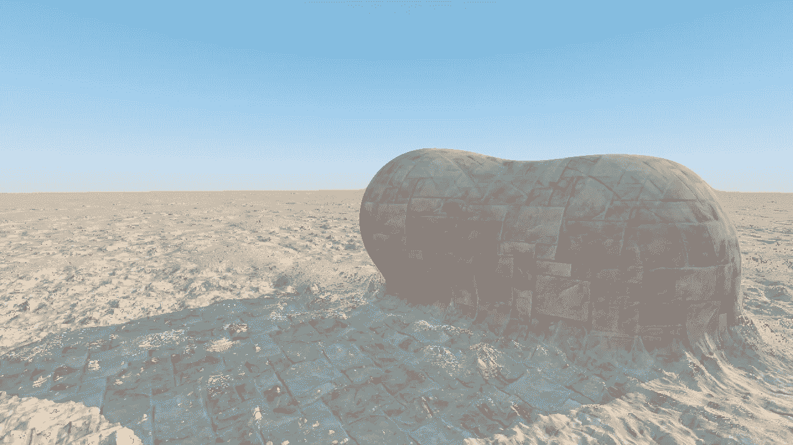
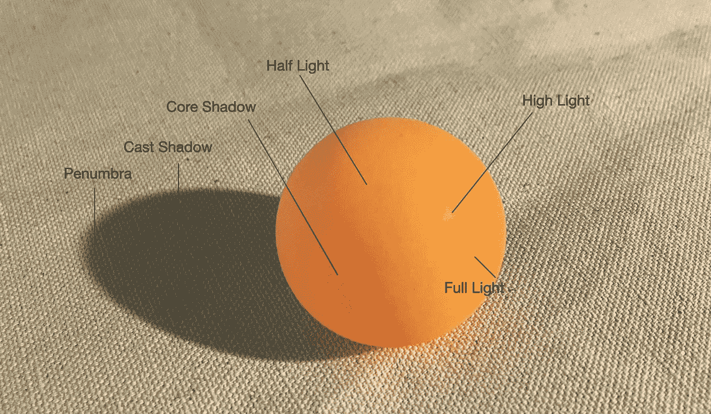
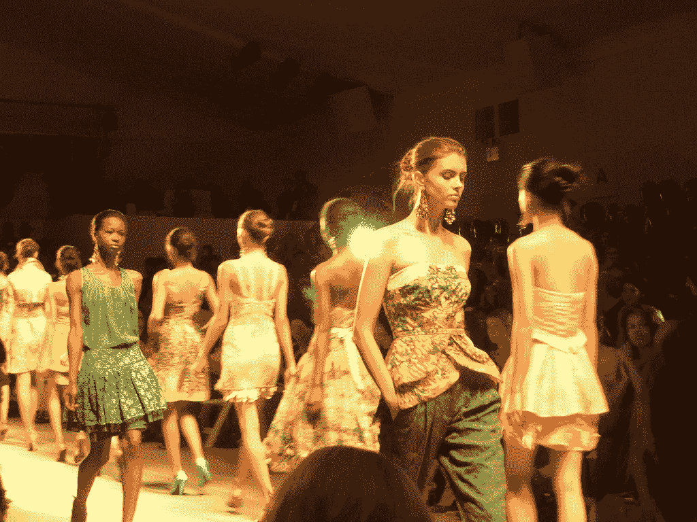
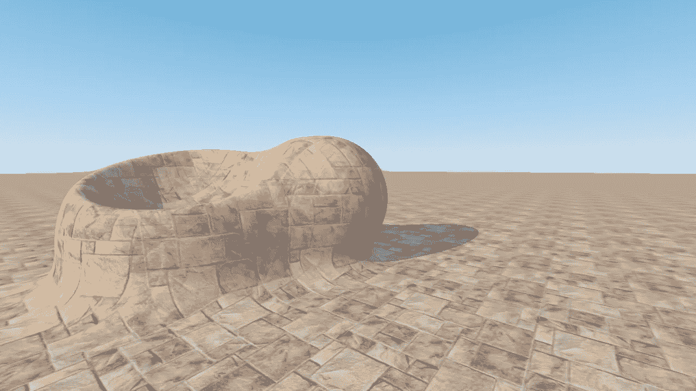
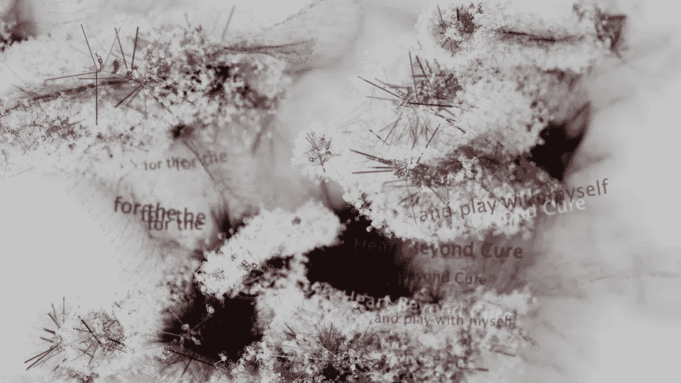

# 实时计算机图形学中的随机漫步

> 原文：<https://towardsdatascience.com/a-random-walk-in-real-time-computer-graphics-6f4315537464?source=collection_archive---------43----------------------->

## GLSL 的照明、纹理和位移映射



图一。一个遥远的场景(2021) | Sean Zhai |用 ShaderToy 创作

# 数学建模

计算机图形学从数学上定义形状开始。建模球体和立方体可以很容易地解决，但是定义真实世界的对象是具有挑战性的。著名的 3D 茶壶模型是由犹他大学的 Martin Newell 于 1975 年创建的，由于在计算机图形学的早期只有非常有限的模型可用，所以它在许多研究论文中被提及。

建模的另一种方法是用多边形网格来逼近形状；结合 3D 数字化仪和扫描仪，高分辨率多边形模型被广泛使用，但往往需要较长的渲染时间。1995 年第一部 CG 故事片*玩具总动员*上映，需要 80 万机时。

硬件的进步极大地改善了这种情况，尤其是现代的 GPU 使得实时计算机图形成为现实。但即使在今天，多边形模型仍然需要高度优化，游戏引擎经常使用低多边形模型。用数学定义形状仍然有明显优势。

# 用光描绘现实

光线被记录为图像中像素的颜色。现代图形处理器的奇迹使得实时制作惊人的图形成为可能，与图形处理器接口的语言是 OpenGL 着色语言(GLSL)。使用 GLSL，我们定义如何渲染像素的颜色；其余的是自动执行的，并且是并行完成的。

我们有完全的自由以任何方式设置场景，但是，遵循现实世界的原则是有帮助的。作为人类，我们的情感经常与和过去经历有相似之处的事物产生共鸣。甚至在构建一个抽象的构图时，我们往往需要一定的熟悉度。



图二。灯光的维度|翟的影像创作

通过观察，我们知道光在表面上的反射是由表面的法线决定的，漫射光对方向不敏感。使用 GLSL，一种简单有效的数字照明方式通常被配置为遵循 3 点工作室照明。根据经验，主光的亮度大约是补光的 10 倍。

在技术术语中，计算机图形照明或多或少取决于双向反射分布函数(BRDF)，它描述了光线在撞击表面时如何表现的理论。

# 纹理、UV 贴图和长方体贴图



图三。特雷西·里斯秀 2008 |图片来源:commons.wikimedia.org

为了创造更真实的外观，最直接的想法是引入一张图片。如果我们想在数字世界中创作岩石时，有一张岩石的照片可以使用，这将使生活变得更容易。一个迫在眉睫的问题是，图像如何包裹物体的表面，当形状复杂时，这可能相当复杂。典型的解决方案在计算机图形学中称为 uv 映射，其中 u 和 v 是定义纹理的坐标。这非常类似于时装业使用织物的方式，这本身就是一门艺术，让不同表面交汇处的图案看起来很漂亮。

下图展示了一种叫做“盒子贴图”的技术。这是米奇·普拉特在皮克斯制作 RenderMan 时发明的。基本思想是从围绕物体的一个假想立方体投射纹理，纹理根据相对于 x、y 或 z 轴的方向混合。



图 4。纹理映射演示| Sean Zhai |使用 ShaderToy 创建

以下是 GLSL 代码中`boxmap`的功能，由 Inigo Quilez 在 ShaderToy 开发。

```
// "p" point being textured 
// "n" surface normal at "p" 
// "k" controls the sharpness of the blending in the transitions areas 
// "s" texture sampler 
vec4 boxmap( in sampler2D s, in vec3 p, in vec3 n, in float k ) 
{     
     // texture along x, y, z axis
     vec4 x = texture( s, p.yz );
     vec4 y = texture( s, p.zx );
     vec4 z = texture( s, p.xy );

     // blend factors
     vec3 w = pow( abs(n), vec3(k) ); // blend and return     
     return (x*w.x + y*w.y + z*w.z) / (w.x + w.y + w.z); 
}
```

# 噪音，逼真的触感

噪声和随机的区别在于，噪声不是随机的。噪声，即使看起来不规则，也需要产生可重复的结果。为了在计算机图形中有用，噪声函数需要创建平滑和渐进的变化。柏林噪音是为电影《创》(1982)开发的，以增加真实感。该算法具有突破性，因为它可以在没有大量数据集或昂贵计算的情况下创建丰富而细致的图像，并激发了其他噪声的发展，如 voronoi、worly 和单纯形噪声。计算机图形学再也不会回到没有噪声功能的日子了。

> *Perlin Noise 的发展使计算机图形艺术家能够更好地在电影行业的视觉效果中表现自然现象的复杂性。*
> 
> — 1997 年奥斯卡颁奖典礼



图五。Bloodie 写了一首颂歌| Rebecca Xu，Sean Zhai(使用柏林噪音场创建的生成动画，在处理中编程)

# 分形噪声和自相似性

> 几乎所有自然界常见的模式都是粗糙的。它们有着极其不规则和支离破碎的方面——不仅比欧几里得的奇妙的古代几何学更加精细，而且复杂得多。几个世纪以来，测量粗糙度的想法只是一个空想。这是我毕生致力于的梦想之一。—伯努瓦·曼德尔布罗

分数布朗运动有时被描述为“随机行走过程”。Mandelbrot 揭示了 fBm 最重要的特征，即自相似性。为了说明这一点，Mandelbrot 展示了可以在自然界的许多地方观察到的自相似性，例如花椰菜的结构，其中植物的一部分与整体具有相同的结构。

图六。伯努瓦·曼德尔布罗的 TED 演讲

为了实时看到这一点，让我们在 GLSL 实现 fBM。下面是一个例子。复杂性是通过添加用于操纵采样纹理的噪声迭代而逐渐建立的；每次采样频率增加一倍，其幅度减小一半。通过这样做，自相似性得以保持。

```
// code by ig at shadertoy.comfloat noise1f( sampler2D tex, in vec2 x )
{
    return texture(tex,(x+0.5)/64.0).x;
}float fbm1f( sampler2D tex, in vec2 x )
{
    float f = 0.0;
    f += 0.5000*noise1f(tex,x); x*=2.01;
    f += 0.2500*noise1f(tex,x); x*=2.01;
    f += 0.1250*noise1f(tex,x); x*=2.01;
    f += 0.0625*noise1f(tex,x);
    f = 2.0*f-0.9375;
    return f;
}
```

对于偶然发现 ShaderToy 的人来说，随机改变着色器中的参数以获得不同的外观是很有吸引力的，但如果不理解基本原理，可能很难掌握构造着色器的艺术，并且当出现伪像时会令人沮丧。

# 位移映射

噪波也可以用来改变对象的实际形状，这通常称为置换贴图。将 fBm 噪波作为位移贴图添加到图 4 中，我创建了图 1 的标题图像。源代码可以在下面找到。

形象很简单，希望还是营造出一种偏僻大气的感觉。我想分享一些笔记，而使这一点。

*   构图:一般你的主要对象不要在死点；相机目标位置`ta`在 x 轴上轻微移动。
*   “建筑结构”的建模是用两个球体连接在一起完成的，减去一个球体来创建凹面形状(可以很容易地在图 4 中看到)。)
*   触摸位移图可以完全改变图像的情绪(比较图 4)。和图 1。).

你可以访问 ShaderToy 查看实时版本。

<https://www.shadertoy.com/view/flBGzK>  

# 收场白

有可能你做过在画布上画线的图形编程，基本上可以解释为“画家的模型”。GLSL 提供的是更强大的东西。可以实时体验，可以印象更深刻。尝试使用 ShaderToy 或另一个 GLSL 合成工具。干杯！