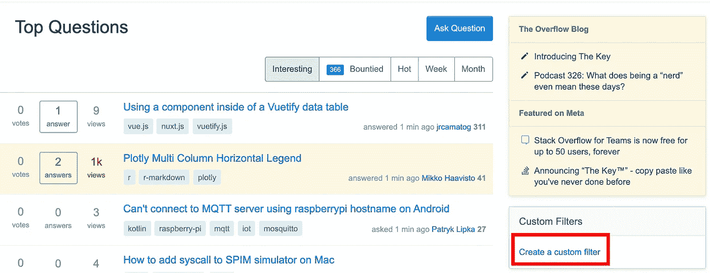
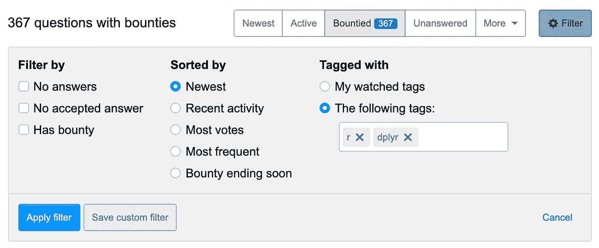

# 在 R 中提高数据辩论技巧的一个非常简单的方法

> 原文：<https://towardsdatascience.com/a-really-easy-way-to-improve-your-data-wrangling-skills-in-r-4a418a5315fb?source=collection_archive---------22----------------------->

照片由[布雷特·乔丹](https://unsplash.com/@brett_jordan?utm_source=medium&utm_medium=referral)在 [Unsplash](https://unsplash.com?utm_source=medium&utm_medium=referral) 拍摄

当我找工作时，我有很多空闲时间。加上 COVID，嗯，我有很多空闲时间。有一天，我对自己说，鉴于 [dplyr 1.0.0+](https://dplyr.tidyverse.org/news/index.html) 相对较新的更新和我个人的理念，你可以*总是*练习基本技能，我可以用`dplyr`进行一点练习。我的第一个想法是谷歌“dplyr 练习题”，但如果你现在这么做，你会发现一堆教程网站都有非常基本的`dplyr`问题。对于 R 的中级和高级用户来说，这可能不是我们想要的。然后，我接下来的想法是“*做一个个人项目*”。无数的文章和人们都推荐把它作为学习和练习 r 的一种方式。是的，我喜欢个人项目，但有时你也在寻找那种快速的锻炼，你知道吗？有时候，你并不真的想花很长时间去构思一个项目，你只是想快速地做一些演示。

但是后来，我突然想到。哪里有一个地方可以让人们发布对他们来说显然不直观的问题，而其他人可以发布解决方案？

对，那个地方就是[栈溢出](https://stackoverflow.com)。

我创建了一个帐户(我一直使用堆栈溢出来查找自己问题的答案，但我从未想过创建一个帐户来回答别人的问题)，并设置我的过滤器来选择性地查看`dplyr`问题:

**第一步**

**第二步**

在“以下标记”中键入 r 和 dplyr

# **游戏计划**

现在我已经确定了这个资源，我如何以及你如何开始使用它？

> 把它当成一次锻炼。

告诉自己每天至少尝试解决 5 个问题。当你点击“应用过滤器”按钮时，你会得到一个问题列表。你可以通过“最新”来查找可能还没有答案的问题。请记住，这些问题会有一系列的困难。通常情况下，你会遇到来自 R 新手的问题，所以这些问题会有相当简单的解决方案。

如果您想要带有“答案”的问题，**将“过滤依据”框留空**。如果你想解决没有公开答案的问题，按“没有答案”过滤。

注意，不一定要贴你的答案；你可以试着用你自己的 RStudio 编码出答案。

## 投资

也就是说，你可以试着公开发布你的解决方案。栈溢出有一个游戏的很多方面；您可以[获得声望点数](https://stackoverflow.com/help/whats-reputation)和徽章。如果你真的在努力提高你的技能，你可以张贴你的答案，如果它是好的，它可能会被接受为解决方案或被社区投票。你也可以通过过滤有**赏金**的问题来尝试解决更难的问题(如果你对赏金问题的回答被接受，你可以获得大量信誉点)。

最后，我认为这是一个很好的练习资源，如果你想快速练习，不需要花太多时间。您正在练习解决一个小问题的数据争论技巧。有时候你会想出一个好的解决方案；有时候其他人会想出更好的办法。无论哪种方式，你都可以从全球 R 社区学习。最后但同样重要的是，你要回馈社会。你在帮助那些可能刚刚开始学习 R 的人；记住你曾经是那些人的一员！