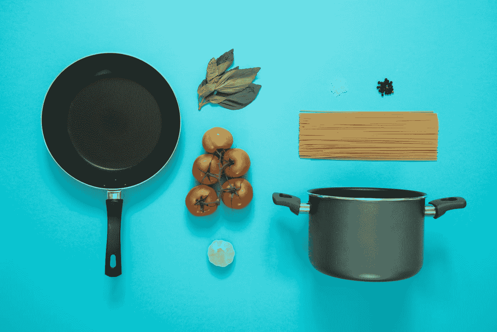

# 让我们用 AI 做饭:如何使用 Telegram 编写食谱推荐机器人

> 原文：<https://towardsdatascience.com/a-recommendation-engine-that-proposes-recipes-after-taking-photos-of-your-ingredients-de2d314f565d?source=collection_archive---------20----------------------->

## [动手教程](https://towardsdatascience.com/tagged/hands-on-tutorials)，菜谱电报机器人

## 用 python Telegram API 和深度学习模型编码的推荐引擎。给你的冰箱拍张照，等待最佳食谱。



[Icons8 团队](https://unsplash.com/@icons8?utm_source=medium&utm_medium=referral)在 [Unsplash](https://unsplash.com?utm_source=medium&utm_medium=referral) 上的照片

# 为什么你应该读这篇文章:

如果你对计算技术感兴趣，并且想学习更多关于识别引擎、推荐引擎和 telegram API 的知识，这篇文章是为你准备的。

我们将一步一步地一起构建一个迷你应用程序，它可以根据您厨房中现有的食材提供定制的食谱。为了更进一步，我们将添加一个识别引擎，它可以根据你发送给机器人的图像识别水果和蔬菜。你可能会问，为什么？仅仅是因为好玩又轻松！

我们还将使用 Telegram API，因为它提供了一个为小项目创建工作前端的绝佳机会。除此之外，如果您将 Python 用于您的后端活动，您可以使用多个包装器来利用它们的 API 的许多不同选项。我还发现，如果你想开发简单的物联网解决方案，这是一个方便的工具。

我希望这篇文章能启发你去做其他很酷的项目。如果您有任何问题或想分享您的项目，不要犹豫，直接联系我或留下评论。

# 我们将如何进行？

1.  应用程序概述。
2.  在本地机器上部署。
3.  一点机器学习的代码。
4.  结论。

# 应用程序快速浏览:

有时一张图片(或者，在这种情况下，一段视频)胜过千言万语。这就是为什么这个 GIF 在这里向你展示这个机器人的主要功能和它是如何工作的。

根据你厨房里的食材，机器人可以从各种烹饪风格(意大利、希腊、日本等)中选择一套食谱。).

作者 Gif

自己试试吧！在您的本地机器上部署 bot 以充分享受这种体验。玩得开心！

提示:我用 gfycat 创建了 GIF。他们提出了奇妙的功能和可能性。不要犹豫，点击 [*这里*](https://gfycat.com/fr/) *试试吧！*

# 在您的本地计算机上尝试(一步一步):

首先，你需要用 Telegram 应用程序创建一个机器人。然后，您将能够在本地计算机上部署应用程序。

## 生成电报机器人:

你可以快速浏览一下这个[帖子](https://medium.com/data-science-state-of-mind/create-a-simple-bot-with-telegram-that-notifies-you-about-the-progress-of-your-code-69bab685b9db)来创建一个带有令牌的电报机器人！然后在创建你的机器人后，你就可以访问它的令牌了！这个你自己留着吧。因为如果有人发现它，他们可以对你的机器人做任何他们想做的事情(*安全总比抱歉好*)。

## 在本地部署它:

如果你熟悉 GitHub，你会在下面的 GitHub [页面](https://github.com/RomainGratier/recipes-telegram-bot)上看到关于机器人部署的所有信息。

如果您在本地机器上安装了 Docker，只需在终端上运行下面的命令行:

```
docker run -e token=Your_token tylerdurden1291/telegram-bot-recipes:mainimage
```

# 机器学习:

我们现在将更深入地研究这个项目，我将它分成了四个部分:

*   我们如何使用 **Doc2Vec** 模型和预测菜肴的**分类器**进行推荐？
*   **基于深度学习的图像识别**。
*   为**前端**设置电报机器人。
*   得益于 **docker** 的快速部署。

# 如何做推荐？

在过去的六年中，最有用的技术之一是自然语言处理(NLP)。在这个领域，研究人员的目标是通过不同的过程来打破语言的深层结构和它们的秘密。让我们用三个要点来总结一下。

*   **标记化**:这个过程将输入文本转换成机器可以理解的格式。总而言之，文本被转换成一系列由数字组成的向量。
*   特征工程/建模:由于文本现在是机器可以理解的，我们现在可以提取一些知识来执行某项任务。我们称之为特征工程，因为我们从输入中提取特征。它也被称为建模，因为这些特征提取器通常是统计模型。
*   **任务:**在 NLP 中，很多任务都可以由一个模型来执行。从简单的任务，如分类，到更复杂的任务，如问答。在我们的小项目中，我们将为菜肴预测执行分类任务，并进行相似性匹配以找到最佳食谱。

## 建议类型:

当我们讨论建议时，主题是相当模糊的。根据目的不同，存在许多不同类型的建议。例如，网飞或亚马逊会根据你正在观看的内容和其他客户之间的相似性进行推荐。在我们的例子中，我们希望根据您已经拥有的食材和食谱中的项目列表之间的**相似性**来做出**推荐**。

一个好的建议是一套食谱，分享你已经拥有的和食谱中的相同成分。基于规则的解决方案是可能的，但是它将产生相当大的编程开销。因此，我选择使用著名的 Doc2Vec 模型。是 Word2Vec 在句子层面的概括。因此，我们可以计算**句子相似度**，而不是单词相似度。

为了增强用户体验，您可以在对数百万个食谱训练您的 Doc2Vec 之前添加一个模型。 *Uber Eats* 和 *Deliveroo* 提议在点菜前选择菜式。使用正确的数据集和简单的模型，我们可以快速实现相同的功能。经过深入研究，我发现了一个包含食物类型的食谱数据集(例如:意大利、墨西哥、法国、中国等。).因此，在第一步中，使用逻辑回归**分类器**在完整的食谱数据集上预测食物的种类。在第二步中，针对每种类型的烹饪训练 Doc2vec。有了这个管道，我们可以确信我们的模型将只为特定的食物类型提供食谱！

如果您想了解关于该模型的更多信息，我强烈建议您查看以下链接:

*   [doc2vec](https://medium.com/wisio/a-gentle-introduction-to-doc2vec-db3e8c0cce5e)
*   [tf-idf](https://monkeylearn.com/blog/what-is-tf-idf/#:~:text=TF%2DIDF%20is%20a%20statistical,across%20a%20set%20of%20documents.)
*   [逻辑回归](https://machinelearningmastery.com/multinomial-logistic-regression-with-python/#:~:text=Logistic%20regression%2C%20by%20default%2C%20is,into%20multiple%20binary%20classification%20problems.)

## 数据集:

对于项目的这一部分，我们需要两个不同的数据源。

*   第一个数据集使用每个配方的配料集合来训练 Doc2Vec 模型。想到的数据集是 [recipes 1M](http://pic2recipe.csail.mit.edu/) ，但是在写这篇文章的时候他们的网站已经关闭了。但是我发现了另一个非常相似的，叫做[食谱盒](https://eightportions.com/datasets/Recipes/#fn:1)。
*   第二个数据集用于训练模型，根据一组配料预测菜肴的类型。多亏了 Kaggle 的订阅者，[食谱配料数据集](https://www.kaggle.com/kaggle/recipe-ingredients-dataset)正在正确地完成这项工作。

## 一点编码:

在**符号化**过程中，我使用了一个简单的管道，将文本符号化并寻找单词的词根。被称为停用词的无用词也被删除以减少噪音。

作者代码

我使用**特征工程**仅仅是为了预测菜肴类型。TF-IDF 在逻辑回归模型预测菜肴种类之前嵌入输入文本。

作者代码

为了计算食谱中的配料之间的相似性，我们将使用著名的 Doc2Vec 模型。这个模型只需要一个记号化的过程，因为它本身就是在提取特征！注意， *Gensim* 库允许我们用一个简单的命令预测未知文本的相似性匹配。

作者代码

# 再进一步:加入基于深度学习的图像识别。

图像识别现在是机器学习中一项众所周知的任务，深度学习模型已经被证明是这项任务的最佳和最可靠的。但是深度学习框架需要巨大的计算能力。因此，迁移学习技术通过使用预先训练的模型而不是从头开始训练新的模型来节省大量时间和开销。

## 数据集:

存在许多用于图像识别的数据集。我选择了以下数据集，为食物识别量身定制: [GroceryStoreDataset](https://github.com/marcusklasson/GroceryStoreDataset) 有很多不同环境下多角度拍摄的水果蔬菜照片。这使得它成为目前最好的可用数据集。

## 一点编码:

由于我正在使用深度学习模型，我需要 GPU 资源，感谢*谷歌*，我们可以通过 Colab 笔记本轻松访问。因此，我分享了我用来训练 Keras 上的预训练模型的 [Resnet](/understanding-and-visualizing-resnets-442284831be8) 模型的笔记本。

[](https://drive.google.com/file/d/1A4g5NcBPVu6wpIUgKa4ZuqNoZiO01Q5q/view?usp=sharing) [## Image _ classification _ 杂货. ipynb

### 合作笔记本

drive.google.com](https://drive.google.com/file/d/1A4g5NcBPVu6wpIUgKa4ZuqNoZiO01Q5q/view?usp=sharing) 

当模型完全训练好时，这里是在应用程序中对单个图像进行预测的代码。

作者代码

# 如何为前端设置电报机器人:

存在许多 API，知道如何使用它们是一项有用的技能。Telegram 多年来一直在开发其 API，并且做得非常出色！这个 API 最酷的一点是它的包装器数量，这将简化您的生活。在这个项目中，我使用了 [python-telegram-bot](https://github.com/python-telegram-bot/python-telegram-bot) 包，它被证明是可用的包装器中最容易使用的一个。

## 编码:

要启动这个包装器，首先，您需要使用 pip 命令安装它。

```
pip install python-telegram-bot
```

在查看我的代码之前，我强烈建议您专注于理解 ConversationHandler 模式。在他们的*示例*文件夹中，您将找到可以轻松在本地实现的可用代码和模式。将 python 文件与其对话模式进行比较，而不仅仅是阅读代码行，节省了我几个小时的时间。

如你所见，第一层处理主要按钮和发送给机器人的文本或照片。第二层用于两种不同的交互:

*   当一个图像被发送到机器人，它被处理，它被传递到一个附加函数，一个回调函数能够检索用户触摸的项目。
*   当你点击*获取食谱*按钮时，情况也是如此。在文章开头的 GIF 中可以看到，点击这个按钮后会要求你选择想要烹饪的美食。需要第二个回调函数来检索用户选择的信息。

注意每个最终层是如何返回主菜单的！

作者代码

# 如何用 D **ocker:** 快速部署 App

Docker 是一个你可能已经听说过的开源软件。它使用其操作系统创建容器，以避免在其他机器上部署解决方案时出现软件依赖性问题。我鼓励你学习 Docker，因为如果你从事计算工程，你将会使用它或者其他类似的软件。对于这个项目，我创建了一个镜像，如果你安装了 docker 而不是使用 GitHub，你可以在本地机器上运行这个镜像。如果你是 Docker 新手，我鼓励你去看下面的[视频](https://www.youtube.com/watch?v=zJ6WbK9zFpI)！

## 命令:

我不会给你一个 docker 课程，并鼓励你去理解什么是容器。但你唯一需要知道的是以下内容。运行容器意味着在你的设备上运行一个新的操作系统。为了构建这个新的操作系统，docker 使用了映像。这篇文章将介绍我是如何为这个项目创建图像以及如何运行它的。

Dockerfile 是您运行以生成图像的文件。因此，它由一个源映像(通常是 Linux OS 容器)和一些命令组成。这些命令将允许我们下载包，设置环境变量，并定义容器启动时将运行的命令。

## Dockerfile 文件:

```
# Base by image from python3.7 source image on amd64
FROM python:3.7# Create a argument variable to call when the image is started
ENV token token_init# copy the requirement within the image before importing the whole code and pip install everything
COPY requirements.txt .
RUN pip3 install --no-cache-dir -r requirements.txt# Import the whole code in the image and change the working directory accordingly
COPY . /app
WORKDIR /app# Run the setup to import models and datasets
RUN bash setup.sh# Create models and the database
RUN python3.7 train_and_populate_recommendation_db.py# Define the command to run when the container will be started
CMD ["sh", "-c", "python3.7 app.py ${token}" ]
```

当然，您不需要在本地运行它，映像可以在 Docker Hub 上获得，您可以轻松地调用它，只需一个命令就可以运行项目。首先，在您的本地 AMD(例如，每个个人桌面都是 AMD，但 raspberry pi 不是)机器上下载 docker，并使用您的 bot 令牌运行以下命令:

```
docker run -e token=Your_token_gen_by_Fatherbot tylerdurden1291/telegram-bot-recipes:mainimage
```

# 结论:

这篇文章的动机是分享的想法。开源项目是避免伟大创意产生过程中瓶颈的最佳方式。因此，我决定分享我的代码，并感谢 Medium，在这篇文章中用我自己的话介绍这个项目。

简单来说，Telegram API 可以帮助你快速开发一些有用的 app，docker 会帮助你分享和部署你的解决方案，Python 有令人印象深刻的快速开发功能！

如果你喜欢这篇文章，别忘了鼓掌，如果你认为它很有趣，你可以查看我的 GitHub [页面](https://github.com/RomainGratier)。