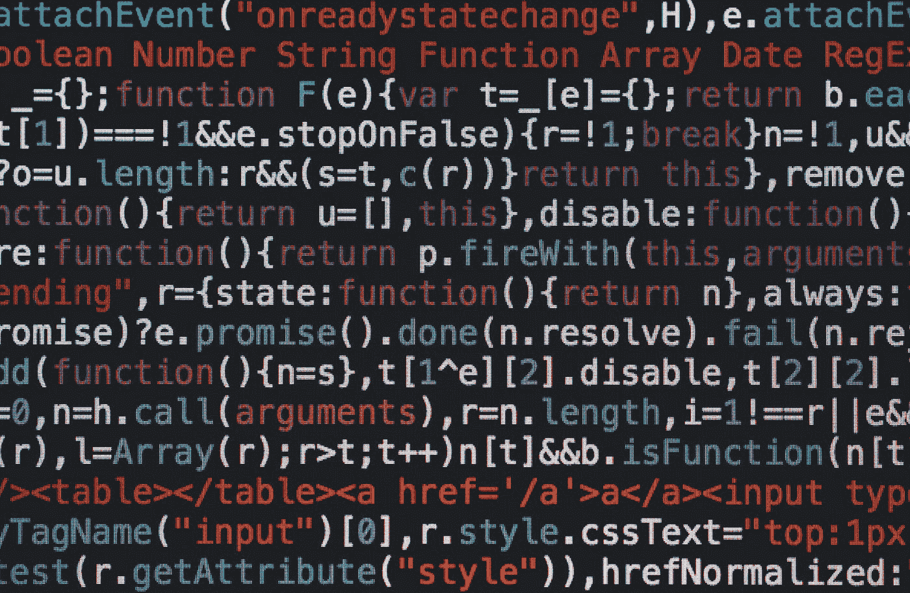

# 对“张量流悲伤故事”的回复

> 原文：<https://towardsdatascience.com/a-reply-to-tensorflow-sad-story-b4b52ea59bc3?source=collection_archive---------18----------------------->

马库斯·斯皮斯克在 [Unsplash](https://unsplash.com?utm_source=medium&utm_medium=referral) 上的照片

T 今天我读了 Zahar Chikishev 的《TensorFlow Sad Story 》,虽然我同意他的大部分观点，但我觉得这对 TensorFlow 本身有点不公平，因为它没有试图掩盖或理解 TensorFlow 为什么是现在这个样子，或者谷歌究竟为什么要做某些事情。自从 2019 年 9 月 TensorFlow 问世以来，我一直是 TensorFlow 的用户，并且感受到了 Zahar 在他的文章中描述的许多相同的痛苦，我开始起草一份回复。然而，正如你从这篇文章中看到的，我的评论失去了控制，所以我决定把它变成一个独立的部分。

需要澄清的是，我并不为 Google 或 TensorFlow 工作，但是，作为一名用户和系统工程师，我也许能够解释为什么 TF 是现在这个样子(我并不同意它的大部分内容，但是我猜它提供了一些视角)。

接下来，我或多或少地按照最初帖子的顺序讨论了每个主题，你可以在这里阅读:

 [## 张量流悲伤故事

### 我已经使用 Pytorch 好几年了，并且一直很喜欢它。它清晰、直观、灵活、快速。还有…

medium.com](https://medium.com/geekculture/tensorflow-sad-story-cf8e062d84ba) 

# 易于安装

事实上，安装 TensorFlow，特别是对于 Python 生态系统的新手来说，可能是一件痛苦的事情。我想谷歌不介意这一点有几个原因:

1.  它免费提供实验室，这样你就可以从那里开始
2.  Anaconda 已经[为您预打包了 TensorFlow](https://anaconda.org/anaconda/tensorflow-gpu) 及其依赖项，如果您愿意自己安装的话
3.  大多数(如果不是全部的话)云提供商[将它与他们的 GPU 实例一起预打包](https://aws.amazon.com/machine-learning/amis/)
4.  坦率地说，到目前为止，这种方法很有效。

此外，很大一部分痛苦来自于 Nvidia 无法发布一个能够跨不同*小*版本远程兼容的 CUDA SDK。当试图手动安装 TensorFlow 时，大多数人会犯的错误是找到编译 TensorFlow 二进制文件所依据的 CUDA 和 cuDNN 的确切版本。

# 插件包:

对于那些不知道的人来说，TensorFlow 项目有几个兄弟姐妹，即[插件](https://www.tensorflow.org/addons)、[概率](https://www.tensorflow.org/probability)、[图形](https://www.tensorflow.org/graphics)和[甘](https://github.com/tensorflow/gan)，以及一些不太为人知的，如[相似性](https://github.com/tensorflow/similarity)、[代理、](https://github.com/tensorflow/agents)和其他。您可以通过浏览 TensorFlow 的 [GitHub 页面获得完整列表。](https://github.com/orgs/tensorflow/repositories)

在最初的帖子中，作者抱怨插件包与主包是分开的，这似乎是不必要的，因为他总是两个都安装。虽然我发现了一个微小的麻烦——仅仅是 requirements.txt 文件中让 pip 吞食的另一行，但这是用户不总是理解公司基本原理的一个很好的例子。

TensorFlow 是一个庞然大物软件。它是巨大的，跨越数百万行代码、几种语言、几种设备等。此外，使用 TensorFlow 的所有产品的总和可能接近(或接近)数十亿美元。如果谷歌搞砸了，反弹将是巨大的。因此，将一个项目分割成更易管理的部分是有意义的，比如一个包含所有基本内容的核心包和几个更集中的项目。

在较小的子项目的一般好处中，我强调:(1)您可以按照自己的步调推进每个子项目，(2)它限制了糟糕的发布的影响，以及(3)它简化了对人们正在使用什么的跟踪。

然而，最重要的是能够包含你不确定是否会被主流采用的东西。例如，考虑优化器。我猜 90%的人只知道亚当或者从来懒得去尝试别人。我在 Addons 包上数了超过[十个小说优化器](https://www.tensorflow.org/addons/api_docs/python/tfa/optimizers)。这些应该添加到核心包中吗？这些年来测试和维护的成本是多少？

作为深度学习，一个由上个月的研究推动的领域，我们永远无法知道什么将经得起时间的考验。

# 渴望是一场骗局:

急切执行是 TensorFlow 2 最令人期待的特性之一。它将为 TensorFlow 带来 PyTorch 式的开发体验，摆脱该死的“会话”基本原理是，eager 可以调试，但速度较慢，而 deferred(图形模式)更快，因为它编译代码，但不能直接调试。谷歌解释说，当训练他们的模型时，人们会使用渴望调试和切换图形模式。

《张量流悲伤的故事》的作者引用了:

> TensorFlow 2.0 急切地执行(就像 Python 通常做的那样)，在 2.0 中，图形和会话应该感觉像实现细节。
> 
> *对于计算密集型模型，比如在 GPU 上进行 ResNet50 训练，急切执行性能堪比* `[*tf.function*](https://www.tensorflow.org/api_docs/python/tf/function)` *执行。但是对于计算量较少的模型来说，这种差距会变得更大，对于有大量小操作的模型来说，优化热代码路径还有很多工作要做。*

第一个引用中提出的要点是*大多数时候，您可以在两个*之间无缝切换。第二段引文指出*图模式受益于许多低成本操作和优化路径*。这里的问题是，“多低的成本才算足够低？”。作者提到使用 ResNet-50 模型，并使用图形模式获得超过五倍的执行速度。如果我是猜测，批量太小，或者 GPU 是相当强大的。在这两种情况下，即使是 ResNet-50 操作也可以被称为低成本。

后来作者提到文档不鼓励使用渴望模式。的确，它本可以措辞得更好。默认情况下，急切模式是关闭的，因为这样更快。然而，如果你正在调试，你可以打开它，随心所欲地调试，然后关闭它。

具有讽刺意味的是，PyTorch 渴望模式默认情况下很快，而 TensorFlow 很慢。事实上，PyTorch 提供了一个混合解决方案，将 Torch 代码 JIT 化为图形模式，以提高性能。我猜如果 PyTorch 团队认为有必要实现一个 JIT 编译器…

# 数据 API:

我完全同意 tf.data.Dataset 很乱，我不会说我大部分时间都喜欢它。

这个 API 之所以这么烂，是因为它伪装的非常 TF1 化(而且所有 TF1 的东西都很烂)。data API 被设计成跟踪你的代码到 C++调用中，所以当你用 Python 写代码时，它被跟踪到一个图形模式表示，并在 CPU C++后端运行。

基本原理是性能:虽然 Python 苦于不可并行化(参见[全局解释器锁](https://realpython.com/python-gil/) (GIL))，但 C++代码可以在所有可用的 CPU 线程上自由运行，因此可以更快地处理数据集，从而让 GPU 保持忙碌。缺点是生成的代码无法调试(毕竟是图形模式)，运行任何外部 Python 代码都有极其痛苦的语法和性能。

只有图形模式是 TF1 的事情，希望它将成为整个图书馆的过去。与此同时， [TensorFlow 2.5 增加了对 tf.data.Dataset](https://github.com/tensorflow/tensorflow/releases/tag/v2.5.0) 的实验性热切支持，这是一个开始。

# API 复制:

TensorFlow 确实具有大量重复的功能。起初这很可怕，但实际上并不是问题。这些大部分都是帮助人们从 TF1 移植代码的遗留操作。如果谷歌放弃所有 1.x 的东西，他们永远不会让人们更新。

一个例子是 TF 1.x 如何拥有自己的操作(比如卷积)，然后公开一个更高级的 API (slim)。在此之后，他们开始整合类似 Keras 的语法(tf.layers)，这导致采用 Keras 本身作为其主要后端(tf.keras)。所以，现在，他们不得不处理所有这些遗留代码。希望他们会在 TensorFlow 3.0 版本中剥离大部分内容，或者更好的是， [JAX](https://github.com/google/jax) 会取代生态系统。

在实践中，您只需关心 tf.nn 模块(类似于 PyTorch)和 tf.keras 包(高级 API ),它隐藏了许多样板文件和形状/尺寸计算。这两个 tf.keras 是主要的 API，而 tf.nn 用于实现定制的东西。

# 草率开发:

都是真的。句号。

特别是 ImageDataGenerator，它是 Keras 中最流行的数据扩充方法，在我看来，它一直是一个失去控制的样本代码，并开始在生产中使用。

最后一点，虽然我确实认为谷歌可以做得更好，但我知道 TensorFlow 是第一个为大规模模型设计的开源深度学习包之一，因此完全关注速度。在这方面，承认当时的情况是值得注意的。首先，神经网络几十年来一直是个笑话；它们速度慢，难以训练，并且不能提供有意义的好处。人工智能社区对决策树和支持向量机更感兴趣。

随着 CUDA 或在 GPU 上编程非图形的东西，事情开始发生变化。Nvidia 在 2007 年发布了第一个公开版本的 CUDA。当时，它主要是实验性的技术，有一些有趣的用例，但是使用它太痛苦了，而且工具很糟糕(现在仍然是，IMHO)。因此，它的大部分采用来自不同的来源和图形社区本身。直到 2012 年 9 月 30 日，CUDA(和神经网络)才有了改变人生的突破:AlexNet。

使用 CUDA 训练的卷积神经网络赢得 ImageNet 比赛并不是 AlexNet 的唯一壮举；它也成功做到了这一点，准确率提高了 10 个百分点以上。它引起了人们的注意。问题是:所有可用的神经网络工具充其量都是实验性和学术性的。此外，使用 CUDA 虽然并不完全新颖，但绝对不是主流。比赛开始了。

从 AlexNet 到 TensorFlow 首次公开发布，整整用了 3 年 1 个月 11 天。换句话说，对于谷歌大脑团队来说，要将他们在神经网络上的一切重新规划成某种东西，他们可以复制突破性的结果，做进一步的最先进的研究，并向公众开放。

在谷歌大脑团队的论文标题中快速搜索“深度”一词，我们从 2000 年到 2011 年总共有 3 篇论文。在那个时候，人们对“深度学习”或“深度神经网络”没有那么多兴趣。2012 年发布次数变为 3 次，2013 年变为 9 次，2014 年变为 10 次，2015 年 TensorFlow 发布时(准确的说是 2015 年 11 月 11 日)变为 20 次。

从那时起，没有一年没有一些突破性的变化或新奇。试图暴露深度学习的最新水平是一场猫捉老鼠的游戏。PyTorch 是在 TensorFlow 之后一年左右发布的，而变形金刚是在那之后一年提出的。在 2018 年，2019 年和 2020 年，我们分别有 GPT-1，-2 和-3，嘿，我们在 2021 年，GPT-4 的谣言正在流传！

我在这里的观点是，深度学习是一种不断发展的技术，因此，工具总是滞后的。因此，下一个将总是更闪亮，或者至少不会过时。

每个计算机架构师都是赌徒。谷歌工程师打赌性能将主导市场，并为此设计了 TensorFlow，赢得了最大的市场份额。脸书工程师赌上了灵活性，这在学术界获得了回报，但在行业采用方面却落后了。Keras 的创造者 Franç ois Chollet 将赌注押在了易用性上。

谁是对的？可能没有，因为世界正在转向大规模分布式的基于注意力的模型。谁会想到呢？上述工具都不适合这种情况。难怪会看到新的竞争者在函数式编程上下赌注。

尽管如此，我们看到 PyTorch 增加了图形模式，TensorFlow 拥有渴望的功能，并且两者今天都有类似 Keras 的 API。而且，都是互相学习。

长话短说，TensorFlow 有它自己的问题，但是，就像任何其他库一样，其他一些库将会出现并成为它应该成为的样子，其他一些库也会取代它。变化是软件的美妙之处。

有人知道 Java Servlets 吗？

暂时就这些了。如果您对本文有任何问题，请随时发表评论或与我联系。

如果你刚接触媒体，我强烈推荐[订阅](https://ygorserpa.medium.com/membership)。对于数据和 IT 专业人士来说，中型文章是 [StackOverflow](https://stackoverflow.com/) 的完美搭档，对于新手来说更是如此。注册时请考虑使用[我的会员链接。](https://ygorserpa.medium.com/membership)

感谢阅读:)