# 崛起的浪潮——尼日利亚的数据科学和机器学习

> 原文：<https://towardsdatascience.com/a-rising-tide-data-science-and-machine-learning-in-nigeria-144d78aaacbd?source=collection_archive---------26----------------------->

## *利用 Kaggle 的年度调查，探索人们对 DS 话题越来越浓厚的兴趣*

由[大卫·罗蒂米](https://unsplash.com/@davidrotimi?utm_source=unsplash&utm_medium=referral&utm_content=creditCopyText)在 [Unsplash](https://unsplash.com/s/photos/nigeria-flag?utm_source=unsplash&utm_medium=referral&utm_content=creditCopyText) 上拍摄

** * *您可以在这里* ***** 找到该项目的代码<https://www.kaggle.com/sootersaalu/a-rising-tide-ds-and-ml-in-nigeria>

*虽然软件开发仍然是该国的首选编程工作，但数据科学在尼日利亚的受欢迎程度近年来不断增加，因为许多尼日利亚人发现自己被其潜力所吸引，并在该领域获得了收益。*

*然而，仍有许多工作要做，因为数据科学研究中的现代工具和新改进明显未得到充分利用，这是由于缺乏知识或害怕风险，数据科学对尼日利亚市场的影响没有达到应有的广泛程度，也没有达到持续生成的数据的内在力量得到利用后的广泛程度。*

*然而，随着对科学感兴趣的个人和企业数量的增加，有很多值得期待的事情——五年谷歌数据科学趋势——迎合尼日利亚培训需求的计划数量也在增加。像[尼日利亚数据科学](https://www.datasciencenigeria.org/)、[哈莫耶](https://hamoye.com/)和 [Utiva](https://utiva.io/) 这样的公司投入时间和资源来教育年轻和年老的尼日利亚人先进的分析、数据科学和人工智能工具和方法，预测涨潮是一个安全的赌注。*

*在这份报告中，我们将看看 Kaggle 的年度数据科学和机器学习调查，首先探索尼日利亚人的信息；他们的编程工具“堆栈”，他们在那里学习、消费内容，以及他们的公司在与世界其他地方的信息进行比较时对数据科学的利用。*

****见解****

*   *年轻人:我们的参与者大多不到 40 岁，尼日利亚的样本甚至更年轻。*
*   *学生来了！:我们学生比例高；学士大多数是硕士，尼日利亚的样本大多数是学士。*
*   **有教养，有教养！*:总体而言，尼日利亚拥有超过 50%的学士学位，在传统的大学教育(学士、硕士、博士)方面，该国在世界上遥遥领先。*
*   **随着经验的增加，比例下降*:我们的调查中有更多的编码和机器学习初学者，他们的线性下降是可视化的。*
*   *你上大学就是为了这个？！与世界其他地区相比，尼日利亚人从大学学习数据科学的比例要低得多。*
*   **数据科学期刊很无聊，Twitter 线程在哪里？*:在我们的尼日利亚样本中，当消费数据科学内容时，期刊、Reddit 和播客最不受欢迎*
*   *谁是他们当中最伟大的短跑运动员？:对于部署/共享工具，更多的尼日利亚人更喜欢 Streamlit，而不是 Shiny 或 Plotly Dash，这种偏好在世界其他地方正好相反*
*   **机器学习方法利用不足*:很大比例的尼日利亚企业根本不使用机器学习，很少有模型投入生产。*

*首先，我们看看从 2017 年到现在参与调查的人数*

*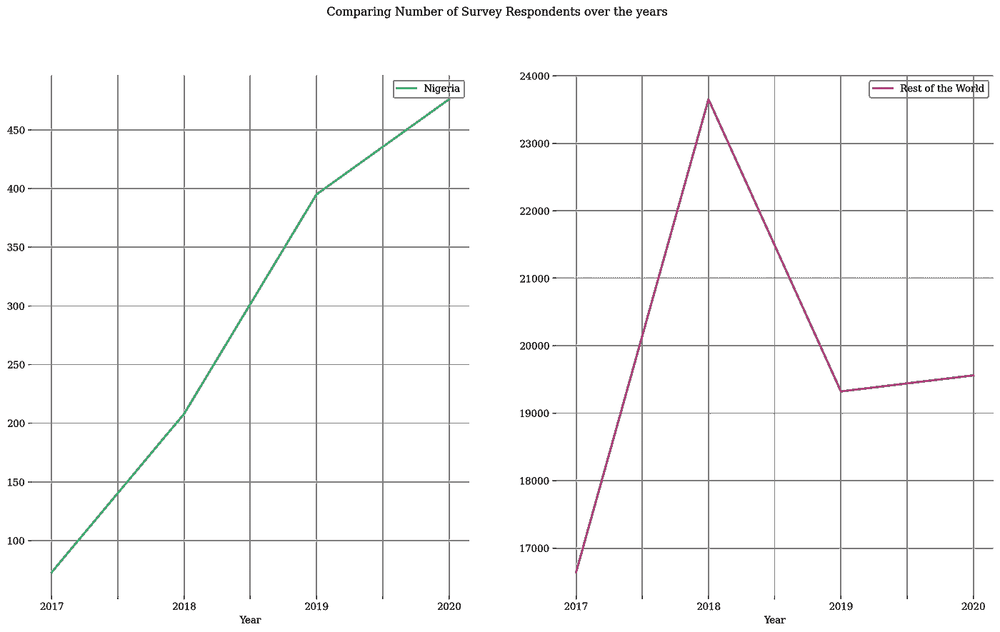*

*调查对象的趋势*

*尼日利亚人越来越多地出现在 Kaggle 调查中，就比例排名而言，他们在 2017 年占据第 39 位，而在 2020 年，他们占据第 8 位，其人数(476)本可以使他们在 2017 年获得第 6 位。*

*与整个世界其他地区相比，尼日利亚受访者的增长没有下降，因为尼日利亚人的数量在最近达到顶峰，是 2017 年尼日利亚参与者数量的 6 倍以上。*

# *参与者的人口统计数据*

*为了更好地了解参与调查的不同个体，我们需要调查他们的相似性以及如何将他们作为一个整体来描述。*

****年龄组****

*在这里，我们绘制了分布图，以探索 Kaggle 调查中尼日利亚和世界其他地区的年龄组，以便于样本之间的比较和分析。*

*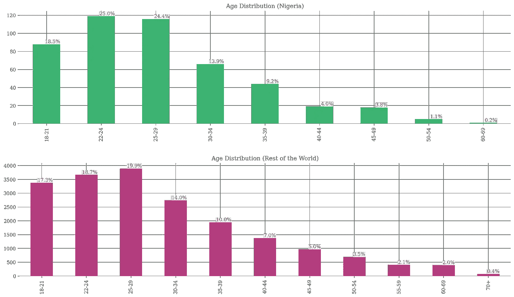*

*年龄分布比较*

*如果这项调查具有代表性的话，整个 Kaggle 的人口严重偏向年轻人，80%或更多的受访者年龄在 40 岁以下。*

*在尼日利亚的样本中尤其如此，因为他们中的大多数人年龄在 35 岁以下，22 岁至 24 岁的人比任何其他年龄组的人都多，这与世界其他地区不同，世界其他地区 25 岁至 29 岁年龄组的人比例最高。*

*退一步说，尼日利亚以其年轻的人口而闻名，2 亿多人口中超过 90%的人年龄在 55 岁以下*

****性别****

*增强受歧视性别的权能和消除性别差距是一项社会需求，所有善意的个人都应努力缓解这一需求。在这里，我们来看看调查中的性别分布。*

*📍 ***“非二进制”、“我更喜欢自我透露”和“我宁愿不说”由于比例较低被归入“其他”*** 📍*

*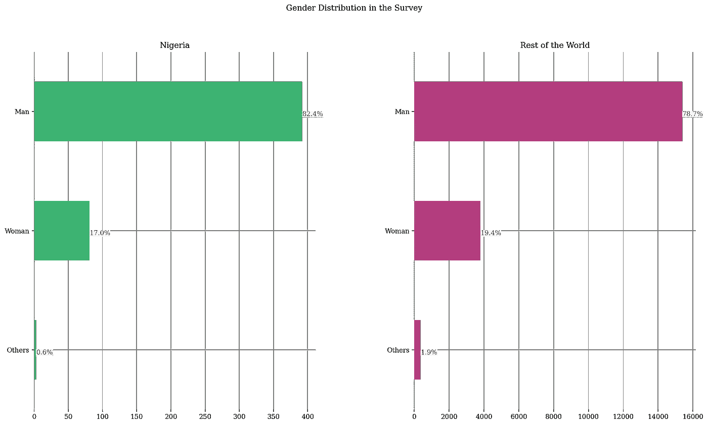*

*性别分布比较*

*正如可以预料或预测的那样，在 Kaggle 的调查中，男女比例严重失衡，男性在这一领域占据明显优势。这种优势可以说是“STEM”世界和更大的社会性别差距问题的代表。*

*由于尼日利亚男性的比例(82.4%)高于世界其他地区的男性(78.7%)，这个问题再次出现，这在很大程度上证明了在科技计划、科技领域的女性、数据科学领域的女性(如这个[数字探索者](https://digitalexplorers.eu/projects/female-track/)项目)以及针对尼日利亚女性和其他代表性不足的性别的类似项目中，女性的比例更低。*

****职业****

*除了年龄和性别变量之外，职业分析对于了解尼日利亚 Kaggle 人口和钻取平台上参与的细分市场也很重要。*

*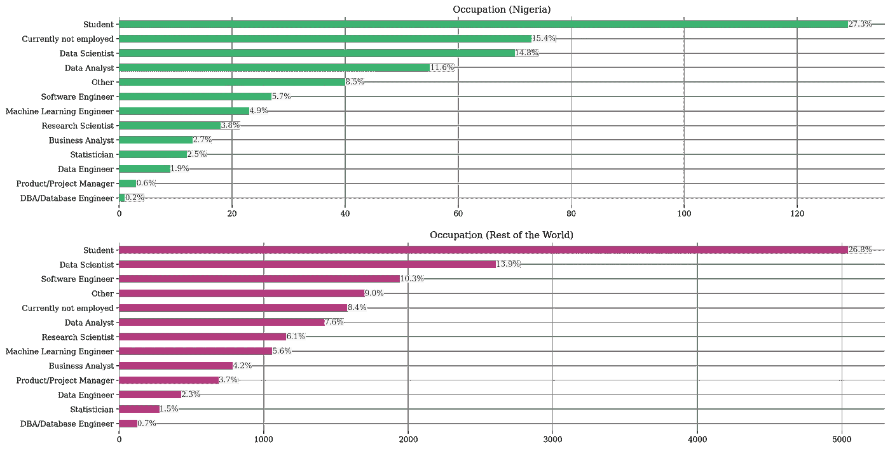*

*职业比较*

*作为一个整体，相当大的“Kaggler”人口，确定为学生，这是 Kaggle 最大使用案例的一个秘密高峰，有许多学习计划建议开设 ka ggle 帐户并参与内容，但是，它也可能代表每年进入数据科学的年轻新人的数量，进一步的分析可能是有帮助的。*

*对于两个样本；在尼日利亚和世界其他地方，排名前六的职位依次是“学生”、“数据科学家”、“数据分析师”、“软件工程师”、“目前未就业”和“其他”(未列出的数据或非数据职位)。*

*Kaggle 可以被描述为一个数据科学社区，有数据集、竞赛、笔记本和面向数据科学的课程，因此，我们可以说，这里可视化的所有职业都对数据科学感兴趣或从中受益。考虑到这一点，尼日利亚软件工程师的比例为 5.7%，而世界其他地区的比例几乎是 10.3%的两倍，这可能表明尼日利亚软件工程师对数据科学的兴趣较低，或者数据任务之间的分歧较大，这值得以后关注。*

*尼日利亚数据科学家的比例较高，而其他列出的数据科学角色的比例较低，这代表了数据科学领域尚未解决劳动力和工作角色的最佳分配问题，让个人单独从事端到端数据科学项目。值得注意的是，本次调查中第二大部分尼日利亚人认为目前失业，这是环境或行业的一个令人担忧的迹象。*

****文化程度****

*要在数据科学领域取得成功，需要大量的领域知识，以及对需要什么工具、为什么需要它们以及它们的应用的理解。这个领域的大部分工作描述包括教育要求，大多数时候是计算机科学或统计领域的研究生学位。*

*虽然对于自学者来说，已经经历过该过程的个人的流行例子是一种鼓励，但数据科学领域仍然需要大量的教育基础。*

*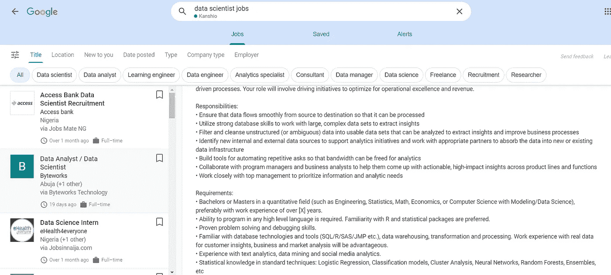*

**截图【谷歌搜索尼日利亚数据科学职位列表】**

*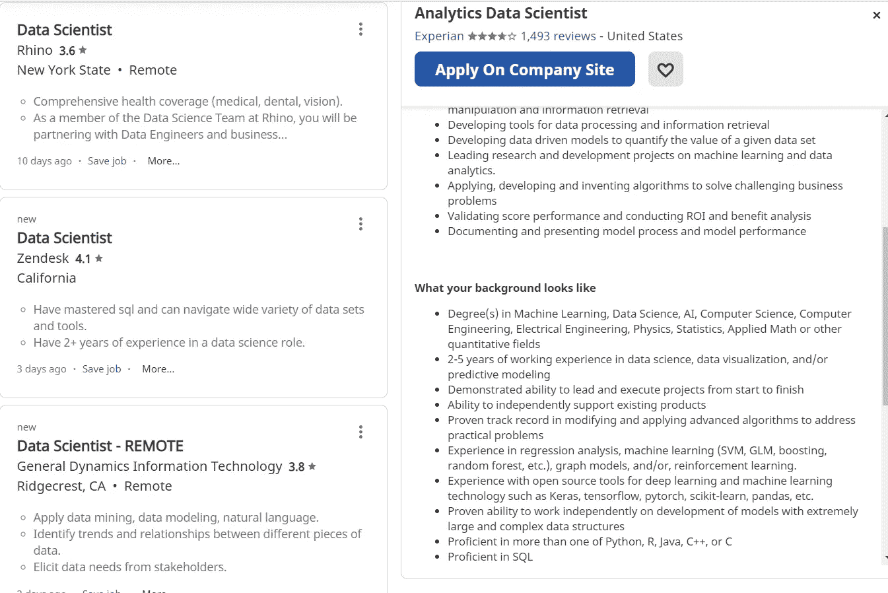*

**截图【数据科学工作确实求职】**

*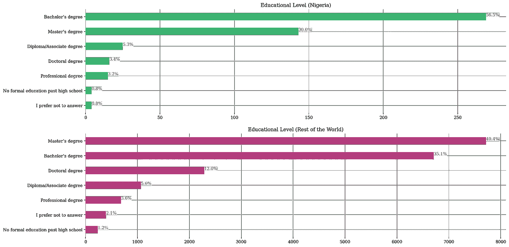*

*教育水平比较*

*尼日利亚受访者被认为拥有学士学位的比例较高，其次是硕士学位，而世界其他地区的情况正好相反，因为硕士学位毕业生是最大的群体。*

*总体而言，尼日利亚学士学位比例超过 50%，在传统大学教育(学士、硕士、博士)方面略胜世界其他国家。然而，当只考虑研究生学习时，这一领先优势就丧失了。*

*此外，高中毕业后没有接受过正规教育的人比例较低，这可能表明此类个人在数据科学领域学习/工作的机会低于平均水平，或者表明更有效的联邦学校计划，甚至是文化压力[为什么尼日利亚人是美国受教育程度最高的(移民)群体](https://www.quora.com/Why-are-Nigerians-the-most-educated-group-in-America)*

*回到我们之前关于“学生”是 Kaggle 人群中很大一部分的观点。进一步将工作角色类别与各种教育水平联系起来将是有益的，以便深入学生群体，调查他们是哪个教育水平的学生，以及其他见解。*

*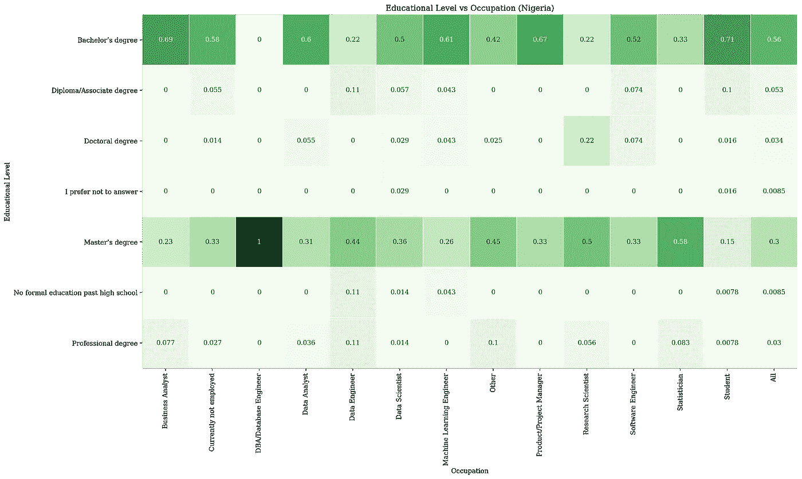*

*教育水平与职业(尼日利亚)*

*从绘制的热图中，我们可以看到，尼日利亚学士学位持有者的比例很高，在所有列出的工作岗位中，有 50%或更多的人拥有学士学位，只有少数例外。看看这些例外情况，DBA/数据库工程师职位只有一名尼日利亚受访者，但他们拥有硕士学位，数据工程师、研究科学家和统计学家职位的硕士学位都多于学士学位以及“其他”类别。*

*调查这一阴谋表明，尼日利亚学生 Kagglers 大多是在学校获得学士学位，让我们看看这是否是相同的世界其他地方。*

*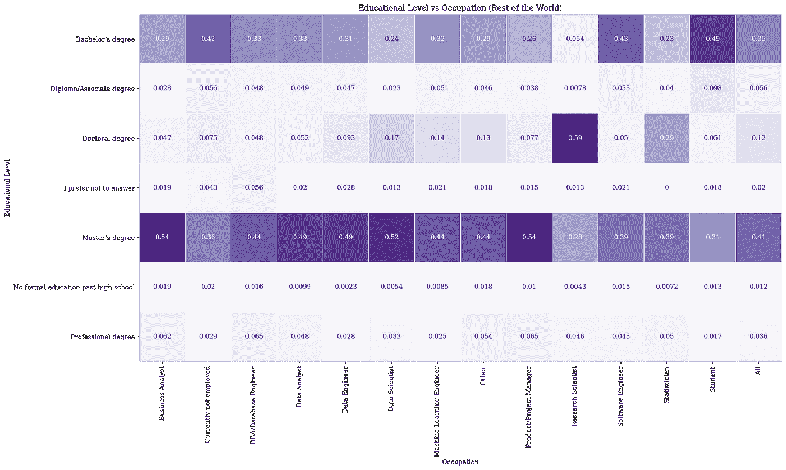*

*教育水平与职业水平(世界其他地区)*

*如前所述，在世界其他地区，硕士学位的范围更广，他们在所有工作岗位上都占主导地位，除了失业者、软件工程师和学生，他们拥有更多学士学位，以及研究科学家角色，他们大多拥有博士学位(59%)。*

*比较两个地块和它们的人口，很大比例的研究科学家拥有研究生学位，突出了该角色的高等教育或技术基础。*

*有了对我们大多数 30 岁以下男性的更好了解，有很大比例的学士学位学生，尼日利亚样本，我们可以继续了解他们对数据科学的兴趣，他们使用了什么工具，他们在哪里学习和消费数据科学内容。*

*首先，我们探索他们在编码或编程和机器学习方面的经验。*

*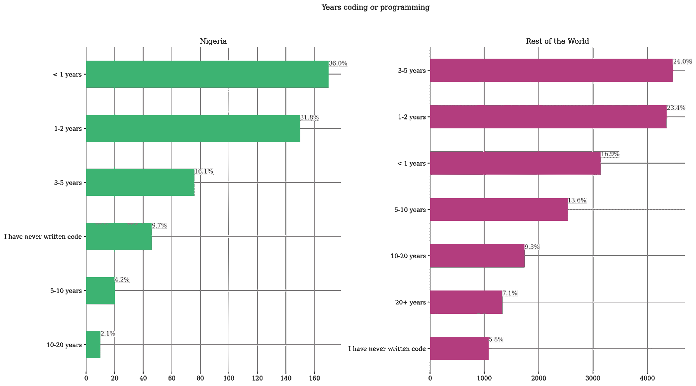*

*多年的编码比较*

*由于两个样本都有相对年轻的个体，如前所述，这里的大多数 Kagglers 有 5 年或更少的编码经验就不足为奇了。*

*尼日利亚样本显示了从一年内开始编程的相对新手到拥有长达 10 年或更长经验的个人的几乎线性的递减过程，比较两个图，我们看到样本中没有尼日利亚个人拥有 20 年以上的经验。*

*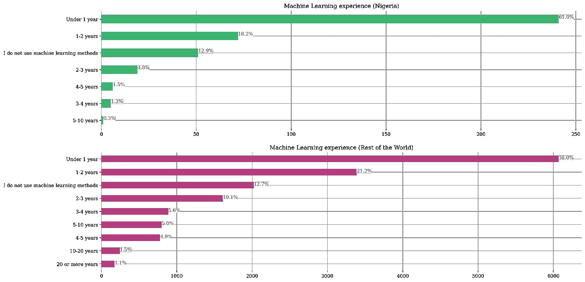*

*ML 体验对比*

*机器学习是数据科学的重要组成部分，具有广泛的现实应用。对于我们的调查样本，很大比例的参与者在该主题上只有不到一年的经验。*

*虽然在百分比比例上存在差异，但在排名上几乎没有差异，因为再次出现了几乎线性的进展，从大部分初学者开始，随着经验的增加而减少。同样，尼日利亚的样本中没有 20 岁以上的人。*

# *数据科学工具*

*随着对数据驱动的决策和创新需求的增长，数据科学和数据分析领域取得了很大进步。这推动了许多有助于丰富流程的工具的流行和重要性。然而，有很多个人偏好，公司也有使用哪些工具的标准。*

*在这里，我们来看看其中的一些偏好。*

*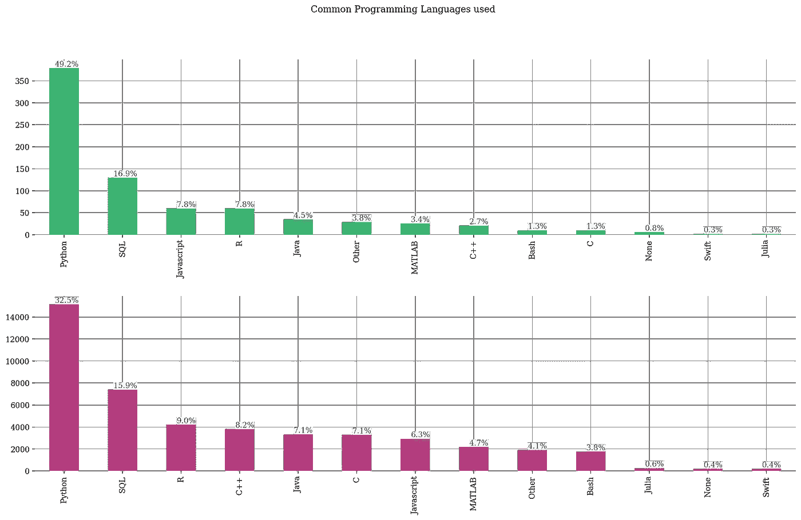*

*语言偏好比较*

*Python 的流行仍在继续，SQL 远远落后，这两种编程语言都是大多数数据相关角色使用的主要数据。JavaScript 排名可能指向我们的参与者，尤其是软件工程师的一些网络经验。在我们的世界其他地方的例子中，JavaScript 用户的比例较小，前三名分别是 Python、SQL 和 r。*

*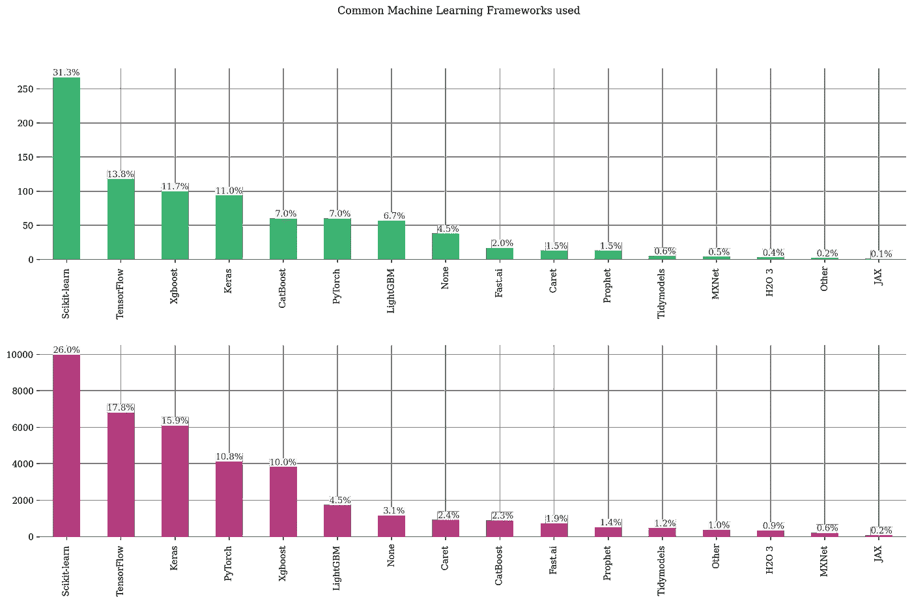*

*ML 首选项比较*

*Scikit-learn 是我们在这两个示例中最受欢迎的框架。自 2007 年首次发布以来，机器学习库一直是数据科学中的一个重要组成部分，它具有初学者友好的方法和针对不同用例的广泛功能。谷歌的张量流在这两个样本中排名第二。比较这两个图，我们的第一个偏差是 Keras 的排名，Keras 经常被用作深度学习的张量流的伴侣。在尼日利亚的样本中，脸书的 PyTorch 并没有排在前五名。*

*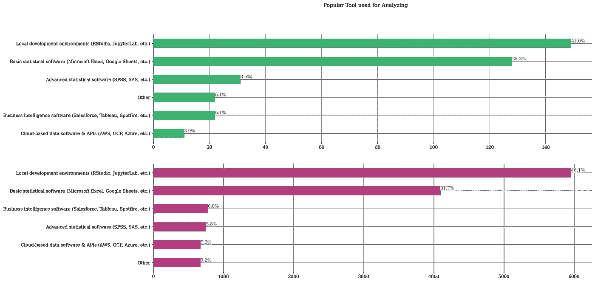*

*工具首选项比较*

*尽管有一些软件包吹嘘自己的预测建模能力，但对于数据科学角色来说，用大多数语言编程在建模过程中提供了更大的灵活性。考虑到这一点，看到编程开发应用程序是两个样本中最受欢迎的分析工具就不足为奇了。像 Excel 这样的基本统计软件包通常是个人对“数据”的第一印象，在许多公司中，这些工具仍然是结构化数据的第一接触，随着数据空间的增长，该工具已经有了许多改进，使其能够保持竞争优势。*

*基于云的软件仍然需要一些改进来迎合大众的口味，尤其是在尼日利亚。尽管大数据的主要吸引力在于更容易管理，但它们满足了尚未普遍实现的需求。*

# *数据科学学习和内容消费*

*在这里，我们调查参与者如何学习和获取数据科学领域的最新信息。*

*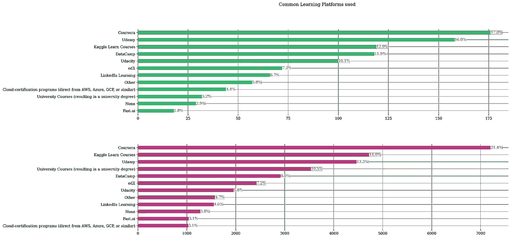*

*学习偏好比较*

*当查看数据科学学习发生的学习平台时，我们看到 Coursera 在两个样本中的比例都高于所有参与者，这可能是对他们在不同主题上的大型课程库以及免费“审核”大多数课程的能力的认可。Udemy 和 Kaggle learn 课程紧随其后，在两个示例中的顺序不同。*

*比较这两个图，在世界其他地区的样本中，大学课程在前 5 名的存在可能表明了以数据科学为目标的研究生课程的可用性，而尼日利亚的学位只能与统计、数学或计算机科学课程相邻。*

*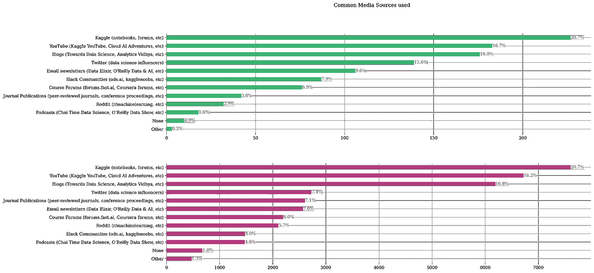*

*内容偏好比较*

*我们的前 4 名排名在两个样本中相同，百分比相似，突出了这些平台在数据科学相关内容中的突出地位；Kaggle，Youtube，博客和 Twitter。*

*尼日利亚参与者发现关于数据科学的期刊出版物不如他们的同龄人有用，他们更喜欢时事通讯、Slack 社区和课程论坛。*

*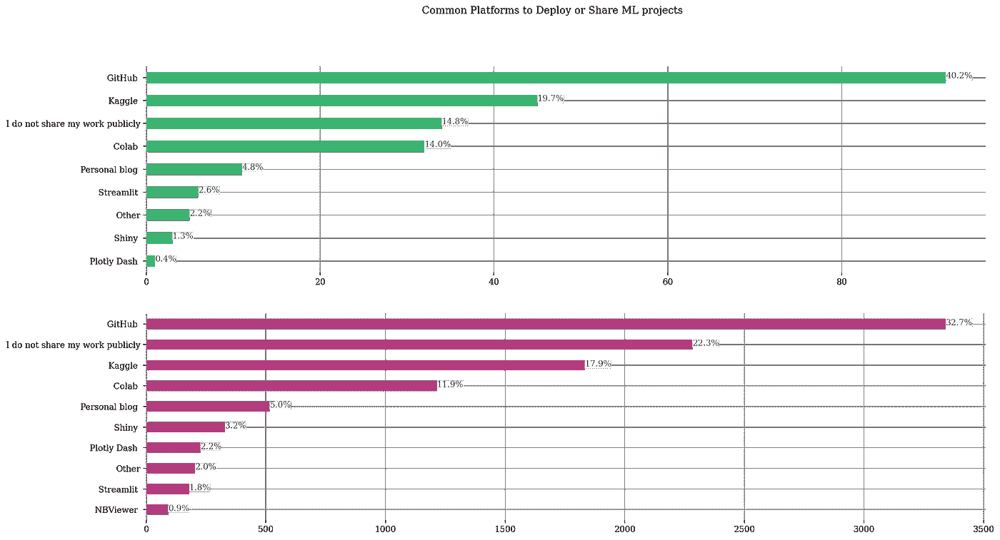*

*公共平台首选项*

*数据科学空间可以是一个畅所欲言的空间，有许多“影响者”,但也有许多人每天分享他们的所作所为或所学。在这里，我们看一下公开分享工作以供他人查看的流行平台。*

*GitHub 和 Kaggle 在两个样本中都名列前三，GitHub 在编程/开发领域的突出地位对该领域的任何人来说都是显而易见的，因为即使没有允许高效团队合作的出色版本控制功能，它也是建立个人或开源项目组合的绝佳场所。*

*Kaggle 也是一个展示数据科学人才的好地方，因为公共竞赛或独特的数据集推动了大量人口寻求学习、竞争或建立他们的数据科学肌肉。有相当多的人，特别是在“世界其他地区”的样本中，由于工作限制、个人偏好或其他原因，没有公开分享他们的工作。*

*值得注意的是，更多的尼日利亚参与者选择了 Streamlit 而不是 Shiny 和 Plotly Dash 作为他们的网络应用程序 dashboarding 需求，这一决定在世界其他地方的样本中是相反的。此外，没有尼日利亚参与者使用过 NBViewer，这是一种将 Jupyter 笔记本(来自 GitHub 或其他地方)呈现为网页的工具，以便于共享或嵌入，这种用例与其他替代品相比有点小众，因为它在世界其他地方的百分比很低。*

# *公司*

*在这里，我们看看我们的参与者工作过的公司的结构(这一部分是为那些在公司工作的人过滤的)，以及他们如何整体上使用机器学习和数据科学。*

*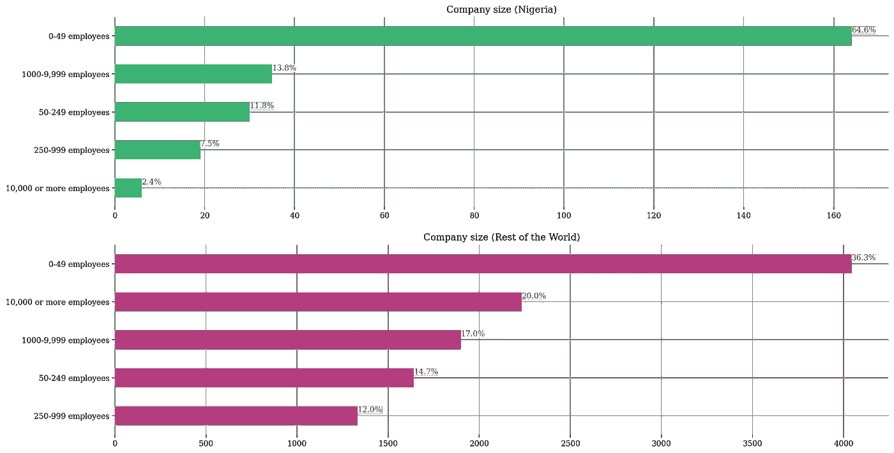*

*公司规模比较*

*我们的大多数参与者，尤其是尼日利亚的参与者，都在员工不足 50 人的公司工作。*

*比较这些图，我们看到在世界其他地区样本中第二大比例是 10，000 或更多员工的最高选项。这要么是假设这样的公司比预期的更普遍，要么是样本的人口统计数据在很大程度上影响了比例。*

*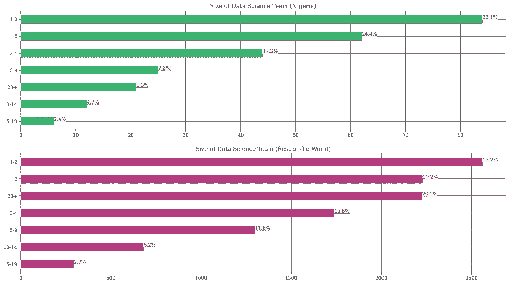*

*DS 团队规模比较*

*公司数据科学团队规模的前两项让我们看到了公司对数据科学的利用程度。此处显示的大部分公司的数据科学团队少于 3 人，下一个百分比排名是完全没有专门的数据科学团队的公司。*

*这意味着该公司根本不使用机器学习或数据科学，或者任何数据科学任务都由不完全致力于执行数据科学的公司成员来完成或承担。*

*在下一个情节中我们会看到更多。*

*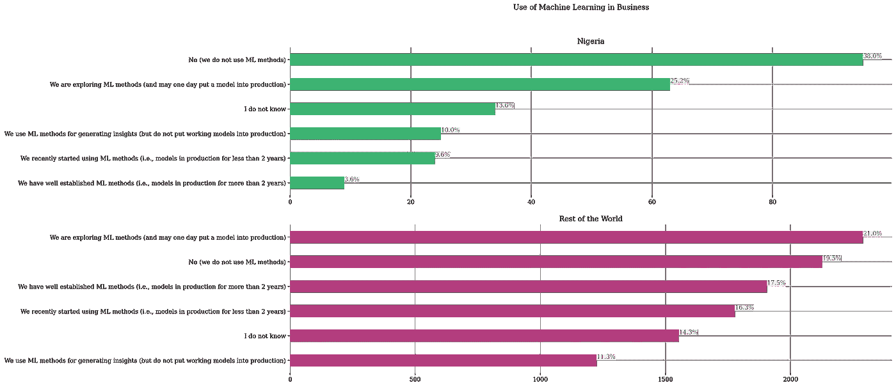*

*ML 利用率比较*

*更多的尼日利亚企业在看比例时不使用机器学习方法。对比图表，这两个样本将“探索机器学习方法”或“根本没有使用它们”作为“你的雇主将机器学习方法纳入他们的业务吗？”。*

*很少有公司已经在尼日利亚生产了模型，这凸显了机器学习方法的利用不足。*

*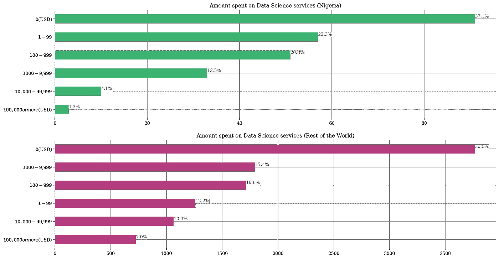*

*在 DS 服务上花费的金额*

*两个样本中没有为数据科学(机器学习或云服务)付费或从未付费的人的比例相似。尼日利亚的曲线是线性下降的，大多数人都是零美元，我们在尼日利亚样本中至少见过两次这种关系，两次都与参与者的经历有关，所以我们可以暂时假设这个问题是相关的。随着越来越多的人开始学习，还有改进的空间。*

*为了总结我们的分析，我们来看看一些与数据科学相关的任务，看看有多少人认为数据科学在他们的日常工作中很重要。*

*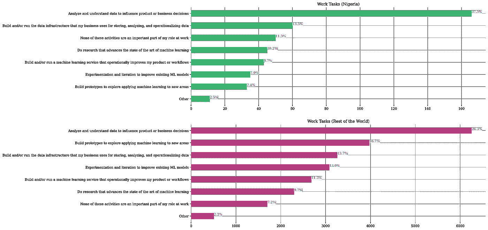*

*DS 工作任务比较*

*两个样本中的大多数人都执行数据分析来影响业务决策。在排名任务中，尼日利亚人发现建立数据基础设施比任何机器学习任务都重要。比较这两个图，为机器学习的新应用建立原型在尼日利亚人的排名中接近底部，而在世界其他地方的排名中则是第二。*

*在尼日利亚样本中，也有更高比例的人表示所列任务不是他们工作角色的重要组成部分，为了探究这一论断，有必要将我们的人口统计数据联系起来，尤其是关于参与者职业的数据。*

*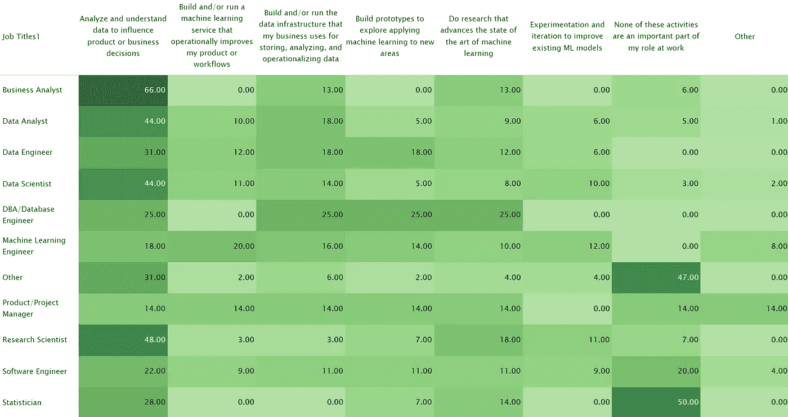*

*工作任务及其职业的交叉表(尼日利亚)*

*可以看出，分析任务对于大多数与数据相关的工作角色都很重要。产品/项目经理工作对其他与数据相关的工作任务的需求最高。统计师和其他未列出的数据角色是表示列出的数据相关任务对他们的工作不重要的人中比例最高的一些，软件工程师是另一个值得注意的人。*

*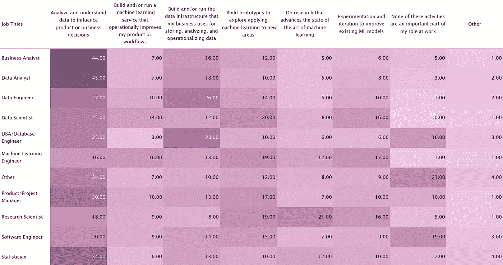*

*工作任务及其职业的交叉选项卡(世界其他地区)*

*本例中的数据工程师和 DBA/数据库工程师花费了大量的时间来构建数据基础设施，这是他们工作的一个重要部分。*

*比较这两个图，认为所列任务在其工作中不重要的统计学家的比例明显减少，该样本中的大多数参与者通过分析来影响商业决策，我们可以假设，接受调查的尼日利亚统计学家没有多少理由致力于影响商业决策，这可能是由于在教育或研究部门的就业。*

# *结论*

*尼日利亚人口众多，虽然这通常是一个弱点，但它也可以是一个优势，有了前人的启发，有了帮助年轻人和老年人提高与众多数据科学相关的数据分析师、商业分析师和数学家技能的计划的支持。随着对知识和经验的需求增加，Kaggle 平台上的人数将继续达到峰值。*

*对于数据科学方法的利用不足，“底线正在上升”，随着数据科学角色的更多空缺，需要了解它们给系统带来的影响，反之亦然，因为这是一个循环，将导致数据科学、其工具和原则的采用。*

# *参考*

1.  *尼日利亚数据科学的谷歌趋势，2015–2020。(2020).检索自[https://trends.google.com/trends/explore?date=today%205-y&geo = NG&q = % 2Fm % 2f 0jt 3 _ Q3](https://trends.google.com/trends/explore?date=today%205-y&geo=NG&q=%2Fm%2F0jt3_q3)*
2.  *中情局关于尼日利亚的实况报道。(2020).从 https://www.cia.gov/the-world-factbook/countries/nigeria/[取回](https://www.cia.gov/the-world-factbook/countries/nigeria/)*
3.  *谷歌搜索尼日利亚数据科学家的工作。(2021).检索自[网站](https://www.google.com/search?q=data+scientist+jobs&oq=data+scientist+job&aqs=chrome.0.0j69i57j0l6.9288j1j7&sourceid=chrome&ie=UTF-8&ibp=htl;jobs&sa=X&ved=2ahUKEwjw_aTTwobuAhWl6uAKHW2dB-IQutcGKAB6BAgDEAQ&sxsrf=ALeKk01jVH_Z30qKGnYACCgw_0bj_PtDmw:1609909072912#htivrt=jobs&htidocid=CgXA2sXWBxSdrn1sAAAAAA%3D%3D&fpstate=tldetail)。作者截图。*
4.  *确实搜索数据科学家的工作。(2021).从[https://www.indeed.com/jobs?q=Data%20Scientist&vjk = D2 B1 AFB 5d 21692 a 2](https://www.indeed.com/jobs?q=Data%20Scientist&vjk=d2b1afb5d21692a2)中检索。作者截图。*
5.  *关于尼日利亚移民的 Quora 问题。(2020).检索自[https://www . quora . com/Why-Nigerians 是美国受教育程度最高的群体](https://www.quora.com/Why-are-Nigerians-the-most-educated-group-in-America)。*

*感谢阅读！*