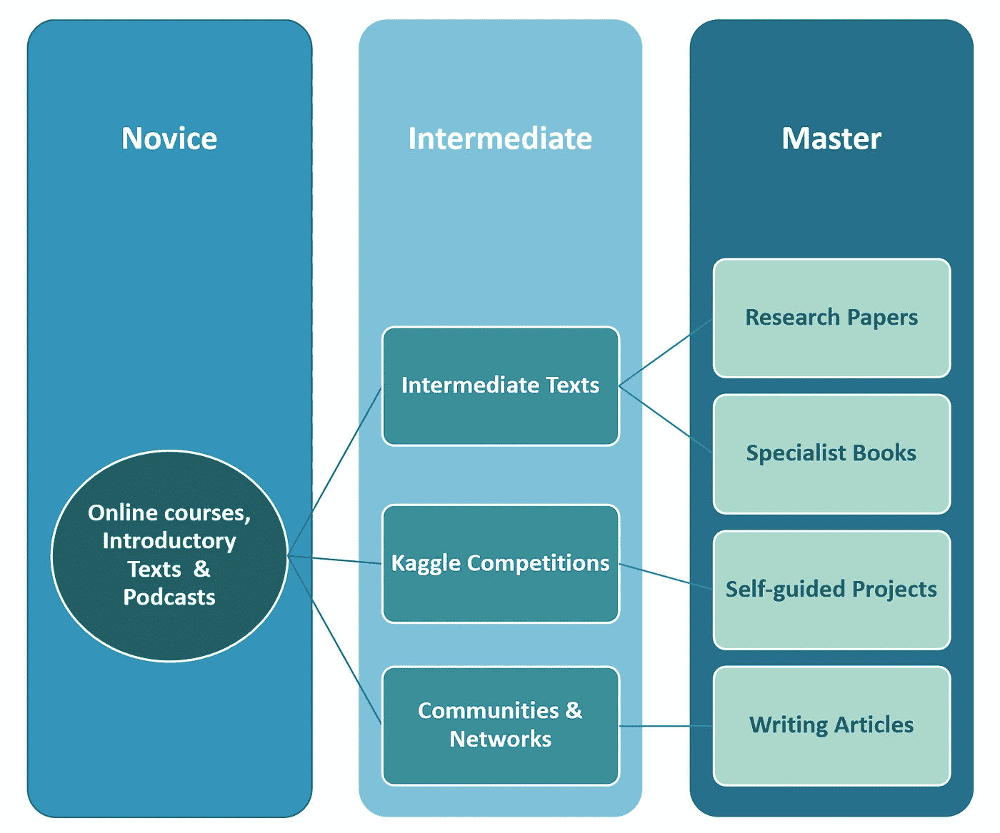

# 热情的新手掌握数据科学的路线图

> 原文：<https://towardsdatascience.com/a-roadmap-for-the-passionate-novice-to-data-science-mastery-f5f6cdf004e9?source=collection_archive---------8----------------------->

## **数据科学学习指南**

## **帮助您掌握数据科学的有用提示和资源**

由 [Lukas Medvedevas](https://unsplash.com/@majesticlukas?utm_source=medium&utm_medium=referral) 在 [Unsplash](https://unsplash.com?utm_source=medium&utm_medium=referral) 拍摄

# **简介**

有这么多的路要走，数据科学新手可能会很快不知所措。你可能会发现自己不知道下一步应该做什么，或者应该从哪里开始。

在这篇文章中，我整理了一个路线图，为你提供一些指导。这是基于我过去几年的精通之旅(顺便说一句，它永远不会结束！).我已经把我的方法系统化了，想和你分享，希望能帮你避开我遇到的坑坑洼洼。

# **这是给谁的？**

这篇文章是写给任何热衷于进入数据科学并掌握这门学科的人的。然而，我想补充一点小小的警告。如果是非技术出身，那就要更加努力了。关于它没有两种方法。许多技术人员认为他们多年来学到的东西都是理所当然的。你没有这种奢侈，但即使如此，你成为大师也是非常可能的。

这条路并不容易，但是从来没有这样一个技术领域如此容易被大众接触到，有如此多的资源可供自学。你需要的只是激情、纪律和计划。

# **学习哲学**

根据我的经验，一条高效的精通之路是采取五管齐下的方法。

> 阅读、倾听、构建和交流。

📚**阅读**:在合适的时间读合适的书是避免变得不知所措的关键。不要直接跳进深水区，而是从浅水区慢慢地漂进去。你将开始喜欢阅读数据科学书籍，并积累一个图书馆来帮助你完成任何项目。

👂听着:对于任何难以实现的目标，你都需要一些灵感。对我来说，我听过的许多播客确实启发了我。你不会从播客中获得大量的技术细节，但你会成为一名更全面的数据科学家。在了解该领域当前问题的同时，您自然会掌握数据科学术语。

🔧🔨**打造**:弄脏自己的手。做项目…很多项目。失败，从错误中学习，获得反馈，适应。如果不弄脏自己的手，你将一事无成，所以不要害怕陷入项目中。通过应用我的知识，我学到了最多。

📢**沟通:**良好的沟通能力通常是普通数据科学家与伟大数据科学家的区别。找到一个听众，交流你学到的东西，无论是通过写作还是演讲。交流新想法是强化新想法的一个好方法。它会迫使你用自己的话重新编码你所学的信息。如果你能正确对待这件事，你将会一举两得:建立你的品牌，同时学习新的概念。

👨‍👩‍👧‍👦**网络**:最终，你希望掌握这个领域，这样你就能找到工作；网络是关键。加入讨论组，创建 LinkedIn 个人资料，参加活动。把自己放在舒适区之外，掌握数据科学的道路需要你在途中遇到一些人。

# 路标

你应该把这篇文章作为有用的数据科学资源和材料的链接库。我花时间为你组织这些课程，帮助你从新手成长为大师。没有捷径可走，但只要投入并遵循系统，我保证你会成为大师。

请记住，数据科学在不断发展，因此学习永无止境。路线图系统会向你灌输你需要的学习习惯。

## ⭐Bonus 提示

1)采取并联方式，避免串联操作。这是我给你的最好的建议。不要等到你已经巩固了所有的理论之后才开始你的第一个项目，阅读和构建同时进行。像这样工作，你会大大减少你的学习时间。

2)计划你的时间——制定一个学习时间表，并坚持下去。每天几个小时应该足够了。

作者图片:您的数据科学路线图

# 🙈**新手**

您刚刚开始您的数据科学之旅，因此夯实基础非常重要。你需要数据科学工具的工作知识，对统计学、数学和机器学习的理解。

## **在线课程**

这些课程将为您提供开始有效使用数据科学工具所需的知识。所有课程免费学习。

**Python** —掌握所有 Python 基础知识，包括函数、循环、数据结构等等。Python 是解决数据科学问题的最佳工具之一，你会很高兴花时间学习它。如果你是计算机编程新手，不用担心，Python 被设计得很容易掌握。耐心和对学习的承诺是所需要的。

[课程链接此处](https://www.kaggle.com/learn/python)

**SQL** —可以说是处理结构化数据的最重要的工具。有很多分析和机器学习是在结构化数据集上完成的。如果你想有所成就，就要熟悉 SQL。

[此处课程链接](https://www.kaggle.com/learn/intro-to-sql)

**Pandas**——python 中处理结构化数据的另一个非常有用的工具。你会想要掌握这个。

[课程链接此处](https://www.kaggle.com/learn/pandas)

**机器学习** —在此获得如何识别和解决机器学习问题的基础知识。这门课程会给你足够的见识，让你开始解决自己的问题。

[此处课程链接](https://www.kaggle.com/learn/intro-to-machine-learning)

## **介绍性文本**

我提供了免费在线资源和(非免费)书籍的混合体。不要因为一些书的价格而却步，把它们看作是对自己的投资，从长远来看会有回报的。

**统计:**坚实的统计基础将大有裨益。

如果你想阅读一些浅显但内容丰富的统计资料，可以从大卫·斯皮格尔哈特的《统计的艺术》开始。

这本书充满了应用统计学专家的实用见解。作为一名专业统计学家，大卫很好地吸引了读者的注意力。

**数据科学&机器学习:**

[**安德烈·布尔科夫**](http://themlbook.com/) 的百页机器学习书，是初学者的必备读物。安德烈不仅涵盖了 ML 所需的基本数学，他还简明扼要地概述了许多重要的机器学习模型。

福斯特教务长汤姆·福西特的《商业数据科学》是一本很好的初学者指南，可以帮助你从数据科学的角度来看待商业问题。商业问题通常是混乱的，在这本书里你会得到处理这些问题的实用技巧。

凯茜·奥尼尔 的《数学毁灭的武器》是一本围绕人工智能和伦理提出重要考虑的优秀书籍。它将把你的视野从人工智能扩展到它影响的社区。

**电脑编程:**

😃所有这些资源都是免费的！

[Select Star SQL](https://selectstarsql.com/) —一本优秀的交互式书籍，适合绝对的初学者，让他们充分了解 SQL 的强大功能。作者假设很少或没有编码或计算机编程经验。

[用 Python 自动化枯燥的东西，作者 Al Sweigart](https://automatetheboringstuff.com/)——不是数据科学专用的，但仍然有用。我不推荐从头到尾阅读这篇文章，但是，它可以作为你在项目中想要完成的任务的参考。

## 播客

[**莱克斯·弗里德曼的人工智能播客**](https://www.youtube.com/user/lexfridman)——莱克斯深入探讨人工智能更具哲学意义的领域，启发观众进行更深入的思考。他招待过很多不可思议的客人，比如埃隆·马斯克和吴恩达。

[**凯西·科济尔科夫**](https://www.youtube.com/channel/UCbOX--VOebPe-MMRkatFRxw/videos)**——凯西是谷歌决策情报主管。她制作了一些技术性的短片，希望向听众灌输良好的数据科学基础知识和最佳实践。**

**❤️If 你知道任何其他伟大的播客，请留下评论！**

# **🤔**中级****

**在这个阶段，你应该对自己的能力更有信心。你可能会对 SQL、Python 有所了解，并有坚实的理论基础。你可以开始阅读一些更高级的文本，接触一些项目，寻找数据科学社区。**

## ****Kaggle 比赛****

**Kaggle 是数据科学家最好的免费学习资源之一。他们举办比赛，让你测试你的技能，并建立在你的机器学习知识。**

**这些比赛的伟大之处在于反馈的能力。你被排在其他参赛者的前面，这给了你一个掌握水平的概念。你也开始建立一个工作组合，向潜在雇主展示你的热情和承诺。**

**这里有三个我认为你应该尝试的竞赛**

**[**《泰坦尼克号》(入门级)**](https://www.kaggle.com/c/titanic)——你的任务是预测泰坦尼克号上乘客生还的可能性。这确实是一个入门级的分类任务，非常适合第一个项目。享受其中的乐趣，不要害怕发布你的结果，你总是可以提高你的分数！**

**[**高级回归技术(中级)**](https://www.kaggle.com/c/house-prices-advanced-regression-techniques) —给你一组房屋数据，你的任务是建立一个机器学习模型来预测它们的销售价格。这不是一项容易的任务，但是在数据清理和高级回归技术方面有一些有价值的经验。**

**作为对你的进一步指导，我写了一个关于这个问题 的 [**解决方案，看看你是否能在我的基础上有所改进。**](/predicting-house-prices-with-machine-learning-62d5bcd0d68f)**

**[**高级(数字识别器)**](https://www.kaggle.com/c/digit-recognizer) —这是计算机视觉中的一个任务。你将需要建立一个数字识别器使用 MNIST 手写数字数据集。我发现这个任务真的帮助我理解了神经网络和深度学习的力量。**

**查看我在 [**计算机视觉**](/a-friendly-introduction-to-computer-vision-with-artificial-neural-networks-d2a38acc047c) 上做的项目，寻求指导。**

## ****中间文本****

**中间文本比介绍性文本更详细一些。他们专注于为您提供一个代码库，帮助您在完成项目时制定自己的解决方案。这些是你的数据科学手册。**

**[**用 Scikit-Learn，Keras & TensorFlow 作者 Aurelien Geron**](https://www.amazon.com/Hands-Machine-Learning-Scikit-Learn-TensorFlow/dp/1492032646/ref=sr_1_1?dchild=1&keywords=Hands-On+Machine+Learning+with+Scikit-Learn%2C+Keras+%26+TensorFlow+by+Aurelien+Geron&qid=1611491320&sr=8-1)——我认为这无疑是你会买到的关于机器学习的最佳书籍之一。这里有许多实用的编码示例，将有助于您的数据科学项目和竞赛。帮你自己一个忙，买一本或者借一本这本书。**

**[**深度学习用 Python 作者 Francois Chollet**](https://www.amazon.co.uk/Deep-Learning-Python-Francois-Chollet/dp/1617294438/ref=asc_df_1617294438/?tag=googshopuk-21&linkCode=df0&hvadid=310913487979&hvpos=&hvnetw=g&hvrand=13812388352628804457&hvpone=&hvptwo=&hvqmt=&hvdev=c&hvdvcmdl=&hvlocint=&hvlocphy=9045880&hvtargid=pla-356949152624&psc=1&th=1&psc=1)——由深度学习用 Python 中的框架 Keras 的创建者编写。您将获得构建自己的深度学习解决方案所需的理论介绍和实践知识。**

## ****社区****

**在这个阶段，我强烈建议你找一个数据科学社区，并加入其中。加入一个社区是扩展你人际网络的好方法。**

**⚡️ **专业提示** : Meetup 是一种寻找数据科学社区和网络的绝佳方式。 [**开户，自己探索。**](https://www.meetup.com/home/)**

**我定期参加 [**数据科学的艺术家**](https://linktr.ee/theartistsofdatascience) 见面会 ups。这是一个由全球数据科学爱好者组成的令人惊叹的社区。你会发现来自不同背景的人有很多见解可以分享。**

**他们有休闲频道、播客、脸书和 LinkedIn 页面，你可以加入并关注。看看他们！**

# **🎓**主人****

**如果你坚持下去，你至少会了解自己两件事。你比你最初认为的更有能力，而且你真的对数据科学充满热情。**

**精通不同于其他两个阶段。这是一个持续的过程，需要终生致力于学习。我将尝试给你一个旅程的起点。**

## **✏️Write 博客帖子**

**学习的最好方法之一是通过教别人。一旦你有了一些项目，为什么不开始写作来帮助别人呢？它将通过要求你在一个主题上构建你的思想，并迫使你弥补知识缺乏的空白，来强化你的知识。**

**有许多媒体上的出版物你可以申请写作。不要害羞，把自己放出来。如果你真的很好，你甚至可以赚点钱。**

## **⭐ **专业书籍****

**这里是我们要深入的地方，这些书不适合胆小的人(从这里开始只限爱好者)。**

**你在寻找精通，这些是你会回来反复参考的书。你将利用这些来寻找最困难问题的答案。**

**[**深度学习——伊恩·古德菲勒、约舒阿·本吉奥和亚伦·库维尔**](https://www.deeplearningbook.org/) 。这是该领域一些顶级研究人员撰写的深度学习书籍中的精华。它有大量的数学证明来指导你理解任何深度学习算法下发生的事情。**

**这本书的伟大之处在于它可以在网上免费获得！**

**[**罗恩·科哈维、黛安·唐&徐亚**](https://www.amazon.co.uk/Trustworthy-Online-Controlled-Experiments-Practical/dp/1108724264/ref=tmm_pap_swatch_0?_encoding=UTF8&qid=&sr=) 可信的在线控制实验——实验是数据科学中不被重视的一部分。在商业环境中设计可信的实验并不是一项容易培养的技能。在线实验的所有错综复杂之处都由作者在本书中提出，他们是该领域的世界领先专家。**

**💁**可选** : [**谷歌云平台上的数据科学——作者 Valliappa Lakshmanan**](https://www.amazon.co.uk/Data-Science-Google-Cloud-Platform/dp/1491974567) 。云计算平台极大地简化了构建端到端机器学习解决方案的过程，将数据科学家和数据工程师的角色结合在一起。[见我关于这个的文章](/5-reasons-data-scientists-must-be-data-engineers-in-2021-and-beyond-805c6d1a1e03)**

**通过掌握一些云技能，你或许可以为自己开辟一片天地。这是可选的，因为不是所有的组织都使用谷歌的云平台，有些使用微软 azure 或 AWS。无论您选择什么平台，了解云计算，它会一直存在。**

## **💰自主项目**

**这就是你的创造力发挥的地方。在这个阶段，你应该开始看到别人可能看不到的数据机会。**

**例如，也许有一个工作过程可以通过机器学习来自动化。开始吧，做一个原型，然后把它推销给你的老板。自我指导项目的美妙之处在于，你从头到尾做每一件事，从构思问题到创造解决方案。支持自己，完成它！**

## **🔥开源代码库**

**创建一个 GitHub 帐户，并开始在 GitHub 存储库中存储您的所有项目。GitHub 不仅有助于协作和版本控制，它还充当了您希望在后续项目中再次访问的代码的存储库。**

**⚡️:这是展示你作品组合的好方法。**

**[在这里设置你的 GitHub 账户](https://github.com/)。**

## **📈研究论文**

**这个领域是不断发展的，你可能会发现你的问题的解决方案在你读过的书中没有涉及到，因为你正在研究一些前沿的东西。这就是研究论文派上用场的地方。它们的生产速度通常比书籍快，并且涵盖了该领域的最新技术。这是真正为非常先进的。**

**[这是一篇关于深度神经网络最优超参数调整的论文](https://arxiv.org/pdf/1803.09820.pdf)**

# **最后的想法**

**就个人而言，我对这个领域研究得越多，我就越有激情。会有一些你感到不知所措的黑暗时期，但是记住那些是你成长最多的时期。**

**成为这个领域的一部分是如此值得的原因之一是它需要很多艰苦的工作。当你看到自己手中掌握着解决问题和设计解决方案的力量时，你会感激自己坚持了下来。**

**🌈记住这个路线图，回头看看这篇文章，给后面的人留下反馈和建议。我很想听听你从新手到高手的旅程进展如何。**

**❤️Thank 你！**

** [## John Ade-Ojo -数据科学|技术|银行和金融| LinkedIn

### 查看 John Ade-Ojo 在全球最大的职业社区 LinkedIn 上的个人资料。约翰的工作列表上有 6 份工作…

www.linkedin.com](https://www.linkedin.com/in/john-adeojo/)**