# 最短路径算法自学指南，用 Python 实现

> 原文：<https://towardsdatascience.com/a-self-learners-guide-to-shortest-path-algorithms-with-implementations-in-python-a084f60f43dc?source=collection_archive---------4----------------------->

## [入门](https://towardsdatascience.com/tagged/getting-started)

## 探索最基本的路径查找算法，它们为什么工作，以及它们在 Python 中的代码实现


由[凯勒·琼斯](https://unsplash.com/@gcalebjones?utm_source=medium&utm_medium=referral)在 [Unsplash](https://unsplash.com/?utm_source=medium&utm_medium=referral) 上拍摄的照片。

在图论中，路径是连接两个节点的**个不同的**个顶点和边的序列。从一个源节点到目的节点可能有过多的路径。考虑下面的例子:

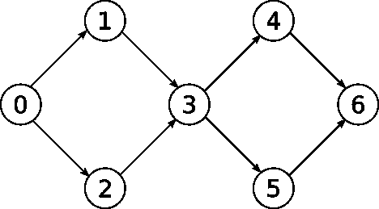

作者图片

考虑分量(0，1，2，3)，我们有两种从 0 到 3 的可能方法。加上(3，4，5，6)，我们就有 2×2 种可能的方法。再加上 8 个类似的组件，我们将有 2 个⁰ = 1024 条可能的路径。

就输入而言，路径的数量可以呈指数增长，但只有这些路径的子集使边权重之和最小，这些路径被称为最短路径。

正如我们已经证明的，生成所有路径的集合来寻找最短路径是非常浪费的。在这篇文章中，我将阐述最基本的最短路径算法。目的是确保不仅理解这些算法如何工作，而且理解它们为什么工作，同时避免复杂的数学证明，而是强调直觉，所有这些都将得到 python 代码的支持。

有 BFS 和 DFS 等基本图形算法的先验知识是加分的，但不是必需的。如果你知道什么是边和顶点，你可能知道得够多了。

贯穿本文，图 G(V，E)将被表示为一个[邻接表](https://en.wikipedia.org/wiki/Adjacency_list#:~:text=In%20graph%20theory%20and%20computer,a%20vertex%20in%20the%20graph.)，其中 V 表示图中的顶点集，E 表示图中的边集。

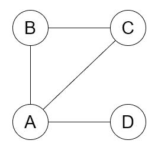

作者图片

例如，上图的邻接表表示如下:

一个如何用 python 表示邻接表的例子。注意这个图是无向的，因为每个边在列表中出现两次，例如:(A，B)，(B，A)。

# 横向优先搜索

广度优先搜索(BFS)是一种基本的图遍历算法。它的工作方式是，对于每个节点，我们扫描它的所有相邻节点，并存储它们，以便我们可以在下一次迭代中依次扫描它们。

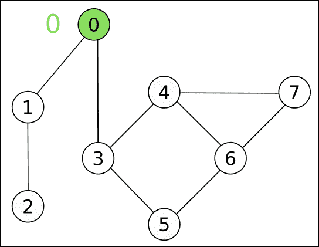

样本图上的 BFS 水平。图片作者。

## 履行

这个用 python 实现的，来自 [MIT 6.006](https://ocw.mit.edu/courses/electrical-engineering-and-computer-science/6-006-introduction-to-algorithms-fall-2011/lecture-videos/MIT6_006F11_lec13.pdf) ，虽然不是你在实践中可能会用到的，但它将帮助我们更好地理解 BFS 实际上在做什么，以及我们如何利用它来寻找最短路径。

在 while 循环的每次迭代中，我们通过遍历上一边界中每个节点的邻居来探索新的节点边界。

结果是我们最终将图分成几层，如上图所示，其中第一层**由距离源至少一条边的节点**组成，第二层由距离源至少两条边的节点组成，以此类推。在上面的代码中，距离数组 *dist* 为图中的每个节点保存这个值。

然后我们可以推测，在一个图上运行 BFS 后，我们可以找出用最少的边数从源头到达任何节点的方法。嗯，对我来说，这听起来像是图中任何顶点的最短路径！(不完全是…)。

除了距离数组，我们还维护了一个父指针数组(或者哈希表，如果您愿意的话)，方便地命名为 parent，其中我们为每个发现的节点 v 指定了发现 v 的节点 u，即它的父节点。

我们使用这个数组来跟踪一个节点以前是否被访问过，但是这本身并不需要指定每个节点的父节点。我们这样做的真正原因是，能够回溯到源，并通过跟随那些父指针来构造最短路径。

BFS 的一个更实际的实现是使用一个队列来存储下一步要探索的节点。但是它抽象了层次的概念，使得理解 BFS 如何给我们提供最短路径变得更加困难。

## 执行时间

*   需要 v 次迭代来初始化父数组和距离数组
*   while 循环只会运行 V 次。因为我们跟踪在父数组中看到的每个节点，所以我们只添加在下一次迭代中要扫描的未探索的节点。
*   在 while 循环的每一次迭代中，我们从队列中弹出一个节点，并扫描与它相邻的所有节点。这等于从 v 发出的边的数量。对图中的每个节点这样做的成本是 O(边的总数= E)。

因此，BFS 的运行时间为 **O(V + E)** 。

## 警告

如前所述，需要注意的是，就边的数量而言，这只是最短路径，也就是说，只有在图是未加权的或者所有权重都相同的情况下，这才算“真正的”最短路径。考虑以下示例，其中从 0 到 2 的最短路径不是边数最少的路径:

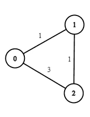

作者图片

那么我们该如何解决这个问题呢？

一种方法是将初始加权图转化为未加权图，同时保持问题陈述的规格完整，方法是将加权边分解为权重为 1 的边，并用假节点将它们链接在一起。

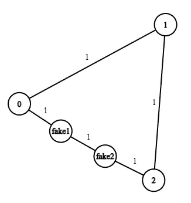

将先前的图形转换成未加权的图形。图片作者。

这个算法的运行时间是多少？

这仍然是 BFS，所以运行时间在边和顶点方面应该仍然是线性的。但是在我们的新图中有多少呢？

*   对于每条权重为 **w** 的边，我们用权重为 1 的 **w** 边来代替:**E’= O(W * E)。** W 为最大边重。
*   对于权重为 w 的每条边，我们创建 w -1 个新顶点，而旧顶点还没有去任何地方。 **V' = O(W*E + V)。**

因此，运行时间是 **O(V + W*E)** ，在这里我们开始看到这种方法的警告:它取决于权重有多大。这对于权重较小的图也同样适用，但在实践中很少有用。我们更希望有一种算法能够快速找到最短路径，而不管权重值是多少。

为此，我们需要引入一项至关重要的技术，这是在图中寻找最短路径的关键。

# 边缘松弛

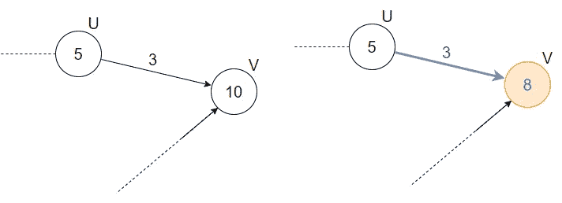

作者图片

放松边(u，v)在于简单地检查我们是否可以从源节点 s，**找到通过(u，v)** 到 v 的更短路径。

我们通过比较已知的旧路径到 v 的距离，与由到 u 的最短路径和边(u，v)形成的路径的距离来实现。

```
Relax(u, v, weight):
    if d[v] > d[u] + weight(u, v):
        d[v] = d[u] + weight(u, v)
        parent[v] = u
```

如果我们确实发现我们可以通过边(u，v)更快地到达 v，那么我们更新以下值:

*   d[v]:从源 s 到节点 v 的距离。我们用刚刚与之比较的新值来更新它。
*   parent[v]，v 的直接父，现在是 u。因为，像在 BFS，我们通过跟随父指针找到路径，这类似于更新到 v 的最短路径

## 最短路径算法模板

使用我们上面学到的技术，我们可以编写一个简单的骨架算法来计算加权图中的最短路径，它的运行时间不依赖于权重的值。

1.  从图形中选择边(u，v)。
2.  放松边缘(u，v)。
3.  重复 1 和 2，以某种顺序选择边，直到没有边可以放松(对于所有边(u，v)，d[v] ≤ d[u] + weight(u，v))

如果图中没有边可以松弛，这意味着没有更好的方法通过任何相邻的边到达任何节点，也就是说，没有比当前路径更短的路径到达任何节点。

这很简单！然而，通常情况下，魔鬼隐藏在细节中，在这种特殊情况下，魔鬼阴险地潜伏在单词**‘某种秩序’**中。不明智的放松令会导致指数时间。一个好的订单甚至可以产生线性时间。该算法的效率取决于放松边缘的顺序，每个后续算法在这方面都有所不同。

# 贝尔曼·福特

既然我们已经知道了如何按照一定的顺序探索一个叫做 BFS 的图的边和顶点，为什么我们不试试呢？让我们按照广度优先的顺序来研究这个图，沿着这个方向扫描顶点和放松边。

然而这一次，我们不能仅仅满足于扫描每个顶点一次。与边未加权时不同，我们不可能知道是否有更好的路径到达一个节点，一条通过位于前方多个边界的节点的路径，还有待探索，如下例所示。

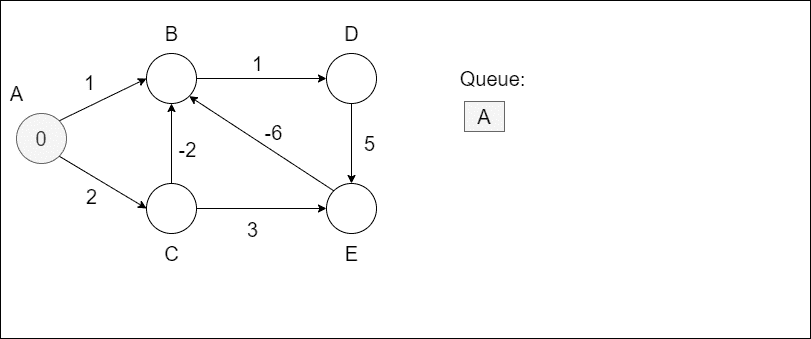

源节点是一个。不同的颜色代表不同的级别。请注意，没有比节点更多的级别，也没有顶点被添加到一个级别两次。请注意，我们必须多次扫描 B 和 D 才能获得它们的实际最短路径值。图片作者。

相反，如果当扫描节点 u 时，边(u，v)可以被放松，我们放松它，然后我们将它添加到队列中。但是我们不想将一个已经在队列中的节点添加到队列中，并计划在以后扫描，这将是一种浪费。因此，对于每个节点，我们必须跟踪它在任何给定时刻是否在队列中。

实现如下所示:(暂时忽略第 26 到 30 行)

但是为什么这个算法能够找到最短路径呢？

## 直觉

类似于我们在 BFS 所做的，我们将尝试通过查看队列中的级别来分析该算法。

级别 0 仅由源节点 s 组成。

级别 1 与 BFS 相同，由与源节点相邻的所有节点组成。这些是源的边缘内的节点，即通过长度为 1 的路径。

第二层现在将包括与第一层节点相邻的所有节点，这些节点的边**可以放松**。这些是图中所有可以通过长度为 2 的路径到达的节点，比长度为 1 的路径快。

在级别 1，长度为 1 的所有最短路径(从源 s)都计算正确。

在第 2 级，所有长度为 2 的最短路径都计算正确。

在级别 V-1，所有长度为 V-1 的最短路径都被正确计算。

一条路径最多只能有 V 个节点，因为一条路径中的所有节点必须互不相同，因此一条路径的最大长度是 V-1 条边。因此，在 V-1 级之后，该算法找到所有最短路径并终止。

## 负重量循环

到目前为止，我有意忽略了关于加权图的一个重要细节。考虑下图:

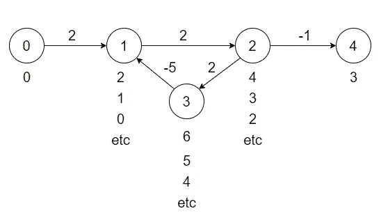

负圈图上 BFS 序边松弛的结果。图片作者。

节点 1、2 和 3 形成一个循环。这个圈的特别之处在于它的边的权重之和是负的。在具有负循环的图中寻找最短路径是一个[NP-完全](https://en.wikipedia.org/wiki/NP-completeness)问题，没有已知的算法可以计算出有效的解决方案，并且很容易看出为什么。

我们已经看到，寻找最短路径的关键是放松边的顺序，但是无论你放松边 1-2、2-3 和 3-1 的顺序如何，你都不会到达没有边可以放松的点，因为你总是可以通过再次穿过负边、再次关闭循环来减少距离。

因此，我们有必要检测算法中这些循环的存在，以防止算法无限运行。但是怎么做呢？

*   我们已经做了安排，以确保一个节点在一个关卡或阶段中不会出现超过一次。
*   我们还知道，在正常情况下，不应超过 V-1 级。

因此，在整个执行过程中，一个节点最多只能被推入队列 V-1 次。然后我们可以跟踪一个节点被添加到队列中的次数(第 26 行)，如果这个数字超过 V-1，我们就检测到了一个负循环(第 28 到 30 行)。

**注意:**这样做的一个后果是，我们不能在带有负边的**无向图**上使用这个算法，因为单个负的无向图将被算作一个负循环(因为它等价于 2 个有向边，(u，v)和(v，u))。

## 执行时间

*   我们知道该算法有 V-1 个阶段，每个阶段对应于我们刚才提到的 V-1 个级别。(例如，在阶段 1 中，我弹出 0 级(这只是源)中的所有节点，扫描它们的所有相邻节点，并扫描下一级节点。)
*   因为我们确保了没有顶点在同一级别的队列中出现超过一次，所以每个级别的顶点不会超过 V 个。
*   在每个阶段，最糟糕的情况是，如果我们将所有的顶点都放在一个级别中，并且必须扫描图中的所有边，这将转化为 O(E)。

因此，算法的总运行时间为 **O(V.E)** 。

在图形稀疏的情况下，这是二次时间(E = O(V)，不是非常浓密)，在图形密集的情况下，这是三次时间(E = O(V)，非常浓密的图形，每个节点都有很多边)。这可能会很慢，有没有办法加快速度？

事实证明，对于包含负权重边的图，我们无法做得更好。但是谁需要它们呢？它们在实践中并不经常出现。如果我们有一个非负边权重的图，有没有办法利用它来提出一个更快的算法？

# 迪克斯特拉

考虑下面的例子:

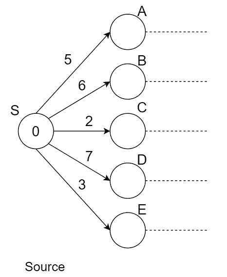

一个图形的开始。

如果我们假设图中没有负边，我们能猜猜哪条边构成了最短路径吗？

权重最小的边将**节点 C** 链接到**源**。

为什么会这样呢？好吧，如果存在到节点 C 的较短路径，那么它必须经过从 A 到 E 的一个节点，所有这些节点的边的权重都高于我们选择的权重最小的边。**因为我们没有负权重的边，所以当你添加更多的边时，路径的成本永远不会变小，**所以当我们在图中继续前进时，总的路径权重不可能降低。

因此，我们可以肯定地说(S，C)是到节点 C 的最短路径，因此，我们不必再回到它，这就是 Dijkstra 算法的本质。

## 算法

Dijkstra 采用贪婪的方法来进行边缘松弛。在每次迭代中，它选择离源最近的节点。它放松它所有的输出边，然后不再检查它，因为它确定这是到那个节点的最短路径的当前值。

它不断重复这一过程，直到它用尽了图上的每个节点，或者，如果你心里有一个目的地节点，直到它到达那个特定的节点。

```
Pseudo-code Dijkstra (adj, source):visited = {} 
Q = priority_queue()
Initialize Q with (node, distance) values, distance being 0 for the source and infinity for every other node.while Q is not empty:
    u = extract_min(Q) # deletes u from Q 
    visited = visited ∪ {u} 
    for each vertex v, weight in Adj[u]:
        if d[v] > d[u] + weight(u, v):
            d[v] = d[u] + weight(u, v)
            parent[v] = u
            Q.decrease_key(v, d[v])
```

该算法利用了一个[优先级队列](https://en.wikipedia.org/wiki/Priority_queue#:~:text=In%20computer%20science%2C%20a%20priority,an%20element%20with%20low%20priority.)数据结构，而不是像本文前面那样的常规队列，因为我们需要在每次迭代中弹出最近的节点。

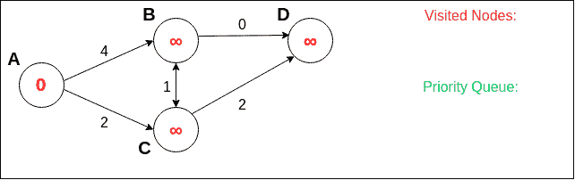

作者图片

你可以在这里找到 Dijkstra 的图像，你可以玩玩，它是由旧金山大学的 David Galles 创作的。

## 直觉

我们已经探索了为什么这个算法能够计算最短路径的部分直觉。我们可以将这种推理扩展到第一次迭代之后:

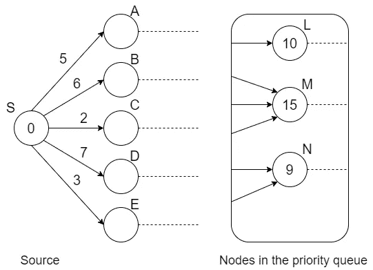

作者图片

对于这个特定的状态，优先级队列将返回 N。不存在到节点 N 的更短的路径，因为到 N 的任何其他路径都必须经过当时已经在优先级队列中的节点(我们探索节点并放松其所有相邻边的方式使其如此)，所有这些节点都离源远于 A。

至于其他节点，虽然它们的距离值可以在未来的迭代中减少，但它们永远不会变得小于 A 的距离，因为它们减少距离的最佳选择是找到穿过 A 的路径。

## 执行时间

我们有以下操作:

*   O(V)将插入优先级队列(初始化步骤)
*   **O(V) extract min** 操作(队列从 V 个节点开始，一直弹出，直到用完为止)
*   对于每一个提取的顶点，我们做的减少键操作和输出边一样多(最坏的情况)。对所有节点求和等于 **O(E)减键**操作。

实际的时间复杂度取决于用于实现优先级队列的数据结构。

**使用未排序的数组**，提取最小值需要完全遍历顶点，导致成本为 O(V)。减少一个键的值可以在常量时间内完成。结果是 **O(V + E) = O(V )** 。

**使用一个** [**二进制堆**](https://ocw.mit.edu/courses/electrical-engineering-and-computer-science/6-006-introduction-to-algorithms-fall-2011/lecture-videos/MIT6_006F11_lec04.pdf) ，两个操作的开销都是 O(log(V))。总运行时间为**O(V . log(V)+e . log(V))= O(e . log(V))**。

使用 Fibonacci 堆，您可以获得 O(E)的运行时间，但是这种数据结构对于实际应用来说太花哨了。

至于哪一个是更好的方法，它(显然)取决于 E 的值。E 可以具有的最佳值是 V -1*(当图刚刚连通时)。对于稀疏图 E = O(V)，使用二进制堆是更好的选择。

最坏的情况发生在图是密集的，并且我们有从每个节点到几乎每隔一个节点的边的时候。在这种情况下， **E** = O(V)，您最好使用数组实现来节省那些减少的关键操作的成本。

*我忽略了这样一个事实，即当图中有多个断开的组件时，E 可以小于 V-1，因为无论如何都无法从源到达这些组件。您可以从开始节点运行 BFS 来确定哪些节点连接到它，并只将这些节点放入优先级队列中，或者在 for 循环中填充优先级队列，而不是从头开始初始化它(下面的 python 实现就是这种情况)。

## 履行

这是一个使用堆作为优先级队列的实现，在实践中是最有用的。但是它与伪代码略有不同:

请注意，我们没有减少节点的键，而是将新的(节点，距离)对推入队列，相信队列将返回距离最小的对。至于留在队列中的较大的副本，将在第 12 行通过检查它们是否已经被访问过而被过滤掉。

我选择这样做的原因是，decrease 键为 O(log(V))，我们需要能够从节点 u 快速定位队列中的(u，du)对。Python 的 heapq 实现不提供这样的功能。你可以[手工实现](https://www.youtube.com/watch?t=10&v=bFEoMO0pc7k&feature=youtu.be)，使用一些[外部模块](https://pypi.org/project/HeapDict/)，或者发挥创意。

因为队列中的节点数量不再限制在 V 个节点，所以我们最多可以在队列中有 O(E)个节点。渐近运行时间为 O(E . log(E))= O(E . log(V))= O(E . log(V))，所以基本不受影响。

Dijkstra 的运行时间相当好，对于随机图，没有更好的渐近运行时间，尽管在实践中确实存在运行更快的算法。

然而，对于[有向无环图(DAGs)](https://en.wikipedia.org/wiki/Directed_acyclic_graph) 的特殊情况，有最后一种算法比 Dijkstra 的算法更快，甚至可以处理负权重边！

# DAG 最短路径

标题中的创造性名称是对这种算法缺乏一个事实的简化，因为没有人真正知道是谁首先发明了它。

现在，一个人在野外遇到一个有向无环图(DAG)时应该发展的基本本能是对它进行拓扑排序。这将给我们一个线性排序，使得如果(u，v)是从 u 到 v 的有向边，那么前一个 u 肯定会出现在后一个 v 之前。

换句话说，**在任何路径上，没有一个节点可以先于它的前一个节点。所有的路都是向前的。**

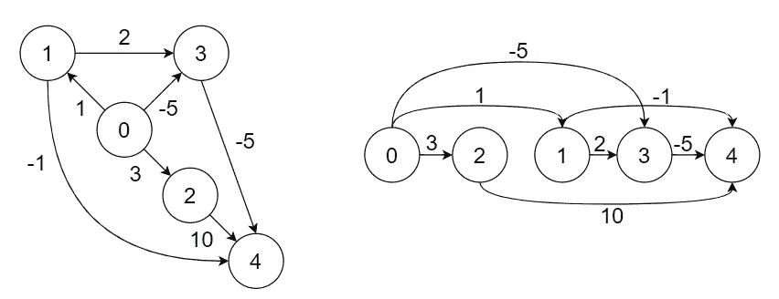

拓扑排序前后的 DAG。图片作者。

因此，通过以拓扑顺序迭代每个节点，放松其所有外出边，我们可以放心，一旦节点被扫描其邻居，它将永远不会再次被扫描，因为它的距离值将永远不会被更新，因为实际上没有办法从它的后继节点回到它，这是拓扑排序的属性。

这基本上是用来证明 Dijkstra 贪婪方法的正确性的相同推理，但是没有复杂的解释(Dijkstra 的实际形式证明相当粗糙……)或花哨的数据结构。并且总运行时间与 BFS 相同， **O(V + E)** 。

**实施**

我们首先对图进行拓扑排序。为此，下面的代码使用深度优先搜索(DFS)。由于这不是一个最短路径算法，我就不详细介绍了。

现在我们可以实现最短路径算法:

# 结论

唷，是时候了。这比我预期的时间要长。我们已经探索了最基本的单源最短算法。以下是迄今为止我们看到的算法的总结:

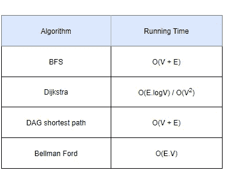

图片作者。

下面是一个决策树，可以帮助您选择最适合您的使用情形的选项:

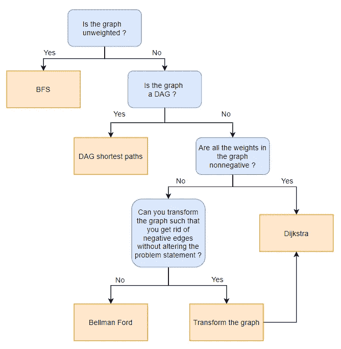

图片作者。

最后，请注意以下几点:

*   本文中描述的所有算法都是为了找到从**一个特定源节点**开始的最短路径，因此它们被称为**单源最短路径算法**。还有其他算法可以找到从图上所有节点的所有最短路径，并且比运行我们已经见过 V 次的算法之一更有效(因为有 V 个源节点)。下次我可能会写一篇关于这些的文章。
*   关于 [**贝尔曼福特**](https://en.wikipedia.org/wiki/Bellman%E2%80%93Ford_algorithm) 算法我其实是撒了谎。文章中提出的算法实际上被称为“ [**最短路径更快**](https://en.wikipedia.org/wiki/Shortest_Path_Faster_Algorithm#:~:text=The%20Shortest%20Path%20Faster%20Algorithm,that%20contain%20negative%2Dweight%20edges.) ”，是贝尔曼福特的改进版本，具有相同的渐近复杂性，但在实践中工作更快。它们也是同样的正确性证明，但是我发现使用最短路径更快的算法更容易看到那个证明。这一点，加上实际的效率，是什么让我选择的变化，而不是原来的。