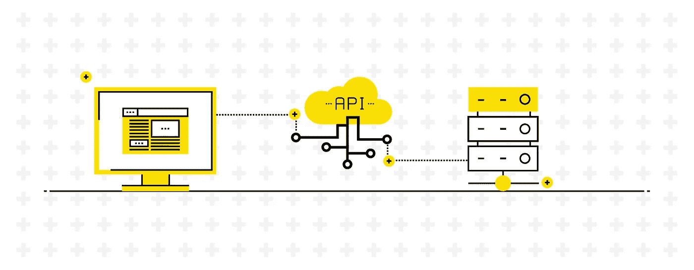
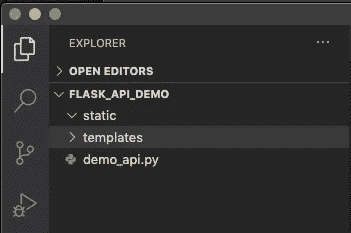
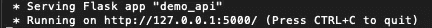
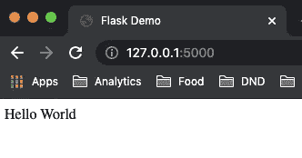
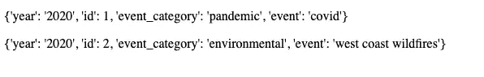
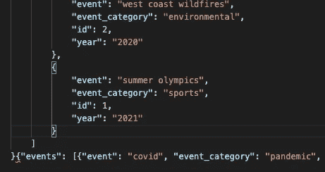

# Flask APIs 系列，第 1 部分:获取和发布

> 原文：<https://towardsdatascience.com/a-series-on-flask-apis-part-1-getting-and-posting-33985dfe8816?source=collection_archive---------7----------------------->



API 允许客户端与服务器通信，对于软件架构至关重要。图片由[约翰经许可做](http://www.johnqdo.com/)。

本文是 Flask APIs 系列文章的一部分。这一部分将介绍如何使用 JSON 文档创建一个基本的 REST API，并在本地运行该 API。后续的每一部分都将引入新技术，帮助您更好地理解云中的 API 和 DevOps。

**基础知识:什么是 Flask，什么是 API，什么是 REST API？**

[Flask](https://flask.palletsprojects.com/en/2.0.x/) 是一个 Python 微框架，通常用于创建 API 或应用编程接口。API 让你与应用程序交互。甚至 Python 中的模块也是一种 API，原因是:它们允许你与应用程序中的外部代码进行交互。API 充当服务器和您之间的一种契约。因此，要清楚地记录呼叫格式和预期的响应类型。

与全栈框架相比，Flask 是一个微框架，它便于接收 HTTP 请求，在控制器中处理这些请求，并返回 HTTP 响应。您可以在 Angular 或 React 的全栈项目中使用 Flask 作为组件，但我们可能不会在本系列中深入讨论。微框架本身通常缺乏身份验证、表单验证和数据库抽象层，但是这些可以使用其他组件内置。

“REST”将架构约束应用于 API。REST 代表代表性状态转移，这意味着当进行调用时，状态的表示也随该调用一起转移。这些包括作为我们的动词的 GET、POST、PUT 和 DELETE，它们的使用导致返回服务器数据的表示。[要让你的 API“RESTful ”,有五个关键的组成部分:](https://vimeo.com/478496666)

1.  一个**统一接口**，它通过我们的动词来标准化请求格式，并且具有逻辑的和模式化的 URI 路由来与 API 交互
2.  **客户端-服务器分离**允许客户端和服务器分别发展，并且仅通过请求 URI 进行通信
3.  无状态请求，每个请求都是独立的，不需要创建服务器会话，服务器也不需要维护过去请求的数据
4.  **可缓存的**服务器端响应数据，以提高可伸缩性和客户端性能
5.  最后，**分层系统架构**支持应用中的多层(通常用于身份验证),并且客户端和服务器不知道它们在与哪一层通信

*   按需**代码的第六个可选约束**允许服务器用代码响应，而不是用 JSON 或 XML 格式表示数据。

如果我们遗漏了任何一个关键组件，我们的 API 就是 REST 式的。关于 RESTful APIs 的更多信息，请查看[罗伊·菲尔丁的论文](https://www.ics.uci.edu/~fielding/pubs/dissertation/rest_arch_style.htm)。

# 构建基本的 Flask API

先决条件:你必须安装 python 和[Flask](https://flask.palletsprojects.com/en/2.0.x/installation/)。

1.  为你的 flask API 创建一个本地文件夹，并在 [VS 代码](https://code.visualstudio.com/)中打开该文件夹。你可能还想从一开始就把它放到 git repo 中。这将使本系列的后续部分变得更加容易。
2.  如下创建两个文件夹和一个 py 文件。将文件夹命名为*静态*和*模板*。Flask 专门寻找具有这些名称的文件夹，因此一种功能性的文件夹结构方法将在将来为您省去麻烦。



作者图片

3.打开 demo_api.py 文件，编写以下代码:

代码片段 1: Hello World

重要的是你要在 1 号线接电话。shebang 是一个解释器指令，它告诉[程序加载器](https://embeddedartistry.com/fieldmanual-terms/program-loader/)这个文件应该被解释为 Python 文件，而/usr/bin/env 代表 Python 安装的逻辑路径。排除 shebang 现在可能不会导致问题，但是当您尝试在云中运行它时就会导致问题。

第 9 行的 route decorator 是 Flask 的一个特性，它让我们可以轻松地为 API 创建端点。一般来说，[装饰器](https://realpython.com/primer-on-python-decorators/)让我们扩展函数的行为。

第 14 行的 render_template 函数获取第 11 行的文本变量，并将其呈现在*index.html*文件中。

4*.接下来，用下面的代码在模板文件夹中创建一个名为*index.html*的文件:

```
<!DOCTYPE html><html lang="en"><head><title>Flask Demo</title></head><body>{{html_page_text}}</body></html>
```

在 Python 文件中，双花括号包含了 render_template 函数中引用的变量。

如果你需要更多关于 html 的信息，请查看 W3Schools。

*您不需要创建 html 文件，代码片段会告诉您如何使用或不使用该 API。

5.打开一个终端/命令提示符，然后将您的 demo_api.py 文件放入目录中。接下来，键入:

```
$ export FLASK_APP=demo_api$ flask run
```

您应该会在终端/命令提示符下看到以下输出:



作者图片

6.去 [https://127.0.0.1:5000](https://127.0.0.1:5000) 。这是端口 5000 上的本地主机。



作者图片

Localhost 或 127.0.0.1 是对您的家庭计算机的引用。任何网站都不能有以 127 开头的 IP 地址，因为这些 IP 地址是为环回接口保留的，环回接口允许您与计算机模拟的网络服务器进行交互。我们能够在本地主机中测试应用程序，因为当环回被触发时，计算机模拟一个 web 服务器。

# 获取数据并将数据发布到 API

在这一节中，我们将扩展 API 的功能，展示如何获取数据并将数据发送到文件。让我们想象一个业务场景，其中我们记录和检索每年的事件。假设我们有三个目标:我们想去/all 查看所有时间的所有事件，我们想去/year/ <year>查看那一年的事件，我们想添加事件以防一些重要的事件丢失。</year>

任何时候你有一个带有未指定方法的路由，Flask 就假定这个方法是 GET(客户机正在从服务器请求数据)。

您需要创建一个包含数据的文件。首先，创建一个名为 *data* 的文件夹，并在其中创建一个名为 *data.json* 的文件。将以下内容粘贴到 *data.json* 中:

```
{"events":[{ "year":"2020","id":1,"event_category":"pandemic","event":"covid"},{ "year":"2020","id":2,"event_category":"environmental","event":"west coast wildfires"},{ "year":"2021","id":1,"event_category":"sports","event":"summer olympics"}]}
```

让我们从添加一个/all 路由开始。我们需要在我们的 *demo_api.py* 文件中创建另一个路由和函数，它从 *data.json* 文件中读取:

代码片段 2:添加/all

第 18 行的 json_url 变量引用了数据所在的路径。然后，我们使用 json.loads 打开该文件，并在*index.html*页面中呈现它。注意，只要我们注意变量，我们可以将各种不同的数据传递到一个模板中。

在继续之前，请确保此操作符合您的预期。

现在，我们要走/年/ <year>路线。查看此视频了解关于端点命名的一些想法。首先，在*模板中创建一个名为*events.html*的文件。我们不能再使用*index.html*文件，因为我们在数据文件的事件列表中有多个项目。将以下代码粘贴到*events.html*中:*</year>

```
<!DOCTYPE html><html lang="en"><head><title>Flask Demo</title></head><body><p>{{ item}}</p></body></html>
```

接下来，我们需要创建一个新的路径来按年份获取数据。完整的代码应该如下所示:

代码片段 3:按年份获取

请注意，在第 24 行，我包含了 methods =['GET']，尽管我们过去没有为任何其他路径这样做。如果路由只是获取数据，您不需要指定方法，但是我们将很快扩展这些方法。

第 31 行确保我们访问了 *data.json* 文件中 events 键内的数据。第 32 行获取传递到路由中的数据，并将其转换为变量。然后，我们遍历列表中的所有数据，使用第 33 行的 list comprehension 获得感兴趣年份的数据。

现在，您可以将任何年份传递到路径中， *data.json* 中的数据将被过滤，只显示该年的事件。events.html 中的 for 循环对于显示多年来的所有事件至关重要，其中列出了多个事件。如果您在第 36 行使用*index.html*，您将看到每年只返回一个事件。

如果您在浏览器中进入[http://127 . 0 . 0 . 1:5000/year/2020](http://127.0.0.1:5000/2020)，您应该会看到以下结果:



作者图片

现在我们将处理向 *data.json* 文件添加新事件。在*模板*文件夹下创建另一个名为*form.html*的 html 文件。为了进行 POST，我们需要某种类型的表单来发送数据(或者我们也可以使用 Postman 并在参数中传递数据，稍后会详细介绍)。将以下内容粘贴到*form.html*中:

```
<!DOCTYPE html><html lang="en"><head><title>Flask Demo</title></head><body><form action="#" method="post" ><p>Yearly Events:</p><table><tbody><tr><td>Category:</td><td><input type="text" name="category" /></td></tr><tr><td>Event:</td><td><input type="text" name="event" /></td></tr></tbody></table><p><input type="submit" value="submit"/></p></form></body></html>
```

首先，我们需要在应用程序中呈现这个表单。如下所示添加/add 路由将让我们做到这一点。

代码片段 4:检索表单数据

除了 send_file 函数之外，从第 25 行开始的/add 路径中的所有内容您都应该很熟悉。这让我们可以将表单中的内容发送给客户端。然而，在这一点上，没有任何东西来接收和处理帖子，您将得到一个内部服务器错误。

我们现在需要编写一些逻辑来从表单中获取发布的数据。有几种方法可以做到这一点，但我将向您展示一种方法。欢迎在下面的评论中加入其他方法。

代码片段 5:发布表单数据

我们需要在第 1 行指定它接受 POST 方法。否则，所有代码都将不起作用。

第 15 到 20 行从发布的表单中提取数据。代码通过在*form.html*属性中指定的名称来引用这些元素。第 21 行到第 25 行将数据放入一个字典中，因此所有数据都是从一个提交的表单中检索出来的。

根据数据文件的格式，第 27 行到第 30 行稍微复杂一些，但是我将根据数据的结构向您展示我的思路。有很多关于像 open 这样的 [Python 内置函数的文档，但是我选择 r+作为模式以确保文件可以被读取和更新。](https://docs.python.org/3/library/functions.html#open)

首先，我们需要让 json 的变化按照我们的设想工作。最初，我想，*好吧，我需要加载当前文件中的数据，将新数据追加到事件列表的末尾，然后覆盖原始文件。*如果您试图添加另一个值，您会注意到这并不完全有效…新字典被添加到旧字典的末尾:



作者图片

所以我们需要从文件的开头开始，而不是追加到结尾。这就是[寻道功能](https://www.tutorialspoint.com/python/file_seek.htm)的用武之地。这将我们指向文件的开头，而不是结尾(数据先前被附加到的地方)

代码片段 6: seek

现在您有了一个基本的 API，可以从一个表单获取数据并将其发送到一个文档中！

**注意/故障排除:**如果您运行上面的代码，您可能会注意到第一行被覆盖了。如果您最初的 *data.json* 有一些缩进，这可能会有问题。这里是 [json.dump](https://docs.python.org/3/library/json.html) 中一个有用的参数派上用场的地方。缩进！

代码片段 7:缩进

您可以使用从 0 开始的任何级别的缩进，但是您需要根据 *data.json* 文件的缩进方式来试验它。

**其他一些方法:**你可以在内置的[打开函数](https://docs.python.org/3/library/functions.html#open)中使用额外的模式来先读取然后覆盖文件。如果你有更多的建议或意见，请在评论区发表。

感谢阅读！