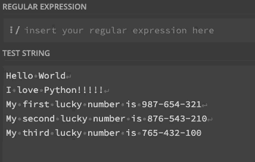
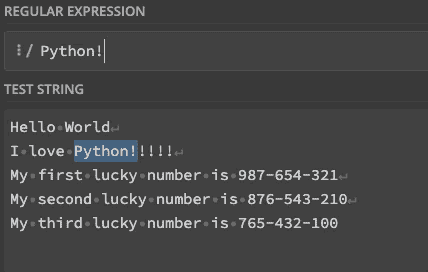
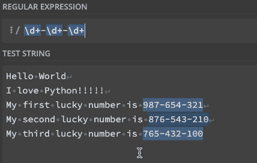
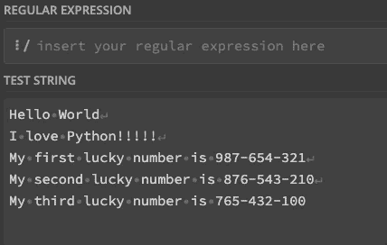
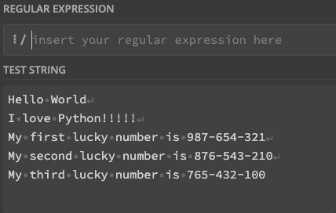
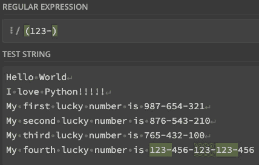
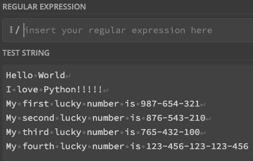
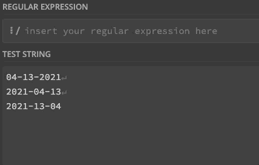
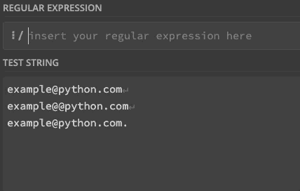

# Python 正则表达式的简单直观指南

> 原文：<https://towardsdatascience.com/a-simple-and-intuitive-guide-to-regular-expressions-404b057b1081?source=collection_archive---------14----------------------->

## 使用 Python 轻松地从任何文本中提取信息。


Max Kleinen 在 [Unsplash](https://unsplash.com?utm_source=medium&utm_medium=referral) 上拍摄的[照片](https://unsplash.com/@hirmin?utm_source=medium&utm_medium=referral)

如果您曾经在 Python 中处理过文本数据，您会知道大多数时候您必须处理脏数据。这意味着您正在寻找的特定文本(姓名、日期、电子邮件等)需要提取出来才能使用。

这时正则表达式(regex)就派上用场了。由于它的语法，你将能够找到你想要提取的模式，并节省大量时间。

尽管正则表达式看起来令人生畏，但乍一看，我为本文中将要看到的所有正则表达式创建了一些动画图像，因此您可以很容易地理解它们背后的概念。

```
**Table of Contents** 1\. [The re module (re.match, re.findall)](#9216)
2\. [^ and $ symbols](#39c1)
3\. [Metacharacters (., \w, \d, \s)](#8860)
4\. [Quantifiers (*, +, ?, {, })](#35eb)
5\. [Group and capture with ( )](#5791)
6\. [Match an expression with [ ]](#bf4d)
7\. [Or](#1426)
8\. [Boundaries (\b)](#a5b1)
9\. [Back-references (e.g. \1](#5fc6))
10\. [Flags](#7c1c)
11\. [Greedy and Lazy match](#d2a9)
12\. [Common Use Cases](#7d2a)
 - [Match punctuation](#19ea)
 - [Valid date format](#f247)
 - [Valid email](#8c18)
 - [Valid username](#9e48)
```

# re 模块(重新搜索，重新查找)

在本文中，我们将使用下面的文本来展示正则表达式是如何工作的。

```
text = '''
Hello World
I love Python!!!!!
My first lucky number is 987-654-321
My second lucky number is 876-543-210
My third lucky number is 765-432-100
'''
```

我们将使用 Python 来解释一些额外的细节，然而，正则表达式语法对于大多数编程语言来说几乎是相同的。在 Python 中，我们需要导入以下内容来处理正则表达式。

```
importre
```

为了找到与正则表达式模式匹配的第一个匹配项和所有匹配项，我们使用下面的。

```
#return the first match
re.search(pattern, text)# return all the matches
re.findall(pattern, text)
```

在本文中，为了主要关注学习正则表达式，**我们将只检查正则表达式** `**pattern**`以避免重复输入`re.search, re.findall and text``.`

# ^和$符号

这两个符号将分别匹配以指定字符开头或结尾的字符串。让我们看一个上面定义的`text`变量的例子。

```
**^Hello**  matches any string that starts with Hello **World$** matches a string that ends with World **^Hello World$** matches a string thatstarts and ends with Hello World (exact match)
```

让我们看看上面列出的正则表达式。



作者图片

**中以蓝色突出显示的文本。上面的 gif 将是匹配的图案。**

现在很清楚每个符号的作用了。请记住，如果文本是`World Hello!`，那么前面的模式都不起作用。此外，在这个例子中，默认的 regex 标志被设置为 multiline(我在下面的标志部分解释了 regex 中的标志)

# 元字符(。，\w，\d，\s)

在正则表达式中，元字符被理解为具有特殊含义的字符，如下所示。

```
**.** matches any character except a new line
**\d** matches a digit
**\w** matches a word character (a-z, A-Z, 0-9, _)
**\s** matches a whitespace (space, tab, newline)
```

现在我们来验证一下它们各自的工作原理。


作者图片

记住，上面提到的元字符也有它们的否定形式`\D`、`\W`和`\S`。同样，为了转义这个和其他特殊字符`^.[$()|*+?`，我们使用反斜杠`\`。我在`Hello World`的末尾加了点，看看这是如何工作的。


作者图片

如您所见，当您包含反斜杠`\.`时，`.` 并不匹配所有字符

# 量词(*、+、？, {, })

量词将帮助我们找到一个重复“n”次的字符。我们来看看最基本的量词`*+?`

假设我们想要匹配单词`Python`后的感叹号`**!**` 的数量

```
Python!*****    matches a string that has Python followed by 0 or more **!** Python!**+**    matches a string that has Python followed by 1 or more **!** Python!**?**    matches a string that has Python followed by 0 or 1 **!**
```


作者图片

以下量词将让您指定重复的字符数。

```
Python!**{2}**  matches a string that has Pythonfollowedby 2 **!** Python!**{2,}** matches a string that has Pythonfollowed by 2 or more **!** Python!**{2,4}**matches a string that has Pythonfollowed by 2 up to 4**!** Python**(!!){2,4}** matches a string that has Pythonfollowed by 2 up to 4 copies of the sequence **!!**
```

这可能看起来很可怕，但它比你想象的要简单。让我们来看看。



作者图片

最后一个图案`Python**(!!){2,4}**` 也捕捉到了感叹号`!!`，因为有括号。我们将在下一节中对此进行更多的检查。

# 使用( )进行分组和采集

要捕获模式中的特定字符组，只需添加括号`()`。例如，正如我们到目前为止所看到的，模式`\d+-\d+-\d+`将匹配由连字符分隔的数字，但是如果我们只想获得第一个连字符之前的数字组呢？

```
(\d+)-\d+-\d+  parentheses create a capturing group of the first group of digits before the hyphen -
```



作者图片

如您所见，当添加括号时，颜色变为绿色，这表示捕获的组。

在 Python 中，您可以使用`re.findall()`来查找所有的事件并显示捕获的组。

```
IN [0]: re.findall(r'(\d+)-\d+-\d+', text)
OUT [0]: ['987', '876', '765']
```

# 用[ ]匹配表达式

与圆括号不同，方括号`[]` 不捕捉表达式，只匹配表达式中的任何内容。

```
**[789]** matches a string that has 7, 8 or 9\. It's like 7|8|9 **[7-9]** same as previous
**[a-zA-Z]** a string that has a letter from a to z or from A to Z **[^a-zA-Z]**  a string that has not a letter from a to z or from A to Z. (the **^ is used as negation** of the expression when it's at the beginning inside brackets)
```

许多人被写在方括号内的模式吓到了，但是当你通过一个例子看到它是如何工作的时候，就不会那么困难了。


作者图片

不管模式有多长，如果它在方括号内，你可以把它们分成“或”条件组。

说到“或”条件，让我们回顾一下目前为止我们已经看到的。

# 或者

我们已经看到了在正则表达式中获得“或”条件的两种方法。第一种是使用括号，第二种是使用方括号。假设我们想要匹配数字 8 或 9 后面的 2 位数。

```
(9|8)\d{2}   matches a string that has 9 or 8 followed by 2 digits *(captures* 9 or 8*)*[98]\d{2}matches a string that has 9 or 8 followed by 2 digits without capturing 9 or 8
```



作者图片

你可能还记得，这两者的主要区别是圆括号捕捉组，而方括号不捕捉组。此外，应该在括号中指定“or”`|`,但是没有必要将它包含在方括号中。

# 边界(\b)

`\b` 符号是另一个元字符，它匹配单词字符(\w)和非单词字符(\W)之间的位置。这叫字界。让我们看看这个怎么样。


作者图片

在图中，我们可以看到 3 个不同的位置符合“单词边界”的条件:

1.  如果第一个字符是单词字符，则在字符串的第一个字符之前。
2.  在字符串的最后一个字符之后，如果最后一个字符是单词字符。
3.  字符串中的两个字符之间，其中一个是单词字符，另一个不是单词字符。

现在让我们看看第 2 点只匹配右边的单词边界实际上意味着什么。为此，我们编写了表达式`.\b`


作者图片

`\b` 符号还有一个与`\b`相反的否定`\B`



作者图片

# 反向引用(\1)

反向引用帮助我们重用已经识别的捕获组。为了更好地解释这一点，我将把下面的句子添加到我们之前定义的文本中。

`“My fourth lucky number is 123–456–123–123–456”`

所以我们的目标是找到重复性的`123-` 放一个又一个。我们可以通过反向引用来解决这个问题。

```
(123-)\1     the **\1** matches the same text that was matched by the first capturing group (123-)
```

让我们来看看。



作者图片

我们可以看到，如果只写`(123-)`，得到的不是`123-`的序列，而是单个元素。相反，如果我们写正则表达式`(123-)\1` ，期望的序列是匹配的。该引用相当于编写`(123-)(123-)`

如果您有一个以上的捕获组，您也可以指定您想要重用的组，方法是写下它的顺序`\1`为第一个，`\2`为第二个，依此类推。

# 旗帜

简而言之，标志是可选参数，用于修改正则表达式的搜索行为。每个标志由一个字母字符表示，并以不同的方式修改搜索行为。

例如，让我们看看标志`i`，它使表达式不区分大小写。在 Python 中，我们会这样做来添加这个新参数。

```
# without flag
IN [0]: re.search(r'[a-z]+', 'Hello')
OUT [0]: <re.Match object; span=(1, 5), **match='ello'**># with I flag
IN [1]: re.search(r'[a-z]+', 'Hello', flags=**re.I**)
OUT [1]: <re.Match object; span=(0, 5), **match='Hello'**>
```

正如我们所看到的，由于正则表达式中增加了参数`re.I`，我们可以得到整个`‘Hello’`而不仅仅是`‘ello’`

使用的其他标志如下

*   `g`(全局)让表达式搜索所有匹配项
*   `m`(多行)使边界字符`^`和`$`匹配每一行的开始和结束，而不是整个字符串的开始和结束
*   `s`(点全)使点符号也匹配换行符。

# 贪婪和懒惰的搭配

这是一些操作符默认的行为方式。像`*+{}`这样的一些字符是**贪婪的**，这意味着它们将匹配**最长的可能字符串**。例如，假设我们想要获取连字符`-`中的所有字符

我们可以很容易地得到这个正则表达式`-.+-` ，但是加号`+` 是贪婪的，所以它将尽可能多地使用字符(如果我们的目标是匹配尽可能短的字符串，甚至是其他连字符`-)` )。，我们应该像`?`一样加一个**懒算子**。我们来对比一下。


作者图片

开始时，`+` 匹配整个字符串`–456–123–123–` ,但是`?` 确保用最少的字符数进行匹配，所以它首先匹配`-456-`,然后匹配`-123-`

请记住，您可以通过编写严格的表达式来避免这些贪婪/懒惰的匹配，比如`-[^-]+-` This 匹配连字符之间的任何内容，同时也不包含任何连字符。

# 常见使用案例

## 匹配标点符号

在处理文本时，通常需要在分析前删除标点符号。为此，我们编写以下表达式

```
[^\w\s]
```



作者图片

## 有效的日期格式

这将取决于您希望匹配的格式。让我们假设你想用美国格式匹配一个日期`mm-dd-yyyy`

```
\d{2}-\d{2}-\d{4}
```



作者图片

## 有效电子邮件

您可以通过以下表达式轻松识别有效的电子邮件

```
^[^@ ]+@[^@ ]+\.[^@ \.]{2,}$
```

表达式的键直到需要时才匹配@和空格，所以我们写`[^@ ]` 来忽略它们。



作者图片

## 有效用户名

假设用户名只允许小写字母或数字。此外，用户名的最小长度必须是 4 个字符，最大长度必须是 16 个字符。

```
^[a-z0-9]{4,16}$
```

你可以在这个[网站](https://regex101.com/)上测试这个以及我们在本文中使用的其他正则表达式。

*就是这样！现在是你创建正则表达式来解决日常任务的时候了！我在我的* [*Github*](https://github.com/ifrankandrade/data_preprocessing.git) *上列出了本文中使用的正则表达式字符及其含义。*

[**与 3k 以上的人一起加入我的电子邮件列表，获取我在所有教程中使用的 Python for Data Science 备忘单(免费 PDF)**](https://frankandrade.ck.page/bd063ff2d3)