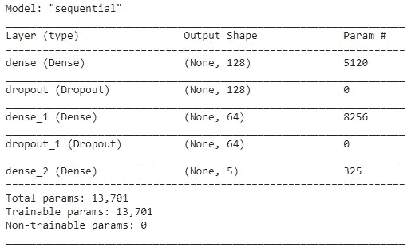
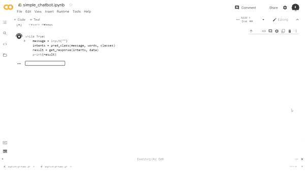

# 用深度学习的 Python 构建一个简单的聊天机器人

> 原文：<https://towardsdatascience.com/a-simple-chatbot-in-python-with-deep-learning-3e8669997758?source=collection_archive---------1----------------------->

## [自然语言处理笔记](https://towardsdatascience.com/tagged/nlpnotes)

## 如何建立自己的朋友


Lyman Gerona 在 [Unsplash](https://unsplash.com?utm_source=medium&utm_medium=referral) 上拍摄的照片

人工智能正在迅速渗透到各行各业的工作流程中。由于自然语言处理(NLP)、自然语言理解(NLU)和机器学习(ML)的进步，人类现在能够开发能够模仿类似人类的交互的技术，包括识别语音和文本。

</a-primer-on-conversational-ai-d20c7a4b2a87>  

在本文中，我们将使用 Python 中的 NLP 和神经网络来构建一个聊天机器人。

## 数据

在我们开始考虑任何编码之前，我们需要建立一个 intents JSON 文件，它定义了在与我们的聊天机器人交互过程中可能出现的某些意图。要做到这一点，我们必须首先创建一组用户查询可能会遇到的标签。例如:

*   一个用户可能希望知道我们聊天机器人的名字，因此我们创建了一个用标签`name`标记的意图
*   用户可能希望知道我们聊天机器人的年龄，因此我们创建了一个标签为`age`的意图
*   等等等等

对于我们创建的每个标签，我们必须指定模式。本质上，这定义了用户如何向我们的聊天机器人提出查询的不同方式。例如，在`name`标签下，用户可以用各种方式询问某人的名字——“你叫什么名字？”，“你是谁？”，“你叫什么？”。

然后，聊天机器人将采用这些模式，并将它们用作训练数据，以确定询问我们聊天机器人名称的人看起来会是什么样子，以便它可以适应有人可能询问我们机器人名称的不同方式。因此，用户不必使用我们的聊天机器人已经学会的精确查询。它可以提出这样的问题:“你叫什么？”我们的聊天机器人能够推断出用户想要知道我们聊天机器人的名字，然后它会提供它的名字。

> **注意**:我们的机器人不会超级聪明，所以它不会总是识别我们在说什么，但是有足够的例子，它会在破译方面做得相当不错。

在这个 intents JSON 文件中，每个 intents 标签和模式旁边都有响应。然而，对于我们简单的聊天机器人，不会生成这些响应。这意味着我们的模式不会像用户可以询问的模式那样自由流动(它不会适应)，相反，响应将使用聊天机器人在提出查询时将返回的静态响应。

```
# used a dictionary to represent an intents JSON filedata = {"**intents**": [
             {"**tag**": "greeting",
              "**patterns**": ["Hello", "How are you?", "Hi there", "Hi", "Whats up"],
              "**responses**": ["Howdy Partner!", "Hello", "How are you doing?", "Greetings!", "How do you do?"],
             },
             {"**tag**": "age",
              "**patterns**": ["how old are you?", "when is your birthday?", "when was you born?"],
              "**responses**": ["I am 24 years old", "I was born in 1996", "My birthday is July 3rd and I was born in 1996", "03/07/1996"]
             },
             {"**tag**": "date",
              "**patterns**": ["what are you doing this weekend?",
"do you want to hang out some time?", "what are your plans for this week"],
              "**responses**": ["I am available all week", "I don't have any plans", "I am not busy"]
             },
             {"**tag**": "name",
              "**patterns**": ["what's your name?", "what are you called?", "who are you?"],
              "**responses**": ["My name is Kippi", "I'm Kippi", "Kippi"]
             },
             {"**tag**": "goodbye",
              "**patterns**": [ "bye", "g2g", "see ya", "adios", "cya"],
              "**responses**": ["It was nice speaking to you", "See you later", "Speak soon!"]
             }
]}
```

## 代码

为了编写我们的机器人，我们将需要一些 Python 内置，以及用于 NLP、深度学习的流行库，以及用于处理数组的事实库 NumPy。

```
**import** json
**import** string
**import** random **import** nltk
**import** numpy **as** np
**from** nltk.stem **import** WordNetLemmatizer **import** tensorflow **as** tf 
**from** tensorflow.keras **import** Sequential 
**from** tensorflow.keras.layers **import** Dense, Dropoutnltk.download("punkt")
nltk.download("wordnet")
```

为了创建我们的训练数据，首先我们必须对我们的`data`做一些事情。以下是清单:

*   创建模式中使用的所有单词的词汇表(回想一下，模式是用户提出的查询)
*   创建一个类的列表——这只是每个意图的标签
*   创建意图文件中所有模式的列表
*   为 intents 文件中的每个模式创建一个所有相关标签的列表

让我们用 Python 来看看这个…

```
# initializing lemmatizer to get stem of words
lemmatizer = WordNetLemmatizer()# Each list to create
words = []
classes = []
doc_X = []
doc_y = []*# Loop through all the intents
# tokenize each pattern and append tokens to words, the patterns and
# the associated tag to their associated list***for** intent **in** data["intents"]:
    **for** pattern **in** intent["patterns"]:
        tokens = nltk.word_tokenize(pattern)
        words.extend(tokens)
        doc_X.append(pattern)
        doc_y.append(intent["tag"])

    *# add the tag to the classes if it's not there already* 
    **if** intent["tag"] **not in** classes:
        classes.append(intent["tag"])*# lemmatize all the words in the vocab and convert them to lowercase
# if the words don't appear in punctuation* words = [lemmatizer.lemmatize(word.lower()) **for** word **in** words **if** word **not in** string.punctuation]*# sorting the vocab and classes in alphabetical order and taking the # set to ensure no duplicates occur*
words = **sorted**(**set**(words))
classes = **sorted**(**set**(classes))
```

这是每个列表的外观…

```
**print**(words)
**>>>> ["'s",  'adios',  'are',  'birthday',  'born',  'bye',  'called',  'cya',  'do',  'doing',  'for',  'g2g',  'hang',  'hello',  'help',  'hi',  'how',  'is',  'later',  'name',  'old',  'out',  'plan',  'see',  'some',  'talk',  'thanks',  'there',  'this',  'time',  'to',  'up',  'wa',  'want',  'week',  'weekend',  'what',  'whats',  'when',  'who',  'ya',  'you',  'your']****print**(classes)
**>>>> ['age', 'date', 'goodbye', 'greeting', 'name']****print**(doc_X)
**>>>> ['Hello',  'How are you?',  'Hi there',  'Hi',  'Whats up',  'how old are you?',  'when is your birthday?',  'when was you born?',  'what are you doing this weekend?',  'do you want to hang out some time?',  'what are your plans for this week',  "what's your name?",  'what are you called?',  'who are you?',  'Thanks for your help',  'bye',  'g2g',  'see ya',  'talk later',  'adios',  'cya']****print**(doc_y)
**>>>> ['greeting',  'greeting',  'greeting',  'greeting',  'greeting',  'age',  'age',  'age',  'date',  'date',  'date',  'name',  'name',  'name',  'goodbye',  'goodbye',  'goodbye',  'goodbye',  'goodbye',  'goodbye',  'goodbye']**
```

既然我们已经分离了我们的数据，我们现在准备训练我们的算法。然而，神经网络希望输入数值，而不是单词，因此，我们首先必须处理我们的数据，以便神经网络可以读取我们正在做的事情。

为了将我们的数据转换成数值，我们将利用一种叫做单词包的技术。有关清理文本和将文本表示为数值的更多信息，请查看我的两篇文章，其中详细介绍了这些技术以及如何在 Python 中执行它们。

</a-guide-to-cleaning-text-in-python-943356ac86ca>  </a-guide-to-encoding-text-in-python-ef783e50f09e>  

```
*# list for training data*
training = []
out_empty = [0] * len(classes)*# creating the bag of words model*
**for** idx, doc **in** enumerate(doc_X):
    bow = []
    text = lemmatizer.lemmatize(doc.lower())
    **for** word **in** words:
        bow.append(1) **if** word **in** text **else** bow.append(0) *# mark the index of class that the current pattern is associated
    # to*
    output_row = **list**(out_empty)
    output_row[classes.index(doc_y[idx])] = 1 *# add the one hot encoded BoW and associated classes to training* 
    training.append([bow, output_row])*# shuffle the data and convert it to an array*
random.shuffle(training)
training = np.array(training, dtype=**object**)*# split the features and target labels*
train_X = np.array(**list**(training[:, 0]))
train_y = np.array(**list**(training[:, 1]))
```

随着我们的数据转换成数字格式，我们现在可以建立一个神经网络模型，我们将把我们的训练数据输入其中。其思想是，模型将查看特征并预测与特征相关联的标签，然后从该标签中选择适当的响应。

```
*# defining some parameters*
input_shape = (**len**(train_X[0]),)
output_shape = **len**(train_y[0])
epochs = 200*# the deep learning model*
model = Sequential()
model.add(Dense(128, **input_shape**=input_shape, **activation**="relu"))
model.add(Dropout(0.5))
model.add(Dense(64, activation="relu"))
model.add(Dropout(0.3))
model.add(Dense(output_shape, **activation** = "softmax"))adam = tf.keras.optimizers.Adam(learning_rate=0.01, decay=1e-6)model.compile(**loss**='categorical_crossentropy',
              **optimizer**=adam,
              **metrics**=["accuracy"])
**print**(model.summary())
model.fit(x=train_X, y=train_y, epochs=200, verbose=1)
```



作者图片

在我们的序列模型中，我们使用了一些丢弃层，这些丢弃层在防止深度学习模型过度拟合数据方面非常有效。在另一篇文章中，我对此做了更深入的探讨。

</combating-overfitting-in-deep-learning-efb0fdabfccc>  

太好了。我们已经训练了我们的深度学习模型，但现在我们必须创建实际的功能，使我们能够在聊天机器人应用程序中使用我们的模型。对于下一个任务，我已经创建了一组实用函数，可以让我们轻松地执行这个任务。

接下来的部分很简单。我们必须创建一个 while 循环，允许用户输入一些查询，然后对这些查询进行清理，这意味着我们获取标记并对每个单词进行词汇化。之后，我们使用单词包模型将文本转换为数值，并预测哪些标签最能代表我们的意图。从那里，我们将从 intents 标记内的响应中随机抽取一个响应，并使用它来响应查询。

```
# running the chatbot
**while True**:
    message = **input**("")
    intents = pred_class(message, words, classes)
    result = get_response(intents, data)
    **print**(result)
```

让我们看看我们的聊天机器人在运行…



## 包裹

您现在已经看到了如何使用深度学习和 NLP 技术用 Python 创建一个非常简单的聊天机器人。在我看来，这绝不是一个你想带到招聘经理面前或放在简历上的优雅聊天机器人，但对于任何对对话式人工智能感兴趣的人来说，这是一个很好的开始。如果你碰巧以这篇文章为指导创建了一个聊天机器人，一定要在我的 LinkedIn 或 Twitter 上给我看一些预览，我会在下面链接。

感谢您的阅读！在 LinkedIn 和 T2 Twitter 上与我保持联系，了解我关于数据科学、人工智能和自由职业的最新消息。

## 相关文章

</never-forget-these-8-nlp-terms-a9716b4cccda>  </5-ideas-for-your-next-nlp-project-c6bf5b86935c>  <https://pub.towardsai.net/7-free-online-resources-for-nlp-lovers-26b1e0bba343> 