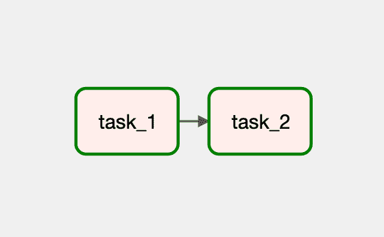
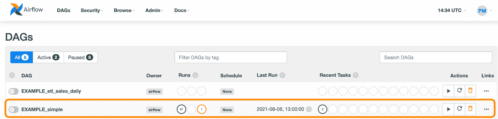
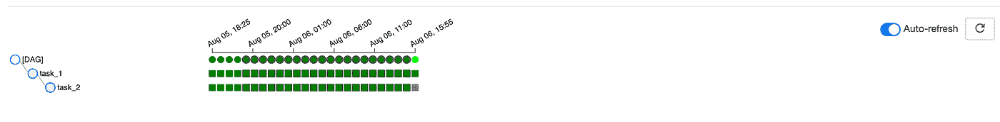
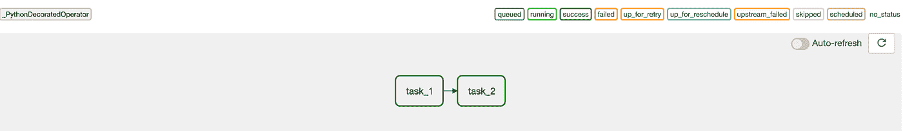
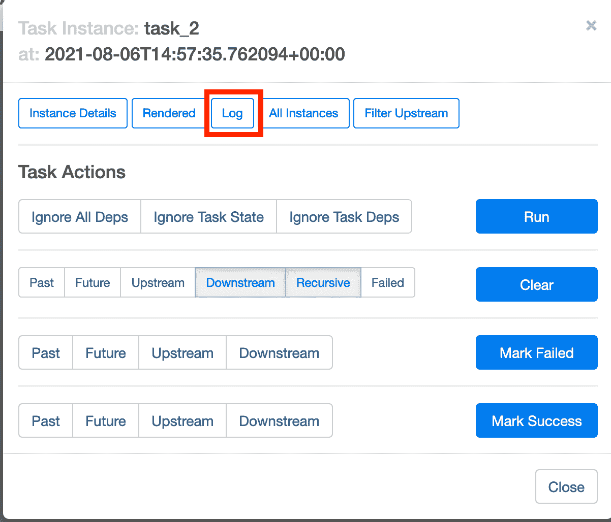
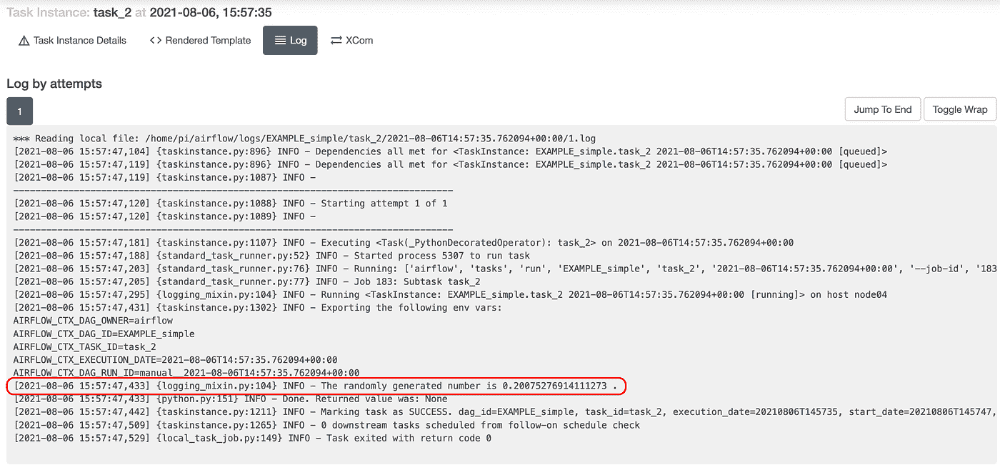
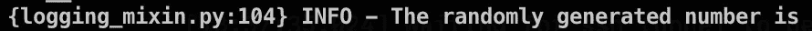

# 使用 Airflow 2.0 的简单 DAG

> 原文：<https://towardsdatascience.com/a-simple-dag-using-airflow-2-0-b4c218b2ccd9?source=collection_archive---------28----------------------->

## Airflow 2.x 是一个游戏改变者，尤其是它使用新的任务流 API 简化了语法。在本教程中，我们正在构建一个只有两个任务的 **DAG。DAG 的任务包括生成随机数(任务 1)和打印该数字(任务 2)。**

# 介绍

# 背景

这篇博客文章是使用 Airflow 2.0 的最新语法和 Raspberry Pis 构建整个 ETL 管道的系列文章的一部分。这需要一些术语的知识，所以[这里是](https://www.astronomer.io/guides/intro-to-airflow)一个刷新记忆的好地方。此外，查看我之前关于如何在树莓派上安装[气流 2 的帖子。](https://pedromadruga.com/posts/airflow-install/)

完整的代码在 [Github](https://github.com/pmadruga/airflow-dags/blob/main/simplest.py) 上。

# 创建 DAG 定义文件

我们将从在`airflow/dags`文件夹中创建 DAG 定义文件开始:

让我们通过添加 DAG 来填充它。

# DAG 分解

# `@dag`装饰工

DAG 有任务。在这个例子中，它有两个任务，其中一个依赖于另一个的结果。为此，我们将使用最新的气流装饰:`@dag`和`@task`。

我们首先定义 DAG 及其参数。我们将确定任务集运行的时间间隔(`schedule_interval`)和开始日期(`start_date`)。当然，还有其他参数可供选择，但是我们将把范围保持在最小。

注意函数`EXAMPLE_simple`顶部的`@dag`装饰器。函数名也将是 DAG id。最后，我们只是运行 DAG 的功能。

# `@task`装潢师

既然`@dag`包装器已经解决了，我们需要定义里面的两个任务。记住，这个 DAG 有两个任务:`task_1`生成一个随机数，`task_2`接收第一个任务的结果并打印出来，如下所示:

从视觉上看，DAG 图形视图如下所示:

前后的代码指的是`@dag`运算符及其依赖关系。接下来，我们将把所有东西放在一起:

就是这样。让我们运行这个。

# 运行 DAG

创建 DAG 定义文件后，在`airflow/dags`文件夹中，它应该会出现在列表中。现在，如果我们想立即运行 DAG，我们需要解除其暂停并触发它。有两个选项来解除暂停和触发 DAG:我们可以使用 Airflow web 服务器的 UI 或终端。让我们两个都处理。

# 通过用户界面运行

首先，您应该在列表中看到 DAG:

在这个例子中，我以前运行过 DAG(因此一些列已经有了值)，但是您应该有一个干净的石板。

现在，我们启用 DAG (1)并触发它(2)，因此它可以立即运行:

单击 DAG ID(在本例中称为`EXAMPLE_simple`)，您将看到树形视图。触发新的运行后，您将看到 DAG 正在运行:

转到**图表视图**，我们可以看到两个任务都成功运行了🎉：

但是显示一个随机生成的数字的`task_2`的打印输出呢？我们可以查看日志。

## 通过用户界面检查日志

在**图形视图**内，点击`task_2`，点击`Log`。

可以看到任务的输出:

再次成功🎉！

# 通过终端运行

对于取消暂停、触发和 DAG，UI 的替代方法非常简单。知道了 DAG 的 ID，我们只需要:

## 通过终端检查日志

假设您的 airflow 安装在`$HOME`目录中，可以通过执行以下操作来检查日志:

并选择正确的时间戳:

其中输出应包括:

后面是我们在这次运行中生成的实际数字。

# 结论

这是一个初学者友好的 DAG，使用了 Airflow 2.0 中新的 Taskflow API。不需要太多代码就可以创建一个简单的 DAG。在本系列的下一篇文章中，我们将使用`@task_group`装饰器创建并行任务。

*原载于*[*pedromadruga.com*](https://pedromadruga.com/posts/airflow2-simple-dag/)*。*