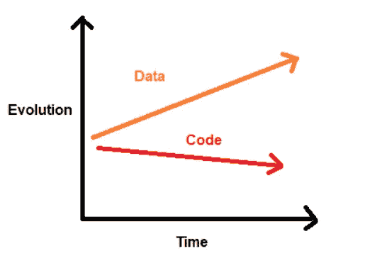

# MLOps 的简单解释

> 原文：<https://towardsdatascience.com/a-simple-explanation-of-mlops-e47009e245f7?source=collection_archive---------30----------------------->

## 以及相关的挑战

[国家癌症研究所](https://unsplash.com/@nci?utm_source=medium&utm_medium=referral)在 [Unsplash](https://unsplash.com?utm_source=medium&utm_medium=referral) 上拍摄的照片

**也在 Datatron 博客分享:** [**什么是 MLOps？**](https://blog.datatron.com/what-is-mlops/)

终于！在过去的 8 年里，你一直为之工作的公司注意到了你的呼声，投资于机器学习——这是一项不断发展的壮举，将彻底改变我们所知的商业。你被安排负责发展数据科学团队，但这没什么大不了的，你的远见已经为你做好了准备。

在过去的 18 个月里，你在利润丰厚的数据科学圈子里流连忘返，并在空闲时间熟悉了这种文化，这让你有机会进入一些最有能力的数据科学圈子。由于对大量生产模型来解决人工智能兴起之前无法解决的问题的前景感到兴奋，你制定了一些演示项目来让事情运转起来。

6 周后，结果出来了，演示的性能指标也在不断提高。以前的内部人工智能怀疑论者一夜之间转变为人工智能的传播者。当高管们被告知时，他们的瞳孔开始放大，直到看起来像美元符号。“头奖宝贝！”一位高管尖叫道，“我们需要尽快投入生产。你多久能做到？”另一个问道。考虑到所有已经解决的复杂任务，人们会想象我们可以很快在美元中畅游。剩下要做的只是一些常规的开发工作，对吗？不对。

为了正确看待这一点，在 2019 年底进入 2020 年时，DeepLearning 中分享了一份报告。AI 的时事通讯， *The Batch，*称“*研究发现，只有 22%使用机器学习的公司成功部署了一个模型。*

> "*越来越多的公司正在开发供内部使用的机器学习模型。但许多公司仍在努力缩小与实际部署的差距。*
> 
> (**来源** : DeepLearning。艾，批量通迅)

了解我们在开发中使用机器学习时所面临的挑战，为 MLOps 的工作以及公司在工作流程中采用机器学习的重要性奠定了基础。

# 有哪些挑战？

我们可以从熟悉“DevOps”这个术语开始。DevOps 是软件工程领域的一套最佳实践，使得在几分钟内将软件交付到生产环境中成为可能，同时确保应用程序在生产环境中可靠运行。因此，可以说 DevOps 是统一软件开发和软件操作的软件工程实践。

**DevOps =软件开发+软件运营**

这就是问题所在。当构建传统的软件应用程序时，DevOps 团队最关心的是代码。另一方面，机器学习应用程序涉及代码和数据——实际上，这是机器学习应用程序和软件工程应用程序之间的根本区别。

部署到生产环境中的最终机器学习模型包含一个应用于大量数据(更好地称为训练数据)的算法，该算法实际上决定了模型在生产环境中的行为-模型的行为也取决于它在推理时接收的输入数据，但我们无法提前知道它会是什么。

作者图片

本质上，传统软件应用和机器学习应用中的代码都是在受控的开发环境中制作的。然而，机器学习应用程序也包括来自称为“真实世界”的永无止境来源的数据。数据不会停止变化，也没有办法完全控制数据应该如何变化。为了增强您对这个概念的理解，您可以考虑代码和数据之间的关系，尽管它们共享一个时间维度，但都生活在各自独立的平面中。

作者图片

平面之间的差距说明了一种脱节，这是几个重要挑战的根源，任何试图将机器学习模型成功部署到生产中的人都应该克服这些挑战。这些挑战包括:

*   部署缓慢
*   训练-发球偏斜(训练期间的表现和发球期间的表现之间的差异)
*   缺乏再现性

试图将机器学习模型部署到生产中的人的目标是弥合这两个层面之间的差距，进而克服如上所列的挑战。

## 最终想法

总之，MLOps 涵盖了在生产中高效、可靠地部署和维护机器学习系统的最佳实践。当在生产中工作时，机器学习引入了它自己的特定挑战。因此，MLOps 作为一门学科诞生于 DevOps，但却包含了传统 DevOps 工作流中不容易获得的机器学习中涉及的所有复杂内容。

## 相关文章

</model-drift-in-machine-learning-8023e3d08217>  <https://medium.datadriveninvestor.com/machine-learning-model-deployment-b1eaf7ca96cd>  </building-reproducible-machine-learning-pipelines-c80407c4319f> 