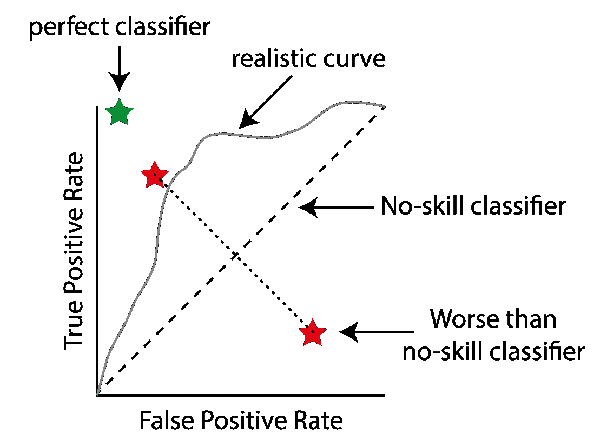
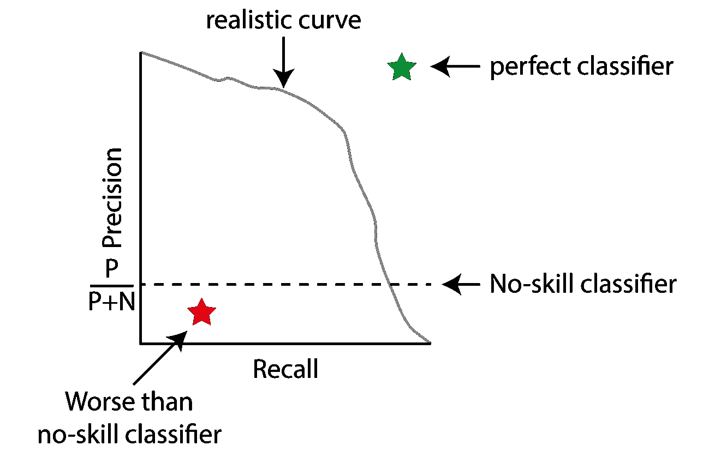
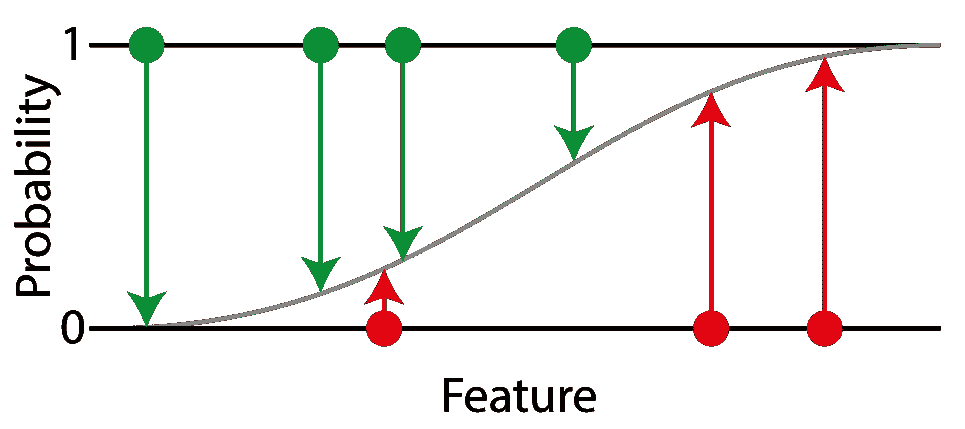
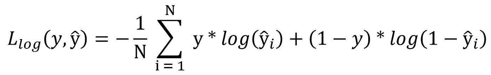
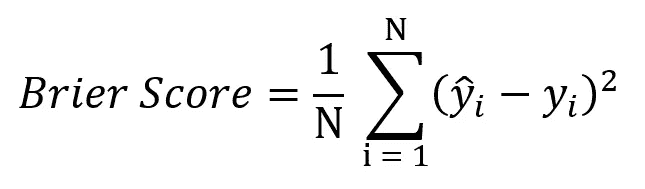

# 绩效指标的简单框架

> 原文：<https://towardsdatascience.com/a-simple-framework-for-performance-metrics-cca97ddf91e5?source=collection_archive---------22----------------------->

## 轻松选择适合您问题的最佳指标

Clark Van Der Beken 在 [Unsplash](https://unsplash.com/s/photos/acropolis?utm_source=unsplash&utm_medium=referral&utm_content=creditCopyText) 上拍摄的照片

准确性、敏感性、特异性、F1 分数……—性能指标的列表似乎永无止境。尤其是如果你是数据科学的新手，你很容易感到在选择的海洋中束手无策。在这篇文章中，我想向你介绍一个对性能指标进行分组的框架，它们如何相互联系，以及你如何使用它来为你的问题和模型选择最佳指标。

## 绩效指标框架

你一定听说过一些指标，比如准确度、灵敏度、F1 分数、接收机工作特性(ROC)等等。但是当我开始深入研究它们时，我经常问自己，它们是如何相互联系的。过了一会儿，我偶然发现了由[费里和他的同事](https://www.sciencedirect.com/science/article/abs/pii/S0167865508002687)提出的一个奇妙的框架，这个框架让我的事情变得简单多了。

基本上，我们可以将二进制分类任务的常见性能指标分为三类。它们中的每一个都有不同的用途:

*   阈值度量:检查您的模型是否满足预定义的阈值。
*   分级度量:将模型实例或完整的模型相互比较。
*   概率度量:测量你的分类的不确定性。

让我们按顺序看一下每一个:

## 阈值度量

这些是你的日常指标，比如准确性、F1、FDR，基本上是维基百科页面上列出的一切。它们的共同点是，您预先指定了哪些性能指标对您给定的问题很重要，并定义了您的模型需要通过的阈值。这就是这个名字的由来。如果你的模型没有通过你的门槛，它甚至不会被进一步考虑。

阈值度量基本上适用于所有的分类器算法，不管它们是直接输出类别标签(像简单的 k 均值或决策树)还是类别成员分数(像模糊 c 均值或逻辑回归)。

我不会详细讨论这些指标是如何计算的，这超出了本文的范围。如果您有兴趣了解各个指标，请查看参考资料，我在其中列出了一些优秀的资料。

我想说的是，如果你有一个平衡或不平衡的数据集，提前检查是非常重要的。对于不平衡的数据集，诸如准确度之类的常见度量已经不再适用，因为总是预测多数类的朴素分类器已经具有高准确度。取而代之的是，使用关注少数类的指标，这是约定俗成的积极类。

## 排名指标

当处理输出类成员分数的分类器时，排名度量特别有用。要将这个分数转换成一个清晰的类标签，您需要对分数应用一个阈值。但是如何选择这个门槛呢？排名指标让它变得轻而易举。让我们首先假设您有一个平衡的数据集:

训练完模型后，迭代所有可能的阈值，计算真阳性率和假阳性率。然后把这些互相勾连。你最终会得到所谓的接收机工作特性，简称 ROC:

接收器工作特性示意图。一个完美的分类器的 TPR 为 1，FPR 为 0，位于左上角(绿色星号)。无技能分类器发现的真阳性和假阳性一样多，用虚线表示。通过迭代模型的不同阈值，您可以生成一条描述模型行为的曲线(灰线)。比随机分类器差的分类器可以通过简单地选择其输出的反义词而被转换成熟练的分类器。这将反映其行为沿对角线(红星)。图片由作者提供。

一个完美的分类器应该在这个图的左上角。对角线描绘了一个没有技巧的简单分类器。你可以把它想象成一个简单地输出随机数，或者总是一个固定数的分类器。当你移动阈值时，你会偶然得到越来越多的真阳性，但同时你的假阳性也会同样增加。要选择最佳模型，只需选择最靠近左上角的点。你可以通过计算真阳性率——假阳性率(也称为约登 J 统计量)轻松做到这一点。

一个有趣的事实是，对角线以下的模型不一定比随机模型差。通过简单地反转模型输出，你基本上可以通过对角线来反映它的点，并可能获得一个非常熟练的模型。

对于不平衡数据集，对应的图是精度-召回曲线。这一次，最佳分类器位于右上方(与 ROC 相反，ROC 位于左上方)，而朴素分类器将在数据集中的阳性部分产生一条穿过 precision(定义为 TP/ (TP + FP))的水平线。这是因为具有随机预测的无技能分类器也有机会将数据集预测为阳性(在精确度中不考虑阴性！).同时，通过移动阈值，无技能分类器将正确地识别越来越多的阳性，从而提高召回率(定义为所有阳性中的真阳性)。

不平衡数据集的精确召回曲线。完美的分类器现在在右上角(绿色的星星)，而无技能的分类器总是有恒定的精度。迭代您的模型的阈值将产生类似于灰色线的行为。图片由作者提供。

要选择最佳阈值，计算 Precision + Recall，选择这个点的阈值(等于选择 F1 分最高的模型)。

## 概率度量

概率度量有点特殊，因为在这里我们不仅要评估我们的模型是否做了正确的分类，而且更感兴趣的是它对分类的确定程度。与排名度量一样，这些当然只能应用于输出类成员概率的模型(在评估它们之前可能需要归一化)。

使用概率度量，我们可以特别惩罚模型以高置信度进行错误分类，而模型输出不是非常确定的错误不会遭受如此高的代价。请注意，一个非决定性的模型通常在概率度量上也不会表现得很好，因为它们也奖励强而正确的预测。

最常见的概率度量是对数损失，也称为交叉熵。因为它对积极因素和消极因素的权重相等，所以您应该只将它应用于平衡的数据集。想象一个二元分类问题，我们用逻辑回归来拟合它:

测井曲线损失的直观解释。想象一个一维问题，其中每个点只是一个数字(x 轴)。对于每一个点，我们都知道属于阳性类别的真实概率，1 表示阳性(绿点)，0 表示阴性(红点)。我们对我们的问题进行逻辑回归，以对这些点进行分类(灰线)。预测概率与真实概率之间的差异用于计算对数损失。图片由作者提供。

从我们的测试集中，我们知道给定点在正类中的真实概率，对于负类是 0，对于正类是 1。我们的逻辑回归分配一个在 0 到 1 范围内的概率。对数损失是基于我们的分配概率与真实概率的差异。对于每个点，我们计算对数损失并对所有点进行平均。

对数损失公式。y 这是我们的分类器分配给每个点的概率，即从上面的 s 形曲线上的值。图片由作者提供。

对于不平衡的数据集，您应该再次使用更侧重于积极类的度量，例如 Brier 分数。它被定义为正类的预期和预测概率之间的均方误差:

Brier 分数的定义。请注意，仅适用于正类，不适用于负类。图片由作者提供。

## 结论

我希望这个框架对你和对我一样有用。首先，决定与您的项目最相关的阈值度量，然后训练您的模型，并用排名度量对它们进行排名。最后，如果你有概率模型，考虑使用概率度量。

当然，困难的部分之一仍然是决定哪一个度量是最有意义的。为此，最好的方法通常是与领域专家深入讨论他们真正想要避免的错误。或者继续关注更多关于这个问题的内容。

## 参考

Ferri，Hernandez-Orallo & Modroiu (2009):分类性能测量的实验比较。*模式识别字母*