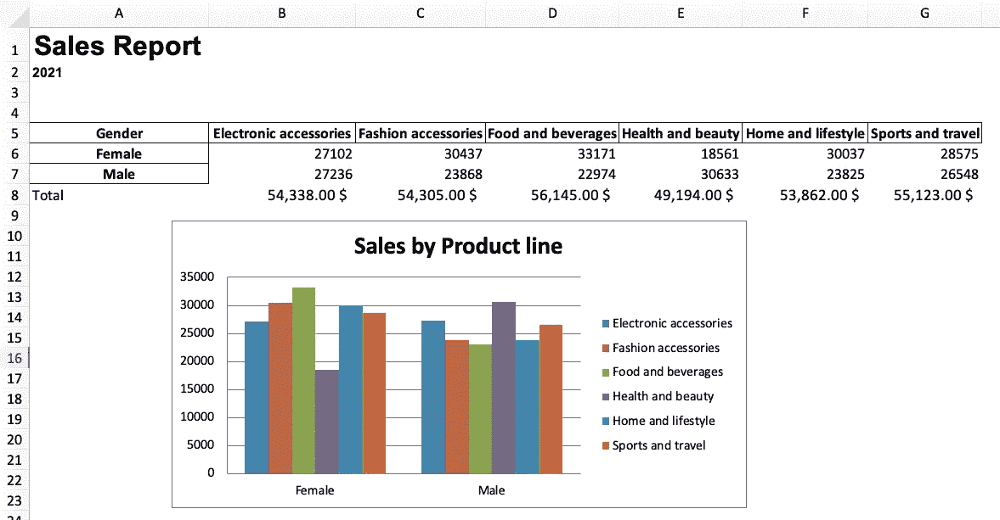
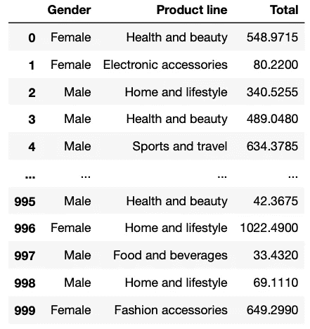
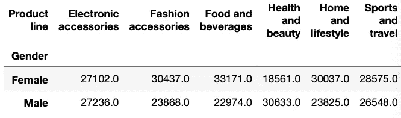
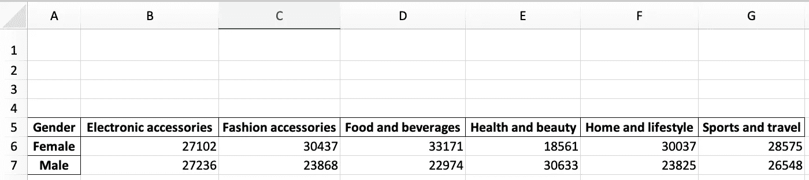
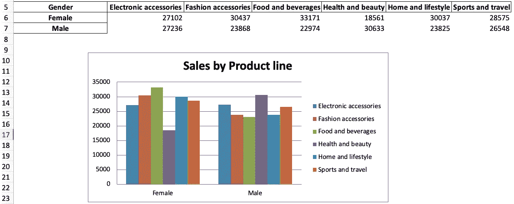
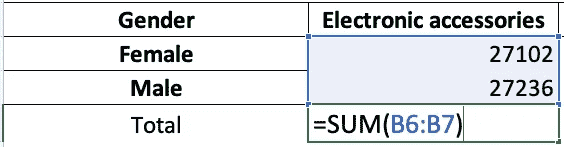

# 使用 Python 自动生成 Excel 报表的简单指南

> 原文：<https://towardsdatascience.com/a-simple-guide-to-automate-your-excel-reporting-with-python-9d35f143ef7?source=collection_archive---------0----------------------->

## 使用 openpyxl 通过 Python 自动生成 Excel 报表


照片由 [StockSnap](https://pixabay.com/users/stocksnap-894430/) 在 [Pixabay](https://pixabay.com/photos/business-working-laptop-macbook-925900/) 上拍摄

让我们面对它；无论我们的工作是什么，迟早，我们将不得不处理重复的任务，如在 Excel 中更新每日报告。如果你在一家不使用 Python 的公司工作，事情可能会变得更糟，因为你不能只使用 Python 来解决这个问题。

但是不要担心，您仍然可以使用您的 Python 技能来自动化您的 excel 报告，而不必说服您的老板迁移到 Python！你只需要用 Python 模块`openpyxl`告诉 Excel 你想通过 Python 做什么。与我之前写的鼓励您从 Excel 迁移到 Python 的文章不同，使用 openpyxl，您可以在使用 Python 创建报表时坚持使用 Excel。

```
**Table of Contents** 1\. [The Dataset](#3bf7)
2\. [Make a Pivot Table with Pandas](#e24a)
 - [Importing libraries](#2541)
 - [Reading the Excel file](#fdc1)
 - [Making a pivot table](#b16b)
 - [Exporting pivot table to Excel file](#cd3a)
3\. [Make The Report with Openpyxl](#4913)
 - [Creating row and column reference](#67f0)
 - [Adding Excel charts through Python](#8c6c)
 - [Applying Excel formulas through Python](#e347)
 - [Formatting the report sheet](#1600)
4\. [Automating the Report with a Python Function (Full code)](#5cd7)
 - [Applying the function to a single Excel file](#30c9)
 - [Applying the function to multiple Excel files](#77dc)
5\. [Schedule the Python Script to Run Monthly, Weekly, or Daily](#e271)
```

# 数据集

在本指南中，我们将使用一个包含销售数据的 Excel 文件，该文件类似于您用来制作工作报告的输入文件。你可以在 [Kaggle](https://www.kaggle.com/aungpyaeap/supermarket-sales) 上下载这个文件；不过它有一个. csv 格式，所以你应该把扩展名改成`.xlsx`或者直接从这个 [Google Drive 链接](https://drive.google.com/file/d/1zWTJ4MPnMO8ez0_Ik87WB423uEF-xDWa/view?usp=sharing)下载(我还把文件名改成了 supermarket_sales.xlsx)

在写任何代码之前，先看看 Google Drive 上的文件，熟悉一下。该文件将成为通过 Python 创建以下报告的输入。



作者图片

现在让我们制作报告，并用 Python 自动完成！

# 用熊猫做一张枢轴表

## 导入库

现在您已经下载了 Excel 文件，让我们导入我们将在本指南中使用的库。

```
import pandas as pd
import openpyxl
from openpyxl import load_workbook
from openpyxl.styles import Font
from openpyxl.chart import BarChart, Reference
import string
```

我们将使用 Pandas 来读取 Excel 文件，创建一个数据透视表，并将其导出到 Excel。然后我们将使用 Openpyxl 库编写 Excel 公式，制作图表，并通过 Python 格式化电子表格。最后，我们将创建一个 Python 函数来自动化这个过程。

*注意:如果你没有在 Python 中安装那些库，你可以通过在你的终端或命令提示符上写* `pip install pandas`和`pip install openpyxl` *来轻松安装。*

## 读取 Excel 文件

在我们读取 Excel 文件之前，请确保该文件与您的 Python 脚本位于同一位置。然后，像下面的代码一样读取带有`pd.read_excel()`的 Excel 文件。

```
excel_file = pd.read_excel('supermarket_sales.xlsx')
excel_file[['Gender', 'Product line', 'Total']]
```

该文件有许多列，但我们将只使用性别、产品线和总计列来创建报告。为了向您展示它们的样子，我使用了双括号来选择它们。如果我们把它打印在 Jupyter 笔记本上，你会看到下面这个看起来像 Excel 电子表格的数据框。



作者图片

## 制作数据透视表

我们可以很容易地从先前创建的`excel_file` 数据框架中创建一个数据透视表。我们只需要使用`.pivot_table()` 方法。假设我们想要创建一个数据透视表，显示男性和女性在不同产品线上的总花费。为此，我们编写以下代码。

```
report_table = excel_file.pivot_table(index='Gender',
                                      columns='Product line',
                                      values='Total',
                                      aggfunc='sum').round(0)
```

`report_table` 应该是这样的。



## 将数据透视表导出到 Excel 文件

为了导出之前创建的数据透视表，我们使用了`.to_excel()`方法。在括号内，我们必须写出输出 Excel 文件的名称。在这种情况下，我将这个文件命名为`report_2021.xlsx`

我们还可以指定要创建的工作表的名称以及数据透视表应该位于哪个单元格中。

```
report_table.to_excel('report_2021.xlsx',
                      sheet_name='Report',
                      startrow=4)
```

现在，Excel 文件被导出到 Python 脚本所在的文件夹中。

# 用 Openpyxl 制作报表

每次我们想要访问一个工作簿时，我们将使用从`openpyxl` 导入的`load_workbook`，然后用`.save()` 方法保存它。在下面的部分中，我将在每次修改工作簿时加载并保存工作簿；但是，您只需要这样做一次(就像本指南末尾显示的完整代码一样)

## 创建行和列引用

为了使报告自动化，我们需要获取最小和最大的活动列/行，这样即使我们添加了更多的数据，我们将要编写的代码也会继续工作。

为了获得工作簿中的引用，我们首先用`load_workbook()`加载工作簿，并使用`wb[‘name_of_sheet’]`定位我们想要使用的工作表。然后我们用`.active`访问活动单元格

```
wb = load_workbook('report_2021.xlsx')
sheet = wb['Report']# cell references (original spreadsheet) 
min_column = wb.active.min_column
max_column = wb.active.max_column
min_row = wb.active.min_row
max_row = wb.active.max_row
```

您可以打印所创建的变量，以了解它们的含义。对于这个例子，我们获得这些数字。

```
Min Columns: 1
Max Columns: 7
Min Rows: 5
Max Rows: 7
```

打开我们之前导出的`report_2021.xlsx`来验证这一点。



作者图片

如上图所示，最小行数为 5，最大行数为 7。同样，最小行是 A (1)，最大行是 G (7)。这些参考资料对后面的章节非常有用。

## 通过 Python 添加 Excel 图表

为了从我们创建的数据透视表创建一个 Excel 图表，我们需要使用我们之前导入的`Barchart`模块。为了识别数据和类别值的位置，我们使用来自`openpyxl` 的`Reference`模块(我们在本文开始时导入了`Reference`)

```
wb = load_workbook('report_2021.xlsx')
sheet = wb['Report']# barchart
barchart = BarChart()#locate data and categories
data = Reference(sheet,
                 min_col=min_column+1,
                 max_col=max_column,
                 min_row=min_row,
                 max_row=max_row) #including headers
categories = Reference(sheet,
                       min_col=min_column,
                       max_col=min_column,
                       min_row=min_row+1,
                       max_row=max_row) #not including headers# adding data and categories
barchart.add_data(data, titles_from_data=True)
barchart.set_categories(categories)#location chart
sheet.add_chart(barchart, "B12")barchart.title = 'Sales by Product line'
barchart.style = 5 #choose the chart stylewb.save('report_2021.xlsx')
```

写完这段代码后，`report_2021.xlsx`文件应该是这样的。



作者图片

分解代码:

*   `barchart = BarChart()` 从`Barchart` 类初始化一个`barchart`变量
*   `data`和`categories` 是代表信息所在位置的变量。我们使用上面定义的列和行引用来实现自动化。另外，请记住，我在`data` 中包括了标题，但在 `categories`中没有
*   我们使用`add_data`和`set_categories`将必要的数据添加到`barchart`中。在`add_data` 内部，我添加了`titles_from_data=True` ，因为我包含了`data`的标题
*   我们使用`sheet.add_chart` 来指定我们想要添加到“报告”表中的内容，以及我们想要添加到哪个单元格中
*   我们可以使用`barchart.title`和`barchart.style`修改默认标题和图表样式
*   我们用`wb.save()`保存所有的修改

## 通过 Python 应用 Excel 公式

您可以通过 Python 编写 Excel 公式，就像在 Excel 表格中编写公式一样。例如，假设我们希望对单元格 B5 和 B6 中的数据求和，并在单元格 B7 中以货币样式显示。

```
sheet['B7'] = '=SUM(B5:B6)'
sheet['B7'].style = 'Currency'
```

这很简单，对吧？我们可以从 B 列到 G 列重复这个过程，或者使用 for 循环来自动执行。但是首先，我们需要让字母表作为 Excel 中列名的引用(A，B，C，…),为此，我们使用`string`库并编写以下代码。

```
import string
alphabet = list(string.ascii_uppercase)
excel_alphabet = alphabet[0:max_column] 
print(excel_alphabet)
```

如果我们打印这个，我们将得到一个从 A 到 g 的列表。

发生这种情况是因为首先，我们创建了一个从 A 到 Z 的`alphabet`列表，但是然后我们取了一个切片`[0:max_column]`来匹配这个列表的长度(7)和字母表的前 7 个字母(A-G)。

*注意:Python 列表从 0 开始，所以 A=0，B=1，C=2，依此类推。此外，[a:b]切片符号采用 b-a 元素(以“a”开始，以“b-1”结束)*

在这之后，我们可以通过列进行循环，并应用求和公式，但是现在使用列引用，所以不用写这个，

```
sheet['B7'] = '=SUM(B5:B6)'
sheet['B7'].style = 'Currency'
```

现在我们包括引用，并把它放在 for 循环中。

```
wb = load_workbook('report_2021.xlsx')
sheet = wb['Report']# sum in columns B-G
for i in excel_alphabet:
    if i!='A':
        sheet[f'{i}{max_row+1}'] = f'=SUM({i}{min_row+1}:{i}{max_row})'
        sheet[f'{i}{max_row+1}'].style = 'Currency'# adding total label
sheet[f'{excel_alphabet[0]}{max_row+1}'] = 'Total'wb.save('report_2021.xlsx')
```

运行代码后，我们在 B 到 g 之间的列的“总计”行中得到=SUM 公式。



作者图片

分解代码:

*   `for i in excel_alphabet` 遍历所有活动列，但是我们用`if i!='A'` 排除了 A 列，因为 A 列不包含数字数据
*   `sheet[f'{i}{max_row+1}'] = f'=SUM({i}{min_row+1}:{i}{max_row}'` 与编写`sheet['B7'] = '=SUM(B5:B6)'` 是一样的，但是现在我们对列 A 到 G 也这么做
*   `sheet[f'{i}{max_row+1}'].style = 'Currency'` 为最大行以下的单元格赋予货币样式。
*   我们用`sheet[f'{excel_alphabet[0]}{max_row+1}'] = 'Total'`将“总计”标签添加到最大行下方的 A 列

## 格式化报告表

为了完成报告，我们可以添加一个标题，副标题，还可以自定义他们的字体。

```
wb = load_workbook('report_2021.xlsx')
sheet = wb['Report']sheet['A1'] = 'Sales Report'
sheet['A2'] = '2021'
sheet['A1'].font = Font('Arial', bold=True, size=20)
sheet['A2'].font = Font('Arial', bold=True, size=10)wb.save('report_2021.xlsx')
```

可以在`Font()`里面添加其他参数。在这个[网站](https://openpyxl.readthedocs.io/en/stable/api/openpyxl.styles.fonts.html)上，你可以找到可供选择的款式列表。

最终的报告应该如下图所示。


作者图片

# 使用 Python 函数自动生成报告

现在报告已经准备好了，我们可以将目前为止编写的所有代码放入一个自动生成报告的函数中，所以下次我们想要生成这个报告时，我们只需引入文件名并运行它。

*注意:为了使这个函数工作，文件名应该具有“sales_month.xlsx”的结构。另外，我添加了几行代码，使用销售文件的月份/年份作为变量，这样我们就可以在输出文件和报告的副标题中重用它。*

下面的代码可能看起来很吓人，但这只是我们目前为止所写的加上新的变量`file_name, month_name,` 和 `month_and_extension`。

## 将函数应用于单个 Excel 文件

假设我们下载的原始文件的名称是“sales_2021.xlsx ”,而不是“supermarket_sales.xlsx ”,我们可以通过编写以下内容将公式应用于报表

```
automate_excel('sales_2021.xlsx')
```

运行此代码后，您将在 Python 脚本所在的文件夹中看到一个名为“report_2021.xlsx”的 Excel 文件。

## 将函数应用于多个 Excel 文件

假设现在我们只有每月的 Excel 文件“sales _ January . xlsx”“sales _ January . xlsx”和“sales_march.xlsx”(你可以在我的 [Github](https://github.com/ifrankandrade/automation.git) 上找到这些文件来测试它们)

您可以一个接一个地应用公式来获得 3 个报告

```
automate_excel('sales_january.xlsx')
automate_excel('sales_february.xlsx')
automate_excel('sales_march.xlsx')
```

或者您可以先使用`pd.concat()`将它们连接起来，然后只应用一次函数。

```
# read excel files
excel_file_1 = pd.read_excel('sales_january.xlsx')
excel_file_2 = pd.read_excel('sales_february.xlsx')
excel_file_3 = pd.read_excel('sales_march.xlsx')# concatenate files
new_file = pd.concat([excel_file_1,
                      excel_file_2,
                      excel_file_3], ignore_index=True)# export file
new_file.to_excel('sales_2021.xlsx')# apply function
automate_excel('sales_2021.xlsx')
```

# 安排 Python 脚本每月、每周或每天运行

您可以安排我们在本指南中编写的 Python 脚本在您的计算机上随时运行。你只需要分别在 Windows 和 Mac 上使用任务调度器或者 crontab 就可以了。

如果您不知道如何安排工作，请点击下面的指南了解如何安排。

</how-to-easily-automate-your-python-scripts-on-mac-and-windows-459388c9cc94>  

*就是这样！在本文中，您了解了如何自动化一个基本的 Excel 报表；然而，一旦你掌握了熊猫图书馆，你可以自己做更多的事情。在下面的链接中，你可以找到我专门为 Excel 用户写的熊猫的完整指南。*

</a-complete-yet-simple-guide-to-move-from-excel-to-python-d664e5683039>  

*我还做了一个指南，帮助你用 Python 建立你的第一个机器学习模型。*

</a-beginners-guide-to-text-classification-with-scikit-learn-632357e16f3a>  

你可以在我的 [Github](https://github.com/ifrankandrade/automation.git) 上找到这个分析背后的代码。

[**与 3k 以上的人一起加入我的电子邮件列表，获取我在所有教程中使用的 Python for Data Science 备忘单(免费 PDF)**](https://frankandrade.ck.page/bd063ff2d3)