# Python 中美丽可视化的简单指南

> 原文：<https://towardsdatascience.com/a-simple-guide-to-beautiful-visualizations-in-python-f564e6b9d392?source=collection_archive---------0----------------------->

## 自定义 Matplotlib & Seaborn，永远忘记那些难看的蓝条。


本杰明·沃罗斯在 [Unsplash](https://unsplash.com?utm_source=medium&utm_medium=referral) 上拍摄的照片

你正在进行一个项目，突然你需要画一个图来分析数据或展示发现的见解。你没有太多的时间，但你肯定不想创造一个看起来像这样的情节。

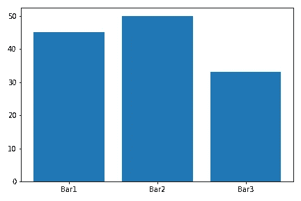

作者图片

然而，你也不想太技术性，不想在一些不是你项目主要目标的事情上浪费更多的时间，那么你应该怎么做呢？

我不知道这种情况在过去发生过多少次，但是通过方便地使用 Matplotlib 和 Seaborn，我想到了一种简单而强大的方法来用 Python 创建**好看且可读的可视化。忘记那些带有微小标签的蓝色条形图、直方图、箱线图、散点图和饼图，在这篇文章中，我将向你展示如何给它们一个更好的外观，而不会太专业和浪费很多时间。**

```
**Table of Contents** 1\. [Globally Setting: Graph style and Font size](#aa59)
2\. [Customization of Plots](#8e90)
 - [Color Palettes](#73cd)
 - [Figure size, figure appearance, title, and axes labels](#e8c8)
3\. [The Dataset](#2362)
4\. [Bar Plot](#ef80)
5\. [Histogram](#efa5)
6\. [Boxplot](#10ec)
7\. [Scatterplot](#055e)
8\. [Piechart + Subplots](#beb4)
 - [Single Piechart](#00c8)
 - [Piechart side by side (subplots)](#ce2b)
9\. [Line Plot](#911b)
```

# 全局设置:图形样式和字体大小

让我更头疼的事情之一是单独设置图中的字体大小。这就是为什么在我们开始制作图之前，最好先全局设置它们。首先，让我们导入我们将在本文中使用的必要库。

```
import matplotlib.pyplot as plt
import seaborn as sns
import pandas as pd
```

*注意:如果你没有在 Python 中安装这些库，你可以通过在你的终端上写* `pip install name_of_library` *来安装它们，或者在命令提示符下写下你想要安装的库(例如* `pip install matplotlib)`

现在，我们可以使用下面的代码轻松地全局设置图形样式和字体大小。

```
sns.set_style('darkgrid') # darkgrid, white grid, dark, white and ticksplt.rc('axes', titlesize=18)     # fontsize of the axes title
plt.rc('axes', labelsize=14)    # fontsize of the x and y labels
plt.rc('xtick', labelsize=13)    # fontsize of the tick labels
plt.rc('ytick', labelsize=13)    # fontsize of the tick labels
plt.rc('legend', fontsize=13)    # legend fontsize
plt.rc('font', size=13)          # controls default text sizes
```

首先，我们使用`sns.set_style()`来设置图形样式。默认情况下，这将使 Matplotlib 和 Seaborn 图形看起来更好。然后，我们使用`plt.rc()`来定制图形中显示的文本的字体大小。我个人的选择是标题用`18`，坐标轴上的文字用`14` ，其余用`13` 。你可以随意编辑它们。

就是这样！您只需要这样做一次，就可以获得足够的字体大小和漂亮的图形样式。

# 地块定制

## 调色板

默认情况下，Matplotlib 的颜色很难看，但我们可以通过使用 Seaborn 调色板轻松地使它们更漂亮。这些是 Seaborn 的调色板，我们将在本文中使用。

`sns.color_palette(‘deep’)`


作者图片— Seaborn 调色板

`sns.color_palette(‘pastel’)`


作者图片— Seaborn 调色板

`sns.color_palette(‘Set2’)`


作者图片— Seaborn 调色板

这些调色板有一个列表的形式，所以你可以通过做`sns.color_palette('deep')[0]`从这些调色板中提取颜色，而不是使用传统的‘b’来获得蓝色。如果您执行这段代码，您将获得一个类似于`(0.298, 0.447, 0.690)`的 RGB 代码，它在 Matplotlib 的 plots 的颜色参数中被接受。我们将在创建图时更好地检查这一点。

在 [seaborn 文档](https://seaborn.pydata.org/tutorial/color_palettes.html#palette-tutorial)中，您可以找到可用调色板的列表。选择一个你喜欢的开始制作好看的图表。

## 图形大小、图形外观、标题和轴标签

在创建图表时，大多数时候我们需要做一些调整，这样任何人都会很容易理解我们的可视化。以下方法将在本文呈现的情节中反复使用，让我们习惯它们。

**如何调整身材大小？**我们使用`plt.figure(figsize)`来调整图形尺寸。我们还将使用`tight_layout=True`来清理一个情节或支线情节之间的填充。

```
plt.figure(figsize=(8,4), tight_layout=True)
```

**如何编辑图形外观？我们将对情节做的一些基本调整是颜色和线宽。出图时，它们作为额外参数包含在内。**

```
# matplotlib
plt.hist(..., color=sns.color_palette('Set2')[2], linewidth=2)# seaborn
ax = sns.histplot(..., palette='Set2', linewidth=2) # seaborn will have either the color or palette parameters available (it depends on the plot)
```

**如何添加支线剧情(并列剧情)？我们将需要`plt.subplots()`来制作并排图。**

```
#subplots
fig, ax = plt.subplots(nrows=1,ncols=2, figsize=(12, 5), tight_layout=True)
```

创建完支线剧情后，我们将使用一维轴`ax[0]`或二维轴`ax[0][0]`

**如何给剧情添加标签和标题？在 Matplotlib `plt.xlabel()`和 Seaborn `ax.set_xlabel()`之间，向轴添加标签和设置标题名称是相似的，但是我更喜欢在 Seaborn 中使用`ax.set()` 变体，因为它在一行中处理大多数参数。**

```
# matplotlib
plt.xlabel('Nationality')
plt.ylabel('Average Rating')
plt.title('Barplot')#seaborn
ax.set(title='Barplot', xlabel='Nationality', ylabel='Average Rating')
```

# 数据集

为了制作有意义的图表，我们需要使用数据集。为了简单起见，我选择了一个在 [Kaggle](https://www.kaggle.com/stefanoleone992/fifa-21-complete-player-dataset?select=players_21.csv) 中可用的干净数据集，你也可以在我的 [Github](https://github.com/ifrankandrade/data-visualization.git) 中找到它。这是一个国际足联球员的数据集，它将帮助我们比较美国和加拿大等非传统足球国家与英格兰、巴西和阿根廷等足球大国。希望在这篇文章的结尾，我们能更好地理解是什么让足球在这些国家变得不同。

在接下来的小节中，我们将使用一个名为`df_country` 的数据框架，它将只包含有问题的国家。下面的代码会解决这个问题。

```
df_fifa21 = pd.read_csv('players_20.csv')
country = ['United States', 'Canada', 'England', 'Brazil', 'Argentina']df_country = df_fifa21[df_fifa21[‘nationality’].isin(country)]
```

现在让我们创建好看的可视化！

# 条形图

使用 MatplotLib 和 Seaborn 都可以很容易地创建条形图，只是略有不同。条形图将使用矩形条显示分类数据，矩形条的高度或长度与它们所代表的值成比例。看看各国足球运动员的平均得分会很有趣

下面的代码显示了这个绘图所需的额外预处理。

```
# Preprocessing
barplot = df_country.groupby(['nationality'], as_index=False).mean()[['nationality', 'overall']]
```

输出如下所示:

```
nationality    overall  
Argentina      69.118510
Brazil         71.143894    
Canada         62.855072    
England        63.253293    
United States  64.538682
```

## MatplotLib 中的条形图与 plt.bar()

MatplotLib 的`plt.bar()` 需要两个参数——分类变量的名称(国籍)和长度(总体评分)。

```
plt.figure(figsize=(8,4), tight_layout=True)
colors = sns.color_palette('pastel')plt.bar(barplot['nationality'], barplot['overall'], color=colors[:5])plt.xlabel('Nationality')
plt.ylabel('Average Rating')
plt.title('Barplot')
plt.show()
```

正如我们之前提到的，为了让条形图更有吸引力，我们将使用 Seaborn 调色板。在这种情况下，我们使用了`pastel` 调色板。

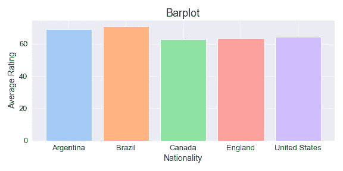

作者图片

显然，来自加拿大、美国和英国的普通球员的评价没有太大的区别。然而，普通球员进不了国家队，只有每个国家的顶级球员才能进，所以如果我们得到前 20 名球员的平均评分，情节就会改变。让我们和 seaborn 核实一下。

## 使用 sns.barplot()在 Seaborn 中绘制条形图

为了得到每个国家的前 20 名球员，我们需要做一些预处理

```
# preprocessing
new_df = pd.concat(
[df_country[df_country['nationality']=='Argentina'][:20], 
 df_country[df_country['nationality']=='Brazil'][:20], 
 df_country[df_country['nationality']=='England'][:20], 
 df_country[df_country['nationality']=='Canada'][:20], 
 df_country[df_country['nationality']=='United States'][:20]]
)barplot = new_df.groupby(['nationality'], as_index=False).mean()[['nationality', 'overall']]
```

现在可以绘制数据了。我们将使用`sns.barplot()`来这样做。

```
plt.figure(figsize=(8,4), tight_layout=True)
ax = sns.barplot(x=barplot['nationality'], y=barplot['overall'], palette='pastel', ci=None)
ax.set(title='Barplot', xlabel='Nationality', ylabel='Average Rating')
plt.show()
```

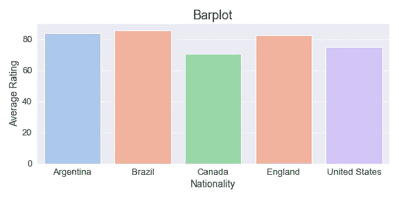

作者图片

顶尖选手之间的收视率差距可见一斑。这揭示了为什么美国和加拿大还不是足球大国，但这并不是全部，让我们深入挖掘。

## 按“n”个变量分组的条形图

现在让我们看看有多少球员在顶级足球联赛中踢球。为此，我们需要按国籍和联赛对数据进行分组(我们将忽略英超联赛，因为大多数英格兰球员都参加这项比赛)

```
# Preprocessing
barplot = df_country[df_country['league_name'].isin(['Spain Primera Division', 'Italian Serie A', 'German 1\. Bundesliga'])]barplot = barplot.groupby(['nationality', 'league_name'], as_index=False).count()
```

现在数据已经准备好了，我们可以用 Matplolib 或 Seaborn 绘制它；然而，为了保持简单并避免编写更多的代码行，我们将使用 Seaborn。通过添加`hue=‘’` 参数，可轻松绘制由“n”个变量分组的数据。

```
plt.figure(figsize=(12, 6), tight_layout=True)ax = sns.barplot(x=barplot['nationality'], y=barplot['sofifa_id'], **hue=barplot['league_name']**, palette='pastel')ax.set(title='Nº of Players outside of domestic league' ,xlabel='Country', ylabel='Count')
ax.legend(title='League', title_fontsize='13', loc='upper right')
plt.show()
```

我们用`ax.legend()` 单独处理了图例选项，得到了下面的图。

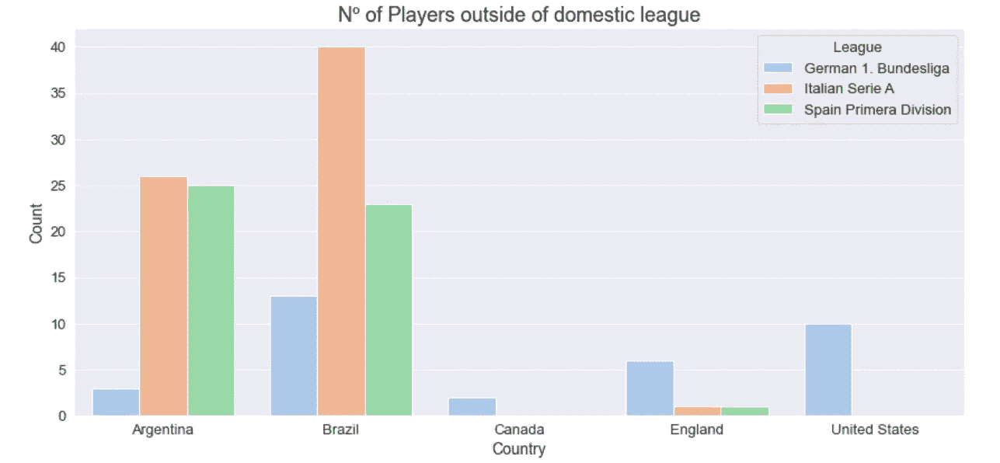

作者图片

正如我们所见，大多数阿根廷和巴西足球运动员都在顶级联赛踢球，而加拿大人和美国人却没有。顶级联赛的球员对国家队在比赛中的成功产生影响，所以这解释了为什么巴西和阿根廷是足球大国。

# 柱状图

直方图表示数字数据的分布。我们来看看足球运动员的身高分布，分析一下它在这项运动中的相关性。

## 带 plt.hist()或 sns.histplot()的直方图

MatplotLib 的`plt.hist()` 和 Seaborn 的`sns.histplot()`工作原理相同。两者都需要两个参数——数值变量的名称(高度)和容器的数量或列表。在本例中，我们制作了一个名为`bins`的箱子列表，它将显示在 x 轴上。

```
plt.figure(figsize=(10,6), tight_layout=True)
bins = [160, 165, 170, 175, 180, 185, 190, 195, 200]# matplotlib
plt.hist(df_country['height_cm'], bins=bins, color=sns.color_palette('Set2')[2], linewidth=2)
plt.title('Histogram')
plt.xlabel('Height (cm)')
plt.ylabel('Count')# seaborn
ax = sns.histplot(data=df_country, x='height_cm', bins=bins, color=sns.color_palette('Set2')[2], linewidth=2)
ax.set(title='Histogram', xlabel='Height (cm)', ylabel='Count')plt.show()
```

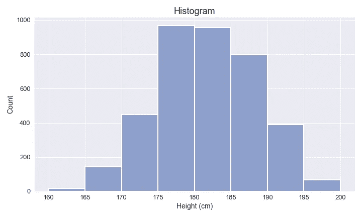

作者图片

直方图显示，大多数球员的身高都在 175-185 厘米之间，因此身高超过 185 厘米似乎在足球中并不那么重要。让我们用箱线图来看看不同国家运动员的身高分布。

# 箱线图

箱线图显示基于最小值、第一个四分位数(Q1)、中值、第三个四分位数(Q3)和最大值的数据分布。在这种情况下，我们将制作一个箱线图，显示 5 个国家运动员的身高分布。

可以在 Matplotlib 上绘制多个分类变量的箱线图，但是它需要一些额外的预处理，所以为了简单起见，我们将使用 Seaborn 的`sns.boxplot()`。制作包含多个分类变量的箱线图时，我们需要两个参数——分类变量的名称(国籍)和数值变量的名称(高度 _ 厘米)

```
plt.figure(figsize=(10,6), tight_layout=True)ax = sns.boxplot(data=df_country, x='nationality', y='height_cm', palette='Set2', linewidth=2.5)
ax.set(title='Boxplot', xlabel='', ylabel='Height (cm)')plt.show()
```

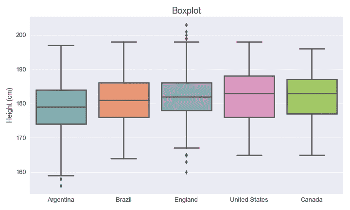

作者图片

现在，箱线图显示，一个国家队不需要很多高大的足球运动员就能在比赛中取得成功，因为阿根廷和巴西的中位数低于其他国家。阿根廷甚至出现了以长底须为代表的五个国家中最矮的足球运动员。

# 散点图

散点图显示数据集中两个数值变量之间的关系。在这种情况下，我们将看到球员的身高和体重之间的关系。

```
plt.figure(figsize=(10,6), tight_layout=True)ax = sns.scatterplot(data=df_country, x='height_cm', y='weight_kg',   **hue='nationality'**, palette='Set2', **s=60**)ax.set(xlabel='Height (cm)', ylabel='Weight (kg)')
ax.legend(title='Country', title_fontsize = 12) 
plt.show()
```

在这个图中，我们添加了`s`来控制点的大小，还添加了`hue` 来区分国籍

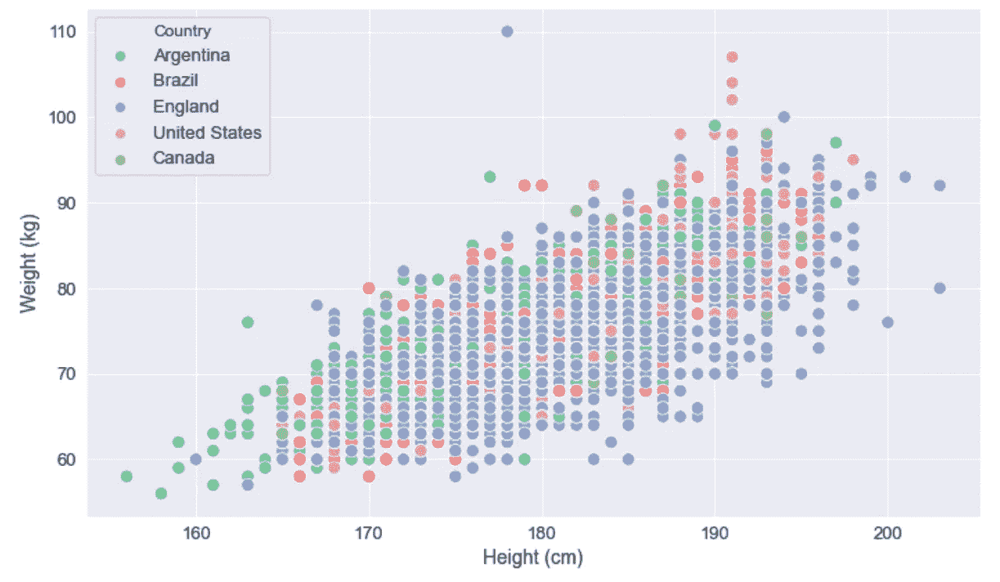

作者图片

从这个散点图中，我们可以看到体重和身高的分布符合简单的线性回归。

# 饼图+支线剧情

## 单饼图

我们要做一个显示玩家价值的饼状图。在这个例子中，我们将选出 USMNT (Pullisic)中最有价值的球员，看看他在他的俱乐部中有多有价值。

```
# Preprocessing
piechart = df_fifa21[df_fifa21['club_name']=='Chelsea']
piechart = piechart.sort_values('value_eur', ascending=False)[['short_name', 'value_eur']]
piechart = piechart[:11]
```

现在数据已经准备好了，我们可以用 Matplolib 的`plt.pie()`制作一个饼状图。除了我们通常添加的参数，我们还将考虑`autopct` 对数字进行舍入，`explode`突出显示特定的球员，`pctdistance`调整标签的距离，`shadow=True`给图表一个坚实的外观。

```
colors = sns.color_palette('pastel')
plt.figure(figsize=(7, 6), tight_layout=True)
explode_list = [0, 0, 0, 0, 0, 0, 0, 0, 0, 0, 0.2]plt.pie(piechart['value_eur'], labels=piechart['short_name'], **autopct**='%.0f %%', **explode**=explode_list, **pctdistance**=.7,
          colors=colors, **shadow**=True)plt.title('Chelsea', weight='bold')
plt.show()
```

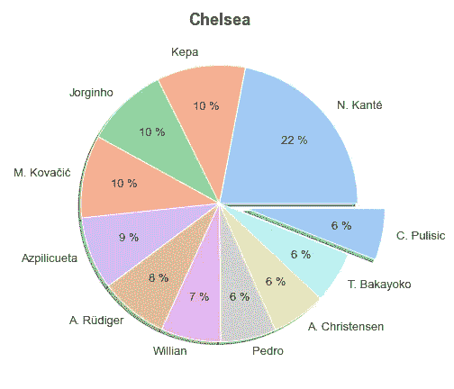

作者图片

这张饼状图显示，普利奇不是他所在俱乐部最有价值的球员，但至少他排在前 11 名。

## 并排饼图(支线剧情)

现在让我们并排绘制两张饼状图，看看这名球员对他的俱乐部和国家队的影响。为此，我们将使用`plt.subplots(nrows, ncols)`。这里行和列决定了我们要创建的图的数量，所以`nrow=1`和`ncols=2` 意味着每列 1 个图(总共 2 个)。

```
#subplots
fig, ax = plt.subplots(1,2, figsize=(12, 5), tight_layout=True)
```

此外，除了之前创建的`piechart` ，我们还需要创建第二个饼图框架`piechart2`。

```
# Preprocessing
piechart2 = df_fifa21[df_fifa21['nationality']=='United States']
piechart2 = piechart2[:10].sort_values('value_eur')[['short_name', 'value_eur']]
```

现在我们可以并排绘制两个饼图。

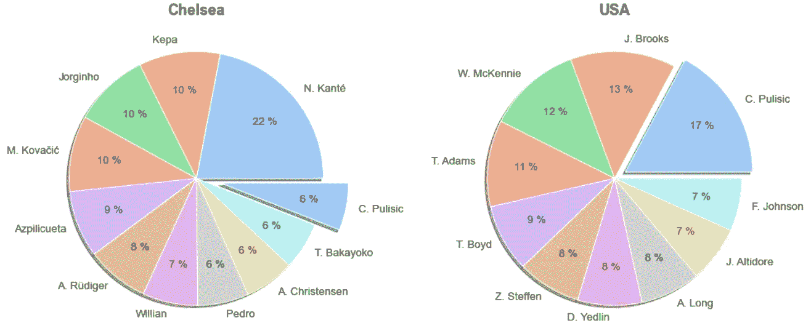

作者图片

现在我们可以验证，普利奇是迄今为止最有价值的美国球员，但在他的俱乐部里，前面还有其他技术娴熟的球员。

# 线形图

我们将绘制顶级足球运动员的评分图，看看评分在过去 5 年中是如何演变的。为此，我们必须读取 2017 年的国际足联数据集，并争论这些数据。

上面的代码给出了一个可以绘制的数据集。

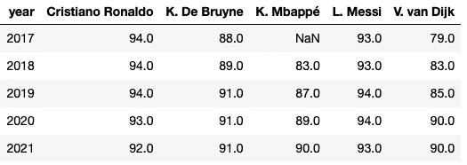

作者图片

## 使用 plt.plot()在 Matplolib 中绘制线图

制作线图就像在 Matplotlib 上输入`plt.plot()` 一样简单，但是我们会做一些简单的定制来使它看起来更好。

```
plt.figure(figsize=(10,6), tight_layout=True)#plotting
plt.plot(lineplot, 'o-', linewidth=2)#customization
plt.xticks([2017, 2018, 2019, 2020, 2021])
plt.xlabel('Years')
plt.ylabel('Ratings')
plt.title('Rating troughtout the years')
plt.legend(title='Players', title_fontsize = 13, labels=['L. Messi', 'Cristiano Ronaldo', 'K. De Bruyne', 'V. van Dijk', 'K. Mbappé'])
plt.show()
```

使用上面的代码，我们生成了下图。

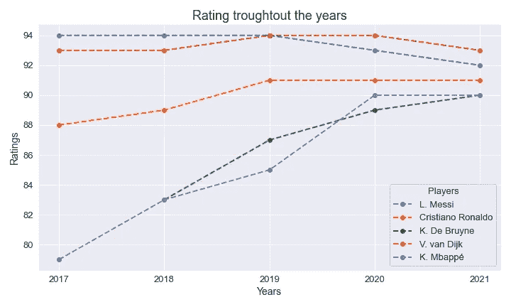

作者图片

## 使用 sns.lineplot()在 Seaborn 中绘制线图

我们也可以很容易地用 seaborn 制作这个情节。

```
plt.figure(figsize=(10, 5))
ax = sns.lineplot(data=lineplot, linewidth=2.5)
ax.set(xlabel='Year', ylabel='Ratings', title='Rating troughtout the years', xticks=[2017, 2018, 2019, 2020, 2021])
ax.legend(title='Players', title_fontsize = 13)
plt.show()
```

运行这段代码后，我们应该会得到一个类似上面的图。

*就是这样！在本文中，我们学习了如何使用 Matplotlib 和 Seaborn 制作漂亮的情节。所有代码在我的*[*Github*](https://github.com/ifrankandrade/data-visualization.git)*上都有。*

感谢阅读这篇文章！在下面的文章中，我展示了制作热图、文字云的代码，以及如何在不编码的情况下制作交互式可视化。

</avatar-meets-data-visualization-60631f86ba7d>  </how-to-easily-make-beautiful-wordclouds-in-python-55789102f6f5>  </8-free-tools-to-make-interactive-data-visualizations-in-2021-no-coding-required-2b2c6c564b5b>  

<https://frankandrade.ck.page/bd063ff2d3>