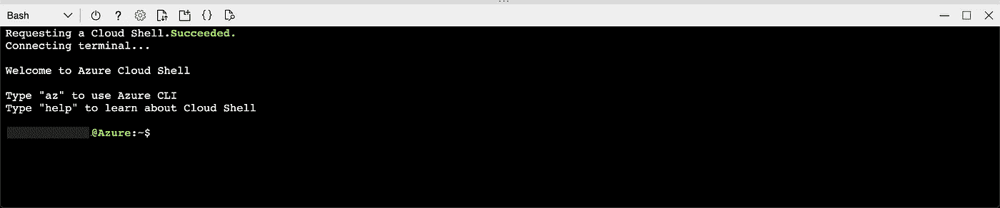
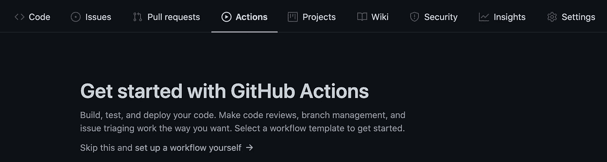
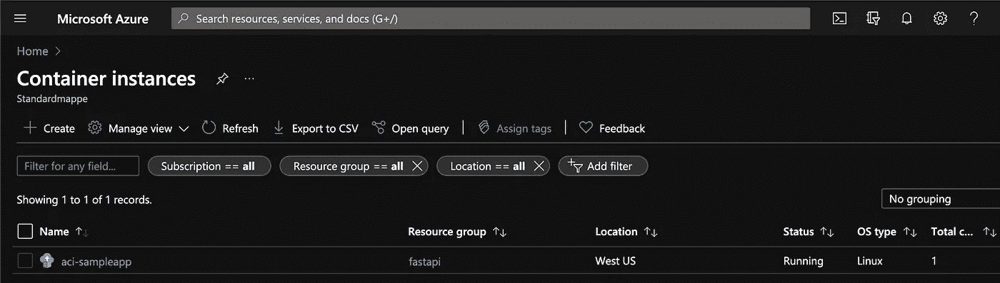
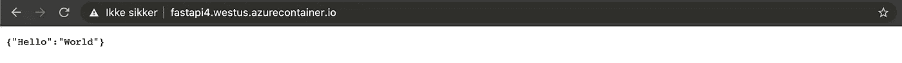

# 将 Dockerized Python 应用部署到 Azure 的简单指南

> 原文：<https://towardsdatascience.com/a-simple-guide-to-deploying-a-dockerized-python-app-to-azure-29753ee507eb?source=collection_archive---------10----------------------->

## 以下是如何使用 Docker、Azure 容器注册中心和 Azure 容器实例在 Azure 上部署令人惊叹的应用程序


詹姆斯·哈里逊在 [Unsplash](https://unsplash.com?utm_source=medium&utm_medium=referral) 上拍摄的照片

你是说你已经开发了一个应用程序，现在你想把它发布给所有人看？不要再看了。下面是如何使用 Docker、Azure 容器注册中心和 Azure 容器实例在 Azure 上部署它。

本指南使用 FastAPI 应用程序作为示例应用程序，并假设您熟悉使用终端、构建 Python 应用程序和基本 Docker 命令的基础知识。如果你有一个你自己的应用程序，你想把它部署到 Azure 上，你唯一需要做的就是使用一个合适的 Dockerize 文件来 Dockerize 化这个应用程序。

读完这本指南后，你会有什么收获？那么，你将在 Azure 上拥有你的应用的部署版本。很好，对吧？

# 1.设置你的应用

首先，让我们设置一个可以部署到 Azure 的 FastAPI 应用程序。我将使用一个简单的 Hello World 示例，您可以在这里找到:【https://github.com/bmaelum/fastapi-hello-world 

该应用程序在/app 文件夹中包含一个主文件，这是 FastAPI 代码所在的位置。

```
from fastapi import FastAPI app = FastAPI(
    title="FastAPI - Hello World",    
    description="This is the Hello World of FastAPI.",
    version="1.0.0",) @app.get("/")
def hello_world():    
    return {"Hello": "World"}
```

要使用 app，首先在你自己的 Github 帐户中创建一个副本。这是使用 Github 动作完成这些步骤所必需的。如果您想使用本指南的示例代码，请转到这个 URL:[https://github.com/bmaelum/fastapi-hello-world](https://github.com/bmaelum/fastapi-hello-world)并单击“fork”按钮。

为了能够测试代码，将 repo 克隆到您的机器上:

```
git clone [git@github.com](mailto:git@github.com):<your-username>/fastapi-hello-world.git
```

然后将 requirements.txt 文件中的需求安装到您的环境中:

```
pip install -r requirements.txt
```

要运行该应用程序，只需输入:

```
uvicorn app.main:app
```

您应该在终端中看到类似这样的内容:

```
INFO:     Uvicorn running on [http://127.0.0.1:8000](http://127.0.0.1:8000) (Press CTRL+C to quit)
```

测试应用程序可以在浏览器中完成，也可以使用类似 Postman 的工具。要在您的浏览器中查看应用程序，只需转到终端中打印的 URL，在本例中为: [http://127.0.0.1:8000](http://127.0.0.1:8000) 。

# 2.是时候归档了

现在，让我们将应用程序归档。


照片由[伊恩·泰勒](https://unsplash.com/@carrier_lost?utm_source=medium&utm_medium=referral)在 [Unsplash](https://unsplash.com?utm_source=medium&utm_medium=referral) 上拍摄

> 使用 Docker 来部署你的应用程序是很棒的，原因有很多，其中之一是它可以帮助你确保你的本地开发和 Azure 上的部署有相同的环境。

确保你有一个合适的 docker 文件。在示例文件中，docker 文件如下所示:

```
FROM tiangolo/uvicorn-gunicorn-fastapi:python3.7 COPY ./app /app COPY requirements.txt .
RUN pip --no-cache-dir install -r requirements.txt
```

## 2.1 建立码头工人形象

要构建 Docker 映像，只需运行:

```
docker build -t fastapi-image .
```

## 2.2 运行并测试 Docker 映像

要在容器中运行映像，只需运行:

```
docker run -p 80:80 -it fastapi-image
```

要测试 app 你可以用和以前一样的地址，只需要把端口改成 80 就可以了，像这样: [http://127.0.0.1:80](http://127.0.0.1:8000) 。

你的应用在本地工作，太好了！现在是时候把它部署到 Azure 了！

# 3.让我们将应用程序部署到 Azure

准备部署到 Azure 了吗？激动人心！

将应用部署到 Azure 需要我们在 Azure 门户中做一些动作，以及使用 Github 动作。

*本指南将遵循微软的官方文档，网址为:https://docs . Microsoft . com/en-us/azure/container-instances/container-instances-github-action*

## 3.1 资源组和服务主体

首先，我们需要在所需的资源组中创建一个服务主体，一个角色。如果您还没有资源组，只需在 Azure 门户的资源组中创建一个即可。

为了创建服务主体，我们在 Azure Cloud Shell 中使用 Bash。通过点击页面顶部的云壳图标打开它:


天蓝色云壳图标

确保它设置为在云壳的左上方猛击:



在 Azure 门户中使用云外壳时的 Bash

然后，通过使用以下命令在 Azure 中为资源组创建一个服务主体，并给角色一个名称，范围是您的资源组的资源 ID。

获取资源组 ID:

```
groupId=$(az group show \
  --name <resource-group-name> \
  --query id --output tsv)
```

创建角色:

```
az ad sp create-for-rbac \
  --name githubactions \
  --scope $groupId \
  --role Contributor \
  --sdk-auth
```

这将为您提供以下格式的 JSON:

```
{
  "clientId": "",
  "clientSecret": "",
  "subscriptionId": "",
  "tenantId": "",
  "activeDirectoryEndpointUrl": "[https://login.microsoftonline.com](https://login.microsoftonline.com)",
  "resourceManagerEndpointUrl": "[https://management.azure.com/](https://management.azure.com/)",
  "activeDirectoryGraphResourceId": "[https://graph.windows.net/](https://graph.windows.net/)",
  "sqlManagementEndpointUrl": "[https://management.core.windows.net:8443/](https://management.core.windows.net:8443/)",
  "galleryEndpointUrl": "[https://gallery.azure.com/](https://gallery.azure.com/)",
  "managementEndpointUrl": "[https://management.core.windows.net/](https://management.core.windows.net/)"
}
```

请务必保存此信息，因为在使用 Github 操作时将使用它进行身份验证。

# 4.创建容器注册表

要管理 Docker 容器和图像，您需要在 Azure 中创建一个容器注册表。

搜索“容器注册表”，然后选择“创建”。选择您的资源组、实例名称和位置。对于 SKU，您可以选择基本选项。

# 5.准备好 Github 动作和 Azure 容器实例了吗？

很好，让我们开始设置 Github 操作。

还记得上一步收集的 JSON 吗？现在是时候使用它了。

转到 Github 和包含您的应用程序的存储库。然后进入设置->密码，添加以下凭证([官方文件](https://docs.microsoft.com/en-us/azure/container-instances/container-instances-github-action)):

`AZURE_CREDENTIALS`服务主体创建步骤的整个 JSON 输出

`REGISTRY_LOGIN_SERVER`您的注册表的登录服务器名称(全部小写)。示例: *myregistry.azurecr.io*

服务主体创建的 JSON 输出中的`REGISTRY_USERNAME`和`clientId`

`REGISTRY_PASSWORD`来自服务主体创建的 JSON 输出的`clientSecret`

`RESOURCE_GROUP`用于确定服务主体范围的资源组的名称

# 6.在 Github 操作中设置工作流程

现在，让我们使用 Github 操作来设置工作流。首先，在 Github 上打开你的回购，点击“操作”按钮。在那里，选择“跳过这一步，自己设置工作流程”。



Github 操作入门

用以下代码替换 main.yml 文件中的现有代码:

```
on: [push]
name: PythonAppAzureDeployment
jobs:
    build-and-deploy:
        runs-on: ubuntu-latest
        steps:
        # checkout the repo
        - name: 'Checkout GitHub Action'
          uses: actions/checkout@main

        - name: 'Login via Azure CLI'
          uses: azure/login@v1
          with:
            creds: ${{ secrets.AZURE_CREDENTIALS }}

        - name: 'Build and push image'
          uses: azure/docker-login@v1
          with:
            login-server: ${{ secrets.REGISTRY_LOGIN_SERVER }}
            username: ${{ secrets.REGISTRY_USERNAME }}
            password: ${{ secrets.REGISTRY_PASSWORD }}
        - run: |
            docker build . -t ${{ secrets.REGISTRY_LOGIN_SERVER }}/sampleapp:${{ github.sha }}
            docker push ${{ secrets.REGISTRY_LOGIN_SERVER }}/sampleapp:${{ github.sha }}

        - name: 'Deploy to Azure Container Instances'
          uses: 'azure/aci-deploy@v1'
          with:
            resource-group: ${{ secrets.RESOURCE_GROUP }}
            dns-name-label: ${{ secrets.RESOURCE_GROUP }}${{ github.run_number }}
            image: ${{ secrets.REGISTRY_LOGIN_SERVER }}/sampleapp:${{ github.sha }}
            registry-login-server: ${{ secrets.REGISTRY_LOGIN_SERVER }}
            registry-username: ${{ secrets.REGISTRY_USERNAME }}
            registry-password: ${{ secrets.REGISTRY_PASSWORD }}
            name: fastapi-sampleapp
            location: 'west europe'
```

然后，提交文件，因为我们已经指定了“on: push ”,它将立即运行。如果它不能确保代码已被提交并推送到回购。

现在，等待构建和部署代码。您可以通过单击“Actions”并选择正在运行的管道来跟踪进度。

如果出现错误:

```
Error: The subscription is not registered to use namespace ‘Microsoft.ContainerInstance’.
```

只需在 PowerShell 中执行以下操作:

```
Register-AzResourceProvider -ProviderNamespace Microsoft.ContainerInstance
```

或者，在 Azure 中，您可以转到“订阅”，选择您的订阅，转到资源提供商，搜索“ContainerInstance”，单击所需的结果，然后单击“注册”。

# 7.Azure 容器实例

当你进入 Azure 门户中的容器实例时，你的 Dockerized 应用现在应该是可见的。



Azure 容器实例

# 测试应用程序

要测试应用程序，请单击新部署的容器实例，然后转到 Properties。在 FQDN 下面有一个网址。将 URL 粘贴到您的浏览器中，您应该会看到类似这样的内容:



在浏览器中测试部署的应用程序

## **恭喜你，你现在已经在 Azure 上部署了一个 Dockerized app！**


布鲁斯·马尔斯在 [Unsplash](https://unsplash.com?utm_source=medium&utm_medium=referral) 上的照片