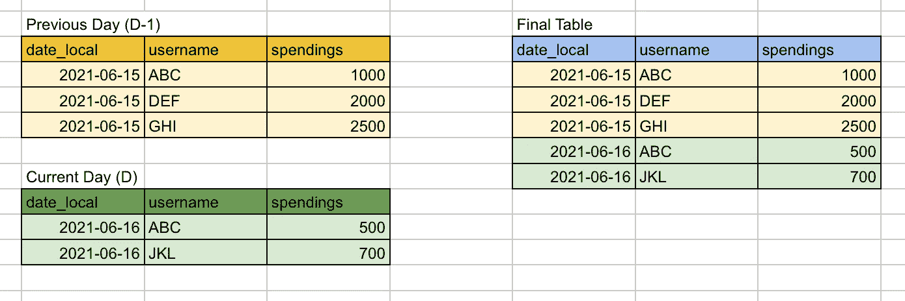
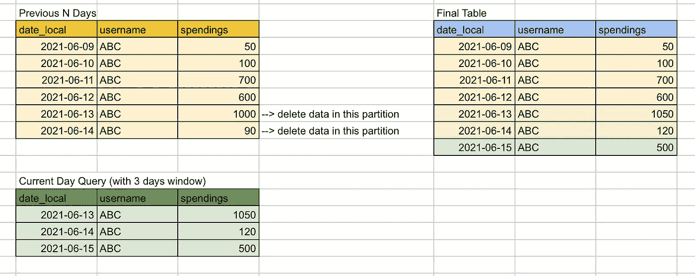
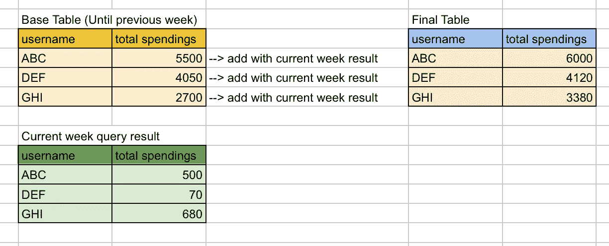

# 提高查询调度技能的简单指南

> 原文：<https://towardsdatascience.com/a-simple-guide-to-improve-your-skills-in-scheduling-queries-40df2aea1f24?source=collection_archive---------25----------------------->

## 创建计划查询时可以遵循的一些基本原则和策略。

由 [Djim Loic](https://unsplash.com/@loic?utm_source=medium&utm_medium=referral) 在 [Unsplash](https://unsplash.com?utm_source=medium&utm_medium=referral) 上拍摄的照片

在我作为数据专家的日常工作中，查询是您将面临的最常见的任务之一。当您重复使用这些查询来生成报告、仪表板甚至培训数据时，我们将需要高效地调度和管理它们。

我想分享一些原则和策略，您可以使用这些原则和策略根据您的具体情况创建一个计划查询。如果您是数据分析师或数据科学家的新手，我希望这些知识会派上用场。

# 要遵循的一些原则

在我的日常活动中，我发现这些原则在执行和管理我的预定查询时帮助很大。它不会在一夜之间到来，你必须一点一点地开始做，并让自己适应它。

## **声明你的变量/参数**

它可以是开始和结束日期或时间戳、过滤器中使用的特定变量等。这是一个很好的实践，因为您可以根据自己的需要快速更改它。

此外，当您从多个表中进行查询时，日期筛选器可能会在多个子查询中使用，这种方法使您只需更改参数，而不必更改子查询的 **ALL** 中的 **WHERE** 子句

要在查询中使用的开始和结束日期变量/参数声明

## **首先处理数据的小子集**

首先使用一小部分数据组成查询(如果可能的话)。您可以首先使用过去 1 天或过去 7 天的数据，然后基于这些数据创建一个完全运行的计划查询(根据第一条原则，您可能只需更改参数😃).

## **使用分区！**

最常见的是按日期分区。此外，我发现使用 date local 作为您的分区(在您的调度查询中)非常有帮助。因为您的报告经常需要您根据当地时间**中的某个时间段进行过滤，这可以节省您运行查询的时间和成本。**

要了解表中分区的更多信息，您可以访问此链接:[https://www . SQL shack . com/database-table-partitioning-SQL-server/](https://www.sqlshack.com/database-table-partitioning-sql-server/)

## **避免使用从另一个预定查询创建的表**

如果可能的话，总是使用主表作为 SQL 查询的源。它可以是直接从事务数据库、数据仓库、数据集市提取的表，或者是您和其他人都认为这些表是您所需数据的主要来源的任何类型的表。

如果您使用另一个计划查询中的表并一直这样做，您可能会失去对更改和执行时间的跟踪，如果一些计划失败并导致您的仪表板停止工作，情况可能会很混乱。

## **要清楚，要干净**

像在编程语言实践中一样，编写清晰的 SQL 查询，必要时添加注释，尽可能使用清晰的变量或别名。这将有助于您和您的团队理解查询中正在发生的事情，并使您在将来需要重新访问它进行更新时变得更加容易。

不太清楚和非常清楚的 SQL 查询示例

# 一些你可以使用的策略

创建查询后，就该安排它了。如果你的查询不需要产生任何表，那么 ***你可以忽略这些策略*** 。但是，通常您需要将结果存储在一个表中，以便在报告工具、仪表板甚至基本的机器学习管道中使用。

## **替换所有策略**

这是最简单的策略，只需运行您的查询，然后将其存储在一个表中。它可以是每日生成的销售线索/销售列表、上个月的流失客户列表等。

我不认为我需要解释更多关于这个策略，它已经很明显了。

## **简单追加策略**

当您需要不断地向表中添加新数据时，可以使用这种策略，比如监控仪表板。

首先，您需要创建您的初始表作为您的基表，然后您可以根据您的需要，每天、每周、每月使用您的预定查询追加更多的数据。

简单附加策略(图片由作者提供)

如果需要，不要忘记设置分区👍

## **窗口追加策略**

有时，您会处理不断更新的数据，这些数据可能来自事件跟踪器或其他一些系统，我们预计从这些数据源提取数据会有延迟，例如 firebase 事件数据。

假设您已经使用计划查询制作了昨天数据的快照，并将其存储在您的表中，但是在您运行计划查询之后，您的主数据源中的数据会有一些更新，此外，您不知道确切的数据更新/插入时间。这会使您的表中的数据无效或不完整，因此您的报告中产生的信息也无效。

在这种情况下，最好以窗口方式运行追加策略。因为在每次运行中，我们都用新的数据替换数据，所以我们可以减少无效或不完整数据的可能性。您可以根据在您的数据环境中最有意义的方式来设置窗口时段。对于每日计划查询，我通常将窗口设置为 3 到 7 天。

窗口附加策略(作者图片)

## **计算然后替换策略**

在某些用例中，您需要根据以前的数字计算一些数字，就像运行计算一样。

例如，我们希望有一个不断更新的特定用户的每周总支出，根据这个支出金额，我们希望给我们的客户特殊待遇。

这种问题实际上可以通过简单地根据我们的每日/每周附加表(来自前面的策略)合计用户的所有支出来解决。当数据变得太大时，将来可能会出现不好的情况，运行这种聚合查询的成本会很高。

因此，您可以简单地一次性捕获每个用户的最新周总支出作为基表，然后通过简单地添加**previous _ total _ spending+current _ week _ total _ spending**来逐步更新该值。

计算然后替换策略(图片由作者提供)

# 结束语

处理查询确实是数据专业人员最常执行的任务之一。随着时间的推移，我们必须提高工作效率，以便更快地交付成果和见解。到一天结束时，我们可以开始花更多的时间来解决越来越多的业务问题。

上面的一些策略是基于我的经验，可能会有更多的策略来探索其他用例。我很开放，如果你有反馈或想补充一些我在这里错过的其他策略，将不胜感激！

最后，快乐学习！！！🚀