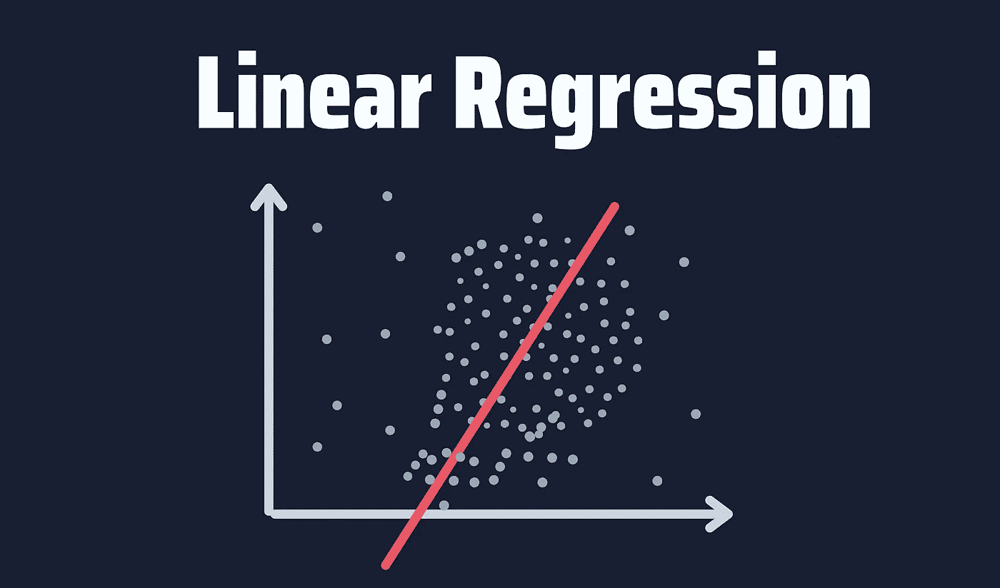
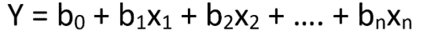
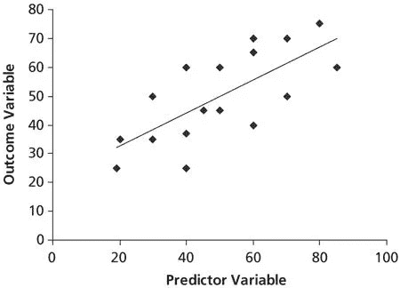
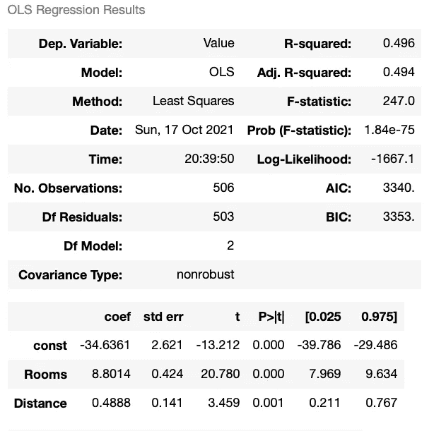

# 使用 Python 进行线性回归的简单指南

> 原文：<https://towardsdatascience.com/a-simple-guide-to-linear-regression-using-python-7050e8c751c1?source=collection_archive---------3----------------------->

## 学习机器学习的核心概念，同时在 Python 中构建线性回归模型



作者图片

每个数据科学家应该学习的第一个机器学习算法之一是线性回归。这个简单的模型帮助我们掌握机器学习的核心概念，例如识别因变量和自变量，建立模型，以及理解模型背后的数学和统计学。

在 Python 中有两种进行线性回归的常用方法——使用 statsmodel 和 sklearn 库。两者都是很好的选择，各有利弊。

在本指南中，我将向您展示如何使用这两者进行线性回归，并且我们还将学习线性回归模型背后的所有核心概念。

```
**Table of Contents** 1\. [What is Linear Regression?](#8e94)
2\. [Linear Regression in Python](#65ed)
 - [The Data](#cbcb)
3\. [Linear Regression with Statsmodels](#0e95)
 - [Simple Linear Regression](#b74c)
 - [Multiple Linear Regression](#0fa8)
4\. [Linear Regression with sklearn](#894e)
5\. [Python for Data Science Cheat Sheet (Free PDF)](#ee7e)
```

# 什么是线性回归？

线性回归是一种建模两个(简单线性回归)或多个变量(多元线性回归)之间关系的方法。在简单线性回归中，一个变量被视为预测变量或自变量，而另一个变量被视为结果变量或因变量。

这是线性回归方程:



其中，`y`为因变量(目标值)，`x1, x2, … xn`为自变量(预测值)，`b0`为截距，`b1, b2, ... bn`为系数，`n`为观察值。

如果等式不清楚，下面的图片可能会有所帮助。



信用: [Quora](https://www.quora.com/What-does-regression-mean-in-statistics-and-machine-learning)

在图中，你可以看到一个线性关系。也就是说，如果一个自变量增加或减少，因变量也会增加或减少。

线性回归可用于进行简单的预测，例如根据学习的小时数预测考试分数，根据工作经验预测员工的工资等等。

理论够了！我们来学习一下如何用 Python 做一个线性回归。

# Python 中的线性回归

在 Python 中有不同的方法进行线性回归。最受欢迎的两个选项是使用 statsmodels 和 scikit-learn 库。

首先，让我们看看我们将用来创建线性模型的数据。

## 数据

为了在 Python 中进行线性回归，我们将使用包含波士顿房价的数据集。原始数据集来自 sklearn 库，但我对其进行了简化，因此我们可以专注于构建我们的第一个线性回归。

你可以在我的 Github 或者 T2 的 Google Drive 上下载这个数据集。确保将这个 CSV 文件放在 Python 脚本所在的目录中。

让我们来看看这个数据集。为此，导入 pandas 并运行下面的代码。

```
**import pandas as pd**
df_boston = pd.read_csv('Boston House Prices.csv')
df_boston
```


作者图片

有 3 列。“价值”列包含以 1000 美元为单位的自住房屋的中值(这是我们想要预测的，也就是我们的目标值)。“房间”和“距离”列包含每个住所的平均房间数和到五个波士顿就业中心的加权距离(两者都是预测值)

综上所述，我们希望根据房屋的房间数量及其到就业中心的距离来预测房屋价值。

# 带统计模型的线性回归

Statsmodels 是一个帮助我们进行统计测试和估计模型的模块。它为每个估计量提供了一个广泛的结果列表。

如果您已经通过 Anaconda 安装了 Python，那么您已经安装了 statsmodels。如果没有，你可以用 conda 或者 pip 安装。

```
# pip
pip install statsmodels# conda
conda install -c conda-forge statsmodels
```

一旦安装了 statsmodel，就用下面的代码行导入它。

```
**import statsmodels.api as sm**
```

创建线性回归之前要做的第一件事是定义因变量和自变量。我们已经在前一节讨论过了。因变量是我们想要预测的值，也称为目标值。另一方面，自变量是预测因子。

在我们的数据集中，我们有 2 个预测，所以我们可以使用其中任何一个或两个。

让我们从简单的线性回归开始。简单的线性回归估计一个自变量**和一个因变量**之间的关系。

## 简单线性回归

对于这个例子，我将选择“房间”作为我们的预测/独立变量。

*   因变量:“值”
*   自变量:“房间”

让我们也在代码中定义因变量和自变量。

```
y = df_boston['Value'] # dependent variable
x = df_boston['Rooms'] # independent variable
```

在本指南中，我将使用线性代数符号——小写字母用于向量，大写字母用于矩阵。

**拟合模型** 现在该拟合模型了。为了向您解释拟合模型的含义，请考虑以下用于简单线性回归的通用方程。

```
𝑦 = 𝑎𝑥 + 𝑏
```


信用: [Quora](https://www.quora.com/What-does-regression-mean-in-statistics-and-machine-learning)

拟合模型意味着找到`a`和`b`的最优值，因此我们获得一条最适合数据点的线。拟合良好的模型会产生更准确的结果，因此只有在拟合模型之后，我们才能使用预测值来预测目标值。

现在让我们使用 statsmodels 拟合一个模型。首先，我们在拟合模型之前添加一个常数(sklearn 默认添加它),然后我们使用。fit()方法。

```
x = sm.add_constant(x1) # adding a constant
lm = sm.OLS(y,x).fit() # fitting the model
```

“lm”代表线性模型，代表我们的拟合模型。这个变量将帮助我们预测我们的目标值。

```
>>> lm.predict(x)0      25.232623
1      24.305975
2      31.030253
3      29.919727
4      31.231138
         ...    
501    24.603318
502    20.346831
503    27.822178
504    26.328552
505    19.661029
```

上面的代码根据“房间”列中的数据预测房屋价值(打印输出)。

## 回归表

虽然我们可以预测目标值，但是分析还没有完成。我们需要知道这个线性模型的表现。回归表可以帮助我们解决这个问题。该表提供了一个结果的详细列表，揭示了我们的模型有多好/多差。

要获得回归表，请运行以下代码:

```
lm.summary()
```

您将获得此表:


作者图片

这个表格的标题是“OLS 回归结果”OLS 代表普通最小二乘法，这是估计线性回归最常用的方法。

让我们看看第一和第二个表中的一些重要结果。

*   离开变量:这是因变量(在我们的例子中,“值”是我们的目标值)
*   r 平方:取 0 到 1 之间的值。接近 0 的 r 平方值对应于解释不了任何数据可变性的回归，而接近 1 的值对应于解释数据全部可变性的回归。**获得的 r 平方告诉我们，房间数量解释了房屋价值变化的 48.4%。**
*   Coef:这些是我们之前在模型方程中看到的系数(a，b)。
*   标准误差:表示预测的准确性。标准误差越低，预测越好。
*   t，P>t (p 值):t 分数和 P 值用于假设检验。“房间”变量具有统计学显著性 p 值。此外，我们可以在 95%的置信度下说“房间”的值在 8.279 到 9.925 之间。

**线性回归方程** 根据上表，让我们使用系数(coef)创建线性方程，然后用数据点绘制回归线。

```
# Rooms coef: 9.1021
# Constant coef: - 34.6706# Linear equation: 𝑦 = 𝑎𝑥 + 𝑏
y_pred = 9.1021 * x['Rooms'] - 34.6706
```

其中 y_pred(也称为 yhat)是回归方程中 y(因变量)的预测值。

**线性回归图** 为了绘制方程，我们使用 seaborn。

```
**import seaborn as sns
import matplotlib.pyplot as plt**# plotting the data points
sns.scatterplot(x=x['Rooms'], y=y)#plotting the line
sns.lineplot(x=x['Rooms'],y=y_pred, color='red')#axes
plt.xlim(0)
plt.ylim(0)
plt.show()
```

上面的代码产生了下面的图。


作者图片

红色的图是我们用 Python 构建的线性回归。我们可以说这是最符合蓝色数据点的线。

恭喜你！您刚刚在 Python 中构建了第一个简单的线性回归。如果你准备迎接挑战，看看如何进行多元线性回归。

## 多元线性回归

现在你已经知道了线性回归的核心概念，我们可以很容易地创建一个多元线性回归。

让我们从设置因变量和自变量开始。在这种情况下，我们将使用 2 个独立变量。

*   因变量:“值”
*   自变量:“房间”和“距离”

让我们也在代码中定义因变量和自变量。

```
y = df_boston['Value'] # dependent variable
X = df_boston[['Rooms', 'Distance']] # independent variable
```

现在让我们添加一个常数并拟合模型。

```
X = sm.add_constant(X) # adding a constant
lm = sm.OLS(y, X).fit() # fitting the model
```

让我们看看结果。

```
lm.summary()
```



作者图片

r 平方增加了一点。此外，在第二个表中有一个新行代表“距离”变量的参数。该表的分析类似于简单的线性回归，但如果您有任何问题，请随时在评论部分告诉我。

## 使用 sklearn 进行线性回归

Scikit-learn 是 Python 中的标准机器学习库，它还可以帮助我们进行简单的线性回归或多元线性回归。

由于之前我们已经用 statsmodels 深入分析了简单线性回归，现在我们用 sklearn 做一个多元线性回归。

首先，我们来安装 sklearn。如果您已经通过 Anaconda 安装了 Python，那么您已经安装了 sklearn。如果没有，你可以用 conda 或者 pip 安装。

```
# pip
pip install scikit-learn# conda
conda install -c conda-forge scikit-learn
```

现在让我们从 sklearn 库中导入 linear_model。

```
**from sklearn import linear_model**
```

因变量和自变量如下。

```
y = df_boston['Value'] # dependent variable
X = df_boston[['Rooms', 'Distance']] # independent variable
```

现在我们必须拟合模型(注意，使用 sklearn 的 fit 方法中的参数顺序与 statsmodels 不同)

```
lm = linear_model.LinearRegression()
lm.fit(X, y) # fitting the model
```

与 statsmodels 类似，我们使用 predict 方法来预测 sklearn 中的目标值。

```
lm.predict(X)
```

然而，与 statsmodels 不同，我们不会使用`.summary()`得到一个汇总表。相反，我们必须逐个调用每个元素。

```
>>> lm.score(X, y)
0.495>>> lm.coef_
array([8.80141183, 0.48884854])>>> lm.intercept_
-34.636050175473315
```

结果与我们使用 statsmodels 获得的表格相同。

注意，为了简单起见，我们没有将数据分为训练和测试。在构建模型之前拆分数据是一种避免过度拟合的流行方法。这将是未来文章的主题，请继续关注！

就是这样！您刚刚学习了如何在 Python 中进行简单的多元线性回归。你可以在我的 [Github](https://github.com/ifrankandrade/model-building.git) 上找到本指南中写的所有代码。

[](/a-beginners-guide-to-text-classification-with-scikit-learn-632357e16f3a) [## Scikit-Learn 简单指南—用 Python 构建机器学习模型

### Python 中的第一个 ML 模型。

towardsdatascience.com](/a-beginners-guide-to-text-classification-with-scikit-learn-632357e16f3a) 

[**与 3k 以上的人一起加入我的电子邮件列表，获取我在所有教程中使用的 Python for Data Science 备忘单(免费 PDF)**](https://frankandrade.ck.page/bd063ff2d3)

如果你喜欢阅读这样的故事，并想支持我成为一名作家，可以考虑报名成为一名媒体成员。每月 5 美元，让您可以无限制地访问数以千计的 Python 指南和数据科学文章。如果你使用[我的链接](https://frank-andrade.medium.com/membership)注册，我会赚一小笔佣金，不需要你额外付费。

[](https://frank-andrade.medium.com/membership) [## 通过我的推荐链接加入媒体——弗兰克·安德拉德

### 作为一个媒体会员，你的会员费的一部分会给你阅读的作家，你可以完全接触到每一个故事…

frank-andrade.medium.com](https://frank-andrade.medium.com/membership)