# 一个简单的黑客来提高任何全局优化算法

> 原文：<https://towardsdatascience.com/a-simple-hack-to-boost-any-global-optimization-algorithm-bdea461b87?source=collection_archive---------21----------------------->

## 用准随机数生成器给你的优化器加点盐和胡椒

比尔·杰伦在 [Unsplash](https://unsplash.com?utm_source=medium&utm_medium=referral) 上的照片

许多计算机程序依靠随机数工作。

这就是**全局优化算法**的情况，其中属于应用数学和数值分析的一个分支，研究如何在给定的优化超空间上有效地找到函数 *f(x)* 的全局最小值/最大值。

在每个全局优化算法中，优化过程从生成维度为 *D* 的 *N* 个个体的随机抽样群体开始。

这些个体中的每一个都代表了要解决的优化问题的候选解决方案。

许多[研究](https://core.ac.uk/download/pdf/82606936.pdf)表明，第一代候选解的空间分布对优化算法的性能有重要影响。

安迪·马克里在 [Unsplash](https://unsplash.com?utm_source=medium&utm_medium=referral) 拍摄的照片

像混沌理论的蝴蝶效应一样，随机过程优化算法初始化中的小偏差会导致非常不同的结果。

在本文中，你会发现有一种**特殊的“随机”数字发生器**可以提高**优化**算法向全局最优的收敛速度。

当我第一次开始从事进化算法的[开发工作并遇到这个相对简单的黑客时，我怀疑它是否会对性能产生任何明显的影响，但没过多久我就发现混沌理论著名的蝴蝶效应也适用于全局优化问题。](https://www.researchgate.net/publication/318470533_Flight_Control_Laws_Carefree_Handling_Clearance_of_a_Highly_Manoeuvrable_Aircraft_Using_Multi-Strategy_Adaptive_Global_Optimization)

欢迎来到疯狂而美丽的随机世界。

克瑞丝·布朗从澳洲墨尔本拍摄的照片。维基共享。

# 电脑不玩骰子

我们生活在一个混沌的世界里，随机性时刻存在于我们的生活中。然而，在我们在计算机上运行的程序中准确模拟这种随机性并不容易。

一台普通的计算机，就像一台机器，在设计上是确定的，这意味着相同的输入总是产生相同的输出。

随机值通常用于统计分析、艺术，或者只是当我们不得不随机选择一些东西时，例如在抽奖中。

然而，当涉及到用标准计算机产生随机性时，我们归因于硬币或骰子等物理对象的完美随机性有点难以实现。

计算机试图以纯数学的方式生成随机数，这是一个问题，而不是一个优势——过了一段时间，看似随机的东西最终不再那么随机了。

虽然随机物理过程的组合可以用来生成纯随机数(从桌上的鼠标移动到放射性)，但如果我们像计算机一样依赖纯数学，我们能得到的最好结果是伪随机数。

> 标准计算机中纯粹的随机性只是一个错误的幻觉，我们所能得到的最好的结果是“几乎随机”的不可预测性

由[马克斯·费尔纳](https://unsplash.com/@maxfelner?utm_source=medium&utm_medium=referral)在 [Unsplash](https://unsplash.com?utm_source=medium&utm_medium=referral) 上拍摄的照片

伪随机数非常接近纯粹的概率，但在随机性方面也有一些限制。这就是前缀“*伪“*的原因。

无论如何，在计算机[中生成一个好的伪随机数序列也不容易](https://medium.com/delta-force/how-computers-make-random-numbers-51e8938d9d53)。

这个游戏的名字是寻找一个函数，它的结果在每次使用时都不同，尽管我们知道它的输出会在某个时间重复，因为从技术上讲，只能使用有限数量的数字(例如，手表表面的数字或存储在变量中的 264 位数字)。

# 为什么伪随机数可能不足以进行全局优化？

在任何基于群体的全局优化算法中，如 [PSO](https://en.m.wikipedia.org/wiki/Particle_swarm_optimization) 、 [CMA-ES](https://en.m.wikipedia.org/wiki/CMA-ES) 、 [GA](https://en.m.wikipedia.org/wiki/Genetic_algorithm) 或 [DE](https://en.m.wikipedia.org/wiki/Differential_evolution#:~:text=In%20evolutionary%20computation%2C%20differential%20evolution,a%20given%20measure%20of%20quality.) 等等，当我们使用伪随机数发生器从均匀概率分布 *U(0，1)* 中对初始代的前 *N* 个个体进行采样时，我们得到如下结果:

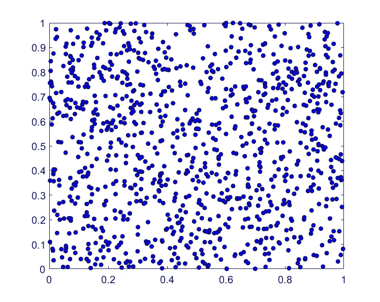

在 Matlab 中使用伪随机数发生器分配 1000 个样本。图片由作者提供。

你不认为 2D 空间中的个体分布在某些区域过于稀疏吗？

这是伪随机数的问题，它们不会以均匀的方式有效地填充空间。

用伪随机数发生器创建的样本并不是沿着采样超空间的每个维度完美地均匀分布的。正如您稍后将看到的，这可能会对优化性能产生很大的影响。

但是不要担心，这个问题有一个非常简单的方法，叫做**准随机**数。处理伪随机数缺乏同质性的一个非常好的替代方案。

准随机数与伪随机数有许多相似之处，但**它们是基于低差异序列**确定性选择的。

# 低差异序列？

好吧，我知道你现在可能想知道，什么是低差异序列？

在数学中，差异( *DN)* 为一个样本序列( *s₁，*...)关于区间[a，b]被定义为

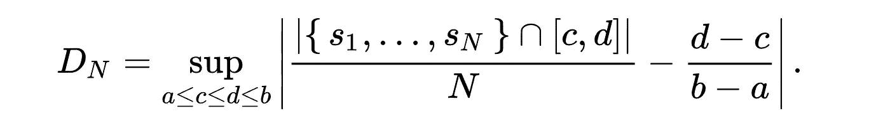

根据这个定义，当 *N* (序列中元素的数量)趋于无穷大时，一个*均匀分布序列*具有趋于零的差异。

低差异序列的一个优点是**它们以均匀分布的方式更加均匀地填充 *N* 维超空间**，因此，使用这种类型的序列创建的初始群体将提供**对优化超空间**的更加有效的探索。

低差异序列也被称为*准随机*序列。

对于我们的情况，真正重要的是要注意，准随机数的低差异属性对于全局优化方法至关重要。

但是，最重要的低差异序列类型是什么？

# 哈尔顿序列和哈默斯利集

哈尔顿序列和哈默斯利集合定义了对 D 维空间采样的两种确定性的<https://en.m.wikipedia.org/wiki/Deterministic_system>**方式，使得连续的点彼此尽可能远离。**

**本质上，Halton 序列和 Hammersley 集合都是针对多维情况的 [Van der Corput](http://lavalle.pl/planning/node196.html) 序列的推广。**

**Van der Corput 序列最初被提出来对一维区间[0，1]进行采样，使得序列的一个点和下一个点尽可能远。**

**假设我们想要生成基数为 *b* 的范德科尔特序列的 *N* 个样本(其中 *b* 是一个质数)，那么第 *n 个*元素可以通过两个简单的步骤获得:**

1.  **获取系数 *ai* 表示基数 *b:* 中整数 *n* 的二进制表达式**

**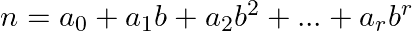****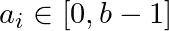**

**2.然后，利用 *aᵢ* 系数，我们可以最终计算出序列的第 n 个元素*ϕ(n】*如下:**

**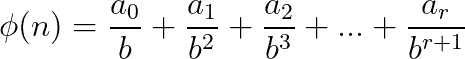**

**例如，数字 *n* = 5 可以用基数 *b* = 2 表示，其中 *a₀* = 1， *a₁* = 0， *a₂* = 1，因此范德科尔普特序列的第 5 个元素将等于 1/2 + 1/8 = 5/8。**

**下图将帮助您以升序(红点)显示基数为 *b =* 2 的范德科尔特序列的前十二个样本。**

**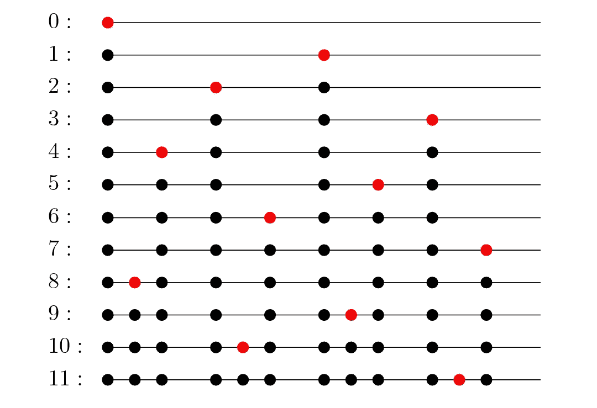**

**资料来源:从范德科尔普特到拟蒙特卡罗规则序列的现代构造。[论文](https://arxiv.org/abs/1506.03764)**

**我知道这里涉及的数学可能不简单。老实说，我一直很难想象数字在不同于 *b* = 10 的基数下的表示。**

**然而，您会惊讶地发现，在通用库 *b.* 中编写范德科尔特序列是多么简单**

**看看这段 C 代码片段。**

**是不是简单得令人难以置信？确实是！**

**到目前为止，我们已经看到了如何生成一个一维序列，所以下一步是将这些序列扩展到更高维度。**

**这就是哈尔顿的贡献发挥作用的时候了。**

**为了将范德科尔普序列推广到一个 *D-* 维超 *-* 空间，哈尔顿使用了一个非常简单的策略，即使用一个范德科尔普序列，每个轴具有不同的素数基。**

**这是，对于 *D-* 维的情况，哈尔顿序列的第一维是基数为 *b* = 2 的范德科尔普序列，第二维是基数为 *b* = 3 的范德科尔普序列，第 *D-th* 维是基数与第 *D-th* 素数一致的范德科尔普序列。**

**这是 1000 个哈尔顿序列样本的样子。**

**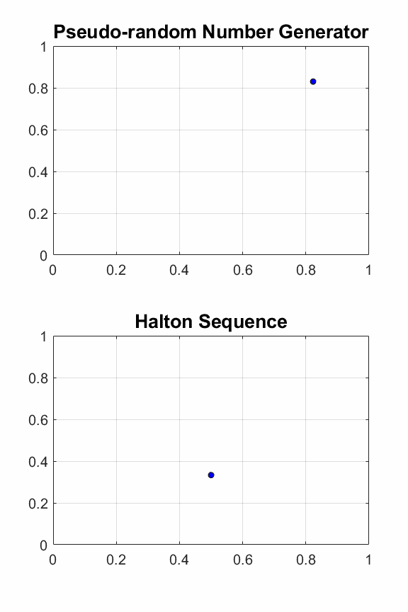**

**此图像显示了来自伪随机数发生器(顶部)的 1000 个点，与 Halton 低差异序列(底部)进行了比较。图片由作者提供。**

**哈默斯利使用了这个策略的一个小变体来产生另一个准随机序列，即哈默斯利集合。**

**在哈默斯利集合中，第一维的第 n 个样本不是基数为 2 的范德科尔普序列，而是简单的 n / N**

**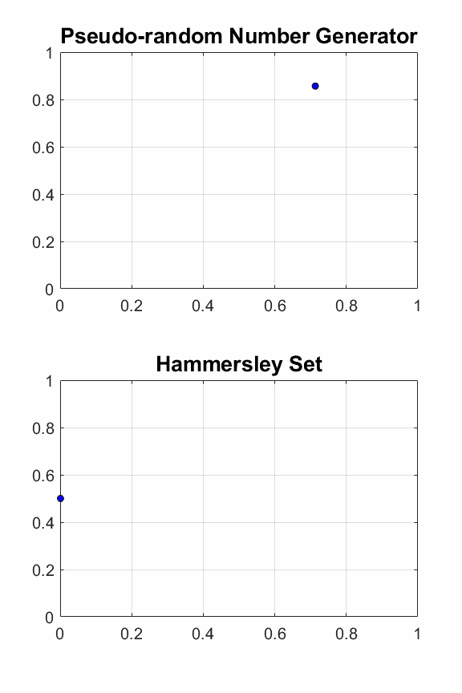**

**此图像显示了伪随机数发生器(顶部)的 1000 个点，与 Hammersley 集(底部)进行了比较。随着样本以递增的顺序呈现，观察 Hammersley 集合的第一维如何是 n / N。**

**Halton 序列和 Hammersley 集都是多维中最基本的低差异序列生成器，它们可以被认为是其他低差异序列的构造块。**

# **2.Sobol 序列**

**Sobol 序列是另一种广泛使用的准随机数生成器，它是由 Ilya M. Sobol 早在 1967 年发明的。**

**这个准随机数生成器使用基数 2 来生成区间[0，1]的均匀分区，然后对采样超空间的每个维度执行主序列的特殊重新排序。**

**Sobol 序列的数学实现稍微繁琐一些，所以我们将直接使用它获得结果，并将它们与使用伪随机数生成器获得的结果进行比较。**

**如果你想了解更多 Sobol 序列背后的理论，可以参考这个[来源](https://dialnet.unirioja.es/descarga/articulo/4160245.pdf)。**

**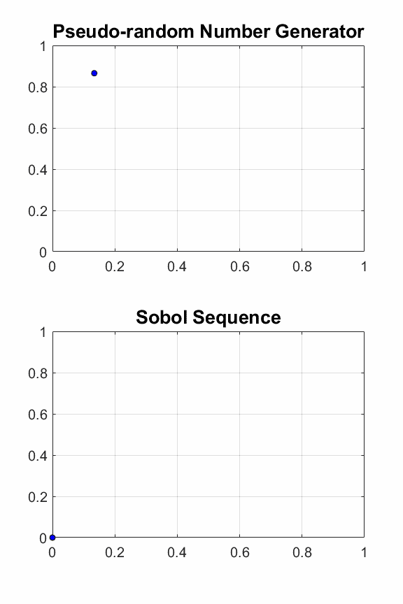**

**该图显示了 Sobol 序列中的 1000 个点(底部)与伪随机样本(顶部)的比较。Sobol 序列更均匀地覆盖空间。图片由作者提供。**

**对于 [Python](https://people.sc.fsu.edu/~jburkardt/py_src/sobol/sobol.html) 、 [Matlab](https://people.sc.fsu.edu/~jburkardt/m_src/sobol/sobol.html) 、 [Julia](https://github.com/stevengj/Sobol.jl) 、 [Fortran](https://people.sc.fsu.edu/~jburkardt/f_src/sobol/sobol.html) 和 [C++](https://people.sc.fsu.edu/~jburkardt/cpp_src/sobol/sobol.html) 编程语言来说，Sobol 序列有太多的实现。**

# ****🟣应用实例——助推粒子群优化算法****

**这里，我们将评估随机初始化对最简单但有效的优化算法之一粒子群优化(PSO)的优化性能的影响。**

**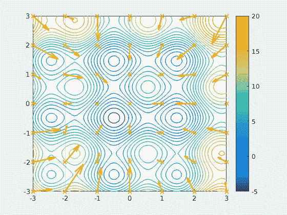**

**基于粒子群优化算法的种群进化动画。来源:[维基共享](https://commons.wikimedia.org/wiki/File:ParticleSwarmArrowsAnimation.gif)。**

**为该比较分析选择的函数 *f(x)* 将是一组三个多维函数，它们通常用于全局优化算法的基准测试。**

*   *****f₁*** :球体功能**

**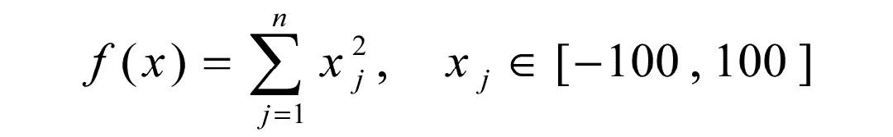**

*   *****f₂*** :超椭球函数**

**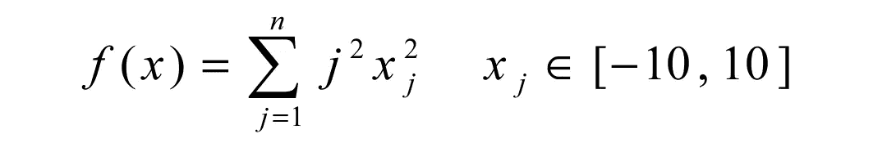**

*   *****f₃*** :阿克利函数**

**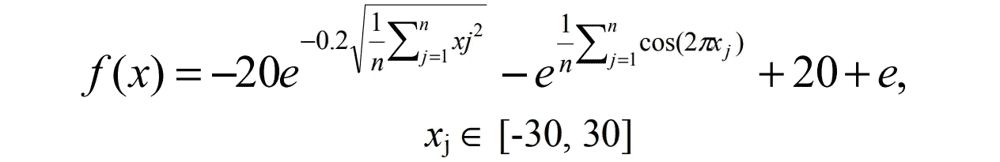**

**我们将只考虑自变量 *x* 的值的上下限约束，而不考虑非线性约束。**

**将比较三种不同的粒子群优化算法的种群初始化方法:**

*   ****U-PSO** :使用伪随机数发生器(`rand()`函数)的统一初始化。**
*   ****H-PSO** :使用随机 Halton 序列初始化。**
*   ****S-PSO** :使用随机化的 Sobol 序列进行初始化。**

**选择用来测量优化性能的品质因数将是找到基准函数的全局最小值(在这种情况下是已知的)所需的函数求值的平均数。越低越好。**

**为了分析[维度诅咒](https://link.medium.com/DCqGVbBWhgb)的影响，我们还将考虑三种不同的情况，维度 *D* = 10， *D* = 20， *D* = 30。**

**你渴望看到优化基准测试的结果吗？**

**这是我在笔记本电脑上运行了几次优化后得到的结果。**

**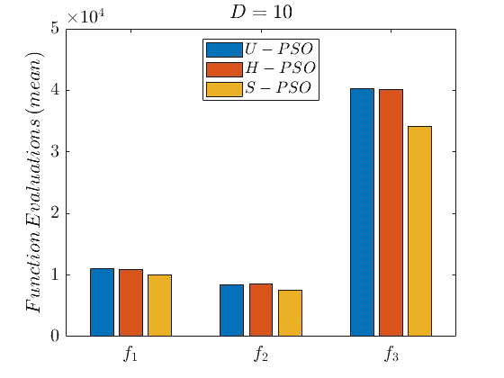**

****D = 10** 的优化基准测试结果，显示了寻找最优解的函数评估的平均值。图片由作者提供。**

**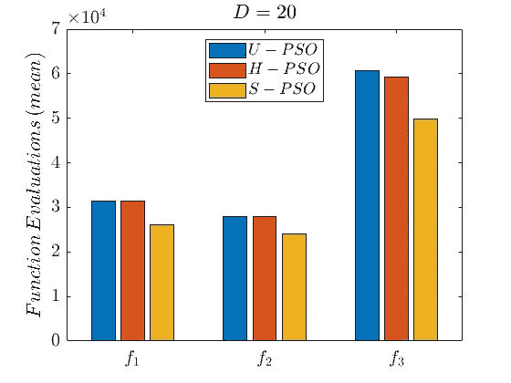**

****D = 20** 的优化基准结果，显示了寻找最优解的函数评估的平均值。图片由作者提供。**

**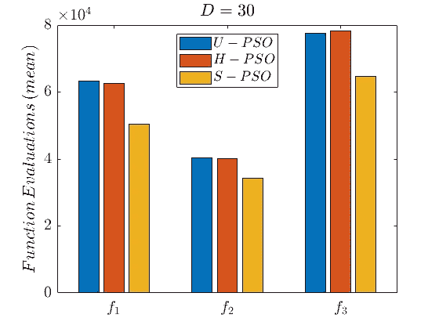**

****D = 30** 的优化基准测试结果，显示寻找最优的函数评估的平均值。图片由作者提供。**

**如结果所示，S-PSO 算法(用随机化的 Sobol 序列初始化的 PSO)优于其他两种算法(U-PSO 和 H-PSO)，而不考虑成本函数和优化空间维度 *D.***

**从这些结果得出的另一个结论是，尽管用随机化 Halton 序列初始化的 PSO 算法并不比使用 Sobol 序列的算法好，但它与使用标准伪随机数发生器的算法一样好(在某些情况下稍好)。**

# **最后的想法**

**正如您所看到的，从伪随机初始化策略切换到准随机初始化策略可以提高优化算法的性能。**

**这个技巧非常简单，可以应用于任何全局优化器，您只需修改那些使用`rand()`函数的代码行，作为您自己的低差异序列生成器。**

**但一如既往，有一个免责声明:**

> **“低差异序列破解不是魔术”**

**有时，根据您正在使用的成本函数，您看不到任何改进，但是无论如何，这都不会损害优化器的性能。**所以值得一试！****

# ****参考文献****

**[1]马阿拉宁，h .，米耶蒂宁，k .和马克勒，M. M. 2004 年。[遗传算法的准随机初始种群](https://www.sciencedirect.com/science/article/pii/S0898122104840240)。计算机与数学应用，第 47 卷:1885-1895。**

**[2] 莫罗科夫，W. J .和卡弗利什，R. E. 1994。[准随机序列及其差异](https://epubs.siam.org/doi/abs/10.1137/0915077?journalCode=sjoce3)。暹罗 J. Sci。计算机。, 15(6):12511279**

**[3]马斯卡尼，m .和迟，H. 2004 年。[在加扰的 Halton 序列上](https://www.sciencedirect.com/science/article/abs/pii/S0168927407001390)。蒙特卡洛方法应用，10(3):435–442**

**【范·德·科尔普特，J.G. 1935。Verteilungsfunktionen。一.米特。继续。阿卡德。潮湿。阿姆斯特丹。38: 813–821**

**[5] Pausinger，f .和 A. Topuzoglu，Van der Corput 序列和置换多项式，预印本。**