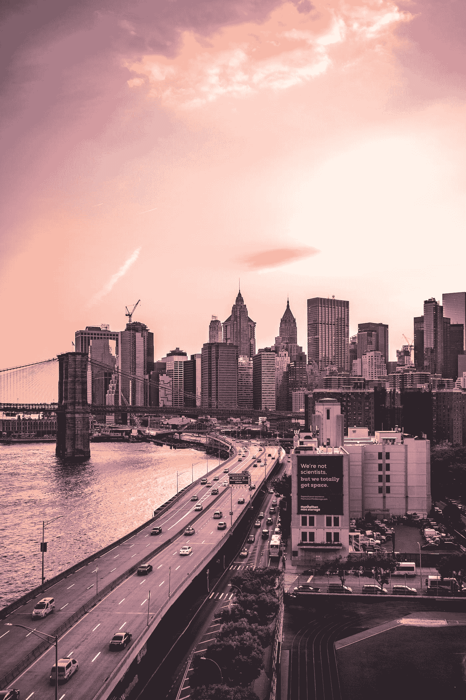
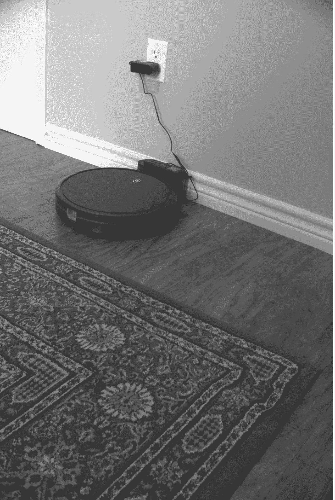
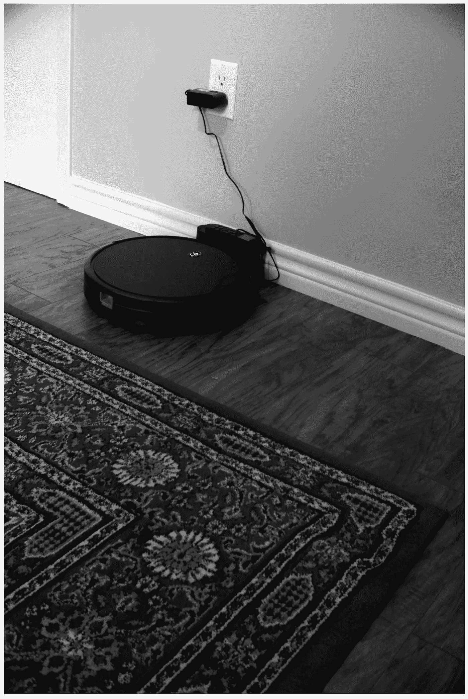

# OpenCV Python 上一个简单的 HDR 实现

> 原文：<https://towardsdatascience.com/a-simple-hdr-implementation-on-opencv-python-2325dbd9c650?source=collection_archive---------12----------------------->

## 了解如何使用 Python 和 OpenCV 创建高动态范围(HDR)图像



在 [Unsplash](https://unsplash.com?utm_source=medium&utm_medium=referral) 上由 [Lerone Pieters](https://unsplash.com/@thevantagepoint718?utm_source=medium&utm_medium=referral) 拍摄

HDR 图像包含了不同曝光的多幅图像的信息。在光源不均匀的场景中，单次拍摄可能会使图像的某些区域过度曝光，并且由于亮度增加，细节会丢失。相反，这张照片也可能出现曝光不足的区域，这也将导致信息丢失。

要创建 HDR 图像，您需要:

1.  用不同的曝光量拍照。最少 2 个，通常 3 个，你可以使用 3 个以上的图像，但这将占用大量的 CPU 资源。
2.  对齐图像。即使你使用三脚架，你也需要执行这一步(我们说的是像素级对齐)。没有正确对齐您的图像将导致您的 HDR 图像中的伪像和“幽灵”。
3.  将对齐的图像合并为一个。
4.  对合并的图像执行色调映射。在自然界中，最小的可能亮度是零，但最大值不限于 255，事实上没有限制，它可以是无穷大。为此，我们需要将第三步中获得的图像映射到(0，255)范围。这可以通过色调映射来实现。

# 例子

```
import cv2 as cvimport numpy as np# Loading exposure images into a listimg_fn = [r"C:\Users\felipe.cunha\Documents\venv\HDRTest\100.jpg", r"C:\Users\felipe.cunha\Documents\venv\HDRTest\250.jpg", r"C:\Users\felipe.cunha\Documents\venv\HDRTest\500.jpg"]img_list = [cv.imread(fn) for fn in img_fn]exposure_times = np.array([100, 250, 500], dtype=np.float32)# Merge exposures to HDR imagemerge_debevec = cv.createMergeDebevec()hdr_debevec = merge_debevec.process(img_list, times=exposure_times.copy())merge_robertson = cv.createMergeRobertson()hdr_robertson = merge_robertson.process(img_list, times=exposure_times.copy())# Tonemap HDR imagetonemap1 = cv.createTonemap(gamma=2.2)res_debevec = tonemap1.process(hdr_debevec.copy())# Exposure fusion using Mertensmerge_mertens = cv.createMergeMertens()res_mertens = merge_mertens.process(img_list)# Convert datatype to 8-bit and saveres_debevec_8bit = np.clip(res_debevec*255, 0, 255).astype('uint8')res_mertens_8bit = np.clip(res_mertens*255, 0, 255).astype('uint8')cv.imwrite(r"C:\Users\felipe.cunha\Documents\venv\HDRTest\ldr_debevec.jpg", res_debevec_8bit)cv.imwrite(r"C:\Users\felipe.cunha\Documents\venv\HDRTest\fusion_mertens.jpg", res_mertens_8bit)
```



德贝韦克方法。看看这些细节！



默滕斯方法。

# 结论

我们已经介绍了 HDR 的基本情况。当您需要在曝光不足和曝光过度的大视场中定位特征时，此技术特别有用。

希望这能对你的计算机视觉项目有所帮助。

如果你想要一篇关于这个话题的更深入的文章，请在评论中告诉我。

谢谢！