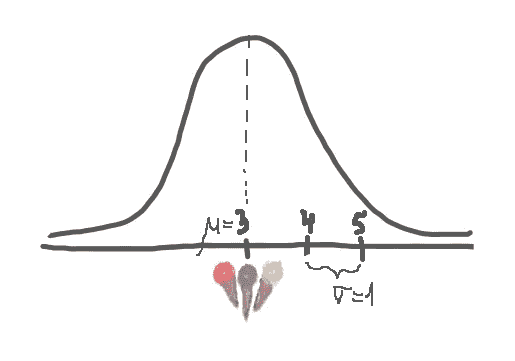
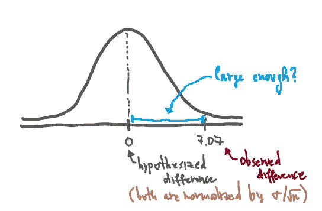
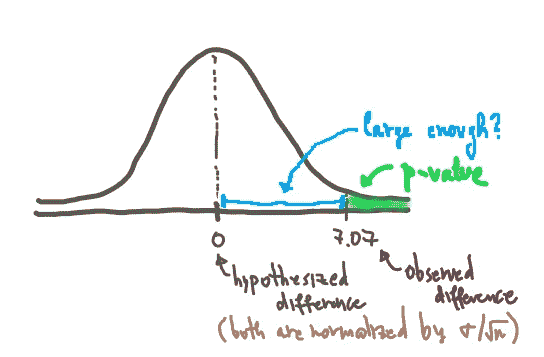

# p 值的简单解释

> 原文：<https://towardsdatascience.com/a-simple-interpretation-of-p-values-34db3777d907?source=collection_archive---------11----------------------->

## 简单解释了 p 值和冰淇淋消耗量。

Katie Smetherman 的照片(来源:[Unsplash](https://unsplash.com/photos/etr1gzkVpuQ)——感谢 Katie！❤)

p 值很有意思。它们非常有用，但又耐人寻味，神秘莫测，难以理解。这篇文章将试图在不使用太多技术术语的情况下解释它们。

让我们简单地从一个关于冰淇淋消费的有趣故事**开始，用通俗易懂的方式来说明 p 值**。

# 冰淇淋店问题🍦

为了便于说明，我将讲述一个虚构的冰淇淋店，我经常在那里停下来买我最喜欢的冰淇淋口味。这家店位于多伦多一条繁忙的街道上，每天都有数百人驻足品尝美味。

在一个阳光明媚的星期天，我路过这个地方，点了我最喜欢的草莓🍓冰淇淋。出于好奇，我问店主，她认为普通顾客一周会买多少冰淇淋。她摇摇头说:

> *“嗯，我想说，平均来说，一个顾客一周会买 3 个冰淇淋，可能多一个或少一个。”*

我谢过她，走到附近的长椅上享用我的甜点。

当我坐在附近的长椅上时，我仔细观察了所有进出的人，注意到有些人甚至一天来多次。我想——嗯，他们可能会在本周再次回来。所以我开始怀疑——她告诉我真相了吗？我开始怀疑现实可能是平均每个顾客一周消费超过 3 个冰淇淋。考虑到冰淇淋的美味，这并不奇怪。

我非常注重数据，喜欢根据数据点做出结论，所以我决定做一个彻底的统计分析来验证我的怀疑。我决定进行假设检验(即 A/B 检验),并收集我做决定所需的数据。

首先，我使用所有者与我分享的数据点绘制了一个分布图:

我假设我的数据近似正态分布，均值= 3，标准差= 1。请记住，并不是所有的真实生活数据都是正态分布的！[图片是我自己的]

太好了——现在我们对底层数据有了一个大致的概念。让我们继续并建立一个 A/B 测试。

# 设置 A/B 测试

在 A/B 测试中，你可能已经知道，你有一个控制组 A (也称为现状)与一个处理组 B**竞争。在这种情况下，让我们这样设置它们:**

****答:平均每位顾客每周在观察到的冰淇淋店购买 *3 份冰淇淋*。****

**和...相对**

****B:平均每位顾客每周在观察到的冰淇淋店购买*3 个以上的冰淇淋*。****

**如果我能找到足够的证据来否定 A 而支持 B，那就太好了，这也证实了我的怀疑。**

**那么，我如何收集足够的证据呢？我需要数据(耶！).我要做的是，我将收集关于 *n = 50* 顾客的数据点，观察他们的习惯，并获得他们在给定的一周内冰淇淋的平均数量。**

**好吧，假设我收集了这些数据，并观察到X̅ = 4，也就是说，我观察到平均来说，一位顾客每周从这家虚拟的冰淇淋店订购 4 份冰淇淋。下一步是使用一个测试统计，它将帮助我得出一个结论，即我怀疑店主对我撒谎是否正确。因为我们在这里测试样本均值，所以我将使用以下常用的测试统计:**

> **Z = (X̅— μ)/ (σ / sqrt(n))**

****边注:**根据 A/B 测试的设置，有大量可用的测试统计数据。例如，如果您测试的是一个比例而不是一个平均值，或者您测试的是多个治疗组，那么测试统计看起来会有所不同。你可以点击了解更多信息[。](https://en.wikipedia.org/wiki/Test_statistic)**

**注意上面的 *Z* 测试统计的公式。我们基本上期望从样本均值中减去假设(理论)均值 *μ* ，然后通过样本大小和理论标准偏差 *σ* 将这一差异归一化。这将有助于我们确定我们选择的样本平均值与理论平均值相差多少。另外，根据店主告诉我们的，注意 *μ = 3，σ = 1* 。X̅是 4，而 *n = 50:***

> **z =(4–3)/(1/sqrt(50))= 7.07。**

**好了，我们得到了这个所谓的 z 值 7.07，现在，我们该怎么做呢？我们将在图表上绘制这个数字，旁边是假设的差值 0(即，如果语句 A 是正确的，那么 *Z = 0* )。**

****

**[图片是我自己的]**

**因此，您看到的是，A 与 B 的对比——我们看到现状为 0，即没有差异，这意味着所有者是正确的，B 意味着归一化差异为 7.07，即根据我的观察，我与现状相差 7.07 个单位(或者，如果我们将 z 分数非归一化并查看原始原始值，则相差 1 个冰淇淋)。**

**现在的问题是，这种差别太大了吗？这个观察到的差异足够大(显著)让我说*“好吧，我有足够的证据拒绝 A，接受 B”*？**

# ****融合 p 值以进行数据驱动的决策****

**看上面的图表，我们到达了需要做出决定的点，但是我们不知道如何做。救市是为了找到一个有助于我们做出最终决定的 p 值。什么是 p 值？**

> **假设零假设(A)是正确的，p 值是获得至少与已经观察到的结果一样极端的结果的概率。**

**好吧，这是一个非常类似维基百科的定义，让很多人感到困惑(当我第一次了解 p 值时，我也感到困惑😌).通俗地说，p 值是下图中绿色的区域，所以本质上它是得到比我们观察到的更极端结果的概率**(在我们的场景中 X̅ = 4)。****

****

**p 值是曲线下的绿色区域。在我们的例子中，我们很快就会看到这个面积几乎为 0。显然，上图中的面积远不为零，我们想从概念上强调 p 值，所以不要让这个问题困扰你！:)【图片是我自己的】**

**这意味着，我们离平均值越远，这个区域(即 p 值)就越小，因此我们就越不可能观察到比我们已经看到的更极端的情况。这个区域越小，我们反对现状的证据就越多(假设 A)。这个区域越小，我们已经观察到的(X̅ = 4)就越有可能已经非常极端，并且**如此极端，以至于观察到更极端的东西是如此不可能**。所以，我们有很多反对现状的证据。计算 p 值意味着计算钟形曲线下的面积，以查看这些极端事件发生的可能性有多大。**

**让我们也正式计算我们的 p 值:**

> **p = P{Z ≥ z} = P{Z≥ 7.07} ≈ 0。**

****边注:**我用[这个 Z 分表](http://www.z-table.com/)得出 P{Z≥ 7.07} ≈ 0。这些表在推断统计中非常常用，所以请继续将链接加入书签以备将来使用！**

**现在你可能想知道——多小的 p 值才算足够小？多大的差异才算足够大？为此，我们需要一个预先确定的门槛。请注意，这些阈值是在实验之前确定的，以避免 [p-hacking](https://en.wikipedia.org/wiki/Data_dredging) 提前调整阈值以获得所需的最终结果。**

**这个阈值在统计学上正式称为**显著性水平**，或 alpha，通常为 5%或 0.05。在不同的情况下，你会看到不同的阈值，例如在医学等更敏感的领域，阈值可能会更低。**

**拒绝规则是，**如果 p 值小于α，我们拒绝 A 而支持 B** 。在我们的例子中，这是真的，所以我们可以继续拒绝 A，并得出结论，我们有足够的证据来支持我们的假设 b。😃**

****End Note 1:** 在设置 A/B 检验时考虑其他因素的细节我没有赘述，比如选择最佳样本量、检验的功效、效应大小等。这篇文章的目的是专注于解释 p 值，而不是转移到其他话题。**

****结尾注释 2:** 作为一项作业，我会让你观察如果我们观察到 X̅ = 3.2 而不是 X̅ = 4 会发生什么。继续计算这种情况下的 p 值，您也可以绘制图表，给你一个更好的直觉。**你还有足够的证据来否定你的零假设 A 吗？X̅ = 3.2 而不是 X̅ = 4 这一事实如何改变了你的直觉？请在评论中告诉我！👇****

**谢谢你陪我走完这段旅程！我希望你喜欢学习 p 值。请随意查看我在**中以简单、务实的方式**解释统计概念的几篇文章:**

1.  **[逻辑回归系数的简单解释](/a-simple-interpretation-of-logistic-regression-coefficients-e3a40a62e8cf)**
2.  **[大数定律的关系&中心极限定理](/the-relationship-between-the-law-of-large-numbers-central-limit-theorem-849907b189ad)**
3.  **[比较 ML 模型:统计意义与实际意义](/comparing-machine-learning-models-statistical-vs-practical-significance-de345c38b42a)**

**另外，请关注我的博客更新。干杯！❤**