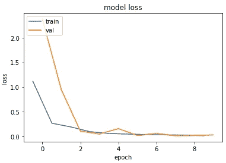
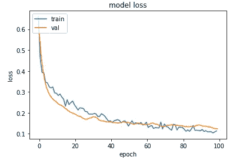
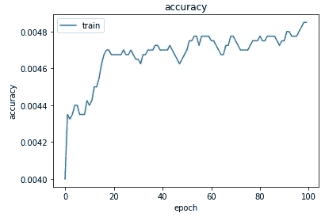
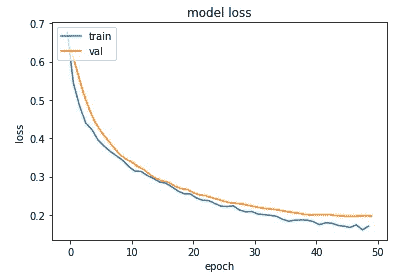
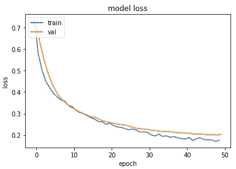
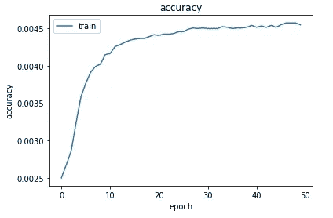

# 一个简单的数学自由 PyTorch 模型框架

> 原文：<https://towardsdatascience.com/a-simple-maths-free-pytorch-model-framework-3eedfd738bd4?source=collection_archive---------18----------------------->

## 喜欢数据科学和深度学习，但被所有的数学和公式搞糊涂了，只想要一个简单的解释和一组例子？我也是。所以现在我们来纠正一下，好吗？

本文的目标是尝试并制作一个简单的可解释的构建 PyTorch 深度学习模型的示例，以给出回归、分类(二元和多类)和多标签分类的示例。

我发现每一种都有几十个甚至几百个例子，但没有一个以相似的方式给出了每一种的例子，并且经常归结为大型的数学公式，所以我在不同的风格和方法之间来回转换，因此我一次又一次地困惑自己，所以我想要一些简单的东西可以重复使用。我还想尽可能简单地完成它们，使用可爱的、随处可得的库和模块，尽可能少地定制“我的解释”。

因此，我不想陷入 EDA、特征工程和所有那些非常重要的东西(我会说比模型更重要)，并希望尽可能保持简单和“只是模型的框架”。
考虑到这一点，我们将使用来自 **sklearn.datasets** 的精彩的 **make_regression** 、 **make_classification、**和**make _ multi Label _ classification**，从而模拟一旦您为第一个基线模型做好所有 EDA 和功能工程准备，您的数据将处于的状态，这意味着我们将不会进行任何标签编码、解决不平衡等。

我也想完全远离数学。我会解释为什么我们在没有符号、公式和算法的情况下做我们正在做的事情。
这不仅仅是给你一些代码来剪切/粘贴，而是向你展示我在这个过程中遇到的一些错误，从而产生(我希望)一组有用的函数和信息。

我写这篇文章是为了帮助我拥有一个入门笔记本，我可以用它来做各种各样的事情，我希望这样做能帮助到其他人，所以我们开始吧。

**准备笔记本**

首先，加载相关模块。基本上就**学**、 **torch** 、 **NumPy** 、 **matplotlib** 。

```
from sklearn import metricsfrom sklearn.model_selection import train_test_split
from sklearn.datasets import make_regression, make_classification, make_multilabel_classification
from sklearn.preprocessing import LabelEncoder, StandardScaler, MinMaxScalerimport torch
from torch.utils.data import Dataset, DataLoader
import torch.optim as torch_optim
import torch.nn as nn
import torch.nn.functional as Fimport numpy as np
import matplotlib.pyplot as plt
```

**创建可重复使用的 PyTorch 组件**

好了，下一节是我们将在整篇文章中反复使用的函数。我将概述他们做什么，但是损失函数和精度函数的任何细节将随着我们的进展详细解释。

**使用 PyTorch 数据集**

作为其中的一部分，我们将熟悉并使用 PyTorch 数据集。为什么？嗯，它们提供了一个很好的方法来在我们的数据周围放置一个迭代器，并允许所有的好处，比如干净地批处理数据等等，所以为什么不使用它们呢。

这是建立一个数据库的最低要求，而且都是不言自明的。

我相信你知道，深度学习模型喜欢数字，所以当你准备好数据时，所有的分类特征都已经被编码了。如果它是一个整数，即所有特性的 np.float32 和目标的 np.int64，否则它也是 np.float32。

在这个过程中，它还把我们可爱的 numpy 数组变成了时髦的 PyTorch 张量。

```
class MyCustomDataset(Dataset):
    def __init__(self, X, Y, scale=False):
        self.X = torch.from_numpy(X.astype(np.float32))
        y_dtype = np.int64 if Y.dtype == np.int64 else np.float32
        if scale: self.y = torch.from_numpy(MinMaxScaler().fit_transform(Y.reshape(-1,1)).astype(y_dtype))
        else:     self.y = torch.from_numpy(Y.astype(y_dtype))

    def __len__(self):
        return len(self.y)

    def __getitem__(self, idx):
        return self.X[idx], self.y[idx]
```

**创建一个简单的 PyTorch 模型**

这里我们将创建一个相当简单的模型，因为这不是一篇关于特定问题类型的最佳模型类型的文章。这给你的是构建 PyTorch 模型的类的结构，你可以用你认为合适的任何东西改变/扩展/替换这些模型。

它以输入 X 形状 10(这将是我们在这些例子中使用的数据的大小)开始，并且可以有一个参数传递给它以形成最终的层(y 形状)，默认为 1。

```
class BetterTabularModule(nn.Module):
    def __init__(self, out_features=1):
        super().__init__()
        self.lin1 = nn.Linear(10, 200)
        self.lin2 = nn.Linear(200, 70)
        self.lin3 = nn.Linear(70, out_features)
        self.bn1 = nn.BatchNorm1d(10)
        self.bn2 = nn.BatchNorm1d(200)
        self.bn3 = nn.BatchNorm1d(70)
        self.drops = nn.Dropout(0.3)
    def forward(self, x):
        x = self.bn1(x)
        x = F.relu(self.lin1(x))
        x = self.drops(x)
        x = self.bn2(x)
        x = F.relu(self.lin2(x))
        x = self.drops(x)
        x = self.bn3(x)
        x = self.lin3(x)
        return x
```

**设置一个简单的优化器**

对于所有这些问题，我们将坚持使用 Adam 优化器。看起来很合适。

```
def get_optimizer(model, lr=0.001, wd=0.0):
    parameters = filter(lambda p: p.requires_grad, model.parameters())
    optim = torch_optim.Adam(parameters, lr=lr, weight_decay=wd)
    return optim
```

**现在一个简单的训练功能，训练循环和评估功能**

这些是使用 PyTorch 的标准方法，所以让我们将它们放在函数中，并在整个过程中使用它们。唯一需要改变的是，是的，你已经猜到了，损失函数，它将作为一个参数传入，还有精度函数。

```
def train_model(model, optim, train_dl, loss_func):
    # Ensure the model is in Training mode
    model.train()
    total = 0
    sum_loss = 0 for x, y in train_dl:
        batch = y.shape[0]
        # Train the model for this batch worth of data
        logits = model(x)
        # Run the loss function. We will decide what this will be when we call our Training Loop
        loss = loss_func(logits, y)
        # The next 3 lines do all the PyTorch back propagation goodness
        optim.zero_grad()
        loss.backward()
        optim.step()
        # Keep a running check of our total number of samples in this epoch
        total += batch
        # And keep a running total of our loss
        sum_loss += batch*(loss.item())
    return sum_loss/totaldef train_loop(model, epochs, loss_func, lr=0.1, wd=0.001):
    optim = get_optimizer(model, lr=lr, wd=wd) train_loss_list = []
    val_loss_list = []
    acc_list = [] for i in range(epochs): 
        loss = train_model(model, optim, train_dl, loss_func)
        # After training this epoch, keep a list of progress of the loss of each epoch 
        train_loss_list.append(loss)
        val, acc = val_loss(model, valid_dl, loss_func)
        # Likewise for the validation loss and accuracy (if applicable)
        val_loss_list.append(val)
        acc_list.append(acc)
        if acc > 0: print("training loss: %.5f     valid loss: %.5f     accuracy: %.5f" % (loss, val, acc))
        else:       print("training loss: %.5f     valid loss: %.5f" % (loss, val))

    return train_loss_list, val_loss_list, acc_listdef val_loss(model, valid_dl, loss_func):
    # Put the model into evaluation mode, not training mode
    model.eval()
    total = 0
    sum_loss = 0
    correct = 0 for x, y in valid_dl:
        current_batch_size = y.shape[0]
        logits = model(x)
        loss = loss_func(logits, y)
        sum_loss += current_batch_size*(loss.item())
        total += current_batch_size # All of the code above is the same, in essence, to Training, so see the comments there # However the functions to assess Accuracy change based on the type of problem we are doing.
        # Therefore the following lines will make more sense as we progress through the article. # Accuracy for Binary and Multi-Class Classification
        if loss_func == F.cross_entropy:
          # Find out which of the returned predictions is the loudest of them all, and that's our prediction(s)
          preds = logits.sigmoid().argmax(1)
          # See if our predictions are right
          correct += (preds == y).float().mean().item() # Accuracy for Multi-Label Classification
        if loss_func == F.binary_cross_entropy_with_logits:
          # Find out, of ALL the returned predictions, which ones are higher than our test threshold (50%), and they are our predictions
          preds = logits
          correct += ((preds>0.5) == y.bool()).float().mean().item() return sum_loss/total, correct/total
```

现在一个小函数来查看结果。

```
def view_results(train_loss_list, val_loss_list, acc_list):
  plt.figure()
  epochs = np.arange(0, len(train_loss_list))
  plt.plot(epochs-0.5, train_loss_list) # offset by half an epoch as Training calculated mid epoch but val calculated at end of epoch
  plt.plot(epochs, val_loss_list)
  plt.title('model loss')
  plt.ylabel('loss')
  plt.xlabel('epoch')
  plt.legend(['train', 'val', 'acc'], loc = 'upper left')
  plt.show()

  if acc_list[0]:
    plt.figure()
    plt.plot(acc_list)
    plt.title('accuracy')
    plt.ylabel('accuracy')
    plt.xlabel('epoch')
    plt.legend(['train','val', 'acc'], loc = 'upper left')
    plt.show()
```

# 回归

好的，让我们从回归模型开始。具有 10 个特征的 1000 个样本，其中 8 个是信息性的(即，在模型/预测中实际有用的数量),让我们进行 80/20 训练测试分割。

```
X, y = make_regression(n_samples=1000, n_features=10, n_informative=8, random_state=1972)
X_train, X_val, y_train, y_val = train_test_split(X, y, test_size=0.2, random_state=1972
```

现在将它们加载到我们的 PyTorch 数据集，并在 PyTorch 数据加载器中将它们分成 256 个大小的批次。

```
train_ds = MyCustomDataset(X_train, y_train, scale=True)
valid_ds = MyCustomDataset(X_val, y_val, scale=True)batch_size = 256
train_dl = DataLoader(train_ds, batch_size=batch_size, shuffle=True)
valid_dl = DataLoader(valid_ds, batch_size=batch_size, shuffle=True)
```

如果我们愿意的话，我们可以看看这些，看看他们玩得好不好。

```
train_features, train_labels = next(iter(train_dl))
train_features.shape, train_labels.shape
(torch.Size([256, 10]), torch.Size([256, 1]))train_features[0], train_labels[0]
(tensor([ 0.8939, -1.0572, -2.1115,  0.9993, -0.4022, -0.7168, -0.1831,  0.3448, -0.6449, -0.4287]), tensor([0.5383]))
```

**现在开始训练**

回归是我们这里最简单的问题类型。

让我们建立我们的模型。对于输出目标的数量，我们可以坚持默认值 1。

我们这里的损失函数是 MSE 损失。(MSE 代表均方误差，基本上就是我们的预测与 y 目标相比有多“错误”)。这是回归问题的一个很好的起点，所以让我们用它来训练。

我们无法计算回归模型的准确性，因为回归模型的性能必须报告为回归预测中的错误。

```
model = BetterTabularModule()
train_loss_list, val_loss_list, acc_list = train_loop(model, epochs=10, loss_func=F.mse_loss)
view_results(train_loss_list, val_loss_list, acc_list)
```



很好，是吧？

# 分类—单一类别

好了，现在让我们来看一个分类模型。具有 10 个特征的 1000 个样本，其中 8 个是信息性的(也就是说，在模型/预测中实际有用的数量)，让我们再次进行 80/20 训练测试分割。

```
X, y = make_classification(n_samples=1000, n_classes=2, n_features=10, n_informative=8, n_redundant=0, random_state=1972)
X_train, X_val, y_train, y_val = train_test_split(X, y, test_size=0.2, random_state=1972
```

现在将它们加载到我们的 PyTorch 数据集，并在 PyTorch 数据加载器中将它们分成 256 个大小的批次。

```
train_ds = MyCustomDataset(X_train, y_train)
valid_ds = MyCustomDataset(X_val, y_val)batch_size = 256
train_dl = DataLoader(train_ds, batch_size=batch_size, shuffle=True)
valid_dl = DataLoader(valid_ds, batch_size=batch_size, shuffle=True)
```

**现在训练**

二元分类(例如，是/否)比回归稍微复杂一点，但不会太复杂。

让我们建立我们的模型。我们需要为输出目标的数量传入 2。首先是答案是第一个选项的概率。第二个是它是第二个选项的概率。

我知道你在想什么。为什么不只有一个输出，并根据它接近 0 或 1 的程度给出我们的答案呢？是的，我们可以这样做，但我认为这种方式更好，原因将变得清楚。

我们这里的损失函数是交叉熵损失(F.cross_entropy ),它的基本功能是返回每个答案的概率。它通过在内部将 log_softmax(一条漂亮的 sigmoid 曲线中的所有值和整行值的总和为 1)和 nll_loss(根据适当的目标标签选择适当的损失)组合成一个函数来实现这一点。

对于分类，我们只关心哪个返回的预测是最响亮的，这就是我们的预测。我们可以使用 logits.argmax(1)来基本上说明 F.cross_entropy 的预测行中的哪一项是最大值。

然后，为了查看我们的预测是否正确，我们将所有预测与实际目标(y)进行比较，并返回正确的数字:(preds == y)。浮动()。平均值()。项目()。这是分类问题的一个很好的起点，所以让我们用损失函数进行训练，用准确度函数进行验证。

```
model = BetterTabularModule(2)train_loss_list, val_loss_list, acc_list = train_loop(model, epochs=100, loss_func=F.cross_entropy, lr=0.001, wd=0.001)view_results(train_loss_list, val_loss_list, acc_list)
```



一点都不差！！

# **分类—多类**

好了，现在让我们来看一个多类分类模型。具有 10 个特征的 1000 个样本，其中 8 个是信息性的(即，在模型/预测中实际有用的数量)，同样具有 80/20 训练测试分割。

```
X, y = make_classification(n_samples=1000, n_classes=3, n_features=10, n_informative=8, n_redundant=0, random_state=1972)
X_train, X_val, y_train, y_val = train_test_split(X, y, test_size=0.2, random_state=1972)
```

现在将它们加载到我们的 PyTorch 数据集，并在 PyTorch 数据加载器中将它们分成 256 个大小的批次。

```
train_ds = MyCustomDataset(X_train, y_train)
valid_ds = MyCustomDataset(X_val, y_val)batch_size = 256
train_dl = DataLoader(train_ds, batch_size=batch_size, shuffle=True)
valid_dl = DataLoader(valid_ds, batch_size=batch_size, shuffle=True)
```

**现在列车**

多类分类(比如狗/猫/马)比二元分类难多了。

笑话！！！一点也不，因为我们用二元分类法做的。想想看，我们建立的模型有两个输出目标。第一个是答案是第一个选项的概率。第二个是它是第二个选项的概率。

那么，我们真的需要现在就用更多的输出目标来构建模型，并让我们的损失函数和准确度与我们使用二元分类时完全相同吗？

没错。！

告诉过你这很容易。

```
model = BetterTabularModule(3) # Now we want 3 outputs
train_loss_list, val_loss_list, acc_list = train_loop(model, epochs=100, loss_func=F.cross_entropy, lr=0.001, wd=0.001)
view_results(train_loss_list, val_loss_list, acc_list)
```



# 分类—多标签

```
X, y = make_multilabel_classification(n_samples=1000, n_features=10, n_classes=3, n_labels=1, allow_unlabeled=False, random_state=1972)
# This returned mimicked one hot encoded data, but we need those as Floats, not Integers for our Accuracy Function
y = y.astype(np.float32)
X_train, X_val, y_train, y_val = train_test_split(X, y, test_size=0.2, random_state=1972)
```

现在将它们加载到我们的 PyTorch 数据集，并在 PyTorch 数据加载器中将它们分成 256 个大小的批次。

```
train_ds = MyCustomDataset(X_train, y_train)
valid_ds = MyCustomDataset(X_val, y_val)batch_size = 256
train_dl = DataLoader(train_ds, batch_size=batch_size, shuffle=True)
valid_dl = DataLoader(valid_ds, batch_size=batch_size, shuffle=True)
```

**现在列车**

我们这里的损失函数是 f . binary _ cross _ entropy _ with _ logits loss，它只是在 BCE 损失之前做一个 sigmoid，因此最终因为我们可以有一个以上最响亮的激活(因为它可以是多标签)，所以我们希望让它们通过 sigmoid，并基于阈值来识别它们是否正确。即:正确+= ((preds>0.5) == y.bool())。浮动()。平均值()。项目()

```
model = BetterTabularModule(3)
train_loss_list, val_loss_list, acc_list = train_loop(model, epochs=50, loss_func=F.binary_cross_entropy_with_logits, lr=0.001, wd=0.001)
view_results(train_loss_list, val_loss_list, acc_list)
```



同样，我认为这在样本数据上训练和验证得非常好。

# 一路上的教训

在把这些放在一起的过程中，我遇到了各种各样的错误和问题，下面我整理了一些。其原因是，当你(希望)利用这一点创建自己的模型，改变损失函数或精度函数，甚至当然只是使用自己的数据时，你可能会遇到相同或类似的问题。

**目标 2 出界。**

*   这是因为当我创建我的模型时，我没有改变一个输出目标的默认值。所以一旦 a 尝试了一个分类模型，我就得到错误
    通过将 2 传递给函数来建立我的模型，我正在纠正我的错误，并确保我的模型有两个可能的结果目标

**我的训练看起来很平静，没有什么事情发生**

*   我错误地没有重置我的模型，所以这个训练是在我已经做过的训练之上的，所以看起来根本没有什么不同

**RuntimeError:张量 a (256)的大小必须与非单一维度 1 的张量 b (3)的大小相匹配**

*   在多标签分类中，我使用 argmaxing 而不是 sigmoid，因此，对于所有目标，我没有获得介于 0 和 1 之间的良好概率，而是像我对标准分类所做的那样，再次选择最响亮的目标

# 结论

现在你知道了。一个简单的 PyTorch 用例的不同问题类型及其方法的例子，您可以根据您的问题需求对其进行扩展。

我希望这有所帮助。