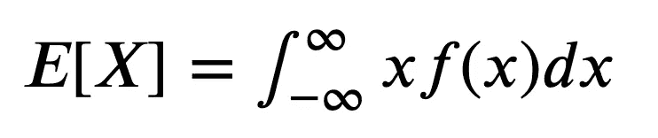
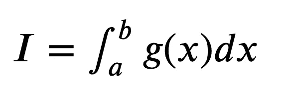
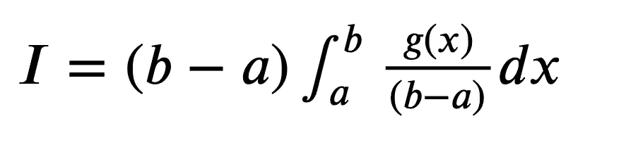
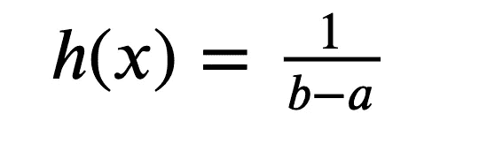
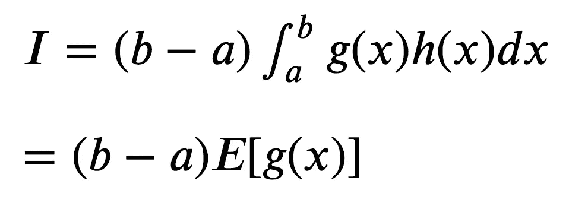
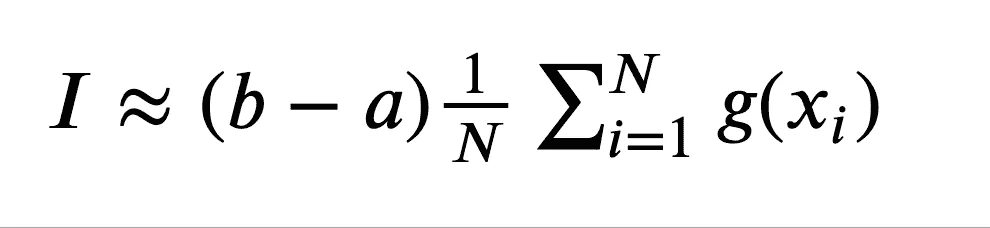
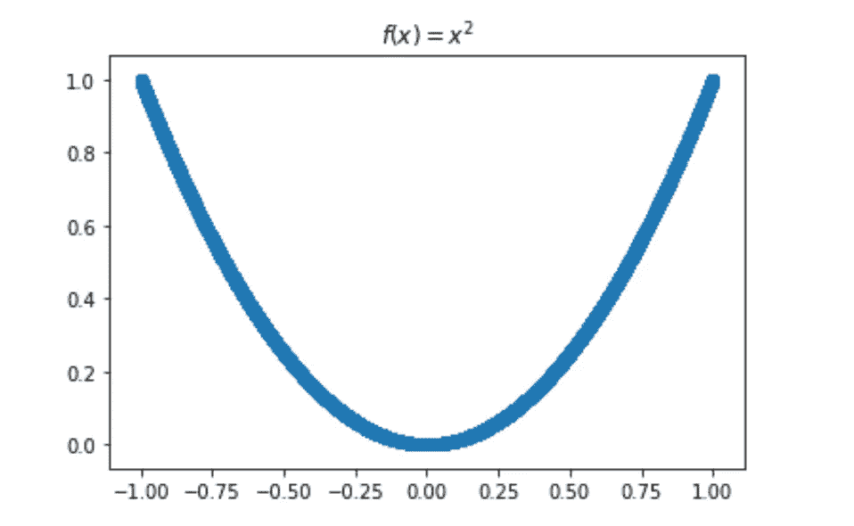
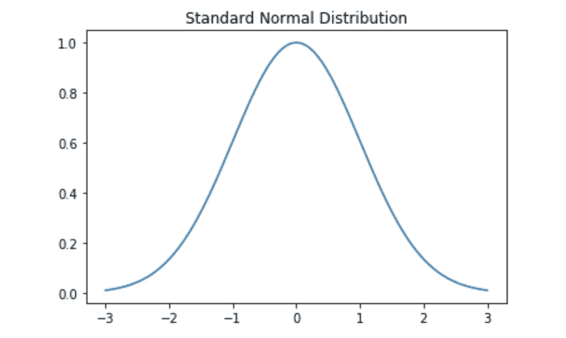
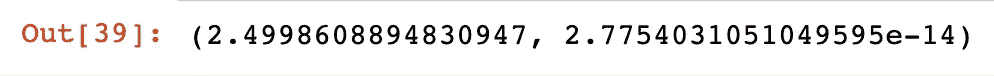

# Python 中数值积分的一种简单方法

> 原文：<https://towardsdatascience.com/a-simple-method-for-numerical-integration-in-python-7906c1703af8?source=collection_archive---------1----------------------->

在本文中，我们将介绍一种用 python 计算积分的简单方法。我们将首先导出积分公式，然后在 python 中的几个函数上实现它。这篇文章假设你对概率和积分有基本的了解，但是如果你没有，你可以直接跳到例子。尽情享受吧！

# 衍生物

我们必须首先说明连续随机变量的期望值的定义。

假设 X 是一个概率密度函数为 f(x)的随机变量。X 的期望值定义如下:



X 的期望值

接下来，我们使用期望公式来推导一个计算积分的简单方程。我们想估计以下积分:



函数 g(x)从 a 到 b 的积分

我们首先将积分改写如下:



然后，我们可以将函数 h(x)定义为:



这允许我们以熟悉的形式重写积分:



积分中的所有计算都被简化为一个期望值，我们知道如何找到一组数据的期望值。最终近似值变为:



## **Python 示例 1:积分初等函数**

我们从简单的从 0 到 1 积分二次函数 f(x) = x 开始。



```
# Dependencies
import numpy as np
import scipy.integrate as integrate
import matplotlib.pyplot as plt# Our integral approximation function
def integral_approximation(f, a, b):
    return (b-a)*np.mean(f)# Integrate f(x) = x^2
def f1(x):
    return x**2# Define bounds of integral
a = 0
b = 1# Generate function values
x_range = np.arange(a,b+0.0001,.0001)
fx = f1(x_range)# Approximate integral
approx = integral_approximation(fx,a,b)
approx
```

我们的积分近似值为:


这是我们所期望的，因为积分的真实值是 1/3。然而，我们也可以将我们的结果与 Scipy 的“quad”函数进行比较。

```
# Scipy approximation
integrate.quad(f1,a,b)
```

结果值:


我确信这个例子让你坐立不安，但是让我们看看我们是否能集成一个更复杂的函数。

## **Python 示例 2:整合高斯函数**

高斯函数因极难积分而臭名昭著。在这个例子中，我们将通过整合标准正态分布来测试我们的方法。

```
# Integrating a random function
np.random.seed(42)def gaussian(x, mu, sigma):
    return np.exp((-1*(x - mu)**2) / (2 * sigma**2))# Define mu and sigma
mu = 0
sigma = 1# Define bounds of integral
a = -3
b = 3# Generate function values
x_range = np.linspace(-3,3,200)
fx = gaussian(x_range, mu, sigma)
```

结果函数如下所示:



我们的积分近似法的好处是，函数的复杂性确实会影响计算的难度。在任何情况下，我们需要的只是积分的边界和函数值。

```
# Our approximation
approx = integral_approximation(fx,a,b)
approx
```


与 Scipy 解决方案相比:

```
# Scipy approximation
integrate.quad(lambda x: np.exp((-1*(x - mu)**2) / (2 * sigma**2)),a,b)
```



我希望你觉得这篇文章简单易懂而且有趣！

## 谢谢大家！

*喜欢我的文章吗？请我喝杯咖啡:*[*https://www.buymeacoffee.com/HarrisonfhU*](https://www.buymeacoffee.com/HarrisonfhU)