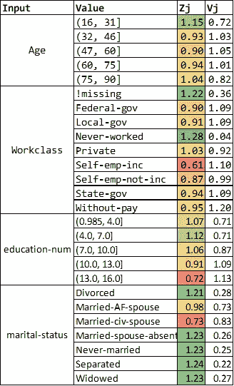
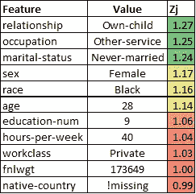
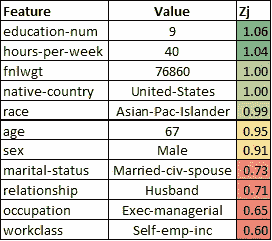
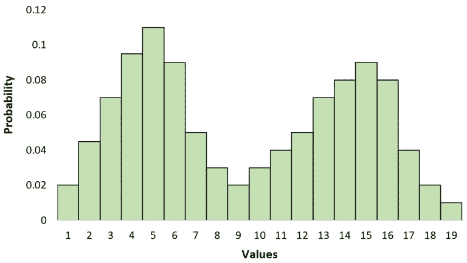
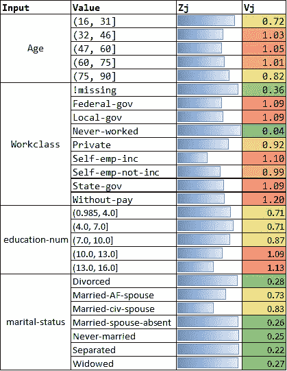

# 独立于模型的分数解释

> 原文：<https://towardsdatascience.com/a-simple-model-independent-score-explanation-method-c17002d66da7?source=collection_archive---------27----------------------->

## 如何为任何模型分数生成*的案例级解释*

T 机器学习(ML)应用的指数级增长以及模型在许多生产应用中的嵌入推动了对解释这些模型的可解释性和透明性的需求。在这篇文章中，我提出了一种简单的方法来提供对模型分数的**案例级**解释——即:哪些输入特征导致了特定案例的预测分数**、**或记录**的增加或减少？**

照片由 [Siora 摄影](https://unsplash.com/@siora18?utm_source=medium&utm_medium=referral)在 [Unsplash](https://unsplash.com?utm_source=medium&utm_medium=referral) 上拍摄

# 介绍

在数据科学中，我们处理统计和机器学习模型的广泛工具箱，从最简单的回归到最复杂的深度学习神经网络架构。此外，在当今数据丰富的世界中，具有数百个输入特征的模型并不罕见，这增加了通常产生单一输出信号的机器的整体复杂性，即指示某事是真还是假，或者预测连续测量。

在许多情况下，最终预测可以推动关键行动，或者为人类决策提供信息。例如，我在税务合规领域的 [ML 应用领域进行了大量工作，使用模型自动对数百万份个人纳税申报单进行评分，以识别可疑的申报单，供进一步检查。在这种情况下，仅仅有一个**模型级的**特性重要性的解释是不够的(在许多开源包中都有)；相反，我们需要一些**案例层次的**解释来解释**模型预测**。具体来说，如果给定输出类的概率很高(或很低)，我们需要提供一个我们认为导致模型做出特定决定的要素列表。这可以帮助用户获得对预测的信心，并帮助推动进一步的决策。](http://eliteanalytics.avianaglobal.com/wp-content/uploads/2015/04/Elite-White-Paper1.pdf)

ML 模型被使用的地方越多，对可解释性的需求就越大。例如，在大多数欺诈检测应用中，能够支持拒绝单个交易的决策是非常重要的。显然，这同样适用于大多数类型的信用评分，在这种情况下，重要的贷款决策是在整体模型评分的基础上做出的。通常，分数解释对于最终用户获得对模型的信心并推动采用是至关重要的。当 ML 模型被引入到历史上依赖于专家知识和直觉的现有过程中时，这是特别真实的。

不是每个 ML 模型都需要可解释性。当模型驱动高度自动化的决策时，如流程控制、直接营销、内容推荐等。在应用程序的调优和调试过程中，模型输出的案例级解释可能更有用，但对操作来说用处不大。

一般来说，当分数影响到个别案例时，解释是有用的。当模型分数只影响一个大规模的过程时，单独的解释只适用于在过程中具有启发性或历史性专业知识的人。

这些仅仅是多希-维勒兹和金在这篇[论文](https://arxiv.org/abs/1702.08608)中陈述的 ML 模型的*可解释性*的一般问题的几个例子，该论文提供了该问题的一般框架和定义。

# 可解释的模型？

在数据科学中可用的各种模型类型中，有些被认为比其他模型更适合“解释”——但是我们真的能这样说吗？比如分类，我能想到的最基本的框架大概就是 Logistic 回归模型。这里，除了最后的非线性单调变换，预测基本上是根据输入的线性函数计算的。

因此，可以用每个特征的系数乘以特征本身的值的乘积来量化每个特征对最终得分的贡献。够简单吗？事实上，在大多数情况下，这将是可行的，尤其是在某些假设为真的情况下，即特征是独立的(无共线性)和标准化的，因为偏差项可能会使模型的解释变得复杂。当一个模型有许多特征时，完全没有共线性是不可能的，因此，即使是最简单的可用模型的可解释性也成问题。

决策树，至少在其最简单的形式中，也被认为是“可解释的”，因为它们可以从数据中推断出定义良好的决策规则。同样，这在理论上是正确的，特别是如果我们控制树的深度，从而限制每个规则中的前提条件的数量。但是在实践中，为了使模型达到合理的准确性，决策树通常会产生大量的“深层”规则。除此之外，规则是人类可读形式的事实并不总是意味着这些规则也是*可解释的*。

虽然一般来说，更简单类型的模型和具有更少变量的模型可能更容易解释，但这种*准确性/可解释性权衡*在给定的应用程序中可能不容易协商，或者至少不需要一些努力。例如，我经常发现自己不得不“简化”复杂的模型，纯粹是为了可解释性。虽然执行模型缩减对于获得泛化和限制过度拟合很重要，但是缩减模型以使其更易解释并不总是容易的，或者是可能的。即使驯服一个“简单”的逻辑模型来减少变量，降低共线性，并使系数更容易解释，同时保持其准确性，也是一项艰巨的工作。

# 案例级模型解释技术

在我提出这个高度简化的方法来提供模型输出的案例级解释之前，让我们回顾一下文献中已经提出的一些更复杂的技术。

作为一般背景，我强烈推荐谷歌关于[人工智能可解释性](https://storage.googleapis.com/cloud-ai-whitepapers/AI%20Explainability%20Whitepaper.pdf)的白皮书，它很好地概述了这个主题，并讨论了在谷歌云中实现的解决方案(充分披露:我在谷歌工作，但这不是为了宣传我们的服务，我只是认为这是一篇很好的文章)。具体来说，本白皮书中用于描述在实例级别“解释”ML 模型分数的能力的术语是**特征属性** (FA)。FA 是一个有符号的连续值，表示在分数的特定实例中，任何单个输入要素对模型输出的贡献程度。

谷歌用于 FA 的技术是基于由劳埃德·沙普利首先引入的博弈论概念，被称为沙普利值(SV)。由 [Christopher Molna](https://christophm.github.io/) r 撰写的关于[可解释机器学习](https://christophm.github.io/interpretable-ml-book/)的优秀在线书籍中有一节专门介绍了 [Shapley Values](https://christophm.github.io/interpretable-ml-book/shapley.html) ，该书对这种方法进行了出色的概述。SV 方法有几个优点:

*   **它是独立于模型的**:它可以应用于任何“黑盒”模型，因为它只需要对从数据集中抽取的例子进行评分的能力。
*   **有一个清晰的解释**:对于一个给定的实例，每个输入特征的 SV 表示实例得分与总体平均得分之间的差异部分，这可以通过该特征假设其特定值来解释。
*   **完整性**:保证所有特征的所有 SV 之和与分数的边际差与其基线相匹配。

这种方法的缺点是计算 Shapley 值所涉及的计算复杂性随着特征的数量呈指数增长，使得它不可能以其原始形式应用于现实世界的问题。然而，一些方法可以通过采样来近似计算 SV。

另一种流行的模型解释方法是 [LIME](https://arxiv.org/abs/1602.04938) ，最早出现在 2016 年。在高层次上，LIME 通过用可解释的模型(例如，回归)局部近似任何黑盒模型来工作。这是通过用从黑盒模型生成的数据训练近似模型来完成的，通过从被解释的实例的值扰动其输入来实现。LIME 也是一种独立于模型的方法，但是它对问题采取了与 SV 方法完全不同的态度。石灰和 [SHAP](/explain-your-model-with-the-shap-values-bc36aac4de3d) (一种基于沙普利原理的方法)的比较见[本帖](/idea-behind-lime-and-shap-b603d35d34eb)。

请注意，上面提到的方法比这篇文章中提到的方法要复杂得多，理论上也更加合理。然而，我们的方法很容易实现，并且在实践中运行良好。对于负责根据分数采取行动的人来说，这也可能更容易理解。也就是说，我会确保强调那些可能不太好的情况。

# 一种简单的独立于模型的方法

给定一个模型 ***M*** ，让我们假设我们可以对数据集 ***X*** 进行评分，该数据集包含一个记录样本，该样本包含 ***M*** 所需的所有输入特征。该数据集可以是训练数据本身，模型 ***M*** 基于该数据集进行估计，或者是保留集，或者是完全不同的样本。唯一的要求是 ***X*** 提供一个合理的输入空间表示，在这个空间内 ***M*** 将在生产中运行。

接下来，我们将 ***M*** 应用于数据集 ***X*** ，产生分数 ***Y*** 的向量。注意，我们不需要目标的实际真值，也不需要知道关于 ***M*** 的任何细节——我们需要给定输入数据集 ***X*** 由 ***M*** 产生的分数。

对于每个输入特征 ***J*** ，我们做如下操作:

*   **对于分类特征**:计算 ***J*** 的每个不同值的 ***Y*** 的平均值。我们还可以计算标准偏差，因为它提供了额外的有用信息。
*   **对于连续/数值特征**:应用任何合理的宁滨方法(如等频宁滨)首先离散变量 ***J*** 。然后，计算与分类变量相同的分数统计。

然后我们计算一个比率， ***Zj*** ，即 ***Y*** 的平均值与*J***Y***的总体平均值之间的比率。该比率表示当输入 **J** 采用特定值 ***Ji*** 时，整个数据集中得分的平均变化。我们还可以计算出 ***J = Ji*** 时得分的标准差与 Y 跨总体的标准差之比。姑且称这个值为 ***Vj*** 。*

*上述过程的输出可以看作是一个简单的查找表。作为一个例子，这里我们将一个简单的逻辑回归模型(我们可以使用任何其他类型的模型)拟合到众所周知的 [UCI 人口普查收入数据集](http://archive.ics.uci.edu/ml/datasets/adult)。然后，我们为模型的每个输入计算了 ***Zj*** 和 ***Vj*** 值。结果示例如下所示，由于篇幅限制，我只显示了 11 个模型输入中 4 个的计算值。请注意，对于连续输入，如*年龄*和*教育编号*，添加离散化仅用于此评估方法——这些输入不是为了创建模型而离散化的。事实上，这种方法完全独立于输入是如何在模型“内部”具体转换的，因为它只取决于模型在给定输入向量的情况下生成的分数。颜色编码有助于识别那些对增加(绿色)或减少(红色)模型分数贡献最大的输入/值组合。*

**

*UCI 人口普查收入数据集模型的模型说明表示例(图片由作者制作)*

*给定一个实例 ***I*** ，我们可以*根据每个输入 ***J 的对应值*** 检索*一组对应的 **Zj** 和 **Vj** 值。第一组数字， **Zj，**代表输入 ***J*** 假设值 ***Ji*** 对分数的平均影响；高于 1.0 的值表示 ***J = Ji*** 增加分数(正贡献)，低于 1.0 的值表示反而有助于降低分数(负贡献)。***【Zj】***值的相对比例为我们提供了对***【J】***输入的贡献差异的指示，例如 ***I*** 。*

*因此，给定一个实例 **I** ，我们可以检索 ***Zj*** 分数，并使用它们根据它们的值对输入特征进行排序。同样，大于 1.0 的因子代表正贡献，而小于 1.0 的因子代表负贡献。接近 1.0 的 ***Zj*** 值表示中性贡献。下面的示例显示了所选数据集的特定记录的模型输入的分级效果，该模型为此产生了很高的分数。*

**

*示例 1:高分案例(作者制作的图片)*

*在第一个示例中，输入的*关系*排名最高，因为它对获得高于平均水平的分数贡献最大，职业*和婚姻状况*紧随其后。虽然输入 *fnlwgt* 和*本国*在列表的底部，但是请注意 ***Zj*** 分数接近 1.0，这意味着这些输入对该记录分数起着*中性*作用，而不是负的作用。***

下一个例子是模型产生相对较低的概率分数 0.18 的情况。请注意，在这种情况下，输入的排序完全改变了。相对于这个例子，贡献最大的特性是*教育数量*和*每周小时数*；然而，在这种情况下，最高的贡献因子仅略高于 1.0，因此接近于“中性”贡献。另一方面，该图解释了低得分的主要驱动因素，在这种情况下，是*职业*和*工作类*，它们的 ***Zj*** 得分在 0.6 左右，推低了整体模型得分。

示例 2:低分案例(作者制作的图片)

***Vj*** 值为实例 ***I*** 提供了关于每个输入效果的附加信息。具体来说，它通知我们关于对分数的贡献的*可变性*，以及因此由 ***Zj 表示的信息的可靠性。*** 这也解决了这种方法的主要弱点和局限性——让我们假设，事实上，当 ***J = Ji*** 时，分数的分布 **Y** 实际上是双峰的。

双峰分布的一个例子([来源](https://www.statology.org/bimodal-distribution/):Statology.org)

在这种情况下，得分***【Y】***的平均值将不能恰当地捕捉特征 ***J*** 假设值 ***Ji*** 对模型输出的典型影响。实际上，类似于这里描述的情况将意味着模型实际上正在捕捉输入特征 ***J*** 和一个或多个其他输入特征之间的一些高度非线性的关系。这肯定是可能的，尽管并不常见。所提出的方法将完全不能代表输入特征贡献是强负还是强正的事实，这取决于其他输入特征的值。相反，这是像 SV 或 LIME 中实现的局部估计这样的计算强度大得多的方法可以明确解决的问题。

然而，通过测量当 ***J*** 取值*时得分 ***Y*** 的可变性，并将其与得分的总体可变性进行比较，我们至少可以意识到这样的情况。如果得分可变性相对较高，如在双峰分布的示例中， ***Vj*** 值将增加，这表明与具有可比较的 ***Zj*** 值但具有较低的 ***Vj*** 值的特征相比，效果的差异较大。因此，例如，我们可以使用***【Vj】***值基于 ***Zj*** 值对条形图进行颜色编码，以捕捉特征属性的方向、强度和一致性。*

*下图提供了模型输入对分数、一致性、可变性或贡献方向的影响的可视化表示示例。*

**

*颜色编码的影响图:条形的长度表示对更高分数的贡献强度，而相邻单元格的颜色表示这种贡献的可靠性或一致性(图片由作者制作)*

# *结论*

*在数据科学中，我们学会处理的许多权衡之一是准确性与复杂性。正如在特征归属的已建立方法的简要概述中所讨论的，存在复杂的方法，其可以在个体实例水平上提供模型分数的更准确的“解释”，包括 Shapley 值和 LIME。虽然这些方法肯定会为更复杂和非线性的模型提供更精确的结果，但这里建议的独立于模型的方法实施起来非常简单，并且可以提供一种快速的解决方案，将“解释因素”添加到模型得分报告中。*

*我要感谢 Paul McQuesten 在这篇文章的准备过程中对我的支持，特别是在制作这些例子时的帮助。*