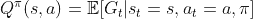

# 强化学习的简单概述

> 原文：<https://towardsdatascience.com/a-simple-outline-of-reinforcement-learning-4c20ddc497c9?source=collection_archive---------33----------------------->

## 让我们来一次人工智能和控制相遇的旅行

> “我们想要的是一台能够从经验中学习的机器。”艾伦·图灵，1947 年

你知道机器(或计算机)是如何在像国际象棋和围棋(DeepMind 的 AlphaGo、AlphaZero 和 MuZero)这样的复杂游戏中超越人类的表现，或者在没有人类干预的情况下驾驶汽车的吗？答案隐藏在它们的编程方式中。这种机器被编程为最大化某些目标，这些目标是由人类明确定义的。这种方法被称为强化学习，完全模仿人类和动物在世界中学习行为。

在这篇文章中，我的目的是解释什么是强化学习和基础知识，而不是太多的细节。

[梁杰森](https://unsplash.com/@ninjason?utm_source=medium&utm_medium=referral)在 [Unsplash](https://unsplash.com?utm_source=medium&utm_medium=referral) 上的照片

# 是什么让强化学习如此特别？

今天，机器学习由 3 个主要范例概括。除了有监督学习(SL)和无监督学习(UL)，强化学习(RL)形成了第三种也是最后一种。虽然它是机器学习的一个子领域，但它有控制理论和博弈论的缺点。

我们可以把智能代理想象成一种功能，当输入(或观察)时，期望它给出有用的输出(或动作)。学习只是越来越接近给出一个正确的(或有用的)输出。

在二语习得中，智能体被输入和相应的正确输出所反馈，以使它学会给看不见的输入合理的输出。

UL 只给智能体输入信息，并让智能体学会给出一些输出信息，从而优化一个预定义的目标，如紧密度或熵之类的度量。

当代理需要通过在动态环境中反复试验来学习行为时，RL 的问题就出现了。这就是人类和动物如何学习他们的行为，如说话和运动。

学习类型的图解，照片由 [IBM](https://developer.ibm.com/articles/cc-models-machine-learning/) 拍摄

不像上面所说的，学习方法不需要严格区分。如果从更大的角度来看，它们都是基于某些目标的优化。近年来，许多成功的人工智能应用是这三种范式的混合，如自监督学习、逆强化学习等。最近在 ML 上的成功隐藏在定义适当的目标，而不是选择 3 种学习类型中的一种。

但是，RL 仍然是唯一的，因为它处理的是动态环境，数据不是事先给定的。因此，与 SL 和 UL 不同，RL 代理应该:

*   收集数据本身，
*   探索环境(学习如何收集有用的数据)，
*   利用其知识(学习如何考虑未来状态，学习最佳策略)，
*   辨别后果的原因(过去的哪些行为导致了当前的情况)，
*   在探索过程中保持自身安全(对于机械应用)。

## 勘探开发困境

如上所述，代理应该*利用*它的知识来获得最优策略。然而，如果没有足够的环境知识，agent 可能会陷入局部最优解。因此，特工应该同时*探索*环境。这就出现了勘探-开发的困境，这是 RL 的重要组成部分。许多算法有各种技术来平衡它们。

代理人应该在哪里吃饭？，照片由[加州大学伯克利分校 CS188 AI 课程 ](http://ai.berkeley.edu/slides/Lecture%2011%20--%20Reinforcement%20Learning%20II/SP14%20CS188%20Lecture%2011%20--%20Reinforcement%20Learning%20II.pptx)

现在，让我们进入技术细节。

# 顺序决策

顺序决策或离散控制过程是在离散时间的每个时间步做出决策，考虑环境的动态性。

在时间 t，我们代理人在 sₜ，受到 rₜ奖励，得到 oₜ观察，并根据其政策 **π** 采取行动 aₜ。作为行动的结果，sₜ₊₁发生状态转变，新观察 oₜ₊₁以回报 rₜ₊₁.

期望观察值代表代理的状态。如果状态可以使用即时观察形成，观察直接用作状态(sₜ=oₜ),这被称为马尔可夫决策过程。如果不能，则称之为部分可观测马尔可夫决策过程，因为即时观测不能完全告知主体状态。然而，我们现在专注于 MDP。

## 马尔可夫决策过程(MDP)

MDP 由以下部分组成:

*   状态空间 S，作为所有可能状态的集合。
*   动作空间 A，作为所有可能动作的集合。
*   模型函数 T(s'|s，a)，作为状态转移概率。
*   奖励函数 R(s)，作为从状态、动作、下一个状态元组到奖励的奖励映射。
*   贴现因子γ ∈ [0，1]，一个实数，决定未来奖励对控制目标的重要性。

马尔可夫决策过程，作者图片

## RL 的建筑单元

*   策略函数π(a|s):取决于状态的行动的概率函数，指示在特定情况下如何行动。
*   回报 G:未来奖励在时间上的累积总和，按折现因子γ缩放。它被定义为:

返回值

*   价值函数 V(s|π):状态 s 下遵循策略π时的期望收益，定义为；

价值函数

*   动作值函数 Q(s，a|π):遵循策略π时的期望收益，除了状态 s 第一步的动作 a，定义为；

动作值函数，又名 Q 函数

## 贝尔曼方程

RL 的整体目标是最大化价值函数 V，以获得最优策略π*。为此，价值函数必须满足以下贝尔曼方程。贝尔曼方程告诉我们，最优策略必须以隐含的方式使所有可能状态的平均价值函数(未来的累积报酬)最大化。

贝尔曼方程

你可能想知道为什么我们需要 Q 函数。它与政策有着直接的关系。

Q 函数的策略推导

注意，两者都是相互依赖的。那么，为什么我们需要另一个定义呢？通过观察环境和行为的结果，代理可以学习当前策略的 Q 函数。然后，代理可以使用这个等式来改进它的策略。它允许代理在学习 Q 函数的同时，通过学习来改进策略。

## 无模型强化学习

无模型 RL 纯粹基于经验，没有模型和奖励函数。

照片由 [*UC Berkeley CS188 AI 课程*](http://ai.berkeley.edu/slides/Lecture%2010%20--%20Reinforcement%20Learning%20I/SP14%20CS188%20Lecture%2010%20--%20Reinforcement%20Learning%20I.pptx)

## 蒙特卡罗方法

蒙特卡罗方法使用统计抽样来逼近 Q 函数。为了使用这种方法，必须等到模拟结束，因为每个状态都使用将来的累积奖励总和。

一旦 sₜ被访问，并采取行动 aₜ，回报 Gₜ是计算从其定义使用即时和未来奖励等待结束的一集。蒙特卡罗方法旨在最小化所有可能样本的 Q(sₜ,aₜ和目标值 Gₜ之间的差距。

利用预定的学习速率α，Q 函数被更新为:

蒙特卡洛 Q 更新

## 时间差分法

目标返回的时间差分(TD)方法 bootstrap Q 函数估计。这允许代理从每个奖励更新 Q 函数。

主要的 TD 方法是 SARSA 和 Q 学习。

*   SARSA 最小化 Q(sₜ,aₜ和目标值 rₜ₊₁+γ Q(sₜ₊₁,aₜ₊₁之间的差距，目标值是收益的自举估计。因为还需要下一个动作，所以它被命名为 SARSA，表示状态、动作、奖励、状态、动作序列。学习率为α时，Q 更新为:

SARSA Q 更新

*   q 学习最小化差距 Q(sₜ,aₜ)和目标值 rₜ₊₁+γ最大 Q(sₜ₊₁)，这也是一个收益的自举估计。与 SARSA 不同，它不需要下一个动作，并假设在下一个状态采取最佳动作。学习率为α时，Q 更新为:

Q 学习 Q 更新

# 基于模型的强化学习

在基于模型的强化学习中，模型和奖励函数要么预先给定，要么通过 SL 方法学习。

基于模型的 RL 依赖于学习模型的质量。

照片由 [*UC Berkeley CS188 AI 课程*](http://ai.berkeley.edu/slides/Lecture%2010%20--%20Reinforcement%20Learning%20I/SP14%20CS188%20Lecture%2010%20--%20Reinforcement%20Learning%20I.pptx)

## 动态规划

动态编程不需要采样。它是在给定模型和报酬函数的情况下解析求解最优策略。

动态编程 Q 更新

## 基于模拟的搜索

有时，状态和动作空间太大。这使得动态编程不适用。在这种情况下，会生成随机模拟路径。其余的是通常的无模型 RL，可以使用蒙特卡罗或时间差分方法。这种方法唯一优点是代理从它想要的任何状态开始模拟。

蒙特卡洛法、时间差分法和动态规划法之间的比较如下所示。

三种主要方法的备份图，照片由[大卫·西尔弗的 RL 课程，第 4 讲](https://www.davidsilver.uk/wp-content/uploads/2020/03/MC-TD.pdf)拍摄

# 结论

在大多数应用中，RL 是通过称为深度强化学习的深度学习来结合的。最近 RL 的成功与神经网络有关。然而，由于样本学习效率低和安全限制，RL 难以适应真实世界的场景。RL 的未来取决于我们对人类学习方式的掌握。

总的来说，RL 不过是在动态环境中学习。有许多 RL 算法和方法，但我试图给出核心定义和算法，让初学者有一个关于它的想法，保持定义尽可能简单。我希望你喜欢！

作为临时演员，我把 OpenAI 的捉迷藏模拟留给 RL。