# 寻找商品碳强度的简单 Python 指南

> 原文：<https://towardsdatascience.com/a-simple-python-guide-to-find-carbon-intensity-of-commodities-6f973170f64e?source=collection_archive---------16----------------------->

## 使用 ResourceTradeEarth 和 ClimateTrace 数据计算碳强度

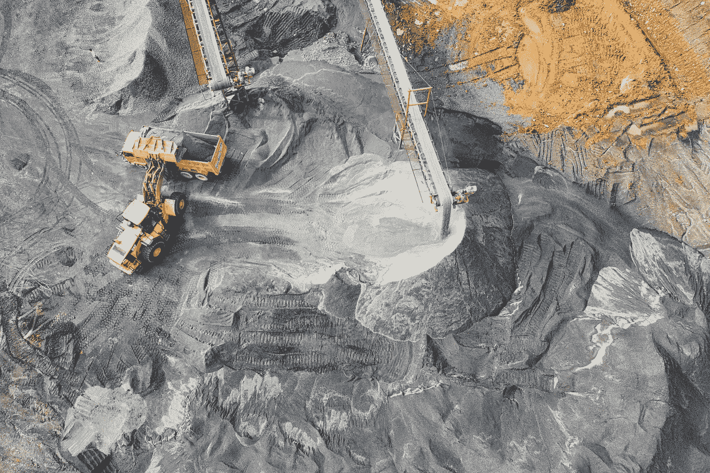

来自 [Pexels](https://www.pexels.com/photo/yellow-excavator-2101137/?utm_content=attributionCopyText&utm_medium=referral&utm_source=pexels) 的[汤姆·菲斯克](https://www.pexels.com/@tomfisk?utm_content=attributionCopyText&utm_medium=referral&utm_source=pexels)的照片

# 文件和数据

## ClimateTrace

1.  [数据](https://www.climatetrace.org/inventory?sector=all&time=2015-2020&country=all-countries)

## 资源贸易地球:

1.  [数据](https://resourcetrade.earth/?year=2019&units=weight&autozoom=1)
2.  [文档](https://resourcetrade.earth/about)

## 此会话中使用的 GitHub 数据集

1.  [数据](https://github.com/neldivad/emission-intensity)

# 外卖食品

建立一个排放估算模型是非常具有挑战性的，即使应用于高质量的数据集，由于必须做出大量的假设。由于缺乏准确性、清晰度和对数据的理解，这种分析很难用于决策目的。

目前的方法是从交易的重量/价值，而不是生产/消费，得出碳强度。因此，这将导致对碳强度的更高估计。

它将主要作为将来如何使用 Python 对类似数据集进行分析的指南。

# 介绍

排放数据一直很难估计。迄今为止，大多数排放清单都是基于自我报告的。报告的排放数据往往有很大的时滞，估算的方法也往往相互不一致。Climate TRACE 的任务是使用人工智能(AI)和机器学习(ML)技术为卫星/传感器数据提供每个部门的最新排放数据。

据推测，碳排放可以通过关于每种商品的生产水平和每个不同国家在生产商品时的局部碳强度的足够信息来准确确定。然而，这两种数据都很难获得。

我的方法是，通过将发现的排放量与交易的商品进行对比，找到与商品相关的平均碳强度，从而逆向计算方程式。

# 数据分析

## 助手函数和库

```
import warnings
import numpy as np 
import pandas as pd
import plotly as py
import seaborn as sns
import statistics as stat
from datetime import dateimport plotly.express as px
import plotly.graph_objs as go
warnings.filterwarnings("ignore")
pd.set_option('display.max_columns', None)import plotly.offline as pyo
pyo.init_notebook_mode()import matplotlib.lines as lines
import matplotlib.pyplot as plt%matplotlib inline
```

**显示/隐藏按钮**

```
import random
from IPython.display import HTMLdef hide_toggle(for_next=False):
    this_cell = """$('div.cell.code_cell.rendered.selected')""" ; next_cell = this_cell + '.next()';
    toggle_text = 'Code show/hide'  # text shown on toggle link
    target_cell = this_cell ;  js_hide_current = ''if for_next:
        target_cell = next_cell; toggle_text += ' next cell';
        js_hide_current = this_cell + '.find("div.input").hide();'
    js_f_name = 'code_toggle_{}'.format(str(random.randint(1,2**64)))html = """<script>
            function {f_name}() {{{cell_selector}.find('div.input').toggle(); }}
            {js_hide_current}
        </script>
        <a href="javascript:{f_name}()">{toggle_text}</a>
    """.format(f_name=js_f_name,cell_selector=target_cell,js_hide_current=js_hide_current, toggle_text=toggle_text )
    return HTML(html)hide_toggle()
```

# ClimateTrace 的排放数据

```
file = 'climatetrace_emissions_by_subsector_timeseries_interval_year_since_2015_to_2020.csv'df = pd.read_csv(PATH + file)df[‘year’] = pd.DatetimeIndex(df[‘start’]).year
df[‘month’] = pd.DatetimeIndex(df[‘start’]).monthco2 = pd.DataFrame( df.groupby(['sector', 'subsector', 'year'])['Tonnes Co2e'].sum() ) \
.reset_index() 
    # wow magic linepd.set_option('display.max_rows', 250)
co2
```

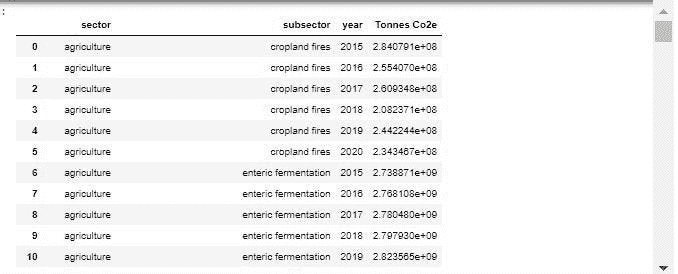

作者图片

```
def make_bar_plot(data, xdata, ydata, cdata, title, legend=True, width=900, height=600):
    import plotly.express as pxfig = px.bar(data, 
                 x= xdata, 
                 y= ydata, 
                 color= cdata, 
                 )fig.update_layout(
        title= title,
        xaxis_tickfont_size=14,
        yaxis=dict(
            title='',
            titlefont_size=16,
            tickfont_size=14,
        ),
        legend=dict(
            x=0.995,
            y=0.98,
            bgcolor='rgba(255, 255, 255, 0)',
            bordercolor='rgba(255, 255, 255, 0)',
        ),
        showlegend= legend,
        height= height,
        width= width,
        barmode='group', #'stack',
        bargap=0.25, 
        bargroupgap=0.1 
    )fig.show()

hide_toggle()
```

## 按国家

```
make_bar_plot(df[ df['country'].isin(['USA']) &  df['year'].isin([2015, 2016, 2017, 2018, 2019]) ], 
              xdata='year', 
              ydata='Tonnes Co2e', 
              cdata='sector', 
              title='Co2 Emissions by USA')
```

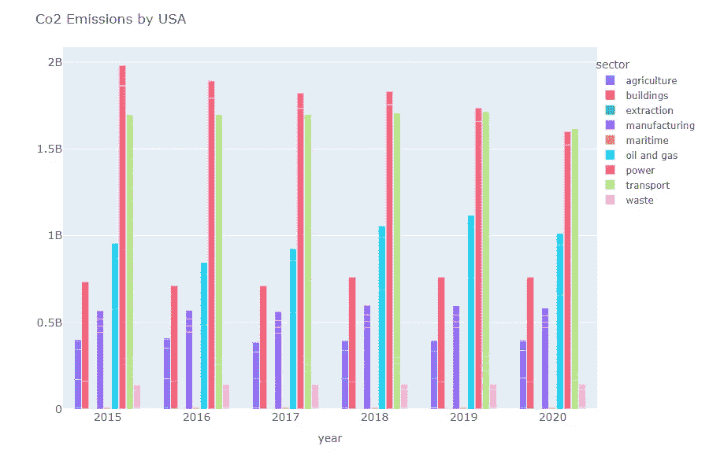

作者图片

图表中的数字应该与 Climate TRACE live 网站上的数字完全一样。我们可以尝试更进一步，深入到每个部门和子部门。

## 按部门和分部门

```
make_bar_plot(co2[ co2['year'].isin([2015, 2016, 2017, 2018, 2019]) ], 
              xdata='year', 
              ydata='Tonnes Co2e', 
              cdata='sector', 
              title='Co2 Emissions by Sector')
```

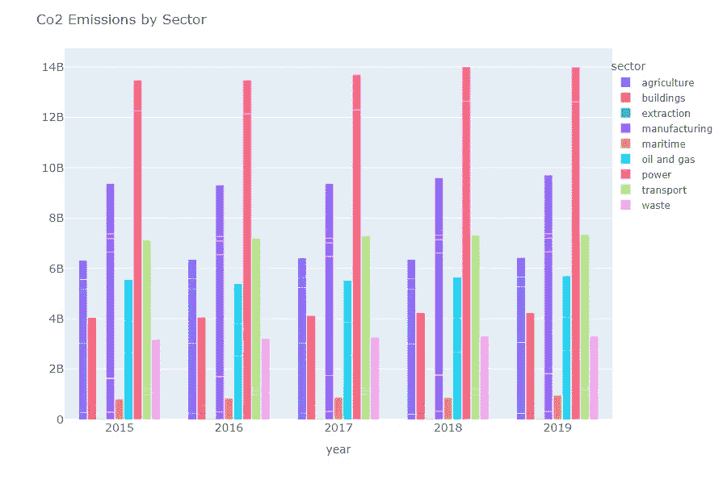

作者图片

```
make_bar_plot(co2[ co2['sector'].isin(['agriculture']) &  co2['year'].isin([2015, 2016, 2017, 2018, 2019]) ], 
              xdata='year', 
              ydata='Tonnes Co2e', 
              cdata='subsector', 
              title='Co2 Emissions by Subsector (Agriculture)')
```

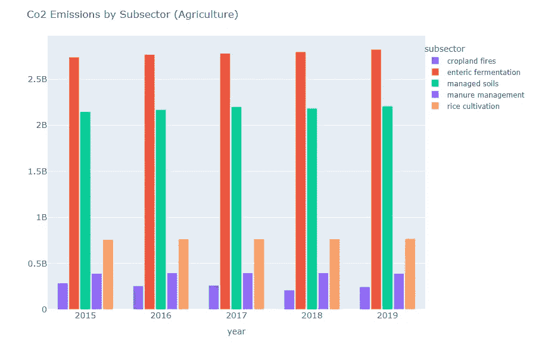

作者图片

# 资源贸易地球的商品贸易数据

ResourceTradeEarth 按年份提供商品交易价值和重量的数据。该网站是由查塔姆研究所开发的，他们的数据是从国际商品贸易统计(IMTS)中获得的精确版本。

随后，IMTS 数据由国家海关当局收集，并由联合国统计司编入联合国商品贸易统计数据库。

现在我们已经有了来自 Climate TRACE 的排放数据，我们的目标是通过将商品部门从 Climate race 结果产生的排放量除以从 ResourceTradeEarth 获得的交易价值/重量结果来估计每种商品的排放强度。

```
export = pd.read_csv(PATH + SUBPATH + 'rte-exporters-2019.csv', 
                     encoding= 'ISO 8859-1')
importe= pd.read_csv(PATH + SUBPATH + 'rte-importers-2019.csv', 
                     encoding= 'ISO 8859-1')commodities = pd.read_csv(PATH + SUBPATH + 'rte-commodities-2019.csv', 
                          encoding= 'ISO 8859-1')commodities.drop(['Exporter M.49', 'Exporter ISO3', 'Exporter region', 
                  'Importer M.49', 'Importer ISO3', 'Importer region'], axis=1, inplace=True)trend = commodities.sort_values(by=['Resource', 'Year'], ascending=True)# Create differenced column
trend['dvalue_share'] = trend.groupby('Resource')['value share'].diff()
trend['dweight_share'] = trend.groupby('Resource')['weight share'].diff()
```

## 按重量绘图

```
make_bar_plot(commodities, 'Year', 'Weight (1000kg)', 'Resource', 'Weight (1000kg) Traded by Commodities')
```

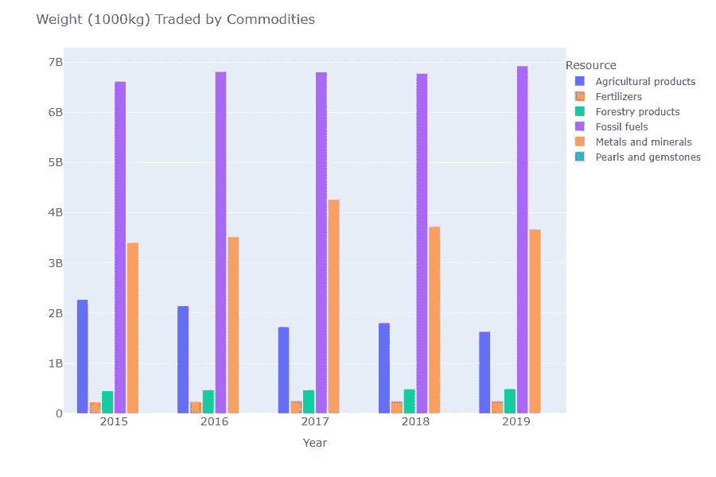

作者图片

## 按价值/重量份额绘图

使用以下等式估算以下变量:

> 价值份额 _2015 =资源价值 _2015 /价值总和 _2015
> 
> 权重份额 _2015 =资源权重 _2015 /权重总和 _2015

这个想法是不同的商品在生产和交易过程中有不同的碳强度。我们想知道我们的商品贸易中有多大比例是高碳密度的。

```
make_bar_plot(commodities, 'Year', 'value share', 'Resource', 'Value Share By Traded Commodities')
```

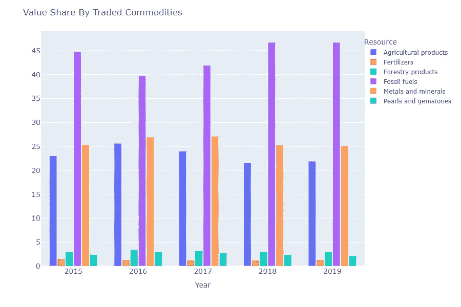

作者图片

```
make_bar_plot(commodities, 'Year', 'weight share', 'Resource', 'Weight Share By Traded Commodities')
```

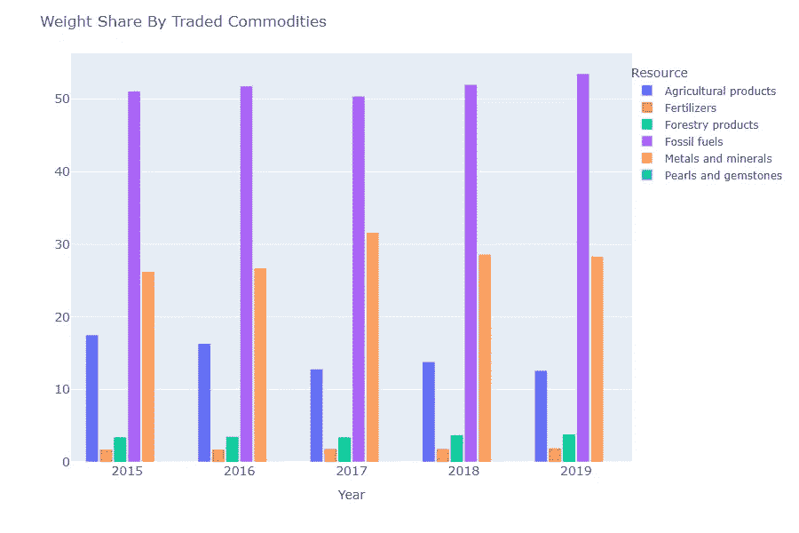

作者图片

## 按商品和年份分列的价值/重量份额的变化

如果企业的目标是利润最大化，同时排放最少，一些人可能会对按交易价值计算的碳强度感兴趣。然而，这很容易被大宗商品价格扭曲。

如果一种商品的交易价值份额下降，而交易重量份额保持不变或上升，这意味着价格对该商品越来越不利。

```
trend
```

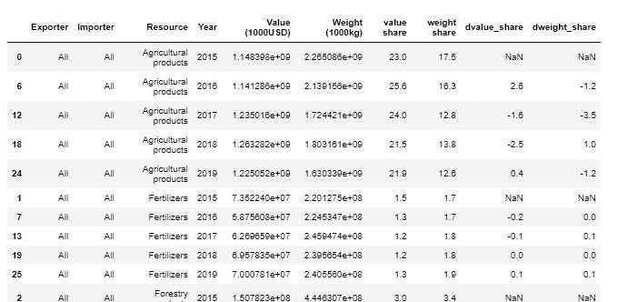

作者图片

```
def make_line_plot(data, xdata, ydata, cdata, title, legend=True, width=900, height=600):
    import plotly.express as pxfig = px.line(data, 
                  x= xdata,
                  y= ydata, 
                  color= cdata, 
                  symbol= cdata,
                 )fig.update_layout(
        title= title,
        xaxis_tickfont_size=14,
        yaxis=dict(
            title='',
            titlefont_size=16,
            tickfont_size=14,
        ),
        legend=dict(
            x=1.02,
            y=0.98,
            bgcolor='rgba(255, 255, 255, 0)',
            bordercolor='rgba(255, 255, 255, 0)',
        ),
        showlegend= legend,
        height= height,
        width= width,
    )fig.show()hide_toggle()
```

## **价值份额变化**

```
make_line_plot(trend, 
               'Year', 
               'dvalue_share', 
               'Resource', 
               'Value Share Change By Traded Commodities')
```

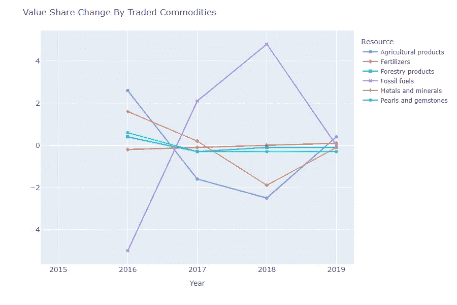

作者图片

```
make_line_plot(trend[ ~trend['Resource'].isin(['Pearls and gemstones']) ], 
              'Year', 
              'dweight_share', 
              'Resource', 
              'Weight Share Change By Traded Commodities')
```

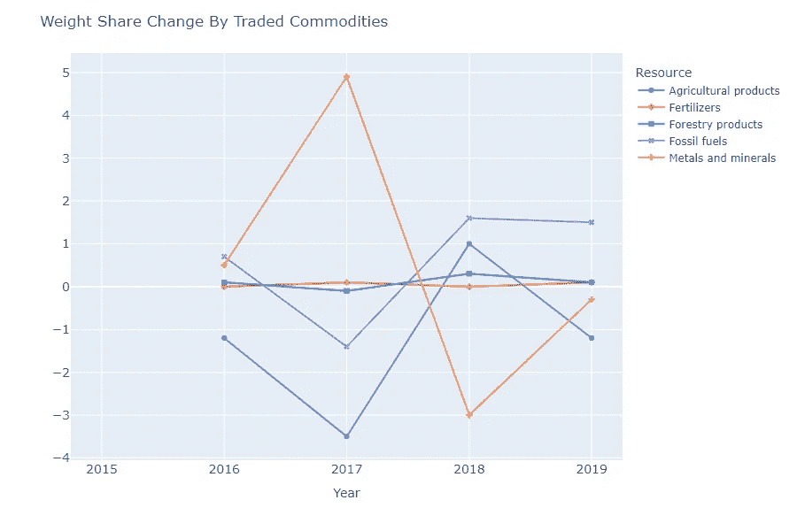

作者图片

# 估算商品的碳强度

```
co2 = pd.DataFrame( df.groupby(['sector', 'year'])['Tonnes Co2e'].sum() ) \
.reset_index() # wow magic line# Agriculture
agri = trend[ trend['Resource'].isin(['Agricultural products']) ]
agri2 = co2[ co2['sector'].isin(['agriculture']) & ~co2['year'].isin([2020]) ]
```

有了排放和交易数据的信息，我们可以将它们结合到一个数据框架中。这里，我们假设:

1.  `Agricultural products`RTE 的商品与`agriculture`部门的气候微量排放相关。
2.  `Fossil fuels`商品与`oil and gas`排放有关。
3.  `Metals and minerals`商品与`extraction`排放有关。

```
agriculture = pd.concat([agri.reset_index(drop=True), 
                         agri2['Tonnes Co2e'].reset_index(drop=True)],
                        axis= 1) 
agriculture['co2 vintensity'] = agriculture['Tonnes Co2e'] / agriculture['Value (1000USD)']
agriculture['co2 wintensity'] = agriculture['Tonnes Co2e'] / agriculture['Weight (1000kg)']# Oil and gas
oil = trend[ trend['Resource'].isin(['Fossil fuels']) ]
oil2 = co2[ co2['sector'].isin(['oil and gas']) & ~co2['year'].isin([2020]) ]fossilfuel = pd.concat([oil.reset_index(drop=True), 
                         oil2['Tonnes Co2e'].reset_index(drop=True)],
                        axis= 1)

fossilfuel['co2 vintensity'] = fossilfuel['Tonnes Co2e'] / fossilfuel['Value (1000USD)']
fossilfuel['co2 wintensity'] = fossilfuel['Tonnes Co2e'] / fossilfuel['Weight (1000kg)']# Metals and Minerals
metal = trend[ trend['Resource'].isin(['Metals and minerals']) ]
metal2 = co2[ co2['sector'].isin(['extraction']) & ~co2['year'].isin([2020]) ]extraction = pd.concat([metal.reset_index(drop=True), 
                        metal2['Tonnes Co2e'].reset_index(drop=True)],
                        axis= 1)extraction['co2 vintensity'] = extraction['Tonnes Co2e'] / extraction['Value (1000USD)']
extraction['co2 wintensity'] = extraction['Tonnes Co2e'] / extraction['Weight (1000kg)']# All commodities
allcomm = pd.concat([agriculture, fossilfuel, extraction], axis=0)
allcomm
```

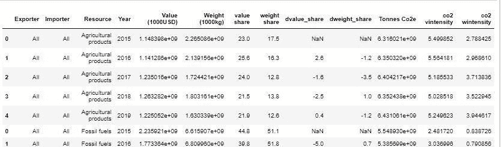

作者图片

```
make_line_plot(allcomm,
              'Year', 
              'co2 wintensity', 
              'Resource', 
              'Carbon Intensity by Weight, by Commodities')
```

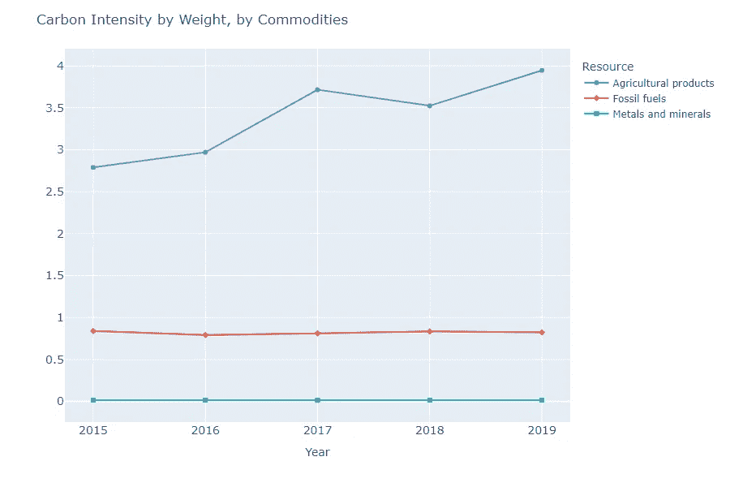

作者图片

```
make_line_plot(allcomm,
              'Year', 
              'co2 vintensity', 
              'Resource', 
              'Carbon Intensity by Value, by Commodities')
```

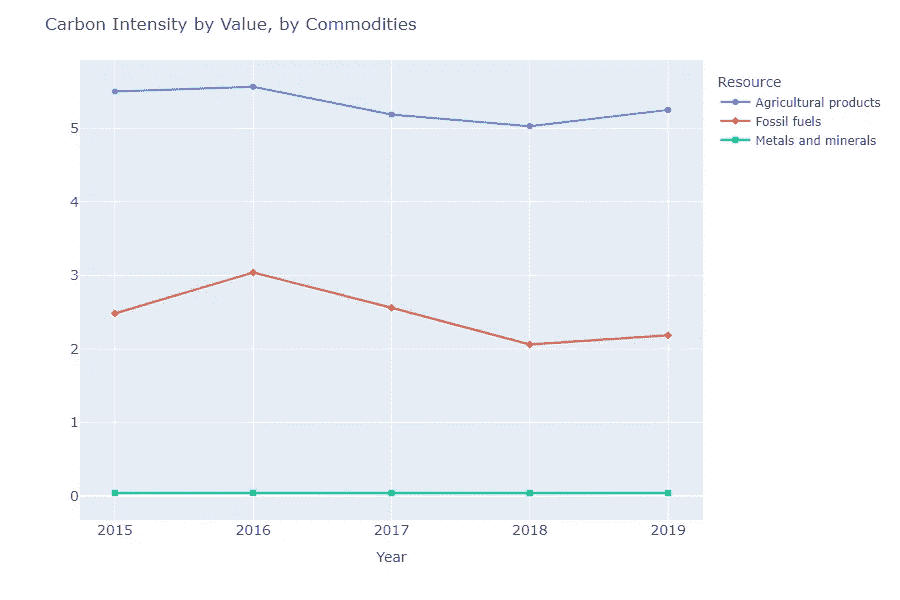

作者图片

结果不令人满意。以下是一些问题:

1.  金属和矿物的碳强度数据非常低，你实际上从图表中看不出来。原因是来自**气候跟踪的开采部门的 CO2 排放数据没有更新，特别是来自煤炭开采部门的数据。**
2.  化石燃料和金属的碳密度数据非常低。尚不清楚我们是否还应包括同样受到这些商品影响的其他部门的排放量。(例如:化石燃料的电力和运输，金属的制造)。
3.  由于碳强度来源于交易的重量/价值，因此**没有考虑国内消费的商品**，导致对碳强度的估计要高得多。在我们的图表中，农产品碳强度的上升趋势可能意味着国内对农产品的消费将会增加。
4.  同一种商品的碳强度在很大程度上取决于生产地。由于垂直农业技术，与欧洲生产的农产品相比，非洲农业单位产量的碳密度可能更高。

虽然我们最终没有做出任何有意义的结论，但我希望这能激励其他人采取更好的方法来处理这个问题。

如果您有任何错误或建议希望引起我的注意，请随时留下任何评论。

# 参考:

[1]查塔姆研究所(2021)，' *resourcetrade.earth* '，[https://resourcetrade.earth/](https://resourcetrade.earth/)

[2]气候追踪(2021 年)，[https://www.climatetrace.org/](https://www.climatetrace.org/)