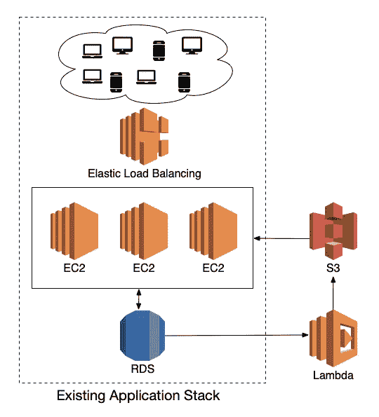

# 带有 AWS Lambda + Surprise 的简单无服务器协作过滤器

> 原文：<https://towardsdatascience.com/a-simple-serverless-collaborative-filter-with-aws-lambda-surprise-309413fdf410?source=collection_archive---------20----------------------->

## 我们将回顾一个使用 Python 的 Surprise 库的内容推荐协作过滤器的简单部署。


图片由朱莉安娜·贝尔纳尔提供

# 介绍

在电子商务、社交媒体和其他应用中，需要将全部内容的子集与特定用户匹配，以最大化转化率、应用内时间或其他所需指标，这是一个常见要求。

确定向给定用户推荐什么内容的一种可能的方法是推荐被表现出类似内容评级倾向的对等体良好评级的项目。这种方法被称为[协同过滤](https://en.wikipedia.org/wiki/Collaborative_filtering)。有几种不同的方法来计算不同项目(视频、产品或其他要推荐的内容)的用户评级之间的相似性。然而，对于这个部署，我们将使用 [Python 的 SciKit Surprise](https://github.com/NicolasHug/Surprise) ，它带有内置算法。

协同过滤通常分 3 步进行:

1.  数据的收集和预处理。
2.  模型的训练。
3.  生成预测。

在接下来的部分中，我们将讨论如何实现这些步骤。

# 架构和设置



现有的应用程序堆栈，增加了用于存储结果的 Lambda 和 S3。

## 先决条件

在我们深入 Lambda 的代码之前，我们需要设置 Lambda 的运行环境。关于要添加推荐算法的应用程序的设置的一些假设:

1.  该应用程序运行在一个[虚拟专用集群(VPC)](https://aws.amazon.com/vpc/) 中。
2.  训练模型所需的数据存储在可从 VPC 内部访问的 SQL 数据库中。
3.  应用服务器可以访问(或者可以被允许访问)S3。

鉴于上述假设，我们可以设置我们的 Lambda，以便它从 SQL 数据库中读取数据，并将结果输出到 S3。这确保它从应用服务器异步运行，如果训练和预测是缓慢的过程，这可能是所期望的。

## λ配置

我们将使用 [SAM](https://aws.amazon.com/serverless/sam/) 来部署 Lambda 及其依赖资源。关于山姆的更深入的介绍，请看下面的文章。

<https://medium.com/better-programming/private-serverless-rest-api-with-lambda-using-sam-2eb31864b243>  

先说文件夹结构。我们将有一个应用程序源文件目录，一个用于部署应用程序的脚本目录，以及 SAM 使用的顶层文件，如`template.yaml`。

```
my-collaborative-filter/
├── cmd/
│   └── deploy.sh
├── src/
│   └── app.py
├── .gitignore 
├── test-event.json
└── template.yaml
```

`template.yaml`将如下图所示。

它定义了 3 种资源:

1.  `RecommendationFunction`是将执行协同过滤的实际 Lambda。
2.  如果您的数据库限制访问，可能需要一个`RecommendationFunctionSecurityGroup`。可以将数据库安全组配置为允许来自该特定安全组的访问。
3.  `OutputBucket`将是我们输出结果的 S3 桶。

注意`RecommendationFunction`中的`Layers`规格。由于 [Surprise](https://github.com/NicolasHug/Surprise) 和[psycopg 2](https://pypi.org/project/psycopg2/)(PostgreSQL adapter)不是 Lambda 操作系统包含的 Python 库之一，我们需要在能够将其导入 Lambda 之前添加它。

在下面的文章中，我们将讨论创建这样一个层的可能过程。

<https://medium.com/better-programming/creating-a-python-opencv-layer-for-aws-lambda-f2d5266d3e5d>  

如果您更喜欢在不使用 Docker 的情况下构建该层，您可以使用 EC2 实例在 Python 虚拟环境中安装 Suprise，并将文件复制到该层。在 EC2 实例上安装库的命令如下所示:

```
python3 -m venv lambda_layer_packages
source lambda_layer_packages/bin/activate
pip install psycopg2 numpy scikit-surprise
```

# λ代码

将放入`app.py`文件中的完整 Lambda 代码如下所示，带有内嵌注释。

# 部署

要部署 Lambda，只需运行下面的部署脚本:

```
sam deploy \
  --template-file template.yaml \
  --stack-name recommender-stack \
  --parameter-overrides RdsPassword=YOUR_PASSWORD \
  --guided
```

# 限制

由于该实现被设计为简单的，所以讨论它的一些限制以及如何改进它是很重要的:

## 最大λ时间限制

截至撰写本文时，Lambda 的最大执行时间为 15 分钟。在包含 5000 个项目和 5000 个用户的数据集上运行接近超时限制。

大部分时间花在预测步骤，因为代码需要为每个用户执行。一旦到达的用户数量足够大，使得 Lambda 超时，我们可以让上面描述的主 Lambda 只执行步骤 1 和 2，并将输出模型(通过[pickle](https://docs.python.org/3/library/pickle.html))保存到 S3 桶中。然后它会为每个用户排队(使用 [SQS](https://aws.amazon.com/sqs/) )一个作业，这样另一个 Lambdas 系列可以运行并做出预测。

## 最大磁盘空间

Lambda 被限制在 [512MB](https://docs.aws.amazon.com/lambda/latest/dg/gettingstarted-limits.html) 的`/tmp`目录上的最大临时磁盘空间。如果作为 CSV 的数据集超过(或接近)这个数量，您可能需要为 Lambda 附加一个额外的卷，或者更改代码，以便数据集完全存储在内存中。

## 新用户预测

上述设置只会对至少有 1 个评分的用户进行预测。根据您的设置，有些用户可能没有评级。

如果需要为这些用户推荐，可以推荐全球最好的商品。这可以完全作为一个单独的服务来完成，或者(取决于为协作过滤选择的算法)您可以对不存在的`user_id`进行预测(例如用户 0 ),并且每当没有对您当前正在寻找的用户的预测时，默认使用该服务。

下面的代码将这个功能添加到现有的 Lambda 中。

## 非实时

这种方法以一个固定的速率重新训练模型，这个速率至多需要 Lambda 运行的频率。因此，它不适用于必须能够向用户提供自适应推荐的系统。

# 结论

我们已经回顾了在 AWS 的 Lambda 上使用 Python 的 Suprise 库部署一个简单的推荐算法。该方法可用于测试算法的性能，而无需投入资源来实现全面的解决方案。

*如果你有任何问题或只是想聊聊创业、创业、承包或工程，请给我发电子邮件:Paulo @*<https://avantsoft.com.br/>**。**