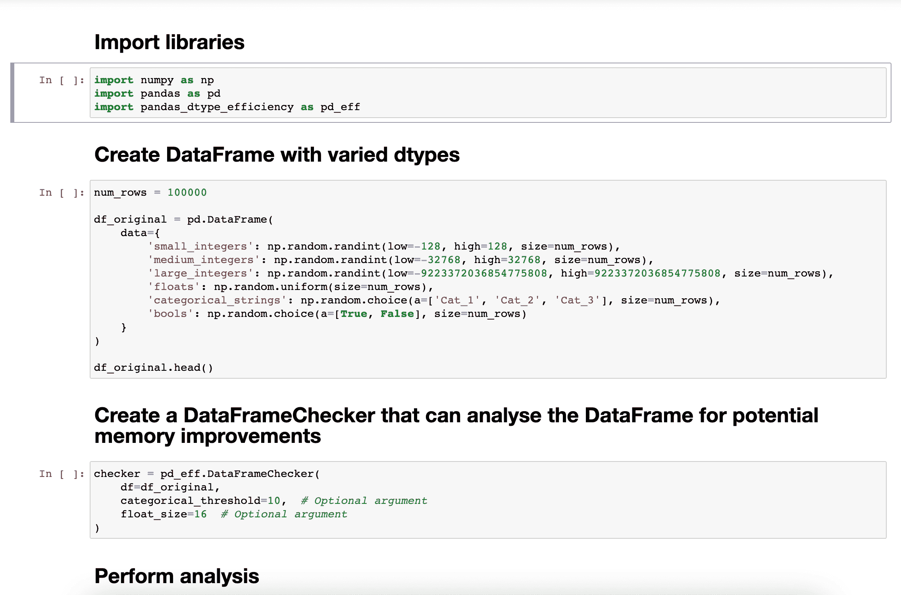

# 避免内存不足的简单技巧

> 原文：<https://towardsdatascience.com/a-simple-trick-to-avoid-running-out-of-memory-d45b0a014ceb?source=collection_archive---------28----------------------->

## 在不丢失数据的情况下减少熊猫内存使用的艺术

当您处理大型数据集时，会面临内存不足的风险。

内存不足的错误尤其令人沮丧，因为在你耐心地等待程序加载完你所有的数据后，你的程序突然崩溃了。


内存不足错误可能需要等待很长时间，然后才发现你的程序已经崩溃了。[西格蒙德](https://unsplash.com/@sigmund?utm_source=medium&utm_medium=referral)在 [Unsplash](https://unsplash.com?utm_source=medium&utm_medium=referral) 上拍照。

幸运的是，在使用 Python 和 Pandas 时，有大量的最佳实践来克服这个障碍，尤其是在 Itamar Turner-Trauring 的这篇优秀的[参考文献](https://pythonspeed.com/memory/)中。

本文重点介绍一种简单而有效的技术，即改变 pandas 数据帧的数据类型，使其更有效地存储。

# 去哪里找

我们将很快讨论如何在 Python 中实现这一点，但是首先，让我们考虑一下幕后发生了什么。

最常见的情况是，三种主要的数据类型可以更有效地表示，因为 Pandas 过于谨慎，分配的内存类型常常容纳比实际需要更多的数据。

## 漂浮物

您的计算机可以表示特定精度级别的浮点数，这可能远远超出您的需要。如果内存是一个问题，问问你自己你的算法是否需要看到 52 位小数的数字。

NumPy 有各种各样的浮点数据类型,您可以在数据帧中指定自己喜欢的精度级别。


你要求的最低精确度是多少？照片由[沃尔坎·奥尔梅斯](https://unsplash.com/@volkanolmez?utm_source=medium&utm_medium=referral)在 [Unsplash](https://unsplash.com?utm_source=medium&utm_medium=referral) 上拍摄。

## 整数

假设你有人们鞋码的数据。在英国，它们通常介于 2 和 15 之间，所以即使考虑到偶尔的篮球运动员，拥有一个可以存储高达 9223372036854775807 的值的 NumPy 数据类型也是浪费内存。


如果您正在测量鞋号，您真的需要一个可以达到 9223372036854775807 的数据类型吗？Julian Hochgesang 在 [Unsplash](https://unsplash.com?utm_source=medium&utm_medium=referral) 上拍摄的照片。

如果您对数据所属的典型范围有很好的感觉，那么您可以选择一种只适应它需要的数据类型。另外，如果你不确定这些数字的范围，你可以使用有用的功能 [iinfo](https://numpy.org/doc/stable/reference/generated/numpy.iinfo.html) 。

## 用线串

有时你有字符串(或熊猫称之为对象)，它们只来自一个独特的可能的值集合。例如，您的数据可能会根据一个固定的列表['蓝色'，'棕色'，'绿色'，'其他']记录一个人的眼睛颜色。事实上，眼睛的颜色可能更微妙，但让我们用这个例子来说明。

将这些表示为字符串是很好的，但是当它们只能是四个值中的一个时，它需要占用内存来一次又一次地存储所有的字符。


简单来说，一个人眼睛的颜色大多属于一个固定的可能颜色列表。Alex Iby 在 [Unsplash](https://unsplash.com?utm_source=medium&utm_medium=referral) 上拍摄的照片。

幸运的是，Pandas 有一个[分类](https://pandas.pydata.org/docs/reference/api/pandas.CategoricalDtype.html#pandas.CategoricalDtype)数据类型，它将每个可能的值映射到一个整数，这样它就不需要每次存储字符串本身来浪费内存，例如{'blue': 0，' brown': 1，' green': 2，' other': 3}。

# 付诸实践

为了执行这些检查，我编写了一个名为[**pandas _ dtype _ efficiency**](https://github.com/osulki01/pandas_dtype_efficiency)的库，可以通过 pip 安装:

```
pip install pandas_dtype_efficiency
```

功能很简单:

1.  取一个现有的数据帧
2.  检查潜在的内存改进
3.  将改进应用于现有的数据帧，或者将建议的数据类型存储为字典，以便在加载数据帧时使用。

这里是它的一个短暂停留之旅，但是你可以随意查看这个例子的更多细节[这里](https://github.com/osulki01/pandas_dtype_efficiency#example-usage)。



熊猫 _ dtype _ 效率在行动。作者 GIF。

下次您处理一些大数据时，试试这个库；根据您的数据帧，它可以将它们减少到原始内存使用量的 10%左右。

# 当你在这里的时候

请随意查看我的其他文章:

*   [如何管理初级数据科学家](/how-to-manage-a-junior-data-scientist-2a5b023eda37)
*   [如何找到正确的集群数量](/how-to-find-the-right-number-of-clusters-acc1130ed231)
*   [计算损失函数](/making-your-loss-function-count-8659cf65feb1)
*   [排列测试的威力](/the-power-of-permutation-testing-c2ac66f2d166)