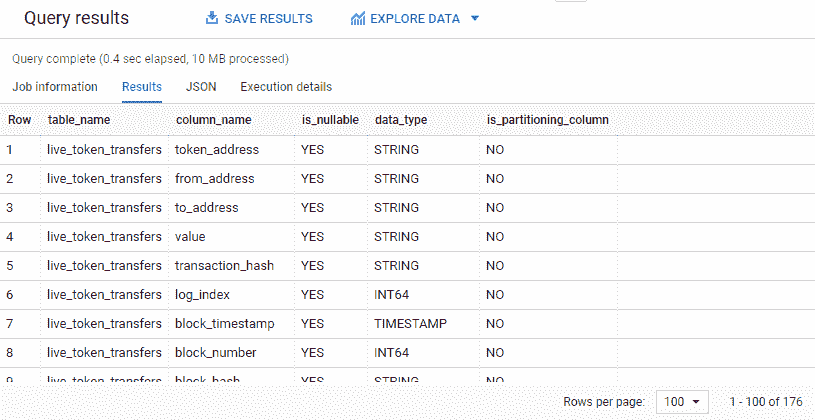

# 一种在 Google BigQuery 中查询表元数据的简单方法

> 原文：<https://towardsdatascience.com/a-simple-way-to-query-table-metadata-in-google-bigquery-92dc7f1edec1?source=collection_archive---------5----------------------->

## 轻松确定 BigQuery 数据集中的内容，以及哪些表对使用 INFORMATION_SCHEMA 和表进行分析有用


作者照片(使用 Canva.com 创建)

元数据！我打赌你以前可能听说过这个术语，并且可能问过自己它是什么，为什么它很重要。让我们用 Google BigQuery 探索一下这个概念。

在这篇文章中，你会发现:

*   什么是元数据？
*   为什么要在 Google BigQuery 中查询表元数据？
*   如何用 INFORMATION_SCHEMA 和表查询表元数据？

# 什么是元数据？

许多来源将元数据定义为“关于数据的数据”。但我个人觉得太模糊，难以理解。所以我尝试用通俗的语言来定义元数据。


作者照片(使用 Canva.com 创建)

# 为什么要在 Google BigQuery 中查询表元数据？

想象一下在 BigQuery 中给我们一个包含很多表的庞大数据集，我们应该查询哪个？我们如何识别哪些表是最新的？每个表是什么时候创建的？每个表中有哪些列？信不信由你，所有这些问题都可以用元数据来回答。

当涉及到查询表元数据时，有许多潜在的解决方案，从 Google Cloud Console 中的简单视图到更复杂的客户端库。但是这里有 3 个最简单和最不需要技术的解决方案。

第一个解决方案是查看**数据目录，这是一个元数据集合，旨在帮助我们搜索所有可用的表，评估它们的质量和有用性，然后访问我们认为适合我们分析的任何表**。这可能是确定我们应该查询哪些特定表的最简单的方法。但是，如果我们手边没有现成的数据目录，那该怎么办呢？怎么样，棕色的母牛？


作者照片

如上所示，第二个选项在 Google Cloud Console 中很容易找到。是的，我说的是与 BigQuery 下每个表相关的**“细节”和“模式”选项卡。然而，如果我们必须一个接一个地点击几十个(甚至几百个)表，这种解决方案将会引发严重的问题。一定有更好的方法，对吗？**

第三个解决方案是在这里扭转乾坤。你猜怎么着？我们可以使用 INFORMATION_SCHEMA 或 TABLES 元表轻松获得跨多个数据集的所有表元数据，所有这些都可以通过熟悉的 BigQuery 接口进行简单的 SQL 查询。这就是我们将在下一节讨论的内容。大伙儿，击鼓吧！让我们开始吧。

# 如何查询表元数据

## 关于所有表的概述

有两个选项可以获得数据集中所有表的概览。下面列出了这两个选项。

***选项 1。信息 _ 模式视图***

> INFORMATION_SCHEMA 是一系列视图，提供对有关数据集、例程、表、视图、作业、预订和流数据的元数据的访问。
> 
> ——来自[谷歌云](https://cloud.google.com/bigquery/docs/dataset-metadata#console_1)

在编写第一个查询之前，记住以下两点是至关重要的。

1.  针对 INFORMATION_SCHEMA 视图的查询**不会被缓存**，而**会产生数据处理费用(10MB)或消耗 BigQuery 槽** ，这取决于与您的项目相关的定价。
2.  INFORMATIONS_SCHEMA 查询**必须用标准 SQL 语法**编写。

**列出所有表格**

让我们开始探索 BigQuery 公共数据中的以太坊区块链数据集。我们将从 2 个简单的问题开始: ***数据集中有多少个表？那些桌子是什么？***

我们可以通过运行一个简单的查询来轻松获得答案。

```
# List all tables and their creation time from a single dataset#standardSQL 
SELECT * 
FROM `bigquery-public-data.ethereum_blockchain`.INFORMATION_SCHEMA.TABLES;
```


作者照片

查看查询结果，首先，这个数据集下有 14 个表。每个表格对应一行，以及以下各列。根据 GCP 文档，下面是每个列的含义的快速概述。

1.  包含数据集的项目的项目 ID
2.  包含表和/或视图的数据集的名称
3.  属于指定数据集的所有表的名称
4.  指示表是普通的 BigQuery 表(也称为基表)、视图、实体化视图还是引用外部数据源。
5.  指示表是否支持 SQL INSERT 语句
6.  该值始终为否
7.  创建表的日期时间

**使用 WHERE 子句列出数据集中选定的表**

这次我们只对 ***获取包含令牌信息*** 的以太坊区块链数据集中 BigQuery 表的表名和创建时间感兴趣。好吧，让我们添加一个相关的 WHERE 子句来过滤我们想要的结果。Tada！下面是查询和结果。

```
# List metadata from selected tables with WHERE clause 
#standardSQL 
SELECT table_name, creation_time 
FROM `bigquery-public-data.ethereum_blockchain`.INFORMATION_SCHEMA.TABLES 
WHERE table_type = "BASE TABLE" 
AND table_name LIKE "%token%";
```


作者照片

***选项二。表元表***

到目前为止还不错，但是很明显，仅仅 INFORMATION_SCHEMA 视图不足以帮助我们 ***根据大小识别最大的表或者根据“最后修改时间”*** 识别最新的表。别急，伙计们！因为在每个数据集中，都有一个隐藏的表，其中包含关于每个表的更多元数据。幸运的是，可以在<project name . dataset . name>访问这个隐藏的表。__ 表格 _ _

***重要提示:您需要在“表格”的每一侧键入 2 条下划线。***

让我向您介绍一个非常有用的查询，它利用这个**表元表来获取我们数据集中所有表的大小、行数和上次修改时间。**对我来说，从谷歌云培训的 Coursera 课程[中学习这个查询绝对是一种福气。我们走吧，各位！](https://www.coursera.org/learn/data-lakes-data-warehouses-gcp)

```
#standardSQL 
SELECT dataset_id, table_id, # Convert size in bytes to GB 
ROUND(size_bytes/POW(10,9),2) AS size_gb, # Convert creation_time and last_modified_time from UNIX EPOCH format to a timestamp 
TIMESTAMP_MILLIS(creation_time) AS creation_time, TIMESTAMP_MILLIS(last_modified_time) AS last_modified_time,
row_count, # Convert table type from numerical value to description 
CASE 
WHEN type = 1 THEN 'table' 
WHEN type = 2 THEN 'view' 
ELSE NULL 
END AS type 
FROM `bigquery-public-data.ethereum_blockchain`.__TABLES__ 
ORDER BY size_gb DESC;
```


作者照片

但是，如果您想列出多个数据集中的所有表及其详细信息，该怎么办呢？您可以使用 UNION ALL 遍历每个数据集，类似于这个 [GCP GitHub](https://github.com/GoogleCloudPlatform/training-data-analyst/blob/master/courses/data-engineering/demos/information_schema.md) 中列出的查询。

## 放大列

让我们仔细看看以太坊区块链数据集中的所有数据列。我们将发现 ***每个表中有多少列，并识别分区列或聚集列*** 。

**列出所有列**

这个查询再简单不过了。

```
# List all columns related to all tables within a dataset 
SELECT table_name, column_name, is_nullable, data_type, is_partitioning_column 
FROM `bigquery-public-data.ethereum_blockchain`.INFORMATION_SCHEMA.COLUMNS;
```



作者照片

这里，我在 SELECT 子句中指定了 5 个属性，因为我只对获得列名、数据类型、为空性以及该列是否用于分区感兴趣。请随意让 SELECT *尝试查看包含数据列元数据的所有其他属性。

**仅过滤用于分区的时间戳列**

如果我们需要识别当前用于分区的所有时间戳列，该怎么办？让我们扭曲上面的查询来得到我们想要的。

```
#standardSQL 
SELECT table_name, column_name, is_nullable, data_type, is_partitioning_column 
FROM `bigquery-public-data.ethereum_blockchain`.INFORMATION_SCHEMA.COLUMNS 
WHERE data_type = "TIMESTAMP" 
AND is_partitioning_column = "YES";
```


作者照片

# 离别的思绪

我们处理大数据越多，我们决定哪些表值得我们研究，哪些表可以忽略的时间就越短。虽然本文仅仅触及了在探索 BigQuery 数据集的元数据时可以用表、元表和 INFORMATION_SCHEMA 视图做些什么的皮毛，但我希望它可以作为一个良好的起点。如果您热衷于使用 INFORMATION_SCHEMA 视图探索关于数据集、流、作业等的元数据，请不要忘记查看 [GCP 文档](https://cloud.google.com/bigquery/docs/information-schema-intro)。

感谢您的阅读。对我如何能做得更好有反馈，或者只是想聊天？请在评论中告诉我，或者在 LinkedIn 上找到我。祝大家这周过得愉快！

*原载于 2021 年 2 月 1 日*[*【http://thedigitalskye.com】*](http://thedigitalskye.com/2021/02/02/query-table-metadata-easily-in-google-bigquery/)*。*