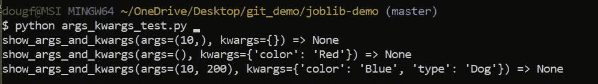

# 用 Python 追踪代码的简单方法

> 原文：<https://towardsdatascience.com/a-simple-way-to-trace-code-in-python-a15a25cbbf51?source=collection_archive---------24----------------------->

## 使用装饰器来跟踪你的函数

作者:[爱德华·克鲁格](https://www.linkedin.com/in/edkrueger/)和[道格拉斯·富兰克林](https://www.linkedin.com/in/dougaf/)

Maksym Kaharlytskyi 在 Unsplash 上拍摄的照片

# 介绍

我们的目标是创建一种可重用的方法来跟踪 Python 中的函数。我们通过用 Python 的`functools`库编写装饰器来实现这一点。然后，这个装饰器将被应用到我们感兴趣的运行时的函数中。

# 跟踪装饰者:@tracefunc

下面的代码代表了一个通用的装饰模式，它具有可重用和灵活的结构。注意`functool.wraps`的位置。这是我们关闭的装饰。这个装饰器保存了传递给闭包的`func`的元数据。

tracer.py

如果我们没有在第 7 行使用`functools.wraps`来修饰我们的闭包，那么在第 11 行打印`func.__name__`时将会返回错误的名字。

这个装饰器打印出传递给`tracefunc()`的函数的轨迹。在第 10 行，`result` ，存储`func(*args, **kwargs).`的值，之后生成一个打印语句。该语句报告了`func.__name__`、args、kwargs 和`result`。

因此，我们用`tracefunc`修饰的函数将生成关于它们执行的附加信息。

# 使用@符号应用 tracefunc

在 Python 中，decorators 可以很容易地用`@`符号来应用。并非所有装饰者的应用都使用这种语法，但是所有的`@`符号都是装饰者的应用。

我们用符号`@` 用`tracefunc` 来修饰`show_args_and_kwargs`。

@tracefunc 的应用

现在`show_args_and_kwargs`被修饰了，当它在第 8–10 行被调用时，我们将看到它的`func.__name__`、args、kwargs 和 result。

跟踪输出

下面我们将更深入地探讨为什么以及如何编写一个装饰器来跟踪函数。

# 为什么人们会追踪一个函数

**跟踪**是模拟程序的执行，一行一行地遍历程序，显示变量是如何变化的。有经验的程序员使用跟踪来调试程序，通常作为调试器的替代品。描摹对于正在学习语言的初学者来说也是非常有用的。

> “干杯，爱！骑兵来了！”—示踪剂

为了用 Python 编写装饰函数，我们依赖于`functools` 和对作用域的认识。我们来回顾一下范围和装饰。

# 装饰、关闭和范围

修饰是 Python 中的一种设计模式，允许您修改函数的行为。装饰器是一个函数，它接受一个函数并返回一个修改过的函数。

当编写闭包和装饰器时，必须记住每个函数的作用域。在 Python 中，函数定义范围。闭包可以访问返回它们的函数的范围；装饰者的范围。

在将修饰函数传递给闭包时，保留它的元数据是很重要的。了解我们的作用域让我们可以用`functools.wraps`恰当地修饰我们的闭包。

*要了解这些概念的更多信息，请阅读这篇三分钟的文章。*

 [## Python 中的装饰器和闭包示例

### 如何使用装饰器增强函数的行为

towardsdatascience.com](/decorators-and-closures-by-example-in-python-382758321164) 

# 这个装饰器的可重用性

注意`func` 被当作第 4 行的一个参数。然后在第 8 行，我们通过`*args, **kwargs`，进入我们的闭包。这些`*args, **kwargs`用于计算第 10 行`func(*args, **kwargs)`的`result`。

tracer.py

`*args`和`**kwargs`的灵活性允许`tracefunc`处理几乎任何函数，不管它是使用 args、kwargs，还是两者都不使用。我们的闭包的 print 语句被设计用来访问函数`__name__`、`args`、`kwargs`和`result`，从而为`func`创建一个有用的跟踪输出。

# 结论

装饰是增强功能行为的有力工具。通过编写一个装饰器来跟踪您的函数，您获得了一个优雅的、可重用的模式来跟踪函数的行为。

请随意将`tracefunc`复制到您的代码库中，或者您可以尝试编写自己的跟踪装饰器！