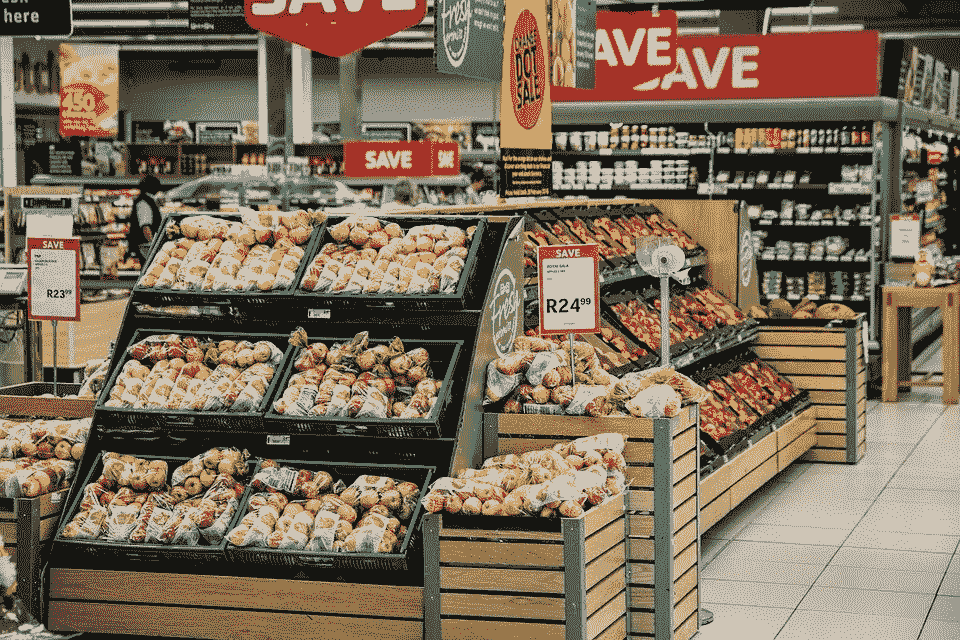
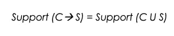
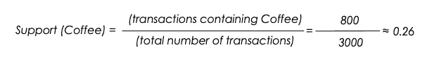
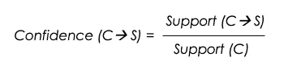
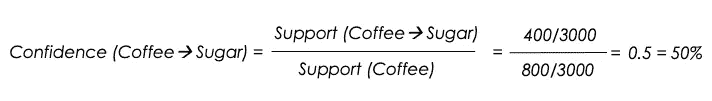
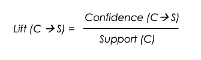
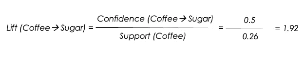

# 从客户购物篮分析用例理解关联规则的简单方法

> 原文：<https://towardsdatascience.com/a-simple-way-to-understand-association-rule-from-the-customer-basket-analysis-use-case-c7bcd75bdec1?source=collection_archive---------34----------------------->

## 本文是对 ***的全面概述*** 的关联规则和不同的度量标准

来自 [Pixabay](https://pixabay.com/photos/grocery-shopping-supermarket-1232944/) 的图片由[史蒂夫·比辛内](https://pixabay.com/users/stevepb-282134/)拍摄

# a)导言

本文的目标是解释应用于客户购物篮分析用例的关联规则。我们将经历定义什么是关联规则的步骤，识别测量它的主要方法，并且也提及它的优点和缺点。

# b)关联规则的定义

关联规则是一种基于 [**规则的机器学习方法**](https://en.wikipedia.org/wiki/Rule-based_machine_learning) ，用于部署模式识别，以识别不同但相关的项目之间的关系。自 20 世纪 90 年代以来，它一直用于零售业，以帮助分析客户同时购买的产品。这可以帮助商店经理找到更好的产品布局、产品折扣、库存管理等策略。当然，其他行业也可以从这项技术中受益。

# c)展示我们的使用案例

**比方说，咖啡和糖经常一起购买**。有了这些信息，您可以通过以下方式增加销售额:

*   将咖啡和糖放在一起，这样购买一种产品的顾客就不会步行去买另一种产品。
*   向购买咖啡或牛奶的人做广告，以增加此人购买配对的其他产品的倾向。
*   如果顾客一次购买牛奶和咖啡，则提供折扣。

# d)将关联规则应用于我们的用例

首先，需要注意的是，一个关联规则有两部分: ***一个前因(if)*** 和 ***一个后果(then)*** 。前提是在数据中找到的项目。结果项是与先行项结合在一起的项。

通过将关联规则应用到我们之前的用例中，我们可以用咖啡和牛奶的例子得到下面的表达式。

*   " ***如果购买了*** 项咖啡， ***则*** 项购买糖的可能性是 __"
    可以表示为:
*   {咖啡}→{糖}

# e)测量关联规则的三种主要方法

测量联想的三种主要方式是: ***支持度、信心度、升力度。***

让我们用咖啡和糖的类比来突出这些概念。想象以下场景，其中:

*   店内**总交易笔数**为 **3000**
*   咖啡(C)的购买数量是 800 次交易
*   糖的购买数量为 500 笔交易
*   一起购买的咖啡和糖(C → S)的数量是 400 个交易

## **1)支持**

这是给定数据集中某项的相对频率(所有事务)。它代表了商品的受欢迎程度，也是由它在总销售额中所占的比例来定义的。

c 是**的先行词**。s 是**的后件**

基于我们的案例，我们可以将咖啡的支持计算为:

## **2)信心**

这对应于在数据中看到结果项的概率，假设数据也包含先行项。换句话说，它告诉 ***在购买了一件商品的情况下，购买另一件商品的可能性有多大。***

c 是**的先行词**。s 是**的结果**

咖啡是 T21 的前身。糖是**的后件**

这个分数意味着，如果购买咖啡，有 50%的几率会购买糖。

## 3)电梯

这衡量了前因和后果一起发生的频率比它们独立发生的频率高多少。

c 是**先行词**。s 是**的结果**

*   如果 *Lift 得分< 1，则*表示如果购买 ***C*** 不太可能购买 ***S*** 。
*   如果 Lift 得分> 1，说明 ***C*** 与 ***S*** 关联度高。换句话说，如果购买了 ***C*** ，很可能会购买 ***S*** 。
*   如果 Lift score = 1，则表示 ***C*** 和 ***S.*** 之间没有关联

咖啡是先行词。糖是**的后件**

*   从结果中，我们可以看到 lift 得分> 1，这意味着如果购买了咖啡，很可能也会购买糖。

# f)关联规则的优点和缺点

## 1)优势

1.  这个技术是最具描述性的，一旦我们修正了 ***结果，它就可以成为预测。***
2.  它是有效的，对所分析的离散数据的性质没有任何理论限制。
3.  它提供了广泛的可能性；例如，我们可以添加时态、个人数据等。
4.  由此产生的规则非常容易理解。

## F.2)缺点

1.  处理大量数据(大量交易或/和项目)非常耗时。
2.  它不适合处理连续变量。
3.  这种技术仅提供局部规则，而不是给出现象的全局视野，强调主要因素和因素之间的相互作用。

# g)文章结尾

我希望您喜欢这篇文章。如果您有任何问题或意见，我将很高兴欢迎进一步讨论。

如需进一步阅读，请随时查阅以下链接:

[https://searchbusinessanalytics . techtarget . com/definition/association-rules-in-data-mining](https://searchbusinessanalytics.techtarget.com/definition/association-rules-in-data-mining)

[https://searchbusinessanalytics . techtarget . com/definition/association-rules-in-data-mining](https://searchbusinessanalytics.techtarget.com/definition/association-rules-in-data-mining)

【https://en.wikipedia.org/wiki/Rule-based_machine_learning 

再见🏃🏾