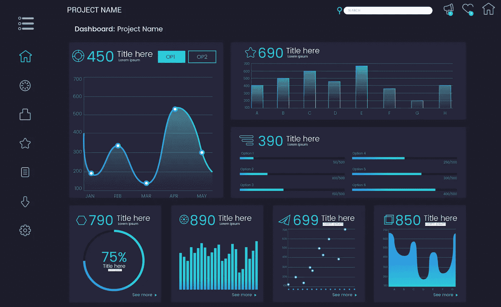
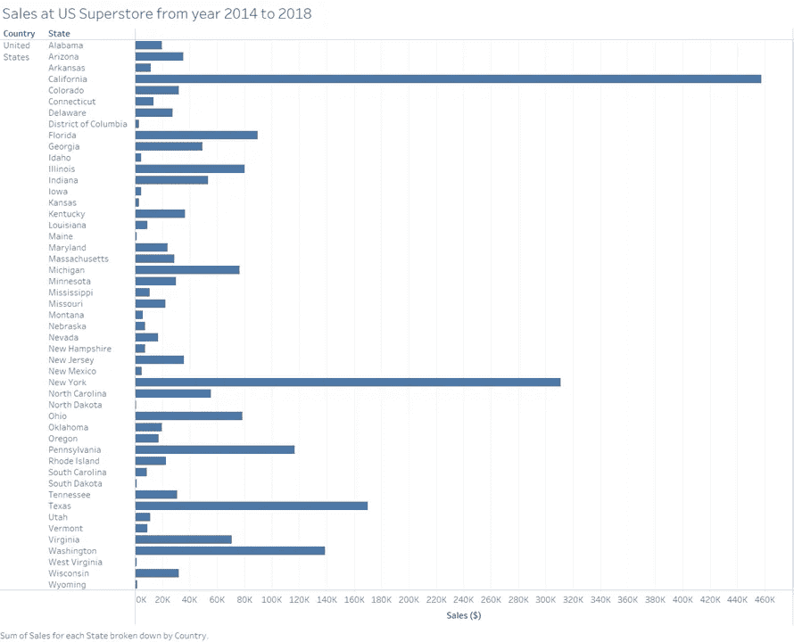
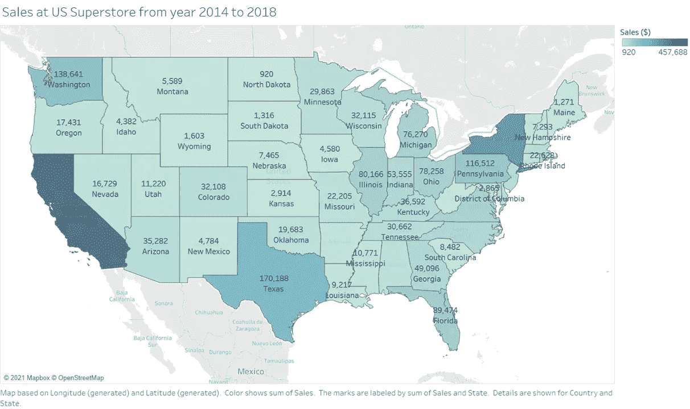

# 一个简单而有效的掌握数据可视化的 5 步框架

> 原文：<https://towardsdatascience.com/a-simple-yet-effective-5-step-framework-to-master-data-visualization-a1825e050c7c?source=collection_archive---------7----------------------->

## 让我们用一个例子来慢慢分解框架，并创建可视化效果。包括截图。

图片由 Freepik 上的 [Freepik](https://www.freepik.com/free-vector/dashboard-user-panel-template_5459026.htm#page=1&query=dashboard%20user%20panel%20template&position=7) 提供

将数据可视化一直令我着迷。用视觉图像呈现我的想法和发现，并讲述一个故事一直是我的强项。

我们都知道数据可视化在大数据时代的重要性。

你的教授喜欢精心设计的课堂演示。你的老板喜欢你通过可视化揭示模式、趋势和商业洞察力。你已经在新的 [iPhone 发布会](https://www.youtube.com/watch?v=JdBYVNuky1M&ab_channel=Apple)上看到了这些可视化的画面，是吗？

当人们通过可视化的方式讲述一个引人入胜的故事时，你可能会感到敬畏，但请相信我；这不是火箭科学。我可以坚持这样做，因为随着时间的推移，我已经开发了自己的 5 步框架，并且每次都依靠这个过程来做好。

关键是要反复进行框架实践，直到你自然而然地创造出“魔法”

我不会把它放在那里，而是用一个例子带你浏览这个框架。

我挑选的是美国超市数据集，它由一个电子商务平台从 2014 年到 2018 年的交易列表组成，可在 Kaggle 上获得[。去吧，下载数据(你需要的只是一个免费的 Kaggle 账户)*，*然后照着例子做。](https://www.kaggle.com/juhi1994/superstore)

# 1.明确目的

这是很多人一开始就忽略的，包括我。甚至在弄清楚你要想象什么之前，你就开始浏览数据。你花了几个小时去理解数据，后来才意识到；这种努力没有什么价值。

作为第一步，让我们明确目的。

*   你想回答什么问题？
*   你想通过想象传达什么？
*   你的视觉化将如何帮助观众？
*   你试图用视觉化来完成什么？

这些简单的问题将有助于你在接下来的阶段提高工作效率。

## 将此应用于示例:

在我们的例子中，美国超市数据集，一些你可能想要解决的问题。

1.  各州之间的销售额有何不同？
2.  每个产品的利润是多少？
3.  哪个产品类别产生高利润？
4.  每种产品对利润贡献的百分比？

这些只是问题的几个例子，还可以有更多。接下来，我们将使用第一个问题，即各州之间的销售额如何变化，作为示例。

# 2.了解您的数据

现在你清楚了你要回答的目的或问题，你应该理解呈现给你的数据。

你需要非常了解数据集。数据集可能有数百列，一眼看去可能会让人不知所措。但是要花时间让自己熟悉变量，每个变量代表什么，以及变量在数据集中的意义。

现在你已经有了一个清晰的目标(来自第一步的*)*，并且已经理解了每个变量所代表的含义，你将能够过滤出你可视化所需要的列。

了解数据集还将澄清您是否可以按原样使用数据，或者是否应该执行任何修改。

## 将此应用于示例:

在检查数据时，为了更好地理解，您可能会问这些问题。

1.  数据集中的每个变量代表什么？
2.  回答问题需要哪些变量？
3.  解决问题需要哪些修改？
4.  你需要绘制哪些变量？

现在你已经有了明确的目的和对数据的理解，让我们进入下一步。我们走吧。

# 3.定义你的受众

理解你的观众是至关重要的，因为它给你的视觉化的想法，你应该拿出来。

例如，如果你的读者是数据科学家，你可以使用 matplotlib 作为你的可视化工具。但是让我们假设你被要求把它展示给一个业务分析师或销售人员；用 matplotlib 创建可视化将是一个错误。你可以使用 MS Excel 或者一些高级工具，比如 Tableau 和 PowerBI。

如果您向客户推销您的数据，您可能希望它尽可能有吸引力。在这种情况下，您可能不想使用 MS Excel，而是选择使用 Tableau 或 PowerBI。

了解你的受众不仅仅是选择你使用的工具，还包括你使用的标题和说明。

## 将此应用于示例:

为了更好地了解你的听众，你可以问自己几个问题

1.  你的目标受众是谁？(*或者你在为谁创造可视化？)*
2.  你的目标受众是技术人员吗？
3.  他们在解释数据方面有什么能力？
4.  他们希望可视化是什么形式？(*例如，在线仪表板、MS Excel 表格、演示文稿)*

在我们的例子中，让我们假设销售人员是我们的目标受众。我们可以选择创建 Tableau 仪表板来显示美国不同州之间的销售差异。

# 4.发展你的想象力

前三个步骤会给你一个清晰的你将要创建的可视化的图像。现在是时候动手开发可视化了。

## 可视化类型

选择正确的可视化类型至关重要。如果你在视觉化的类型上没有做出正确的选择，你到目前为止所付出的所有努力都会以失败告终。

我大概可以写一整篇文章来讨论如何在不同的可视化类型之间进行选择，但是在这篇文章中我将保持简单。

1.  **条形图:**当您想要对数据进行比较时，可以使用条形图。
2.  **折线图:**这些图表可以用来可视化数据随时间变化的趋势。例如，一种产品在一年中的价格，一年中每天产生的利润。
3.  **饼状图:**这些是用来展示构图的。来解释整体的百分比。比如每个产品贡献利润的百分比。
4.  **地图:**你可以选择使用地图来可视化基于地理位置的数据。这将使最终用户更好地了解位置。
5.  **甘特图:**这是一种广泛使用的图表类型，用于可视化一段时间内的项目进度或活动。

可视化的类型不限于以上五种。为了简单起见，我只提到了上面五个。一旦你选择了正确的图表类型，注意颜色和比例的选择。

## 将此应用于示例:

在我们看到的例子中，我们可以创建一个类似下图的条形图。

作者创造的形象

# 5.测试和改进

在这个阶段，您测试您的实现以进行改进。人类在开发时做出假设是很常见的。为了减少这种偏见，你应该总是期待同事的反馈。

## 将此应用于示例:

在我们的示例中，我们可以将上一步中创建的条形图改进为地图。(*我在上一个步骤中特意创建了条形图，以显示反馈可能带来的改进)。*

作者创造的形象

# 让我们重温一下，永远记住它

简单的五步指南可以节省你创建可视化的时间。

1.  明确目的:把自己要解决的问题说清楚。
2.  理解你的数据:检查数据，清楚每个变量代表什么。根据问题过滤掉变量。
3.  定义你的受众:了解你的受众将有助于你决定在开发阶段使用的工具和短语。
4.  发展你的视觉化:现在，你确切地知道要创造什么。为数据集选择正确的可视化类型，并开始创建。
5.  测试和改进:获得对开发的可视化的反馈，并对其进行改进。最后，与利益相关者分享。

好了，你知道了。这不是魔法。很简单。当你把它付诸实践时，你就会知道它有多有效。万事如意！

非常感谢你读到这里。我希望你喜欢阅读，这篇文章给你增加了一些价值。我希望听到您对我如何改进的反馈。期待看到你的恒星可视化！