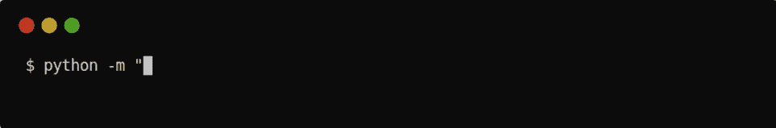
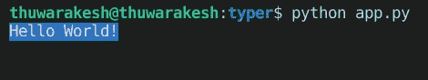
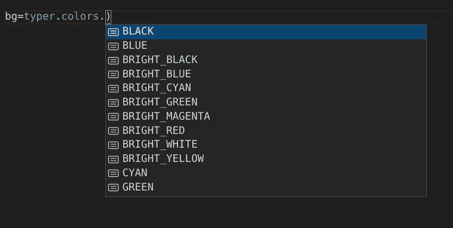
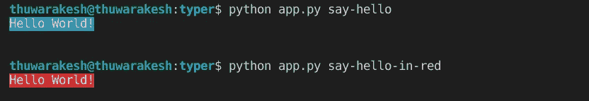
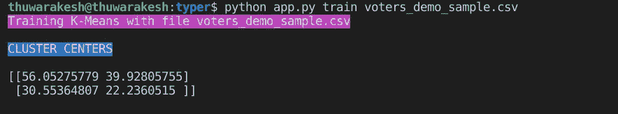
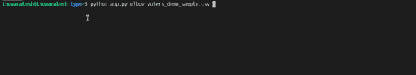
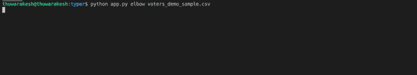
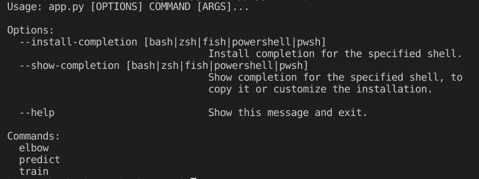
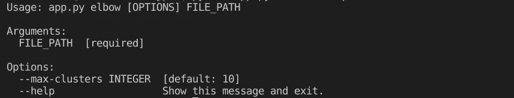
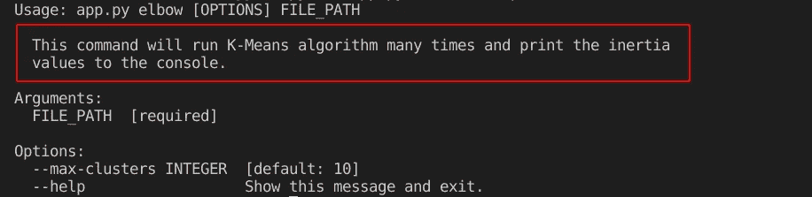

# 为您的数据科学项目创建 CLI 的简化指南

> 原文：<https://towardsdatascience.com/a-simplified-guide-to-create-clis-for-your-data-science-project-bf9bcaa26e1?source=collection_archive---------39----------------------->

## CLI 是一种与机器学习模型交互的强大而直接的方式


迈克尔·泽兹奇在 [Unsplash](https://unsplash.com?utm_source=medium&utm_medium=referral) 上的照片

这是一个可怕的假设。我以为一旦部署，就结束了。但是，部署只是大多数数据科学项目的开始。

我们经常需要重新训练和更新模型。通常使用新数据，有时使用不同的配置，偶尔使用完全独特的体系结构。

更糟糕的是，有时，你把它交给另一个团队或没有技术能力的客户去做。如果不是，无论是谁在做这些维护工作，都可能对架构有不同的理解。

在这种情况下，我们建立一个门户网站来支持善后处理。我们将应用程序链接到数据存储库，让用户通过 web 表单进行配置，并运行算法。

构建一个 web 应用程序来与您的机器学习模型进行交互是一个不错的主意。特别是，Streamlit 等工具允许数据科学家创建 web 应用程序，而无需任何 HTML、CSS 或 JavaScript 代码。

[](/how-to-create-stunning-web-apps-for-your-data-science-projects-c7791102134e) [## 如何为您的数据科学项目创建出色的 Web 应用程序

### 数据科学家不必学习 HTML、CSS 和 JavaScript 来构建网页。

towardsdatascience.com](/how-to-create-stunning-web-apps-for-your-data-science-projects-c7791102134e) 

然而，网络应用并不适合一些人。假设你对托管 web 应用程序有所顾虑。不用担心；不是死路一条。我们有一个后备方案，这确实是一个解决问题的可靠方案。

您可以创建命令行界面(CLI)来产品化和交付您的机器学习项目。

# 你能用 CLI 为你的机器学习模型做什么？

CLI 允许您在命令提示符下运行编程指令，而无需与代码库交互。CLI 可以有许多命令，每个命令都有不同的参数。例如，下面启动一个 web 服务器，您可以选择使用哪个端口。



```
python -m "http.server" 8080
```

您也可以创建像这样有用的 CLI 来与您的 ML 模型交互。如果您的客户想要用不同的数据重新训练模型，他们可以用一个像下面这样的命令来完成。

```
manage retrain /<path>/new_data.csv
```

您还可以为您的 CLI 创建帮助页面，在训练(或任何其他任务)时显示进度，并在终端窗口中有意义地设计日志和错误。

# 创建您的第一个 CLI。

我们将使用一个名为 [Typer](https://github.com/tiangolo/typer) 的 python 库来创建 CLI。Typer 是创建 CLI 命令、打印时尚输出和显示进度的最小框架。

您仍然可以使用 Typer 为您的非 Python 程序创建 CLI。您必须使用 Python 子流程，或者通过 HTTP 或消息代理与非 Python 代码通信。这里就不讨论了。但是，这可能是未来文章的主题。

安装 Typer 很简单。您可以使用 PyPI:

```
pip install typer
```

安装完成后，您可以尝试这个 Hello World 应用程序，了解一下 Typer 是如何工作的。

在您的项目目录中创建一个名为 app.js 的文件(您可以选择不同的名称)和以下内容。

作者的代码片段。

运行上面的命令将在终端上打印一条彩色的 Hello World 消息。



作者[截图。](https://thuwarakesh.medium.com/)

当然，上面的练习不仅仅是简单的 Hello World。您可以更改文本颜色和字体颜色。如果您使用的是带有 IntelliSense 的编辑器，如 VSCode，找到它们就很容易了。如果没有，你可以在 Typer 的[文档](https://typer.tiangolo.com/features/)上找到它们，无论如何都值得一查。



作者[截图。](https://thuwarakesh.medium.com/)

在继续之前，让我们看看如何向您的 CLI 添加多个命令。它需要对代码库稍加修改。

我们创建一个类型的实例，并在“main”方法中调用它。它需要对代码库稍加修改。我们可以在函数上使用“command”修饰符，将每个函数转换成一个 CLI 命令。

代码片段由[作者提供。](https://thuwarakesh.medium.com/)

通过这种新的安排，您可以在同一个 CLI 下使用多个命令。您可以在文件名后面加上函数，告诉 CLI 要执行哪个函数。



[作者截图。](https://thuwarakesh.medium.com/)

这不是已经很棒了吗？现在我们已经安装并测试了 Typer，让我们继续集成一个 ML 算法。

# 为 K-Means 算法创建 CLI。

我将使用 K-Means 算法，我在以前的帖子中讨论过。K-Means 是一种简单而强大的数据点聚类技术。

[](/running-election-campaigns-with-k-means-clustering-ecc40a91135a) [## 用 K-均值聚类进行竞选活动。

### K-均值聚类实用介绍。

towardsdatascience.com](/running-election-campaigns-with-k-means-clustering-ecc40a91135a) 

这是我们的应用程序的修改版本。我们创建了两个命令:一个用于训练和保存 K 均值模型，另一个用于加载和在预测中使用。注意，train 函数定义有一个参数 file_path。Typer 会将其转换为命令行参数。

代码片段由[作者提供。](https://thuwarakesh.medium.com/)

使用文件路径运行我们的应用程序 CLI 的“train”命令就可以做到这一点。您可以通过实现 predict 命令来练习一下。



作者[截图。](https://thuwarakesh.medium.com/)

# 显示进度条

对于消耗任务，你必须显示一个进度条，这样用户就不用拔头发了。Typer API 可以帮助你创建进度条，而不用拖动你的进度条。

让我们使用另一个命令，使用 elbow 方法找出集群的最佳数量。该方法将对不同数量的组运行 K-Means 多次。理想的数字应该是具有低惯性的数字。在大型应用程序中，这可能是一个运行几个小时的任务。

下面是完成这项工作的代码片段。注意，这一次，我们添加了两个参数，其中一个有默认值。Typer 会把它当做一个选项，而不是一个论点。您可以选择留空。

代码片段由[作者提供。](https://thuwarakesh.medium.com/)

现在尝试运行`python app.py elbow voters_demo_sample.csv`。



作者[截图。](https://thuwarakesh.medium.com/)

这段代码目前没有进度条。运行这个命令将使终端在几秒钟内没有任何输出，并立即打印出来。

让我们放一个进度条来帮助我们的用户。这是更新后的脚本。请注意 for 循环中的细微变化。

代码片段由[作者提供。](https://thuwarakesh.medium.com/)

下面是现在运行它的样子:



作者[截图。](https://thuwarakesh.medium.com/)

# 为 CLI 创建手册页。

手册页是帮助用户的文档。Typer 很聪明地将您的函数及其输入转换成详细的手册页。它将列出所有可用的命令、参数和选项。

您可以使用后缀- -help 来访问 Typer 生成的手册页。

```
python app.py --help
```



作者[截图。](https://thuwarakesh.medium.com/)

您也可以访问特定命令的手册页:

```
python app.py elbow --help
```



作者[截图。](https://thuwarakesh.medium.com/)

如果你需要给用户更多的信息，你可以在函数的开头使用多行注释。Typer 将在帮助页面上显示它们。

代码片段由[作者提供。](https://thuwarakesh.medium.com/)



[作者截图。](https://thuwarakesh.medium.com/)

# 结论

在本文中，我们创建了一个 CLI 来帮助与机器学习模型进行交互。您可以将这些技术扩展到数据科学项目之外。CLI 可以处理任何用户交互。

虽然我们使用 Python 来生成 CLI，但是您也可以使用它来运行其他程序。在这种情况下，您可能必须使用子流程、HTTP 或消息代理。

CLI 是解决关键问题的快速方法。如果不适合开发门户网站或其他解决方案，您可以构建一个。此外，您不必担心服务器停机等不可预见的事件。这使得 CLIs 成为值得考虑的可靠替代方案。

通过 Typer，一个极简的 Python 库，我们创建了

*   与 K-Means 算法交互的 CLI 命令；
*   终端窗口上的彩色消息；
*   一个进度条，让用户随时了解情况；
*   指导用户的命令行文档。

> 感谢阅读，朋友！看来你和我有许多共同的兴趣。我很乐意通过 LinkedIn、T2、Twitter 和 Medium 与你联系

还不是中等会员？请使用此链接 [**成为**](https://thuwarakesh.medium.com/membership) 会员。你可以享受成千上万的有见地的文章，并支持我，因为我赚了一点佣金介绍你。