# 用于评估对象检测模型的单个数字度量

> 原文：<https://towardsdatascience.com/a-single-number-metric-for-evaluating-object-detection-models-c97f4a98616d?source=collection_archive---------15----------------------->

## F1 分数以及它们如何帮助评估模特的表现

尼古拉斯·卡佩罗在 [Unsplash](https://unsplash.com?utm_source=medium&utm_medium=referral) 上拍摄的照片

## 介绍

使用精度和召回率来评估对象检测模型可以提供对模型在各种置信度值下如何执行的有价值的洞察。类似地，F1 分数尤其有助于确定平衡给定模型的精度和召回值的最佳置信度；然而，该值跨越了从 0 到 1 的置信值的范围。单值评估度量可以从给定模型的 F1 分数集合中导出，其可以是整体模型性能的良好指标。

## 背景

F1 分数、精确度和召回率可使用以下等式进行评估:

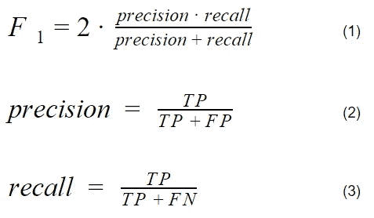

F1 分数、精确度和回忆方程式，作者图片

当在各种置信值下评估模型时，这些指标可以很好地协同工作，从而根据设计规范提供关于模型如何执行以及哪些值可以优化模型性能的有价值的见解。通常，随着置信度阈值的增加，精确度会上升，召回率会下降，如下面显示的自定义 yolo v5 模型的结果所示:

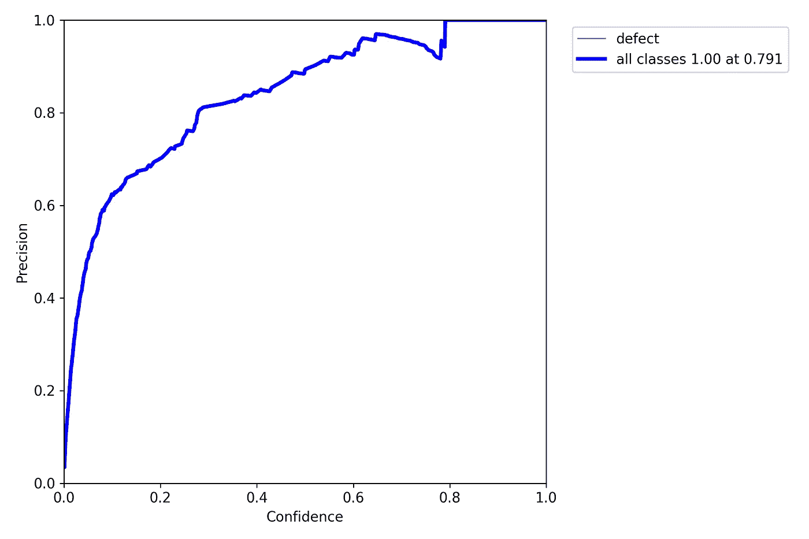

自定义 yolo v5 对象检测模型的单一类别精度分数，图片由作者提供

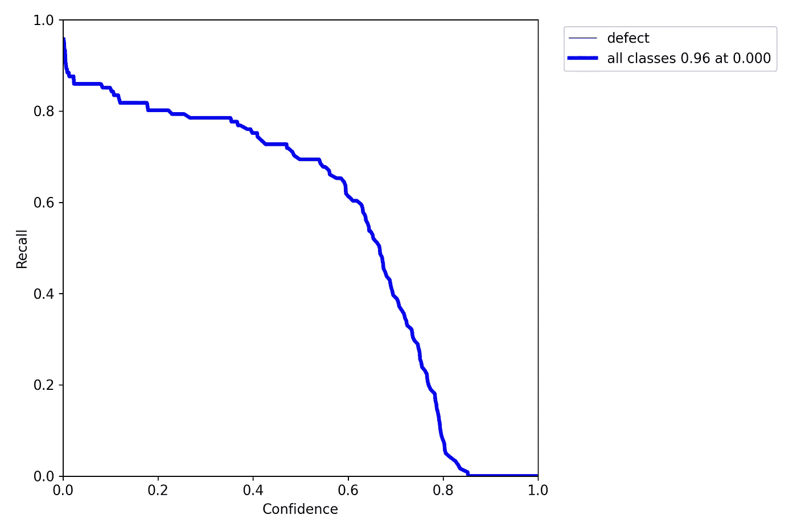

自定义 yolo v5 对象检测模型的单一类别召回分数，图片由作者提供

使用 F1 得分曲线，可以看到精确度和召回率之间的平衡，并且可以使用下面的图表确定设计点:

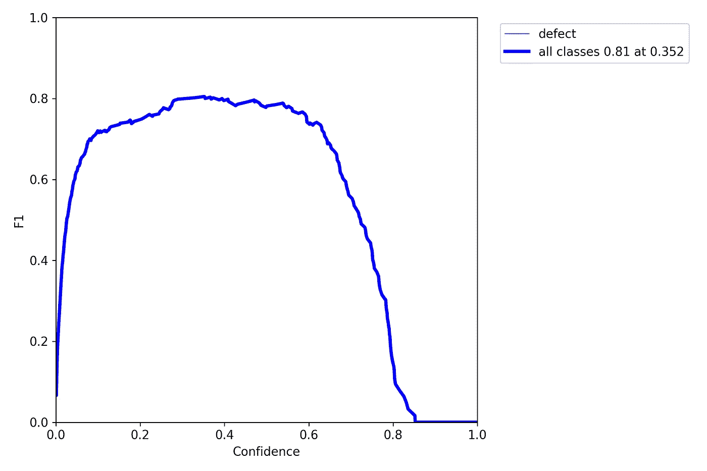

自定义 yolo v5 对象检测模型的 F1 得分曲线，图片由作者提供

从 F1 曲线来看，优化精度和召回率的置信度值是 0.352。在许多情况下，更高的置信度值是可取的。在该模型的情况下，选择置信度 0.6 可能是最佳的，因为 F1 值看起来大约为 0.75，这与最大值 0.81 相差不远。观察置信度为 0.6 的精度和召回值也证实了这可能是一个合适的设计点。从 0.6 左右开始，召回值开始吃亏，精度值还是大致在最大值。

## 理论

现在，通过提供具有相应置信度的最大值，可以用 F1 分数中的单个数字来评估模型；然而，这可能不能准确地代表模型的整体。从 F1 得分中得出的一个建议的单个数字指标如下所示:

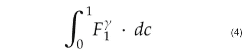

建议度量的基本积分形式，作者提供的图像

该值通过对 F1 得分曲线进行积分来确定，积分的指数因子称为 gamma。如果 F1 曲线的方程是已知的，可以使用这种形式。在大多数情况下，F1 得分曲线由使用评估或测试数据集评估的值生成。在这种情况下，可以使用更一般形式的方程:

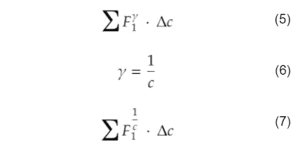

建议指标的求和符号，作者提供的图像

当应用矩形积分时，可以使用具有中点规则的公式的详细形式:

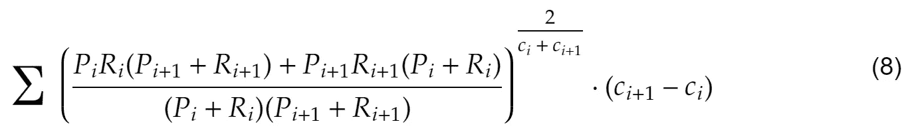

中点规则应用于矩形块，按作者排序的图像

p 是给定索引处的精度值，R 是给定索引处的召回值。指数γ1/c 已被给定指数的平均置信度值所取代。

在这个新的符号中，将计算每个数据点的 F1 得分曲线下的面积，并将其添加到累计总数中。指数因子 gamma 可用于惩罚和奖励 F1 曲线的各个区域。例如，对于 gamma 的标准值，置信值较低的 1/c: F1 分数由于被驱动到 0 而受到严重惩罚，并且对整体度量几乎没有贡献。类似地，对于高置信度值的 F1 分数，指数因子最低限度地惩罚总分数。此指标可获得的最大值为 1，最小值为 0。yolo v5 模型 F1 得分曲线各点的建议指标值如下所示:

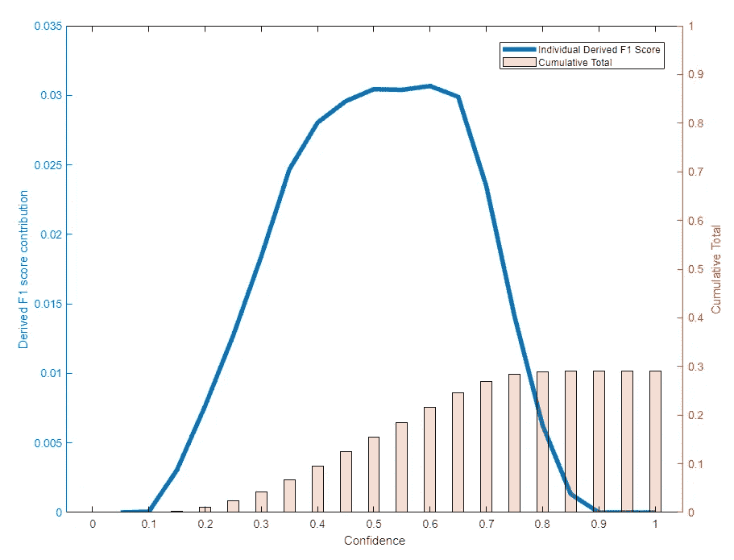

衍生 F1 评分曲线与处罚，图片由作者

蓝线表示等式 7 在每个数据点的计算值。请注意，随着数据点数量的增加，该值会越来越小。浅橙色条代表所有计算的单个数据点得分的累计总数。

由于伽马因子，在置信度为 0.1 或更低时评估的大多数 F1 分数点被驱为零，并且 F1 分数贡献被抑制直到置信度为 0.4。F1 分数值的惩罚程度可以使用 gamma 因子来控制。例如，如果需要更高的惩罚，将伽马因子中的分子从 1/c 增加到 10/c。这将使置信度为 0.4 之前的所有值比以前受到更严重的惩罚，但不会改变惩罚开始改变的置信度值。

类似地，如果想要更少的惩罚，减少分子或者甚至移除伽马指数将会有所帮助。用于评估度量标准的一种形式的方程，该度量标准考虑了控制惩罚程度和惩罚点的变量，可描述为:

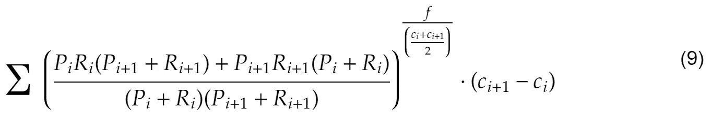

带有惩罚因子的度量评估，由作者提供的图像

其中 *f* 用于控制上面讨论的惩罚量(默认值 1)。请注意，将 *f* 增加到大于 1 的值将显著影响分数。

## 比较

我们来比较三个模型:前面提到的基础模型，一个比基础模型差的模型，一个比基础模型好的模型。这些模型被指定为优于或劣于基本模型的方式可以总结为:

*   F1 曲线、积分面积、罚积分面积
*   推理结果的人工评估
*   通过较少的训练数据、不同的配置参数以及时期和批次变化，专门训练得更好或更差

各种模型的 F1 曲线、非惩罚积分值和惩罚积分值曲线如下所示:

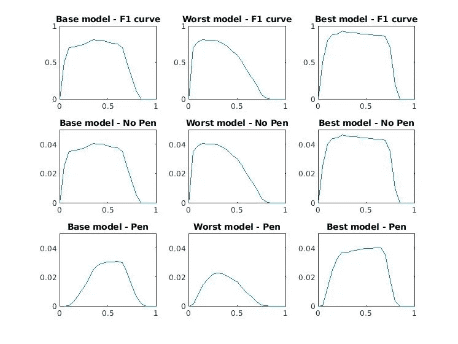

各种度量得分曲线，图片由作者提供

非惩罚曲线将遵循 F1 曲线的相同轮廓，因为它们是线性相关的。请注意，F1 曲线和非惩罚积分曲线之间的幅度是不同的。这是由于等式 9 中的δ置信项。任何积分分数的最大可能值是用于积分 F1 曲线的增量。在这种情况下，使用 0.05 的增量，因此非惩罚和惩罚积分的最大值是 0.05。当置信度接近约 0.4 时，惩罚曲线的低置信度部分随着衰落严重程度而明显降低。所有被罚曲线都是在 *f* 值为 1 的情况下计算的。

上述曲线的最终得分总结如下:

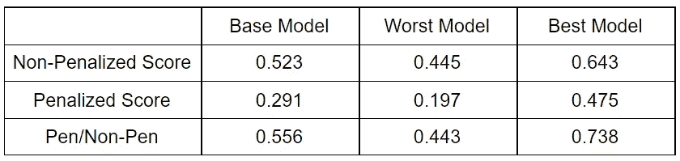

分数摘要，按作者分类的图像

最后一行是处罚分数与非处罚分数的比率。它代表综合 F1 分数中位于较高置信区域的部分。如果期望更高的置信度，当确定多少非惩罚分数实际上是相关的时，这可能是一个很好的指标。

一个 GitHub 知识库已经公开，可以很容易地计算出被罚和未被罚的综合分数。可以在以下位置找到它:

 [## plebbyd/集成-F1

### 该库用于轻松计算被罚和未被罚的 F1 积分。为了使用，克隆…

github.com](https://github.com/plebbyd/integrated-F1) 

此外，对于任何给定的置信度和 F1 分数值的输入，该存储库中的函数返回惩罚与非惩罚的比率。

## **结论**

惩罚的和非惩罚的综合 F1 分数可以是用于评估对象检测模型的良好的单个数字度量。如果在多个模型的研究或训练过程中无法对 F1 曲线进行手动检查，那么评估这些新指标可能会有所帮助。

## 参考

[1]戴维·m·w·鲍尔斯(2011 年)。[“评价:从精度、召回率、F-Measure 到 ROC、信息量、标记性&相关性”](https://www.researchgate.net/publication/228529307)。*机器学习技术杂志*。**2**(1):37–63。

[2] Yolo v5 (2021)。In: GitHub。[https://github.com/ultralytics/yolov5](https://github.com/ultralytics/yolov5)。访问时间是 2021 年 5 月 31 日。