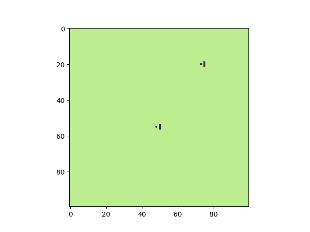

# 模拟森林火灾、流行病和经济的单一技术

> 原文：<https://towardsdatascience.com/a-single-technique-to-model-forest-fires-pandemics-and-economies-3d68d7c1a865?source=collection_archive---------64----------------------->

## 探索 Python 中的交互代理建模

流行病，森林大火和经济危机。不仅是去年的菜单，还有一小部分现象可以在基于主体的建模(ABM)框架下进行建模。

图片来自 Unsplash

ABM 非常适合于理解复杂行为是如何在基于系统个体参与者之间简单交互的系统中出现的。abm 在解释一般观察结果方面表现出特别的优势，这些观察结果被称为“程式化事实”，例如观察到的中子散射模式或资产回报的分布。这些代理可以是任何东西，从人或公司到生态系统中的动物或气体中的原子。这种建模方法是自下而上的方法，其中系统的行为完全由对参与者个体行为的假设驱动，而不是自上而下的方法，该方法假设参与者将如何一起行为。

一个简单的例子是野火建模，每个代理代表一小片土地。每块土地的规则可能非常简单:如果土地着火，将顺风的相邻土地点燃，直到该土地上的所有燃料都烧完。尽管有这些简单的规则，wildfire 系统的整体行为表现出复杂的行为。此外，探索改变假设的影响，如使火灾蔓延概率化或引入燃料再生，只需要改变地块之间相互作用的规则，而不改变模型框架。这有助于快速实验和假设测试。

有两个点火点的野火反弹道导弹。原始图形

快速实验并不是 ABM 优于自顶向下方法的唯一优势。考虑被建模的个体中的变化会在自上而下的模型中引入显著的复杂性，而在基于代理的方法中是微小的变化，因为这种异质性可以被变化的个体代理捕获。这可用于捕捉差异，如野火模拟中不同的燃料水平，或创建模仿流行病模型的人口普查数据的代理群体。

ABMs 不局限于在模拟物理空间中交互的代理，模型框架扩展到代理交互的非物理限制，例如限制代理只与他们“知道”的其他代理交互。这允许引入社会异质性，许多代理人属于封闭的社会圈子，而较少的高度社会化的代理人连接这些圈子。

这是在下面的简单流行病模型中通过将代理的社会联系表示为具有小世界属性的网络来实现的。

具有小世界相互作用的简单 ABM 流行病模型。原始图形

这也让我们能够探索限制社会交往如何影响流行病的持续时间和强度的程式化事实。在该模型中，这是通过减少网络中的平均连接来实现的，这类似于个人减少与他们最亲密的朋友和家人的物理接触。

与上面相同的流行病模型，但是社会联系减少了 40%。原始图形

ABM 的另一个关键优势是潜在假设的可解释性，这可以为结果提供信心，并使发现更容易沟通。例如，对收入不平等和税收影响的自上而下的分析通常是高度数学化的，并且对个人非常抽象，这使得政策决策的沟通成为一个持续的挑战。

各种税收制度下的收入平等——基尼系数越高，不平等程度越高。原始图形

另一方面，自下而上的 ABM 方法允许模型减少到只有三个步骤，每个周期由代理重复:1)与他们有社会联系的代理随机交易，如在流行病模型中；2)缴纳交易所得税，如果财富低于最低水平，则领取福利金；3)产生固定的生活费用，并获得储蓄利息。注意到这些假设没有提到每个代理人的工作道德或生产力，模型的程式化事实仍然模仿自上而下模型中发现的事实，特别是统一税导致比累进税更高的财富不平等(以基尼系数衡量),以及需要福利支付以防止固定生活成本使大部分代理人破产。

不幸的是，通常缺乏关于这些基本假设和输入的知识，因为有关系统的相关数据通常是在总体水平上而不是在单个水平上获取的。此外，模型输出通常对所使用的输入敏感，这可能极大地限制预测中的使用并削弱信心。

一种解决方案是将假设捕捉为一组参数，然后优化参数以拟合历史数据，针对各种参数组合运行模型，直到模型输出与观察到的数据相匹配。然后，来自该调整模型的参数被用于正在进行的预测或建模练习。这种实践增加了对所产生的洞察力的信心，并在模拟世界和现实世界之间提供了更强的联系。

虽然 ABM 技术并没有取代传统的自上而下的方法，但它们确实提供了一种替代的视角，并且在某些情况下提供了一种方法来处理那些太复杂而无法以自上而下的方式定义的问题，或者代理表现出大量异质性的问题。虽然编写和测试 abm 需要一定水平的技术技能，但由于模型框架的可重用性和开源库(如 Mesa for Python)的存在，这种学习曲线变平了，Mesa for Python 为代理、代理交互和数据捕获提供了通用框架。最后，通过易于沟通的假设和方法，增加了对模型结果的信心。通过将模型输入建立在已知真实世界数据的基础上并优化参数以适应历史观察，这将得到进一步的测试和改进。

这个故事是基于代理的建模系列的第一篇，是基于我自己对构建 abm 的研究和实验。如果你想跟进，请考虑关注我的个人资料或这份出版物。

一些来源如下:

[https://www . science direct . com/science/article/pii/s 1755436517300221](https://www.sciencedirect.com/science/article/pii/S1755436517300221)

[https://www . bankofengland . co . uk/-/media/BOE/files/quarterly-bulletin/2016/agent-based-models-understanding-the-economy-from-the-bottom-up . pdf](https://www.bankofengland.co.uk/-/media/boe/files/quarterly-bulletin/2016/agent-based-models-understanding-the-economy-from-the-bottom-up.pdf)