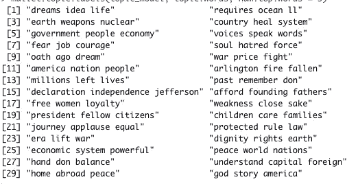
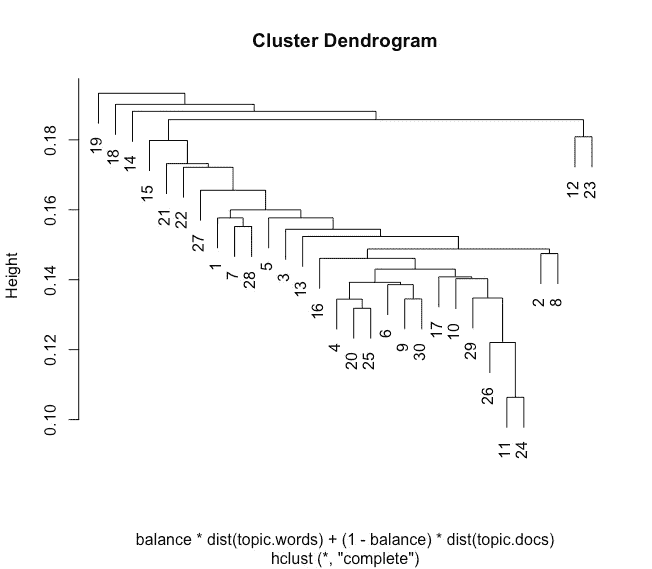
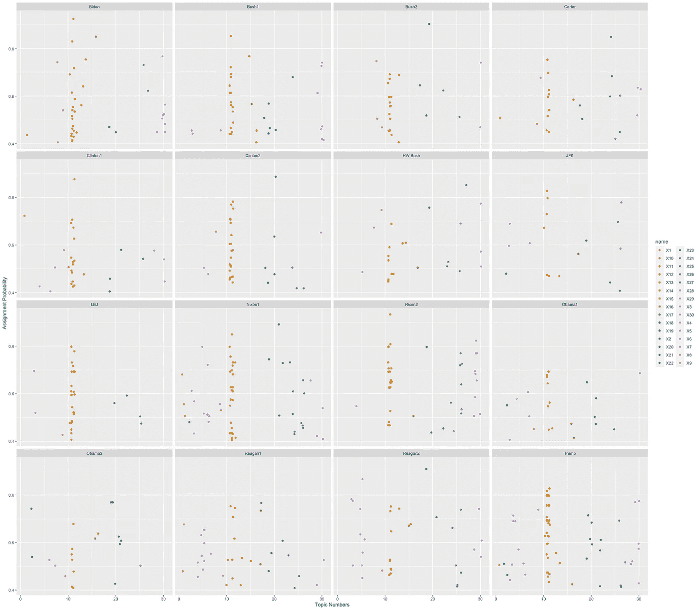
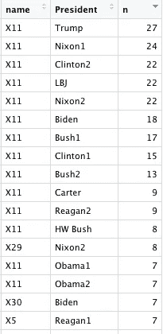
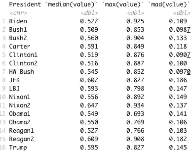
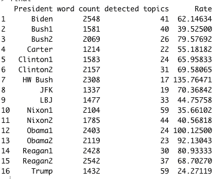

# 一篇关于居住和沉思的演讲

> 原文：<https://towardsdatascience.com/a-speech-for-dwelling-and-contemplation-machine-learning-the-inaugural-address-67818295585?source=collection_archive---------51----------------------->

## 机器学习和就职演说

1 月 20 日，按照宪法治理的正常流程，拜登总统宣誓就职。总统用演讲来纪念这一时刻——通常具有特别的说服力。在他们关于就职演说的经典方法中，Karlyn Kohrs Campbell 和 Kathleen Hall Jamison [认为就职演说通常是由他们的条件所决定的，这些演说重新组成了“人”，论证了总统职位的可能性和局限性，并且在邀请沉思中是永恒的。最好的就职演说会提出一些深刻的论点，它们不像威尔逊式的国情咨文，读起来像是一系列政策建议。里根的第一次就职颁布了跨领域的统一](https://www.jstor.org/stable/27550215?seq=1#metadata_info_tab_contents)[复兴幻想](https://nca.tandfonline.com/doi/abs/10.1080/00335638209383599#.YAh9WuCIaAk)。奥巴马的第一次就职[解散二进制，](https://muse.jhu.edu/article/461548)建立新的国家统一。坎贝尔和贾米森总结了就职演说的作用:

> 就职典礼必须复述过去的公共价值观，阐明指导新政府的政治原则，并证明总统能够恰当地扮演总统角色。

这是有道理的，在大多数情况下，这些地址会有非常相似的签名，因为它们可能会说许多相同的事情。在这篇文章中，我不是在阅读演讲的语义内容。我以前用[情绪分析](https://medium.com/s/story/two-states-of-the-union-3b58814f096f)做过这个，在这一点上，这位即将离任的高管的风格是[众所周知的](https://www.cambridge.org/core/books/language-in-the-trump-era/introduction-the-trump-era-as-a-linguistic-emergency/DCAD253C6142EB22FDA74CF62FB179E0/core-reader)——高度多变、情绪化、粗暴和好斗。

**就职的签名**

情感分析是一个有用的工具，但是经常被过度使用。在我们今天看到的背景下，知道使用普通词汇是有用的。拜登今天的情绪比他的前任更消极，但变化较小。这对于具有简单连接的词汇的情感分析来说是一个问题:高价值单词的混乱可以产生非常正常的和或平均情感得分，这只能通过偏差来揭示。深刻负面的文本很容易得到正面的分数。

我没有为了感悟而阅读，而是把拜登的就职演说加入了一个更大的可以追溯到 JFK 的就职文集。使用 Mallet for LDA，一种机器学习方法，我们可以使用停用词的一般选择来读取三十个主题的语料库。

我们三十个话题的标签

主题之间的关系如下:

请注意，话题 11 和 24 是在底部结合在一起的——这些话题在很大程度上与总统之间的共同价值观有关。12 和 23 这一组讲述了关于阿灵顿国家公墓的讨论和不断变化的对话。而在第 19 题的第一个休息处，我们可以找到每一位总统列举的人物的开头段落，比如众议院议长。在我做过的 LDA 驱动的项目中，这是在主题层面上最连贯的。机器学习的远距离阅读过程增强了近距离阅读的修辞阅读维度，作为一名研究总统沟通的研究人员，我可以以我坐在几十页纸上永远无法做到的方式快速查看和判断案件。

重要的是就职演说有多少，它们是如何进行的，以及总统们是如何选择一些话题的。每位总统都会留下一个特别的签名。

为了这个图形的目的，只有超过 0 . 4 的值被包括在内，毕竟每个段落都有 30 分，我们不需要图形的底部完全拥挤。你可以在第二届就职典礼上看到紧缩，因为与上届政府没有什么不同。为了量化这种转变，我们需要查看平均赋值值、赋值总数和每个单词的赋值。

主题 11 是最常见的作业。这里的特殊异常值包括尼克松关于越南战争结束的言论被框定为和平(29)，除了特朗普咄咄逼人的一段。话题 30 是对美国的祝福和忠诚，这是拜登的一个中心主题，一个典型的总统可能会说一两个。

第二次就职典礼往往有更高的平均分配值和更高的最大值(奥巴马是一个例外)，这将再次表明第二次演讲更集中。从这个意义上来说，拜登读起来更像是第二次就职演说，尽管他的最高分出现在主题 11、16 和 30，其中拜登的标志性主题“献身美国”非常明显。JFK 使用话题 11，然后是话题 26，这是一个被许多人使用的外交政策话题，但在乔治·w·布什的作品中只出现过一次。这是有道理的，因为他的第一次演讲是在 9/11 之前，但他关于外交政策的最有力的陈述是在主题 8 中——因为它们是用莱茵霍尔德·尼布尔的语言表达的，古典现实主义——它们是灵魂的问题。这也证实了另一件事:除了议题 26 中的合作语言，没有外交政策驱动的就职演说，外交政策问题隐藏在美国公民宗教中。

我们可以用这种方法确认，奥巴马的第一个是关于主题 11，然后是主题 21——一个关于克服二进制的旅程的主题。60%的 topic 21 位置来自奥巴马的第一个，Nixon1 使用了两次，Reagan2 和克林顿 1 使用了单个段落。里根的用法特别有趣，因为这是一个关于历史终结的混合隐喻:“这首歌永远回荡在未知的空气中。”

最后，考虑主题被检测到的速率是很重要的。

拜登的演讲相当长，话题比平均水平多，话题发现率接近平均水平。除了奥巴马，每第二次演讲都比前一次详细。当然，有一个引人注目的异常值，我们已经确定它与其他异常值在性质上是不同的。

**结论**

拜登总统就职演说的修辞信号在主题选择和变化上都符合预期。主题建模过程进一步表明，除了被检测为主题 11 的标准框架(国家的未来承诺)，拜登的演讲通过对美国和民主的主题关注为语料库贡献了独特的签名。虽然读数完全有可能会发生变化，但在这种最初的机器学习驱动的方法和对这些结果的修辞性阅读的背景下，很明显，拜登总统发表了一个非常符合就职典礼形式的演讲，并且非常适合这个时刻。最后，我们可以清楚地看到支持就职演说研究的悠久历史的证据。