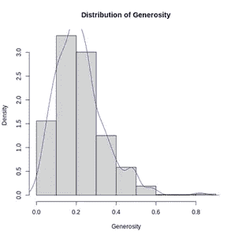
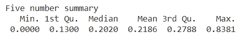

# 影响公民幸福感的社会因素的统计分析

> 原文：<https://towardsdatascience.com/a-statistical-analysis-of-social-urban-and-national-factors-that-affect-citizen-happiness-c24ed0e87dcf?source=collection_archive---------15----------------------->

## 使用线性回归对不同因素进行深入的统计分析

图片由 [Ricardo Moura](https://unsplash.com/@ricardomoura) 在 [Unsplash](https://unsplash.com/) 上拍摄

# 摘要

本文旨在探索可能影响全球公民幸福的各种*社会、城市和国家因素*。报告的布局包括对用于分析数据的方法的描述，包括数据集选择、数据清理和预处理、探索性数据分析和数据建模(使用多元线性回归)，然后是对每个阶段的调查结果的详细分析。该分析集中于确定对幸福分数的预测和我们的拟合模型的质量有贡献的各种因素的重要性。在我们进行的过程中，每个阶段都会回答多个子问题。然而，最重要和最有趣的分析结果在最后进行了总结，并提出了可行的建议。

# 介绍

随着 COVID 的出现，一种绝望和不确定感笼罩了整个世界。全世界人民的福祉和精神健康受到严重影响。这暗示了这样一个想法:随着世界一天天进步，我们的注意力更多地转向永无止境的进步，而不是真正重要的事情。我们忽略的一件事就是幸福。了解幸福的决定因素以及它们如何影响个人的福祉非常重要，这样我们作为一个社会可以共同努力改善它们，以形成一个更幸福的环境。因此，在本报告中，我们开始着眼于更大的图景，并确定以下研究问题的答案:

*“公民的幸福如何取决于各种社会、城市和国家因素？”*

# 数据集

《世界幸福报告》是一项具有里程碑意义的全球幸福状况调查。这项调查是 2012 年发起的同类调查之一，自那以来每年在 155 个国家进行。它衡量了几个社会、城市、国家和个人因素，这些因素可能会以这样或那样的方式影响幸福。幸福指数较高的国家被认为更幸福，更有利于公民的福祉，而幸福指数较低的国家则被鼓励实施以公民为中心的政策。总的来说，该报告因其完整性和在跨学科研究中的实用性而获得了巨大的全球认可。

我们将使用的[数据集](https://www.kaggle.com/unsdsn/world-happiness)是 2015 年至 2019 年的世界幸福报告。它基于五个 CSV 文件，即每年一个文件，这些文件合并在一起形成一个整合的数据集。我们打算确定这些年来国内生产总值、家庭、健康和预期寿命、自由、无腐败和慷慨对公民福祉的贡献程度[【1】](#_ftn1)。关于本次调查数据收集过程的背景研究显示，受访者被要求参加盖洛普世界民意测验。他们必须对上述每个因素对他们生活的影响进行评分，满分为 10 分，最低分为 0 分(即该因素不会带来幸福)，最高分为 10 分(即该因素对他们的幸福贡献很大)。

# 方法

为了系统地找到我们的研究问题的答案，我们将我们的方法分为三个阶段，即数据清理(和预处理)、探索性数据分析(EDA)和最后的回归分析。

# 数据清理

在开始分析之前，理解和预处理数据是很重要的。我们首先导入我们需要用于分析的相关库。接下来，我们读取数据集并检查它们的维度，以了解我们正在处理的行数和列数。

*图 1:数据集维度的 R-输出*

正如我们所见，每个数据集中的列(要素)数量各不相同。我们选择了所有数据中共同的数据，以形成一个更大的数据集，并去掉不同的数据。然后，我们分别清理每个数据集。他们每个人都遵循相似的模式。我们首先检查每个数据帧中的空值，并相应地处理它们。幸运的是，我们在数据帧中几乎没有发现空值。如果我们有，我们适当地估算他们。然后，我们对列进行了标准化，即为了便于访问而对它们进行了重命名，将名称转换为小写，并检查了适当的数据类型。为了确认数据清理是否成功，我们从每个数据集中抽取了 10 行样本，并检查我们所做的更改是否成功应用。

在分别清理数据帧后，我们将它们合并成一个名为 *df 的数据帧。*它由 782 行和 10 列组成，如下面的 R 输出所示:

*R-组合数据集的维度和列的输出*

然后我们检查数据集是否有空值，我们在 corruption 列中发现了一个空值。我们有两个选择，要么删除行，要么填充空值。我们决定采用后者，并用腐败列的平均值来估算缺失值。

*R-清洗前后的空值输出*

上面 R 输出中的 False 表示现在数据集中没有空值或缺失值。

最后，我们检查每一列的数据类型是否合适，或者我们是否需要改变什么。让我们来看看:

*R-列数据类型的输出*

除了 country 之外的所有列都具有数值或整数数据类型。事实上，这些就是我们分析中将要用到的列(或前面提到的起作用的因素)。因此，列的当前数据类型对于我们的后续分析来说是很好的，因此不需要标记或编码。这使我们进入方法的第二阶段，即探索性数据分析(EDA)。

# 探索性数据分析

对于一个 782 行 10 列的数据集，重要的是从分析数据在正式建模、回归分析和其他测试之外能够揭示什么开始。因此，我们进行了探索性数据分析，以可视化数据并总结其特征。我们还想看看是否有任何明显的趋势，以便我们可以相应地构建我们的研究问题。

# 分析的特征

现在，我们知道我们有 10 个特征。其中之一是幸福得分，这是因变量。我们使用的数据源和其他网站的背景研究使我们能够找出自变量的确切含义和目的。其中每一项的详细情况如下:

*数据集中特征(列)的描述*

# 相互关系

既然我们知道了每个特性代表什么，我们想看看这些特性是如何相互关联的。我们以相关矩阵的形式计算不同特征之间的皮尔逊相关(r)。我们检查了每一个变量，看它们是正线性相关，负线性相关还是没有。

*皮尔森特征间的相关性*

为了便于解释，我们随后在彩色编码的热图中绘制了相关性，并附有一个参考尺度来理解它。产生的图如下:

*关联热图(r)*

从右边的刻度可以明显看出，特征之间较暗的图表示强线性相关性(r 更接近+1)。蓝色代表正线性相关(r > 0)，而红色代表负线性相关(r < 0)。显然，特征与其自身的相关性是 1，即完全相关。令人惊讶的是，没有一个特征与另一个负相关。这暗示了一个事实，因为所有的预测变量都以一种形式衡量幸福，增加其中一个并不会导致另一个因素的减少。分数，我们的反应变量，与其余特征有最强的正相关。GDP、家庭和健康与其余变量也有中等程度的相关性，但慷慨度与其他变量的相关性最弱甚至没有相关性。

由于我们的主要目标是预测幸福分数和影响幸福分数的因素，我们决定更深入地研究每个可能的因素与幸福分数(因变量)的相关性，以了解哪些因素更有可能强烈影响幸福分数。这一次，我们打算查看皮尔逊相关的确切值，以做出尽可能准确的判断:

*特征与分数的皮尔逊相关性*

幸福得分与所有考虑的因素呈线性正相关。它与 GDP 的相关性最强，其次是健康和家庭。它与自由有适度的相关性，与腐败和慷慨有微弱的正相关性。

# 幸福分数

在探索性数据分析的前两个步骤中，我们非常重视我们的响应变量——得分。让我们更深入地了解它，以了解它在数据集中的分布。这将使我们对回归建模结果的解释更加容易。如前所述，幸福指数是人们在调查时对自己幸福程度的评价。可能的最高分是 10 分(这意味着回答者是他/她所能得到的最快乐的人)，最低分是 0 分(这意味着回答者一点也不快乐)。

幸福指数的五位数汇总显示，幸福指数在 2.693 到 7.769 之间。平均幸福指数为 5.379，平均幸福指数为 5.322。最低和最高分数足够合理，即它们既不太低也不太高。由于没有异常值(如下面的方框图所示)，很明显没有需要考虑的幸福指数特别高或特别低的国家。

同样，下面的幸福得分分布也表明，甚至没有一个国家的幸福得分是完美的。事实上，所有国家的幸福指数都低于 8。大多数国家的幸福指数在 5 到 6 之间(包括平均值和中间值)。所以总体来说，幸福得分的分布是对称的。

# 乡村幸福指数

虽然对幸福分数的国别分析超出了我们研究问题的范围，但注意到不同国家幸福分数的差异还是很有趣的。因此，我们决定鸟瞰各国的幸福指数。

下面的世界地图(以 R 绘制)显示了我们数据集中 156 个国家的彩色幸福指数。光谱左侧的颜色(即蓝色阴影)不太快乐，而光谱右侧的颜色(即红色和黄色阴影)更快乐。看看这张地图，像巴西、俄罗斯、美国和加拿大这样的发达国家显然比不发达国家更幸福。

*世界范围内相关量表的幸福得分*

为了有一个更具体的图片，前 20 个最幸福的国家和他们的分数被绘制如下:

# 回归分析

在使用预测变量和反应变量的可视化和总结彻底理解数据后，我们继续通过一个模型来理解所选预测变量对幸福得分的影响。

我们使用对幸福得分起作用的因素的多元线性回归，假设我们的预测变量与响应变量有线性关系(根据之前计算的皮尔逊相关值推断)。

该模型的基本思想是找到 GDP、家庭、健康、自由、腐败和慷慨程度的线性组合，这种组合最能预测幸福得分。我们确定了显著变量(用回归模型汇总表的 p 值< 0.05) in the prediction of score. Important diagnostics for the model included determining coefficient of determination (R-squared and Adjusted R-squared) and making and analyzing ANOVA table. We also visualized our model and the residuals using Residual Plots and Q-Q plots the interpretations of which are discussed in the latter part of the report. Lastly, to make sure our model was not faulty (i.e., it neither underfitted nor overfitted), we also employed several measures — tested multicollinearity, data distribution and then drew final conclusions from the results.

# Analysis

# Multiple Linear Regression

As mentioned earlier, we employed Multiple Linear Regression to model the dependence of response variable (happiness score) on a set of predictor variables (GDP, family, health, freedom, corruption, and generosity). The relevant R code for this is shown in the excerpt below alongside the summary table of the regression model as the output.

*R 输出*

# 回归方程式

根据上面的 R 输出，我们构建了以下回归方程来预测幸福得分:

**得分= βo + gdp*β1 +家庭*β2 +健康*β3 +自由*β4 +腐败*β5 +慷慨*β6**

**得分= 2.17749+1.14675 * GDP+0.64109 *家庭+1.00394 *健康+1.47913 *自由+0.85366 *腐败+0.59359 *慷慨**

上述方程的这些系数被解释为当一个变量改变 1 个单位而所有其他变量保持不变时幸福得分的边际增加。

**βo** :在所有其他预测因素都不在模型中的情况下，幸福得分将为 2.17749

**gdp** :如果所有其他特征保持不变，那么 gdp 每增加一个单位，幸福指数就会增加 1.14675 个单位。

**家庭**:如果其他所有特征保持不变，那么家庭(社会支持)水平每增加一个单位，幸福得分就会增加 0.64109 个单位。

**健康**:如果所有其他特征保持不变，那么健康(预期寿命)每增加一个单位，幸福指数就会增加 1.00394 个单位。

**自由度**:如果其他所有特征保持不变，那么自由度每增加一个单位，幸福得分就会增加 1.47913 个单位。

腐败:如果所有其他特征保持不变，那么腐败(在我们的上下文中，是对政府的信任)增加一个单位将导致幸福指数增加 0.85366 个单位。

**慷慨度**:如果所有其他特征保持不变，那么慷慨度增加一个单位将导致幸福得分增加 0.59359 个单位。

# 特征显著性(p 值)

通过分析回归模型汇总表中 Pr(>|t|)列中给出的 p 值，我们可以衡量每个预测变量在解释响应变量时的重要性。p 值是对观察到的差异可能只是随机发生的概率的度量，也可以称为对零假设的证据强度的度量。对于我们的模型，零假设(Ho)表明幸福得分和相应的预测变量之间没有关系。如果预测变量的 p 值小于 0.05(标准阈值)，我们将认为它在估计响应变量中具有重要意义。

从汇总表中可以看出，Pr(>|t|)列中的所有值都小于 0.05。这表明了这样一个事实，即 Bo、gdp、家庭、健康、自由、腐败和慷慨中的所有特征在估计幸福分数时都起着重要作用。我们的回归模型的总体 p 值也小于 0.05，因此，它具有统计学意义，可以用于从给定的预测变量预测幸福得分。

下表总结了每个预测变量的 p 值及其显著性:

*由各自的 p 值指示的特征(列)的重要性*

# 决定系数

r 平方是一种统计度量，表示回归模型中自变量解释的因变量方差的比例。在这种情况下，多个 R 平方值代表了幸福分数的可变性，这可以用 6 个特征来解释。然而，在多变量回归设置中，多重 R 平方不是一个可靠的度量，因为随着我们向模型添加更多的特征，它会不断增加，即使这些特征中的一个或多个变量可能不重要(这会导致模型过度拟合)。这可能导致对我们模型预测能力的不准确估计。

因此，在这种回归模型中，采用调整的 R 平方，并确保在向模型中添加非显著变量时其值降低。在这种情况下，调整后的 R 平方的值为 0.7622 或 76.22%，这表明模型使用 gdp、家庭、健康、自由、腐败和慷慨度等特征估计了大约 76% 的幸福得分可变性。

# 诊断学

回归模型基于一组假设，在得出关于响应变量与预测变量之间关系的结论之前，必须检查这些假设。一是初步模型拟合；为此可以采用不同的技术。

*残差与回归模型拟合图*

上图显示了 y 轴上的残差值(未知误差的预测值)和 x 轴上的拟合值。理想情况下，该图应该看起来像一个随机散点图，线残差= 0，方差恒定，因为残差的总和为 0。从上面的散点图中可以看出，这些点是随机分布的，没有明显的模式会违反回归模型的一个或多个假设。在该图中，编号为 457、616 和 774 的点被表示为异常值，因为它们远离残差= 0 线，但与我们拥有的数据量相比，该数字并不显著。

*回归模型的分位数图*

上图显示了标准化残差和理论分位数之间的正态分位数-分位数图。它用于评估残差呈正态分布的回归假设。如果数据来自正态分布，则这些点位于图上的一条直对角线上。因此，为了使正态假设成立，这些点应该位于 y = x 线上或靠近 y = x 线。该曲线尾部的曲率表明数据中存在异常值。例如，编号为 457、616 和 774 的点在该图中被表示为异常值(就像残差图一样)，因为它们远离 y = x 线。尽管与 y = x 线有一些偏差，但绝大多数数据点位于 y = x 线上，因此，保持正态假设有效。

*回归模型残差直方图*

为了重申残差正态分布的概念，我们还绘制了它们的直方图，以展示正态假设事实上是有效的。上面的图还描绘了平均值以 0 为中心，这是正态分布数据的情况。

我们还测试了模型的偏斜度，如上面的代码片段所示，模型只是稍微向左偏斜了–0.286，这并不多，可以忽略不计。因此，我们得出结论，我们的模型包含了需要在回归中考虑的一组假设。

# 方差分析

接下来，我们继续进行回归的一个组成部分，即 ANOVA 分析。以下是我们构建的方差分析表的 R 输出:

ANOVA(方差分析)测试允许同时对两个以上的组进行比较，以确定它们之间是否有任何关系。我们将逐一查看输出的主要结果:

我们的数据的自由度被计算为 N-(P+1)= 782-(6+1)= 775。这些是数据集中可以自由变化的数据值的数量。自由度将多次用于计算统计测量值，如 F 值，如下所示。

方差分析公式的结果 F 统计量(也称为方差分析系数)可以计算为

*F =回归均方/残差均方*。

F 统计允许对多组数据进行分析，以分析和确定样本间和样本内的变异性。如果两组之间不存在真正的差异，即两组之间没有明显的差异，则 F 统计量接近 1。然而，在我们的模型中，高 F 值表明每个预测变量在预测幸福得分中起着重要作用。p 值的计算也表明了这一点，但是 F 值证实了我们先前的主张。因此，如上面的 ANOVA 表所示，平均值之间的所有差异都具有统计学意义，这使我们得出结论，我们拟合的回归模型作为预测变量的集合，具有高度显著性。

# 预测变量分析

在本节中，我们将逐一分析每个预测变量，以便更好地理解模型的结果。它包括它的分布、相关性和对幸福分数的影响，以及合理的原因。

# 国内生产总值

最低人均国内生产总值为 0.000，最高人均国内生产总值为 2.096，差距为 2.096。人均国内生产总值的四分位数间距为 0.6297。

如相关图所示，人均 GDP 与幸福指数有很强的正相关关系。

正如我们的回归模型所确定的，人均国内生产总值的单位增长也会导致幸福指数单位的最高增长。

直觉上，经济状况较好的国家通货膨胀率较低，国民生活更轻松。这里的一个例子是任何发达国家和发展中国家之间的比较。经济较好的国家有较高的生活水平，这可能会导致公民的幸福。

# 家庭的

个人以家庭、朋友和亲戚形式获得的最低社会支助水平为 0.000，最高为 1.6440，范围为 1.6440。家庭/社会支持的四分位数范围是 0.4579。

如相关图所示，个人获得的社会支持水平与幸福指数有很强的正相关关系。

正如我们的回归模型所确定的，家庭(社会支持)单位的增加也会导致幸福指数单位的增加。

从逻辑上讲，人们需要从亲戚朋友那里获得一定程度的社会支持才能快乐，这是有道理的，这两者之间的关系根植于社会环境中。很多人依靠他们的支持系统来获得幸福。因此，家庭(社会支持)是预测幸福的一个似是而非的衡量标准。

# 健康

健康预期寿命的最低水平是 0.000，最高水平是 1.1410，范围是 1.1410。健康预期寿命的四分位距是 0.3678。

如相关图所示，健康预期寿命与幸福指数有很强的正相关关系。

正如我们的回归模型所确定的，健康预期寿命增加一个单位也会导致幸福指数增加一个单位。

直觉上，反过来也是有道理的，因为更快乐会提高生活质量，从而带来更健康的预期寿命。在这个前所未有的疫情时代，健康生活、高免疫力和更长的预期寿命的需求凸显出来，我们的幸福建立在我们的健康和我们周围人的健康之上。

# 自由

做出生活选择的最低自由度为 0.000，最高自由度为 0.7240，范围为 0.7240。自由度的四分位数范围是 0.2212。

如相关图所示，做出生活选择的自由与幸福指数呈正相关。

正如我们的回归模型所确定的，自由增加一个单位也会导致幸福分数增加一个单位。

这又一次有了直觉，因为对许多人来说，以自我为中心的自主和选择是影响幸福的重要因素。

# 腐败

腐败认知的最低水平为 0.000，最高水平为 0.55191，范围为 0.55191。对腐败的看法的四分位数范围是 0.10161。

如相关图所示，特定国家的低腐败水平和对政府的信任度的增加与幸福指数之间的正相关性相当弱。

正如我们的回归模型所确定的那样，腐败感(在我们的案例中是对政府的信任感)每增加一个单位，幸福指数就会增加一个单位，但这种增加不如人均平均绩点或健康预期寿命等预测变量的影响深远。

如柱状图所示，对腐败的看法是正确的，这意味着这些国家对腐败的看法很高，也就是说，有腐败问题的国家越多。

# 慷慨

最低慷慨度为 0.000，最高慷慨度为 0.8381，范围为 0.55191。慷慨的四分位数范围是 0.1488。

正如相关图所示，慷慨与幸福指数也有微弱的正相关。

正如我们的回归模型所确定的，慷慨度单位的增加会导致幸福指数单位的增加，但这种增加不如人均平均绩点或健康预期寿命等预测变量的影响深远。

# 多重共线性分析

多重共线性是多元回归模型中两个或多个独立变量之间存在高度相关性的一种现象，它会导致扭曲和误导的结果，并使回归模型估计值不可靠和不稳定。虽然我们在开始分析之前检查了变量之间的相关性，但我们再次进行了交叉检查，以便(这次从多重共线性的角度)检查模型中使用的变量是否很少或没有多重共线性。

*多重共线性的可视化(如果有)*

上图展示了每个独立变量和其他预测值的散点图，以直观地寻找多重共线性。对角线代表 gdp、家庭、健康、自由、腐败和慷慨的密度图。从图中可以看出，只有健康和国内生产总值高度相关，而家庭-国内生产总值和健康-家庭中度相关。总的来说，可以得出结论，在自变量的总体集合中存在非常轻微的多重共线性，这不会影响我们的统计推断的可靠性。

我们通过使用下面的方差膨胀因子(VIF)模型进一步证实了这一观点。

*预测变量的 VIF 分数*

此处使用的测量方法 VIF 量化了多元回归设置(即我们使用的回归技术)中一组独立变量内的多重共线性的数量。从数值上来说，它是整个模型的方差和各个独立变量的方差的比例。因此，较大的 VIF 值表明一个独立变量与其他多元回归变量高度共线性，应进行调整。

在我们的回归模型中，没有一个独立变量的 VIF 值超过 3(即 VIF <= 3)，如上面的水平条形图所示。一般来说，高于 10 的 VIF 表示高相关性。因为我们的预测变量的值小于阈值，所以几乎没有可能使模型不可靠的多重共线性。总体而言，无需对多重共线性进行进一步调整。

# 结果和结论

除了在分析的每个阶段回答的多个子问题之外，以下是可以从上述统计数字的广泛分析、可视化和阐述中得出的关键结果:

GDP、家庭、健康、自由、腐败和慷慨等因素在决定幸福得分方面发挥着重要作用。增加这些特征中的任何一个，保持其他特征不变，都会导致幸福感的增加(正如回归方程及其解释所解释的那样)。在所有因素中，自由对幸福得分的影响最大，其次是人均 GDP 和公民的健康(预期寿命)。

所有起作用的因素的 p 值< 0.05(即，我们拒绝零假设的阈值)。因此，它们对预测幸福得分都有统计学意义。然而，p 值本身不足以证实我们的发现。因此，方差分析表和 F-统计量的计算使我们得出结论，我们拟合的回归模型作为预测变量的集合，确实非常显著。

在探索性数据分析中，我们发现很少或没有异常值，并且整个数据中的偏斜度非常小，这使得数据建模和解释相关统计数据更加容易。多元线性回归足以有效地模拟和描述我们的数据。

总的来说，数据选择、数据整合、数据清理、特征选择、探索性数据分析、回归建模和后续分析使我们能够找到一开始提出的研究问题的答案，即各种社会、城市和国家因素确实有助于决定公民的幸福。

# 前进的道路

从我们的分析中得出了如此有趣的结果和结论，我们希望随后的幸福报告和幸福测量可以有效地用于评估国家的进步和幸福。我们的分析涵盖了 2015 年至 2019 年的幸福报告。然而，在新冠肺炎之后，幸福报告的重点需要从典型的预测稍微转移到理解疫情对主观幸福感的影响，反之亦然。

全世界已有 200 多万人死亡，变异的威胁和关于如何应对的不均衡政策决定给未来带来了不确定性。尽管如此，当务之急是通过理解个人的福祉并采取必要的措施，让彼此的事情变得更容易。这就是幸福报告及其分析发挥作用的地方。即使未来几年的报告中的影响因素保持不变，重要的是要评估在疫情的背景下，哪些因素对个人和国家的幸福影响更大。这不仅使政府能够更好地制定以公民为中心的政策，而且也使我们作为个人能够为彼此创造一个更幸福的环境。

# 参考

[1]网络，可持续发展解决方案。《世界幸福报告》*卡格尔*，2019 年 11 月 27 日，【www.kaggle.com/unsdsn/world-happiness】T2。(数据集)

[2]《世界幸福报告》。*首页*，可持续发展解决方案网，worldhappiness.report

[3]“起重机和生物导体上的 R 封装。”*文档*，数据营[，www.rdocumentation.org](http://www.rdocumentation.org)

**查看完整 R 码** [**此处**](https://github.com/momin-butt/WorldHappinessReport_StatisticalAnalysis) 。