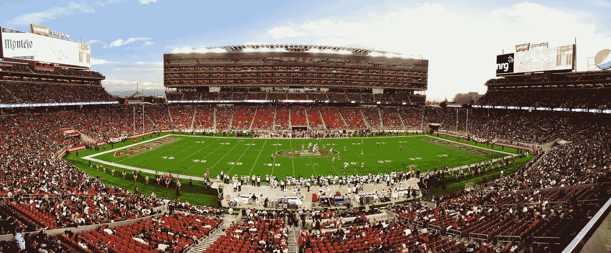
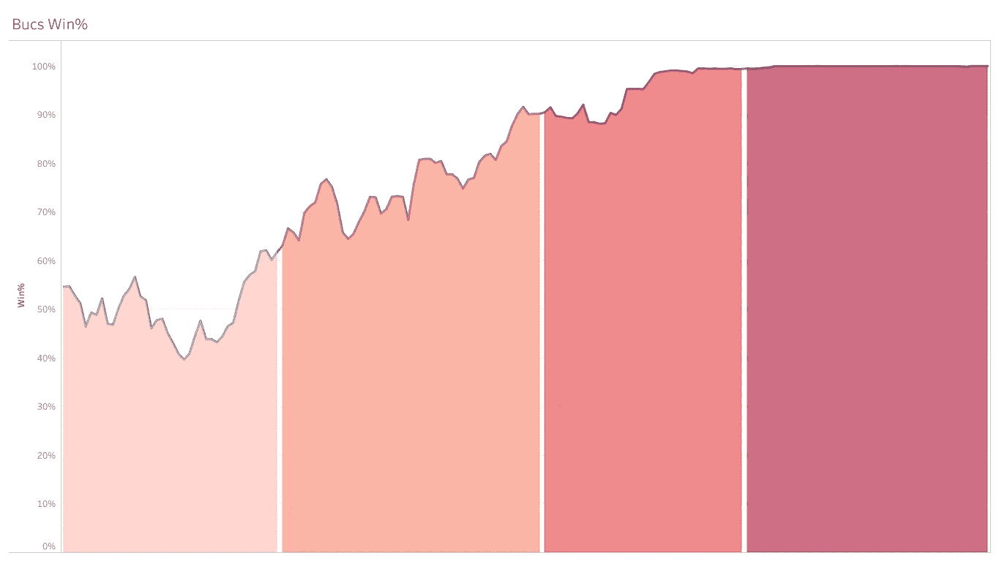
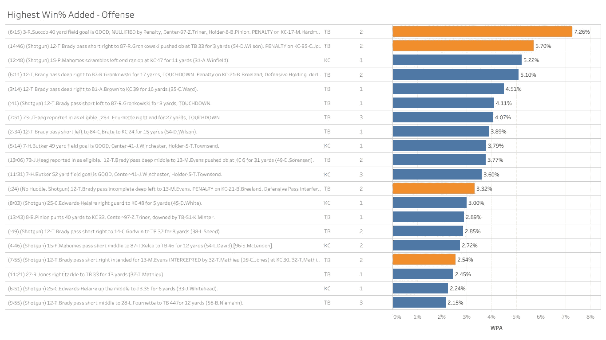
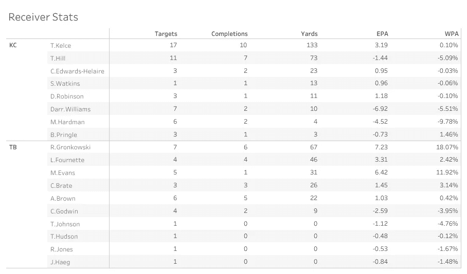
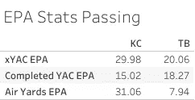

# 超级碗 LV 的统计分析

> 原文：<https://towardsdatascience.com/a-statistical-analysis-of-super-bowl-lv-76138e70b727?source=collection_archive---------56----------------------->

## 酋长海盗队比赛的讨论要点

罗伯特·埃尔南德斯·维拉塔摄于[佩克斯](https://www.pexels.com/photo/nfl-stadium-field-full-with-crowd-watching-the-game-during-daytime-128457/?utm_content=attributionCopyText&utm_medium=referral&utm_source=pexels)

22 周后，NFL 赛季终于结束了，我们可以坐下来回顾一下我们刚刚目睹的一切。作为联盟的惯例，汤姆·布拉迪赢得了他的第 7 枚戒指，这次是在海盗队。这是双方真正的统治性表现，海盗队自始至终赢得了这场比赛。这篇文章将呈现一个游戏的统计摘要，回顾谈话要点并呈现支持它的分析。

## 关键术语

*   **YAC**——接球后码数
*   **xYAC** —接球后的预期码数
*   **EPA** —每场比赛的预期加分
*   **WPA** —每次游戏增加的获胜百分比
*   **EP** —预期点数(可作为 EPA 的总和计算)
*   **移动******棒**——获得第一次击倒的动作**

## **如果最后的分数没有告诉你足够的信息，这些数字可以证明这是一场多么没有争议的比赛。**

****

**作者图片**

**31-9 的最终比分很好地向我们展示了这场比赛是如何进行的。酋长队在前三节每节都得了 3 分，第四节一分未得，而海盗队继续疯狂得分，上半场得了 21 分，下半场得了 10 分。当我们查看 Bucs 的胜率时，在上图中用四分之一进行了颜色编码，这一事实得到了进一步强调，因为 Bucs 在上半场结束前就超过了 90%的水平。很明显，海盗队在第二节给这场比赛打上了印记。在前 15 分钟，他们设法将胜率提高了大约 5%，但在第二季度，这一数字从 60%上升到 90%。自 2014 年海鹰队和野马队之间的总决赛以来，我们还没有见过这种统治地位。在那场比赛中，海鹰队也有类似的统计表现，在第二节达到了 90%的分数，尽管西雅图队在上半场的时间超过了 3 分钟，而上周末的比赛只有 30 秒。**

## **酋长的防守使他们输掉了比赛**

****

**作者图片**

**图表显示了排名前 20 的 WPA 比赛。WPA 是赢球百分比的总和，它本质上代表了一场比赛对一支球队赢得比赛的贡献。这是使用每场比赛的一系列情况输入来计算的，例如获得的码数、剩余时间、第一次进攻所需的码数、新的场地位置等。WPA 的计算方式是这样设计的，即在游戏快结束时，重要的玩法比游戏开始时的相同玩法对 WPA 的影响更大。在对方半场跑 20 码也会比在自己半场跑 20 码得到更高的 WPA。WPA 被设计来调整所有这些情境因素，因此在分析剧本时是一个相当可靠的方法。**

**在上图中，海盗队在 WPA 排名前 20 的比赛中占据了 14 席。橙色突出显示的是比赛中涉及点球的那些，正如我们所看到的，所有这四个点球都是针对酋长队的。合计 18.82%的罚款成本非常高，尤其是考虑到它们发生的关键时刻。4 个点球中的 3 个发生在触地得分，第一个在第 4 和第 5 次投篮尝试中，给了海盗队第一次得分，最终导致 7 分而不是 3 分。从本质上来说，在 WPA 中奖励一支球队 18%的得分和 2 次触地得分在这里是不能低估的，因为我们可以清楚地看到这对决定比赛的胜负有多大的贡献。**

## **首席执行官们没有给帕特里克·马霍斯提供任何东西**

****

**作者图片**

**当看简单的盒子分数时，泰瑞克希尔和特拉维斯凯尔斯有合理的外出。酋长队的两个主力队员的码数比整个 Bucs 接收队加起来还多，但这并不能说明他们的情况表现。整个游戏过程中，酋长们都在丢弃捕获量，EPA 的统计数据让我们更好地了解了这种影响。希尔在比赛中有 73 码，但他不完整的传球和多次移动球棍的失败导致了环保局更具破坏性的表现，而不是积极的表现。例如，凯尔斯的统计数据和伦纳德·福内特的统计数据之间的比较，突出了简单统计数据中没有显示的推论。Fournette 有 1/3 的 Kelce 的接收码，也有 0 次触地得分，但总 EPA 略好。这背后的很大一部分原因可能是因为凯尔斯的不完整传球有多么重要。第三次下降时的多次下降或失误将导致环保局受到更大的处罚，因为局长们将被迫放弃。**

****

**作者图片**

**xYAC EPA 表示进位后从预期码增加的预期点数。持球后的预期码是另一个情境统计，根据球员接球时的位置、接球时的速度和最近的防守队员的距离计算得出。这个统计数据也是为不完整传球计算的，它代表了接球者在接球后的预期跑动距离。酋长的总 xYAC EPA 为 29.98。这告诉我们一些事情。直接的翻译是，马霍斯把他的接球手放在一个很好的位置，因为他们有持续的机会在接球后把球带到更远的地方。这也是对海盗队后场或任何在覆盖范围内打球的人的轻微指控，因为他们确实在太空中留下了接球手。这不一定是一件坏事，托德·鲍尔斯的防守一直优先向 QBs 施压，他的防守计划在周日完美地发挥了作用，但它确实给了我们一些关于海盗如何防守传球的洞察力。**

**完成的 YAC EPA 是 xYAC EPA 的一半，告诉我们接收器在周日完全丢失。我们不得不称赞海盗队的防守，因为他们预测传球和追截接球手的速度非常快，但这是一种无能为力的真实反映。对酋长队来说，在空中和空中得到 60 分，但实际上只得到 9 分是另一个重大的失败。**