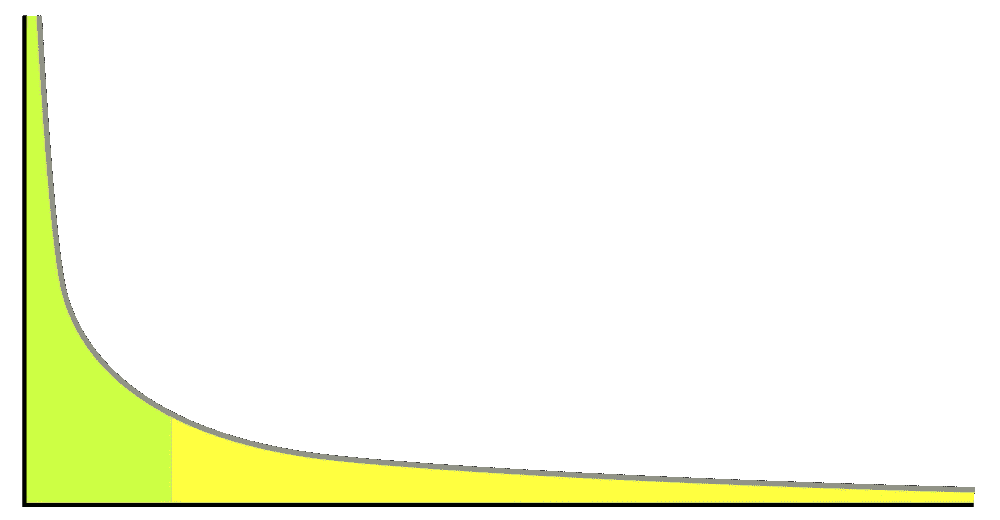
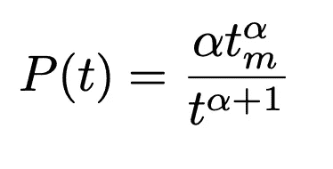
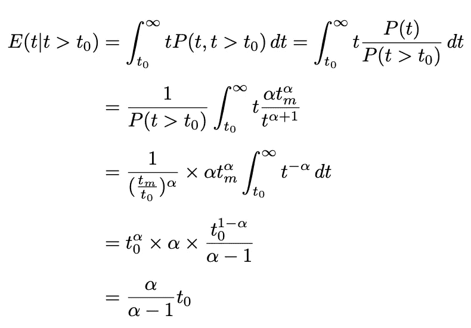
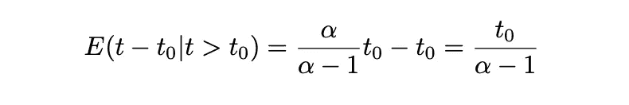
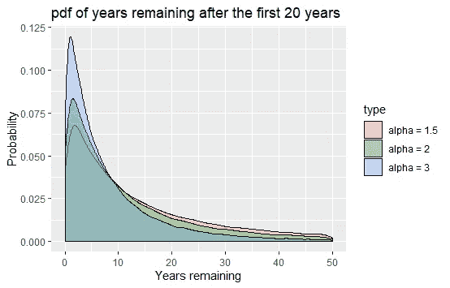
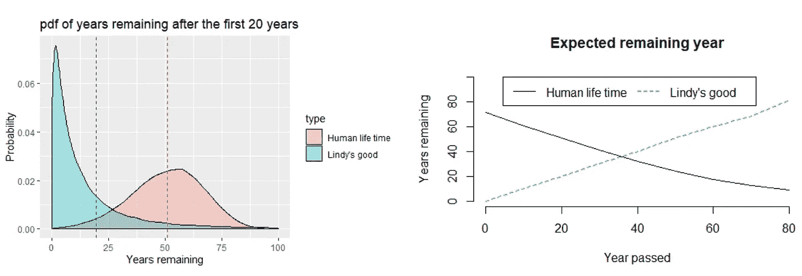

# 优化生活的统计法则:呼唤效应

> 原文：<https://towardsdatascience.com/a-statistical-rule-to-optimize-your-life-the-lindys-effect-96d2c75b080d?source=collection_archive---------11----------------------->

## 在一个信息太多的世界里，你如何从噪音中分辨出信号？

照片由[思想目录](https://unsplash.com/@thoughtcatalog?utm_source=unsplash&utm_medium=referral&utm_content=creditCopyText)在 [Unsplash](https://unsplash.com/s/photos/laptop-book?utm_source=unsplash&utm_medium=referral&utm_content=creditCopyText) 上拍摄

有时候，我一觉醒来，会着急打开手机。浏览所有的社交媒体新闻，浏览《纽约时报》的应用程序，希望在 Youtube 上看到一些新的上传，这需要 ***很多时间*** 。

每天淹没我的信息洪流产生的痛苦大于收获。每一点信息都被优化得“看起来紧急/重要”,以至于我们不得不不断地选择要处理什么，而我们知道其中很少(如果没有的话)会在接下来的 24 小时内保持相关？

如果存在一种规则来识别哪种类型的新闻或信息在未来很长一段时间内仍然相关，那会怎样？

如果有一个指南，你可以用来从其他的噪音中过滤出值得知道的知识，那会怎么样？

有——这叫做**林迪效应**。

## **呼唤效应——或作为质量评判标准的时间价值**

呼唤效应是这样一个观察结果:

> 一件藏物存在的时间越长，它可能存在的时间就越长。

纳西姆·尼古拉斯·塔勒布在他的书**中，把这个概念解释得相当干净:*“如果一本书已经印了四十年，我可以预计它还会印四十年。但是，[……]，如果它能再生存十年，那么它就有望再出 50 年。”***

**这个想法是，像一本书/技术/智力产品等一些不易腐烂的东西的未来预期寿命与它们当前的年龄成正比；每多存活一段时间意味着更长的预期寿命。**

****

## **数学动机:**

**呼唤效应始于一个想法，即一些智力人工制品的寿命遵循**帕累托分布:**一个带有沉重的、“缓慢衰减”尾部的偏斜分布(即大部分数据在尾部)。**

****

**帕累托图的一个例子。左边是占主导地位的少数，右边是包含大量数据的长尾。图片来自维基百科——公共领域。**

**你可能听说过帕累托分布，即著名的 80/20 法则:有几个项目非常普遍，对分布的“头部”贡献很大，例如，20%的高收入者占全国财富的 80%；顶级足球队在英国联赛中只占一小部分，但他们却占据了电视版税的大头。**

**通过帕累托分布对工件的生命周期建模意味着大多数项目将只持续很短的一段时间，但是有一个长尾巴的项目可以持续更长的时间。大量的经济研究已经证实了智能人工制品的这一特性。**

**我们可以将这种工件的寿命概率分布函数——PDF(t)写成帕累托形式:**

****

**其中 ***t_m*** (比例参数)是 **t** 的最小可能值， ***α*** 是形状参数，也称为尾部指数。注意 ***t_m*** 必然是正数，即工件的寿命必须为> 0。**

**现在，我们要找到预期寿命 ***E(t)*** ，条件是它已经持续了一段时间 ***t_0*** 。换句话说，我们要找到 ***E(t|t > t_0)。*****

****

**因此，在 **t_0** 或**E(t-t _ 0 | t>t _ 0)**之后的预期额外寿命为:**

****

**虽然数学看起来令人生畏，但结果却出人意料地清晰。有条件的预期额外寿命简单地是已经过去的时间(*)乘以比例常数***【α-1】***。***

*   *****α*** 越接近 1，比例常数越大，我们对工件的预期额外寿命就越大。如果 ***α*** = 2，则比例常数为 1。即 ***预期额外寿命等于目前所见寿命。*****
*   **例如，当 ***α*** = 2 时，一旦到达 t_0，我们期望的未来寿命也是 t _ 0；如果达到该点使得总寿命到目前为止为 2t_0，则新的预期未来寿命是 2t _ 0；诸如此类。**

## **模拟**

**我知道不是每个人都喜欢数学证明，所以我会试着用一个小模拟来说服你。**

**让我们假设 2021 年是你最喜欢的书的 20 周年纪念，你想知道这本书在完全被遗忘之前还有多少年。**

**我们要做的是从 ***P(t-t_0|t > 20，α)*** 到 ***α，*** 的不同值，模拟生命周期的许多许多场景，并观察分布如何表现 ***。*****

***现在，实际执行这种模拟需要一种称为逆随机采样的技术。它的细节超出了本帖的范围，但是如果你感兴趣，我写了* [*一个小说明*](https://github.com/tuangauss/DataScienceProjects/blob/master/R/lindy/Inverse_Random_Sampling.pdf) *解释技巧。***

**条件抽样和绘图的样本代码**

****

**您可以看到，随着 ***α*** 值的增加，头部周围的条件分布变得“更重”，从而导致剩余年数的条件预期更小。一本已经印了 20 年的书，如果 **α=1.5** ，20 如果如果 **α=2** ，10 如果 **α=3** ，预计还能再印 40 年。**

**一个有趣的结果是比较了剩余寿命的条件预期在呼唤人和人之间的差异。**

**通过一些快速的研究，我发现美国男性的寿命分布遵循平均寿命为 70 岁的威布尔分布。有了这些信息，我们就可以做一些模拟，看看一个人庆祝完 20 岁生日后剩余寿命的条件概率是多少:**

****

**左图:前 20 年过去后呼唤氏好(Pareto with*α= 2)***和人类(Weibull with mean = 70)的条件概率分布函数——虚线代表各自分布的均值。右图:作为已过去年数的函数的预期剩余年数。****

***我们了解到技术和人类有不同的生存模式。***

*   ***考虑到最初的 20 年，呼唤的预期剩余寿命是 20 年，而我们预计美国男性的平均寿命是 50 年(加起来是 70 岁)。***
*   ***然而，一个人越老，他剩下的预期年数就越少。这是因为人类的寿命遵循细尾分布——比帕累托分布的尾部细得多。帕累托分布的重尾是为什么一项技术存活的时间越长，我们就能期待它存活的时间越长。用塔勒布的话来说，技术 ***“反过来老化。”******

## ******运用呼唤效应优化你的生活:******

***本质上，呼唤效应教给我们一个简单的原则:如果你无法决定，那么就让时间成为内容的自然过滤器:***

*   ***我已经卸载了手机上所有的新闻应用，同时订阅了每周新闻简报。如果一个事件是重要的和有新闻价值的，那么它应该在最初的 24 小时之外保持如此。***
*   ***书籍:不知道在比尔·盖茨的读书笔记和 NPR 的书《礼宾》中选择哪本书？读经典。《圣经》、马基雅维利的《君主论》、马可·奥勒留的《沉思录》,这些书的真知灼见经受住了时间的考验，它们很可能比今年 NYT 的大多数畅销书都要长寿。***
*   ***ML 算法:根据 2016 年 [Kdnuggets 的一项调查](https://www.kdnuggets.com/2016/09/poll-algorithms-used-data-scientists.html)，高斯在 19 世纪发明的通过最小平方估计的线性回归仍然是迄今为止数据科学家中最受欢迎的机器学习技术。如果我必须在最小平方线性回归和深度神经网络之间打赌，并选择哪种算法在 2200 年仍将被使用，我的赌注肯定是前者。***

## ***一些警告:***

***正如我们已经看到的，呼唤效应是非常整齐的概率陈述。但它们确实是概率陈述，你不应该把它看得太重:***

*   ***我们并不确定哪一项展现了呼唤效应。申请的条件相当严格。并非一切都遵循帕累托分布:人类的寿命当然不会，原子衰变也不会。最重要的是，即使一个工件的寿命以帕累托方式分布，我们已经看到，如果我们只是稍微移动一下形状参数，额外的寿命预期会有很大的不同。***
*   ***注意，我计算的是***E(t | t>t _ 0)***，也就是说，它只以知道 ***t > t_0*** 为条件。如果你有额外的信息，比如有证据表明某项技术正在衰落，那么你就需要以这些信息为条件。***

***因此，林迪效应是一种微不足道的启发法，随着你获得更多的相关信息，它的有用性会降低。***

***但是你知道，要过滤阅读的书籍和新闻，也许琐碎的试探法就足够了。***

***如果你喜欢这篇文章，你可能也会喜欢我的另一篇关于有趣的统计事实和经验法则的文章***

*   ***[迪士尼电影是对的——我们都是特殊的，从统计数据来看也是如此](/disney-movies-were-right-we-are-all-special-and-statistically-so-3bb56e79ab71)***
*   ***[规则三:计算尚未发生事件的概率](/the-rule-of-three-calculating-the-probability-of-events-that-have-not-yet-occurred-106144dc2c39)***

***对于其他深潜分析:***

*   ***[贝叶斯统计如何说服我去健身房？](/how-bayesian-statistics-convinced-me-to-hit-the-gym-fa737b0a7ac)***
*   ***[利用数据驱动的体育博彩策略赚大钱](/making-big-bucks-with-a-data-driven-sports-betting-strategy-6c21a6869171)***
*   ***[寻找上帝的贝叶斯探索](/a-bayesian-quest-to-find-god-b30934972473)***

***这个项目的完整代码可以在我的 Github 中找到。***