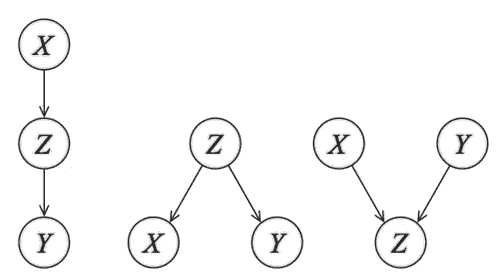
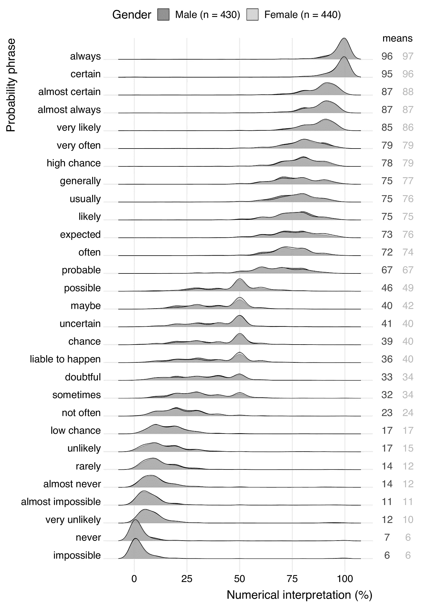
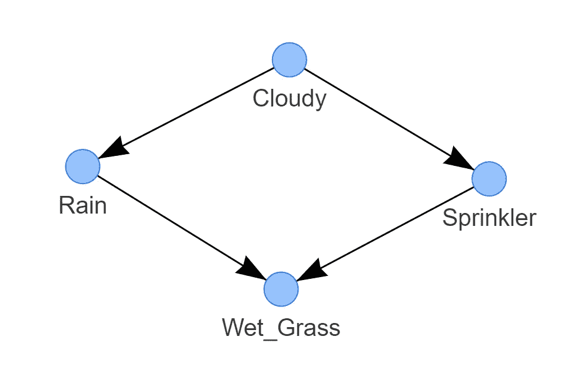
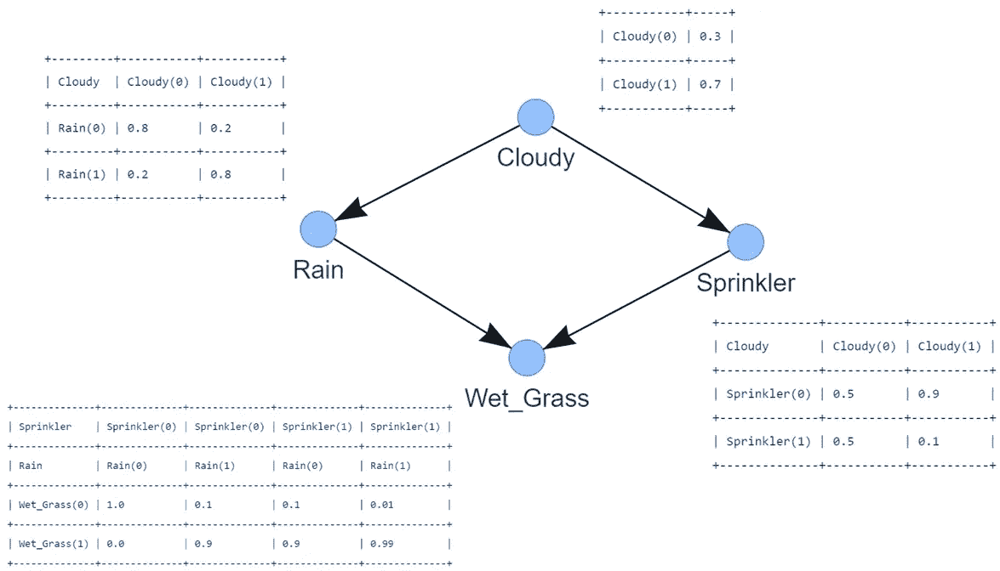

# 使用贝叶斯定理设计知识驱动模型的分步指南。

> 原文：<https://towardsdatascience.com/a-step-by-step-guide-in-designing-knowledge-driven-models-using-bayesian-theorem-7433f6fd64be?source=collection_archive---------7----------------------->

## [实践教程](https://towardsdatascience.com/tagged/hands-on-tutorials)

## 万一你没有数据但是有专家知识。将知识转化为计算机辅助模型的入门指南。


*照片由:* [*基兰木*](https://unsplash.com/@kieran_wood) *，Unsplash*

数据是模型的燃料，但是您可能已经目睹了没有数据，只有一个领域专家可以很好地描述甚至预测给定环境下的*情况*的情况。我将从 ***贝叶斯概率*** 的角度总结 ***知识驱动*** 模型的概念，接下来是一个动手教程，演示将专家的知识转化为贝叶斯模型的步骤，目标是做出推论。我将使用 S *prinkler 系统*从概念上解释从知识到模型的过程中的步骤。最后，我将讨论复杂知识驱动模型的挑战，以及由于提问和提取知识而可能出现的系统性错误。所有的例子都是使用 python [*库 bnlearn*](https://erdogant.github.io/d3graph) *创建的。*

*如果你觉得这篇文章很有帮助，可以使用我的* [*推荐链接*](https://medium.com/@erdogant/membership) *继续无限制学习，并注册成为中级会员。另外，* [*关注我*](http://erdogant.medium.com) *关注我的最新内容！*

# 我们能把专家的知识融入模型吗？

当我们谈论知识时，它不仅仅是描述性的知识，如事实。知识也是对某人或某事的熟悉、觉察或了解，程序性知识(技能)，或熟人知识[ [1](https://en.wikipedia.org/wiki/Knowledge) ]。

> 无论你有什么知识，或者想使用什么知识，如果你想建立一个计算机辅助知识模型，它都需要以计算机可解释的方式呈现。

这意味着你需要设计一个建立在一系列流程阶段上的系统。或者换句话说，一个序列从一个过程的输出进入下一个过程的输入。多个简单的序列可以组合成一个复杂的系统。我们可以把这样一个系统表示成一个有节点和边的图。每个节点对应一个变量，每条边代表变量对之间的条件依赖关系。通过这种方式，我们可以根据专家的知识定义一个模型，最好的方法是使用贝叶斯模型。**要回答这个问题，*我们能把专家的知识转化为模型吗？* '** *嗯，这要看你把知识用图形表示出来有多准确，用概率定理又叫贝叶斯图形模型*把它粘在一起有多精确。尽管如此，还是有一些限制。

# 贝叶斯图形模型是创建知识驱动模型的理想选择。

机器学习技术的使用已经成为在许多领域获得有用见解和做出预测的标准工具包。然而，许多模型是数据驱动的，这意味着需要数据来学习模型。将专家的知识整合到数据驱动的模型中是不可能的，也不容易做到。然而，机器学习的一个分支是 ***贝叶斯图形模型*** (又名*贝叶斯网络、贝叶斯信念网络、贝叶斯网、因果概率网络和影响图*)，可以用来将专家知识纳入模型并进行推理。下面是一些贝叶斯图形模型的优点，我将在本文中强调。

*   将领域/专家知识纳入图表的可能性。
*   它有模块化的概念。
*   复杂的系统是由简单的部分组合而成的。
*   图论直观地提供了高度交互的变量集。
*   概率论提供了结合各部分的粘合剂。

要制作贝叶斯图形模型，您需要两个要素:1 .**有向无环图**和 2。**条件概率表**。只有一起才能形成专家知识的表示。

# 第 1 部分:贝叶斯图是有向无环图(DAG)

至此，你知道知识可以表示为一个系统化的过程，可以看做一个图形。在贝叶斯模型的情况下，一个图需要被表示为一个 *DAG* 。 ***但达格到底是什么？*** 首先，它代表 **D** 有向 **A** 循环 **G** 图，是一个具有**有向**的节点(变量)和边的网络(或**图**)。图 1 描绘了三个*独特的* 图案，可以用三个变量(X，Y，Z)来制作。节点对应于变量 X、Y、Z，有向边(箭头)表示依赖关系或条件分布。网络是无环的 T21，这意味着不允许有反馈回路。

> 使用 DAG，可以通过组合(较简单的)部分来创建复杂的系统。



图 1:三节点 DAG 的三种独特模式(图片由作者提供)。

所有 Dag(大型或小型)都是根据以下 3 条规则构建的:

1.  边是条件依赖。
2.  边缘是有方向的。
3.  不允许反馈循环。

这些规则很重要，因为如果您删除方向性(或箭头)，三个 Dag 将变得相同。或者换句话说，有了方向性，我们可以使 DAG 可识别[2]。有许多博客、文章和维基百科页面描述了 Dag 背后的统计数据和因果关系。您需要理解的是，每个贝叶斯网络都可以通过这三种独特的模式来设计，并且应该代表您想要建模的过程。设计 DAG 是创建知识驱动模型的第一部分。 ***第二部分是定义条件概率表*** ，用(条件)概率描述每个节点的关系强度。

# 第 2 部分:定义条件概率表来描述节点关系的强度。

概率论(又名*贝叶斯定理或贝叶斯规则*)构成了贝叶斯网络的基础。查看这篇关于 [***贝叶斯结构学习***](/a-step-by-step-guide-in-detecting-causal-relationships-using-bayesian-structure-learning-in-python-c20c6b31cee5)[3](/a-step-by-step-guide-in-detecting-causal-relationships-using-bayesian-structure-learning-in-python-c20c6b31cee5)*的中型文章，阅读更多关于贝叶斯定理的具体部分。虽然这个定理在这里也适用，但还是有一些不同。首先，在知识驱动的模型中，CPT 不是从数据中学习的(因为没有数据)。相反，概率需要通过提问从专家那里获得，并随后存储在所谓的*条件概率表(CPT)(也称为条件概率分布，CPD)中。在本文中，我将交替使用 CPT 和 CPD。**

> *CPTs 用条件概率或先验来描述每个节点的关系强度。*

*然后，CPT 与 Bayes 规则一起使用，以更新允许做出推断的模型信息。在下一节中，我将通过洒水车用例来演示如何用专业知识准确地填写 CPT。但是首先，将专家的知识转化为概率存在挑战。*

# *将专家知识转化为概率*

*当我们想要建立一个知识驱动的模型时，从专家那里提取正确的信息是至关重要的。*领域专家将告知成功流程的可能性和副作用的风险。将信息理解为旨在最大限度地降低沟通失误的风险，这一点非常重要。当与专家交谈时，许多估计的概率是口头传达的，用诸如“*很可能*之类的术语，而不是确切的百分比。**

> *确保发送方和接收方的口头概率短语在概率或百分比方面是相同的。*

*在某些领域中，有一些指导原则将诸如' *common* '这样的术语描述在一定的范围内，比如说 1-10%。但是如果没有该领域的背景知识，单词' *common* '很容易被解释为不同的数字[ [4](https://www.semanticscholar.org/paper/Variability-in-the-interpretation-of-probability-in-Willems-Albers/5ff22e5487d51f1edc37f6018daab2d48d631793) ]。此外，概率短语的解释会受到其上下文[ [4](https://www.semanticscholar.org/paper/Variability-in-the-interpretation-of-probability-in-Willems-Albers/5ff22e5487d51f1edc37f6018daab2d48d631793) ]的影响。例如，比较您在下面两个语句中的数字解释:*

*   *明年六月，曼彻斯特*(英格兰)可能会下雨。**
*   **明年六月的 ***巴塞罗纳*** (西班牙)可能会下雨。**

**很可能，你对第一句话中的“*可能*”的数值解释高于第二句话。小心上下文曲解，因为它也可能导致系统性错误，从而导致不正确的模型。概率短语的概观图如图 2 所示。**

> **“不可能”似乎并不总是不可能的！**

****

**图 2:概率短语的解释。资料来源:Sanne Willems 等人，JCOM [ [4](https://www.semanticscholar.org/paper/Variability-in-the-interpretation-of-probability-in-Willems-Albers/5ff22e5487d51f1edc37f6018daab2d48d631793) ]**

# **bnlearn 图书馆。**

**关于用于本文所有分析的 [*bnlearn*](https://erdogant.github.io/bnlearn) 库的一些话。bnlearn 库旨在应对一些挑战，例如:**

*   *****结构学习*** :给定数据:估计一个捕捉变量间依赖关系的 DAG。**
*   *****参数学习*** :给定数据和 DAG:估计个体变量的(条件)概率分布。**
*   *****推理*** :给定学习过的模型:为你的查询确定准确的概率值。**

***[*bnlearn*](https://erdogant.github.io/bnlearn)*相比其他贝叶斯分析实现有什么好处？****

*   **在 pgmpy 库的基础上构建**
*   **包含最想要的贝叶斯管道**
*   **简单直观**
*   **[开源](https://github.com/erdogant/bnlearn/blob/master/README.md)**
*   **[文档页面](https://erdogant.github.io/bnlearn)**

# **建立一个基于专家知识的喷水灭火系统。**

**让我们从一个简单直观的例子开始，展示如何基于专家的知识构建真实世界的模型。在这个用例中，我将扮演自动喷水灭火系统领域专家的角色。**

**假设我的后院有一个自动喷水灭火系统，在过去的 1000 天里，我亲眼目睹了*它是如何以及何时工作的。我没有*收集任何数据，但我创造了一种关于工作的直觉。姑且称之为*专家观点*或*领域知识*。注意，洒水系统是贝叶斯网络中一个众所周知的例子。****

**从我的专家的角度来看，我知道一些关于这个系统的事实；它有时开有时关(是不是很棒)。我经常看到-*-如果自动喷水系统在上*，那么*草*可能会-*-*-*湿*。然而，我也知道*下雨*-*-几乎肯定* -也会导致*湿草*，并且*喷水*系统在大多数时间* - *关闭*。我知道*云*在开始*下雨*之前*经常*出现*。最后，我注意到在*洒水器*和*多云*之间有一个*微弱的*互动，但我不完全确定。****

*从这一点开始，你需要将专家的知识转化为模型。这可以通过首先创建 ***图*** 然后定义连接图中节点的***CPT***来系统地完成。*

## *喷水灭火系统由四个节点组成，每个节点有两种状态。*

*在喷水灭火系统中有四个节点，您可以从专家的视图中提取。每个节点有两种工作状态:下雨:是或否，多云:是或否，喷水系统:开或关，湿草:真或假。*

## *定义简单的一对一关系。*

*复杂的系统是由简单的部分组合而成的。这意味着你 ***不需要*** 立刻创建或设计整个系统，而是首先定义较简单的部分。更简单的部分是一对一的关系。在这一步，我们将把专家的观点转换成关系。我们从专家那里得知:*雨*取决于*多云*状态，*湿草*取决于*雨*状态，但是*湿草*也取决于 s *prinkler* 状态。最后我们知道*洒水*靠*多云。*我们可以建立以下四种有向的一对一关系。*

*   **多云* → *下雨**
*   **雨* → *湿草**
*   **洒水器* → *湿草**
*   **多云* → *洒水器**

*重要的是要认识到，一对一部分之间的关系强度存在差异，需要使用 CPT 来定义。但是在进入 CPTs 之前，让我们先使用 [*bnlearn*](https://erdogant.github.io/bnlearn) 制作 DAG。*

## *DAG 基于一对一的关系。*

*这四个有向关系现在可以用来构建带有节点和边的图。每个节点对应一个变量，每个边代表变量对之间的条件依赖关系。在 [*bnlearn*](https://erdogant.github.io/bnlearn) 中，我们可以赋值并图形化表示变量之间的关系。*

*`pip install bnlearn`*

*根据一对一的关系设计喷水灭火系统的 DAG。*

*在图 3 中是生成的 DAG。我们称之为*因果 DAG* ,因为我们已经假设我们编码的边代表我们对喷水系统的因果假设。*

**

*图 3:喷水灭火系统的 DAG。它编码了以下逻辑:湿草依赖于洒水器和雨水。洒水车依多云，雨依多云(图片作者)。*

*此时，DAG 拥有 ***没有*** 关于底层依赖关系的知识。我们可以用`bn.print(DAG)` 检查 CPT，这将导致消息*“没有 CPD 可以打印”*。我们需要用所谓的*条件概率表*和向 DAG 添加知识，我们将***依靠专家的知识来填充条件概率表。****

> **可以用条件概率表(CPT)将知识添加到 DAG 中。**

## **建立条件概率表。**

**洒水系统是一个简单的贝叶斯网络，其中*湿草*(子节点)受到两个父节点(*雨*和*洒水器*)的影响(见图 1)。节点*洒水*和*下雨*受单个节点影响；*多云*。*多云*节点不受任何其他节点的影响。**

**我们需要将每个节点与一个概率函数相关联，该函数将该节点的父变量的一组特定值作为输入，并给出(作为输出)该节点所表示的变量的概率。让我们为四个节点做这件事。**

## **CPT:多云**

***多云*节点有两种状态(是或否)并且没有依赖关系。当处理单个随机变量时，计算概率相对简单。从我专家的角度来看，在过去的 1000 天里，我有 70%的时间亲眼目睹了多云的天气(不过我没有抱怨，只是失望)。由于概率加起来应该是 1， ***不是*** *多云*的时间应该是 30%。CPT 看起来如下:**

**定义节点的 CPT:多云。**

## **CPT:下雨**

***雨*节点有两种状态，受*多云*制约，多云也有两种状态。总的来说，我们需要指定 4 个条件概率，即在给定一个事件发生的情况下，另一个事件发生的概率。在我们的情况下；假定*多云*，事件*下雨*发生的概率。 ***证据*** 因此*多云*而**变量**是*雨*。从我的专家的角度来看，我可以告诉你，当下雨的时候，80%的时间都是多云。我也确实看到*下雨* 20%的时间看不到*云* ( *真的吗？是的。真实故事*)。**

**定义节点的 CPT:Rain。**

## **CPT:洒水喷头**

***洒水器*节点有两种状态，并受*多云*两种状态的制约。总的来说，我们需要指定 4 个条件概率。这里我们需要定义*喷头*出现*多云*的概率。 ***证据*** 因此*多云*而**变量**是*雨*。我可以说当*洒水器*关闭时，90%的时间都是*多云*。因此，对于*洒水器*为真和*多云*为真的对应情况是 10%。其他的概率我不太清楚，所以我会设置为 50%的几率。**

**定义节点的 CPT:喷水装置。**

## **CPT:湿草**

***湿草*节点有两种状态，受两个双亲节点制约；*下雨*和*洒水*。这里我们需要定义*湿草*的概率，给定*雨*和*洒水车*的发生。总之，我们必须指定 8 个条件概率(2 个状态^ 3 个节点)。**

*   **作为一个专家，我可以肯定，比如说 99%，在*下雨*或者*洒水器*开了之后看到*湿草*:P(湿草=1 |雨=1，洒水器=1) = 0.99。因此对应的是 P(湿草=0|雨=1，洒水器= 1)= 1–0.99 = 0.01**
*   **作为一个专家，我完全确定当不下雨或者洒水器*没有打开的时候，没有*湿草*:P(湿草=0 |雨=0，洒水器=0) = 1。相应的是:P(湿草=1 |雨=0，洒水器= 0)= 1–1 = 0***
*   *作为专家，我知道*湿草*几乎都发生在*下雨*和*洒水器*关闭的时候(90%)。p(湿草=1 |雨=1，洒水车=0) = 0.9。对应的就是:P(湿草=0 |雨=1，洒水车= 0)= 1–0.9 = 0.1。*
*   *作为专家，我知道*湿草*几乎总是发生在不*下雨*并且*洒水器*开着(90%)的时候。p(湿草=1 |雨=0，洒水车=1) = 0.9。对应的就是:P(湿草=0 |雨=0，洒水车= 1)= 1–0.9 = 0.1。*

*定义节点的 CPT:湿草地*

*就是这个！此时，我们定义了 DAG 与 CPT 之间的关系强度。现在我们需要连接 DAG 和 CPT。*

## *使用 CPT 更新 DAG:*

*所有 CPT 都已创建，现在我们可以将它们与 DAG 连接起来。作为健全性检查，可以使用 *print_DAG* 功能检查 CPT。*

*用 CPT 更新喷水灭火系统的 DAG。*

*带有 CPT 的 DAG 现在将如图 4 所示。*

**

*图 4:喷水灭火系统的因果 DAG 与连接的 CPT(图片由作者提供)。*

# *对因果模型进行推论。*

*干得好！至此，您已经创建了一个描述数据结构的模型，以及定量描述每个节点及其父节点之间的统计关系的 CPT。让我们对我们的模型提几个问题，举一反三！*

```
****How probable is having wet grass given the sprinkler is off?*** *P(Wet_grass=1 | Sprinkler=0) = 0.6162****How probable is a rainy day given sprinkler is off and it is cloudy?***
*P(Rain=1 | Sprinkler=0, Cloudy=1) = 0.8**
```

*对因果喷水灭火系统做出推论。*

# *讨论*

*贝叶斯网络的一个优点是，对于人类来说，直观上更容易理解直接相关性和局部分布，而不是完全的联合分布。要制作知识驱动的模型，我们需要两种成分；DAG 和条件概率表(CPT)。两者都来源于专家的提问。DAG 描述数据的结构，需要 CPT 来定量描述每个节点与其父节点之间的统计关系。虽然这种方法似乎是合理的，但是您应该意识到通过向专家提问可能会出现系统错误，以及在构建复杂模型时的局限性。*

## *我如何知道我的因果模型是正确的？*

*在喷头的例子中，我们通过个人经验提取领域专家的知识。虽然我们创建了因果图，但是很难完全验证因果图的有效性和完整性。例如，你可能对概率和图表有不同的观点，你也可能是对的。作为一个例子，我描述道:“*我也确实在 20%的时间里没有看到云的情况下看到了雨”。*对这样的说法进行争论可能是有道理的。相反，也可能在*同时存在多个真知识模型*。在这种情况下，你可能需要综合各种可能性，或者决定谁是对的。*

> *所使用的知识和专家的经验一样丰富，和专家的偏见一样丰富多彩。*

*或者换句话说，我们通过向专家提问提取的概率是 ***主观概率***【5】。在洒水喷头的例子中，接受这个概率的概念是个人的就足够了，它反映了特定的人在特定的时间特定的地点的信仰程度。这样质疑自己；*如果专家生活在英国相比于西班牙，喷头型号会有变化吗？**

*如果你想使用这样的程序来设计一个知识驱动的模型，理解人们(专家)如何得出概率估计是很重要的。在文献中描述了当对不确定事件进行推理时，人们很少遵循概率原则，而是用有限数量的试探法[ [6](https://www.science.org/lookup/doi/10.1126/science.185.4157.1124) ，7]代替概率法则，例如*代表性*、*可用性*和*来自锚的调整。*请注意，这可能会导致系统误差和不正确的模型。此外，确保发送方和接收方的口头概率短语在确切的概率或百分比方面是相同的。*

## *复杂性是一个主要的限制。*

*所提出的喷水灭火系统只有几个节点，但是贝叶斯网络可以包含更多具有多级父子依赖关系的节点。在贝叶斯网络中填充条件概率表(CPT)所需的概率分布的数量随着与该表相关联的父节点的数量呈指数增长。如果要通过从领域专家那里获得的知识来填充表格，那么任务的巨大规模会形成相当大的认知障碍[ [8](https://arxiv.org/ftp/cs/papers/0411/0411034.pdf) ]。*

> *过多的父子依赖会对领域专家形成相当大的认知障碍。*

*例如，如果 *m* 父节点表示*布尔*变量，那么概率函数由一个具有*条目的表来表示，每个条目对应一个可能的父组合。不要创建大图(超过 10-15 个节点),因为父子依赖的数量会对领域专家形成相当大的认知障碍。如果您有想要建模的系统的数据，也可以使用结构学习[3] 来学习结构(DAG)和/或其参数(CPTs) [。](/a-step-by-step-guide-in-detecting-causal-relationships-using-bayesian-structure-learning-in-python-c20c6b31cee5)**

## *****我们能把专家的知识变成模型吗？*****

**我再重复一遍我之前的说法:*“嗯，这取决于你用图形表示知识的准确度，以及你用概率定理把它粘在一起的准确度。”***

# **最后的话**

**这就是了。创建一个知识驱动的模型并不容易。这不仅是关于数据建模，也是关于人类心理。确保你为专家面试做好准备。多次短面试比一次长面试好。系统地问你的问题。首先设计有节点和边的图，然后进入 CPTs。讨论概率时要谨慎。理解专家如何得出他的概率，并在需要时进行标准化。检查时间和地点是否会影响结果。建立模型后进行健全性检查。偶尔微笑。**

***注意安全。保持冷静。***

*****欢呼，E.*****

***如果你觉得这篇文章很有帮助，可以使用我的* [*推荐链接*](https://medium.com/@erdogant/membership) *继续无限制学习，并注册成为中级会员。另外，* [*关注我*](http://erdogant.medium.com) *保持我的最新内容！***

## **软件**

*   **[bnlearn github/documentation](https://erdogant.github.io/d3graph)**

## **我们连线吧！**

*   **[让我们在 LinkedIn 上联系](https://www.linkedin.com/in/erdogant/)**
*   **[在 Github 上关注我](https://github.com/erdogant)**
*   **[在 Medium 上跟随我](https://erdogant.medium.com/)**

# **参考**

1.  **维基百科，[知识](https://en.wikipedia.org/wiki/Knowledge)**

**2.朱迪亚·珀尔(2000 年)。因果关系:模型、推理和推论。剑桥大学出版社。ISBN 978–0–521–77362–1。OCLC 42291253。**

**3.E.Taskesen，[使用 Python 中的贝叶斯结构学习检测因果关系的逐步指南](/a-step-by-step-guide-in-detecting-causal-relationships-using-bayesian-structure-learning-in-python-c20c6b31cee5)，Medium，2021**

**4.Sanne Willems 等人，[荷兰新闻文章中概率短语解释的可变性——误传的风险](https://www.semanticscholar.org/paper/Variability-in-the-interpretation-of-probability-in-Willems-Albers/5ff22e5487d51f1edc37f6018daab2d48d631793)，JCOM，2020 年 3 月 24 日**

**5.R. Jeffrey，主观概率:真实的事物，剑桥大学出版社，剑桥，英国，2004 年。**

**6.A. Tversky 和 D. Kahneman，[不确定性下的判断:启发和偏见](https://www.science.org/lookup/doi/10.1126/science.185.4157.1124)，《科学》，1974 年**

**7.特沃斯基和 d .卡内曼，“不确定性下的判断:试探法和偏见”，载于《不确定性下的判断:试探法和偏见》，d .卡内曼、p .斯洛维奇和 a .特沃斯基编辑。，剑桥大学出版社，剑桥，1982 年，第 3-2 页**

**8.Balaram Das，[生成贝叶斯网络的条件概率:缓解知识获取问题](https://arxiv.org/ftp/cs/papers/0411/0411034.pdf)。Arxiv**