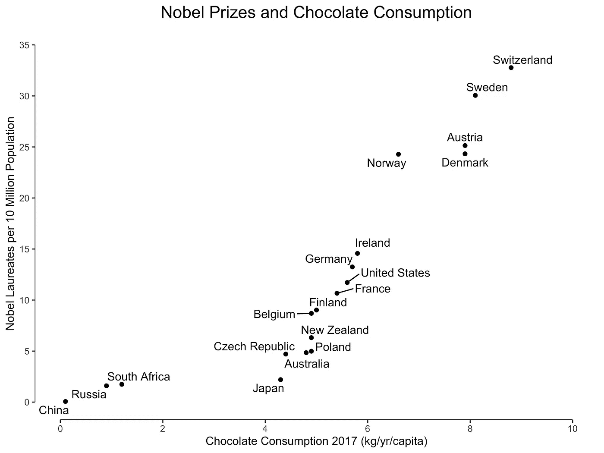
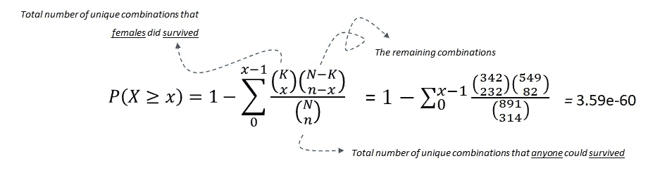
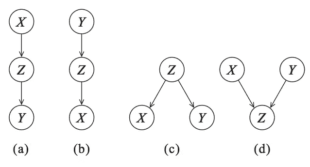
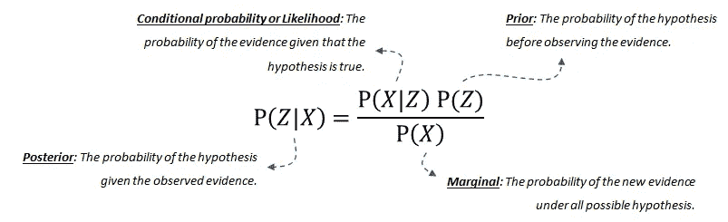
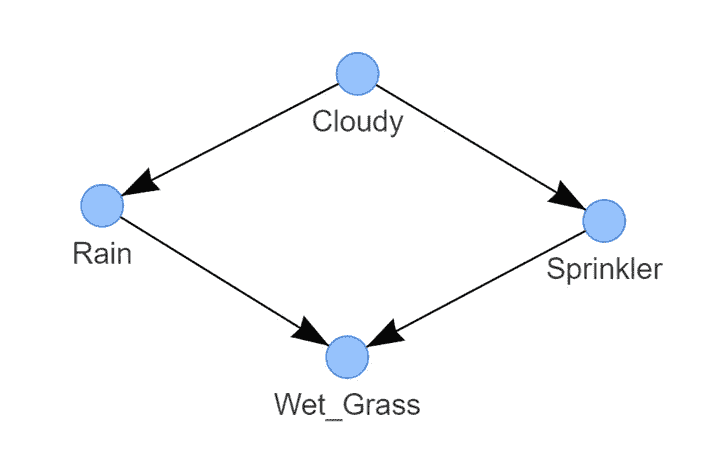
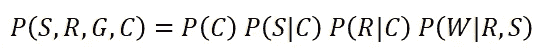
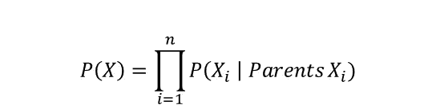
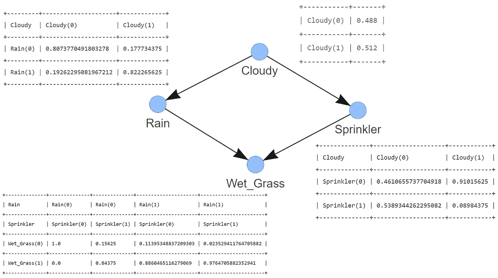

# 使用 Python 中的贝叶斯结构学习检测因果关系的分步指南

> 原文：<https://towardsdatascience.com/a-step-by-step-guide-in-detecting-causal-relationships-using-bayesian-structure-learning-in-python-c20c6b31cee5?source=collection_archive---------0----------------------->

## [实践教程](https://towardsdatascience.com/tagged/hands-on-tutorials)

## 有效确定变量间因果关系的入门指南。


*照片由*[GR 股票](https://unsplash.com/@grstocks?utm_source=unsplash&utm_medium=referral&utm_content=creditCopyText) *上* [*下*](https://unsplash.com/s/photos/strategic?utm_source=unsplash&utm_medium=referral&utm_content=creditCopyText)

确定变量之间的因果关系可能是一个具有挑战性的步骤，但它对于战略行动非常重要。我将从 ***贝叶斯概率*** 方面总结 ***因果模型*** 的概念，后面是一个动手教程，利用*贝叶斯结构学习*检测*因果*关系。我将使用*喷洒器数据集*从概念上解释如何使用 Python 库 [*bnlearn*](https://erdogant.github.io/bnlearn) *学习结构。*

*如果你觉得这篇文章很有帮助，可以使用我的* [*推荐链接*](https://medium.com/@erdogant/membership) *继续无限制学习，并注册成为中级会员。另外，* [*关注我*](http://erdogant.medium.com) *关注我的最新内容！*

# 背景

在疾病预测、推荐系统、自然语言处理等许多领域，机器学习技术的使用已经成为获得有用见解和进行预测的标准工具包。虽然可以实现良好的性能，但提取与目标变量的因果关系并不简单。换句话说:*哪些变量对目标变量有直接的因果作用？*这些洞察对于确定*得出结论的驱动因素*非常重要，因此可以采取战略行动。机器学习的一个分支是贝叶斯概率图形模型，也称为贝叶斯网络(BN)，可用于确定这些因果因素。

在我们进入因果模型的技术细节之前，让我们重温一些术语。术语“*相关性*”和“*关联性*”经常互换使用。但我们都知道，相关或关联并不是因果关系。或者换句话说，观察到的两个变量之间的关系并不一定意味着一个导致另一个。从技术上讲，相关性指的是两个变量之间的线性关系，而关联性指的是两个(或更多)变量之间的任何关系。另一方面，因果关系意味着一个变量(通常称为预测变量或自变量)引起另一个变量(通常称为结果变量或因变量)[1]。在接下来的两节中，我将通过示例简要描述*关联*和*关联*。

# 相互关系

皮尔逊相关是最常用的相关系数。这是如此普遍，它经常被用作相关的同义词。强度由 *r* 表示，并在从-1 到 1 的标准化范围内测量样本中线性关系的强度。使用关联时有三种可能的结果:

*   正相关:两个变量之间的关系，其中两个变量的运动方向相同
*   负相关:两个变量之间的关系，其中一个变量的增加与另一个变量的减少相关
*   无相关性:两个变量之间没有关系。

图 1 展示了一个正相关的例子，在图 1*中，我们看到了巧克力消费量与每个国家诺贝尔奖获得者人数之间的关系【2】。*



图 1:巧克力消费与诺贝尔奖得主之间的相关性

该图显示，巧克力消费可能意味着诺贝尔奖获得者的增加。或者反过来说，诺贝尔奖获得者的增加同样可能导致巧克力消费量的增加。尽管相关性很强，但更有可能的是，社会经济地位或教育系统质量等未被观察到的变量可能会导致巧克力消费量和诺贝尔奖获得者人数的增加。或者换句话说，这种关系是否是因果关系还是个未知数[2]。这并不意味着相关性本身是无用的，它只是有一个不同的目的[3]。相关性本身并不意味着因果关系，因为统计关系并不唯一地约束因果关系。

# 联想。

当我们谈到*关联*时，我们的意思是一个变量的某些值往往与另一个变量的某些值同时出现。从统计学的角度来看，有许多关联的测量方法(如卡方检验、Fisher 精确检验、超几何检验等),通常用于一个或两个变量为序数或名义变量的情况。应该注意的是，*相关性*是一个技术术语，而术语*关联*不是，因此，在统计学上并不总是有一致的含义。这意味着陈述你正在使用的术语的含义总是一个好习惯。关于关联的更多信息可以在这个博客[4]中找到，并且阅读这个关于如何[通过一个重要关联的网络](/explore-and-understand-your-data-with-a-network-of-significant-associations-9a03cf79d254) [5】探索和理解你的数据的博客。

为了举例，我将使用*超几何测试*来演示两个变量是否与使用 Titanic 数据集的*相关联。泰坦尼克号数据集在许多机器学习例子中使用，众所周知，*性别*状态(女性)是*存活率*的良好预测器。我来演示一下如何计算*幸存*和*女性*之间的*关联*。*

首先安装[*bnlearn*](https://erdogant.github.io/bnlearn)*库，只加载泰坦尼克数据集。*

```
*pip install bnlearn*
```

*问:雌性存活的概率有多大？*

*存活与雌性之间的超几何检验*

> ***无效假设**:存活者与女性没有关系。*

*超几何检验使用超几何分布来衡量离散概率分布的统计显著性。在本例中， ***N*** *是总体大小(891)，* ***K*** *是总体中成功状态的数量(342)，* ***n*** *是样本大小/抽签数(314)，* ***x*** *是成功的数量**

**

*等式 1:使用超几何检验来检验存活者和雌性之间的关联。*

*我们可以在α= 0.05 的情况下拒绝零假设，因此，我们可以谈论幸存者和女性之间的统计显著关联*。* ***重要的是，联想本身并不意味着因果关系。*** 我们需要区分 ***边际*** 关联和 ***条件*** 关联。后者是因果推理的关键组成部分。*

# *因果关系。*

*因果关系是指一个(独立)变量引起另一个(因变量)，由*赖兴巴赫(1956)* 表述如下:*

> *如果两个随机变量 x 和 y 在统计上是相关的(X/Y)，那么要么(a) X 导致 y，(b) Y 导致 x，要么(c)存在第三个变量 z 导致 x 和 y。此外，给定 z，即 X⊥Y∣Z.，x 和 y 变得独立*

*这个定义包含在贝叶斯图形模型中(*又称贝叶斯网络、贝叶斯信念网络、贝叶斯网、因果概率网络和影响图*)。同一个技术有很多名字。为了确定因果关系，我们可以使用贝叶斯网络(BN)。让我们从图表开始，可视化由*赖兴巴赫* (X，Y，Z)描述的三个变量之间的统计相关性(见图 2)。节点对应于变量(X，Y，Z ),有向边(箭头)表示依赖关系或条件分布。*

**

*图 2:Dag 编码条件独立性。(a，b，c)是等价类。(a，b) *级联，*(c)*、【d】是具有 *V 型结构的特殊类。***

**可以创建四个图形；*【a，b】Cascade、**【c】**Common parent 和(d)**V-结构、*这些图构成了贝叶斯网络*的基础。***

> **但是我们怎么能知道什么导致什么呢？**

**确定因果关系的方向，从而确定哪个节点影响哪个节点的概念思想是通过保持一个节点不变，然后观察效果。举个例子，让我们看一下图 2 中的 DAG (a ),它描述了 Z 是由 X 引起的，Y 是由 Z 引起的，如果我们现在保持 Z 不变，如果这个模型是真的，Y 应该不会有变化。每一个贝叶斯网络都可以用这四个图来描述，用**(见下一节)*我们可以把各个部分粘在一起。***

> ***贝叶斯网络是概率论和图论的完美结合。***

***应该注意，贝叶斯网络是一个*有向无环图* (DAG)，DAG 是因果的。这意味着*图*中的边是*指向*的，并且没有(反馈)循环(*非循环*)。***

## *****概率论*****

***概率论，或更具体的*贝叶斯定理或贝叶斯规则，*形成了贝叶斯网络的基础。贝叶斯规则用于更新模型信息，在数学上表述为以下等式:***

******

***等式 2:贝叶斯法则。***

***该方程由四部分组成； ***后验概率*** 是给定 x 时 Z 发生的概率 ***条件概率*** 或可能性是假设为真时证据出现的概率。这可以从数据中推导出来。我们的 ***先验*** 信念是在观察证据之前假设的概率。这也可以从数据或领域知识中获得。最后， ***边际*** 概率描述了新证据在所有可能假设下需要计算的概率。如果你想阅读更多关于(因式分解)概率分布或贝叶斯网络联合分布的细节，试试这个博客[6]。***

# ***贝叶斯结构学习估计 DAG。***

***通过结构学习，我们希望确定能够最好地捕捉数据集中变量之间的因果依赖关系的图的结构。换句话说:***

> ***最符合数据的 DAG 是什么？***

***寻找最佳 DAG 的一种简单的方法是创建图的所有可能的组合，即，通过制作几十个、几百个、甚至几千个不同的 DAG，直到所有的组合都用尽。然后，可以根据数据的拟合度对每个 DAG 进行评分。最后，返回得分最高的 DAG。在变量 X，Y，Z 的情况下，我们可以做出如图 2 所示的图形以及更多的图形，因为它不仅是 X>Z>Y(图 2a)，还可以是 Z>X>Y，等等。变量 X，Y，Z 可以是布尔值(真或假)，**但也可以有多种状态**。Dag 的搜索空间在使分数最大化的变量数量上变成所谓的超指数。这意味着对于大量节点，穷举搜索实际上是不可行的，因此，已经提出了各种贪婪策略来浏览 DAG 空间。使用基于优化的搜索方法，可以浏览更大的 DAG 空间。这种方法需要一个核函数和一个搜索策略。一个常见的评分函数是给定训练数据的结构的后验概率，如 BIC 或 BDeu。***

> ***大型 Dag 的结构学习需要评分函数和搜索策略。***

***在我们进入示例之前，理解何时使用哪种技术总是好的。有两种广泛的方法来搜索整个 DAG 空间并找到数据的最佳拟合图。***

*   *****基于分数的结构学习*****
*   *****基于约束的结构学习*****

***注意，局部搜索策略进行了旨在提高结构得分的增量改变。像马尔可夫链蒙特卡罗这样的全局搜索算法可以避免陷入局部极小值，但我不会在这里讨论。***

## ***基于分数的结构学习***

***基于分数的方法有两个主要组成部分:***

1.  ***在所有可能 Dag 的搜索空间中进行优化的*搜索算法*；如*穷举搜索*、 *Hillclimbsearch* 、 *Chow-Liu* 。***
2.  ****评分函数*表示贝叶斯网络与数据的吻合程度。常用的评分函数有*贝叶斯狄利克雷得分*如 *BDeu* 或 *K2* 和*贝叶斯信息准则* ( *BIC* ，也叫 MDL)。***

***下面描述了四种常见的基于评分的方法，但是关于贝叶斯评分方法的更多细节可以在这里找到[9]。***

*   ******穷举搜索*** *，*顾名思义，对每个可能的 DAG 进行评分，并返回得分最高的 DAG。这种搜索方法只对非常小的网络有吸引力，并且阻止有效的局部优化算法总是找到最佳结构。因此，确定理想的结构通常是不容易的。然而，如果只涉及几个节点(例如:少于 5 个左右)，启发式搜索策略通常会产生好的结果。***
*   ******Hillclimbsearch***是一种启发式搜索方法，如果使用更多的节点，可以使用这种方法。 *HillClimbSearch* 执行贪婪的局部搜索，从 DAG“start”(默认:断开的 DAG)开始，通过迭代执行单边操作来最大限度地增加分数。一旦找到局部最大值，搜索就终止。***
*   ******Chow-Liu*** 算法是一种特定类型的基于树的方法。Chow-Liu 算法找到最大似然树结构，其中每个节点最多有一个父节点。可以通过限制树形结构来限制复杂度。***
*   ******树增强朴素贝叶斯(TAN)*** 算法也是一种基于树的方法，可用于对在其各种相互依赖的特征集之间涉及大量不确定性的巨大数据集进行建模[6]。***

## *****基于约束的结构学习*****

*   ******卡方检验。*** 一种不同但相当直接的方法，通过使用假设检验(如 chi2 检验统计量)识别数据集中的独立性来构建 DAG。这种方法依赖于统计测试和条件假设来学习模型中变量之间的独立性。chi2 检验的 P 值是观察到计算出的 chi2 统计值的概率，给定零假设，即 X 和 Y 是独立的，给定 z。这可用于在给定的显著性水平上做出独立的判断。基于约束的方法的一个例子是 PC 算法，该算法从一个完整的全连通图开始，并且如果节点是独立的，则基于测试结果移除边，直到达到停止标准。***

# ***bnlearn 图书馆***

***关于本文中用于所有分析的 [*bnlearn*](https://erdogant.github.io/bnlearn) 库，说几句话。 [*bnlearn*](https://erdogant.github.io/bnlearn) 库旨在应对一些挑战，例如:***

*   ******结构学习*** :给定数据:估计一个捕捉变量间依赖关系的 DAG。***
*   ******参数学习*** :给定数据和 DAG:估计个体变量的(条件)概率分布。***
*   ******推论*** :给定学习过的模型:为你的查询确定准确的概率值。***

****[*bnlearn*](https://erdogant.github.io/bnlearn)*相比其他贝叶斯分析实现有什么好处？*****

*   ***在 pgmpy 库的基础上构建***
*   ***包含最想要的贝叶斯管道***
*   ***简单直观***
*   ***[开源](https://github.com/erdogant/bnlearn/)***
*   ***[文档页面](https://erdogant.github.io/bnlearn)***

# ***喷头数据集中的结构学习。***

***让我们用一个简单直观的例子来演示结构学习的工作原理。假设你的后院有一个**喷水系统**，在过去的 1000 天里，你测量了四个变量，每个变量有两种状态:*雨*(是或否)*多云*(是或否)*喷水系统*(开或关)，以及*湿草*(对或错)。基于这四个变量和你对现实世界的概念，你可能会有一个图形应该是什么样子的直觉。对吗？对吗？如果没有，你最好读一下这篇文章，因为通过结构学习你会发现！***

> ***用[*bn learn*](https://github.com/erdogant/bnlearn)*只用几行代码就很容易确定因果关系。****

****在下面的例子中，我们将导入 [bnlearn](https://erdogant.github.io/bnlearn) 库，加载洒水喷头数据集，并确定哪个 DAG 最适合该数据。请注意，洒水喷头数据集很容易清理，不会丢失值，并且所有值都具有状态 1 或 0。****

********

****图 3:喷水灭火系统的最佳 DAG 示例。它编码了以下逻辑:草地潮湿的概率取决于洒水器和雨水。洒水喷头开启的概率取决于多云天气。下雨的可能性取决于多云天气。****

****就是这样！我们已经学习了如图 3 所示的结构。检测到的 DAG 由通过边连接的四个节点组成，每个边指示一个因果关系。*湿草*的状态取决于两个节点，*下雨*和*洒水*。*下雨*的状态受*多云*的制约，另外*洒水器*的状态也受*多云*的制约。这个 DAG 表示(分解的)概率分布，其中 *S* 是洒水喷头的随机变量， *R* 表示下雨， *G* 表示湿草地， *C* 表示多云。****

********

****通过检查图表，您很快就会看到模型中唯一的独立变量是 *C* 。其他变量取决于多云、下雨和/或洒水的概率。通常，贝叶斯网络的联合分布是给定其父节点的每个节点的条件概率的乘积:****

********

****在 [*bnlearn*](https://erdogant.github.io/bnlearn) 中对于结构学习的默认设置是 **hillclimbsearch** 方法和 **BIC** 评分。值得注意的是，可以指定不同的方法和评分类型。请参见指定搜索和评分类型的示例:****

****bnlearn 中各种结构学习方法和评分类型的示例。****

****尽管检测到的洒水喷头数据集的 DAG 很有见地，并显示了数据集中变量的因果相关性，但它不允许您询问所有类型的问题，例如:****

*   *****洒水装置关闭时，草地潮湿的可能性有多大？*****
*   *****在洒水装置关闭且多云的情况下，下雨的可能性有多大*？****

****在洒水喷头数据集中，根据您对世界的了解和逻辑思维，结果可能很明显。但是一旦你有了更大、更复杂的图表，它可能就不再那么明显了。有了所谓的 ***推论，*** 我们就可以回答“*假设我们做了什么*”类型的问题，这些问题通常需要受控实验和明确的干预来回答。****

# ******如何进行推论？******

****为了做出推论，我们需要两个因素: ***DAG*** 和 ***条件概率表(CPTs)*** 。此时，我们将数据存储在数据帧( *df* )中，并且我们很容易计算出描述数据结构的 *DAG* 。需要 CPT 来定量描述每个节点与其父节点之间的统计关系。CPT 可以使用 ***参数学习*** 来计算，所以让我们先跳到参数学习，然后我们再回到做出推论。****

## ****参数学习****

****参数学习的任务是估计*条件概率表*的值。 [*bnlearn*](https://erdogant.github.io/bnlearn) 库支持离散节点的参数学习:****

*   *******最大似然估计*** 是利用变量状态发生的相对频率进行的自然估计。当估计贝叶斯网络的参数时，缺少数据是一个常见的问题，并且 ML 估计器具有过拟合数据的问题。换句话说，如果观察到的数据对于基础分布不具有代表性(或者太小),那么最大似然估计可能会非常遥远。例如，如果一个变量有 3 个父变量，每个父变量有 10 个状态，那么对于 10 = 1000 个父变量的配置，将分别进行状态计数。这可能使 MLE 对于学习贝叶斯网络参数非常脆弱。减轻 MLE 过拟合的一种方法是贝叶斯参数估计。****
*   *******贝叶斯估计*** 从容易存在的先验 CPT 开始，这些 CPT 表达了我们在数据被观察到之前对变量*的信念。然后使用来自观测数据的状态计数来更新那些“先验”。人们可以认为先验存在于*伪状态计数*中，其在归一化之前被添加到实际计数中。一个非常简单的先验是所谓的 *K2* 先验，它简单地将“1”加到每个单个状态的计数上。更明智的先验选择是 *BDeu* (贝叶斯狄利克雷等价均匀先验)。*****

# ***喷头数据集上的参数学习。***

***我将继续使用洒水喷头数据集来学习其参数，从而检测到*条件概率表(CPT)*。为了学习参数，我们需要一个*有向无环图(DAG)* 和一个具有完全相同变量的数据集。想法是将数据集与 DAG 连接起来。在前面的例子中，我们很容易计算 DAG(图 3)。您可以在这个示例中使用它，或者，您可以基于您对世界的了解创建自己的 DAG！在示例中，我将演示如何创建您自己的 DAG，它可以基于专家/领域知识。***

***使用喷头数据集进行参数学习的示例。***

***如果您达到了这一点，那么您已经使用*最大似然估计(MLE)* 基于 *DAG* 和输入数据集 *df* 计算出了 *CPTs* (图 4)。注意，为了清楚起见，图 4 中包括了 CPT。***

******

***图 4:CPT 是使用*最大似然估计通过参数学习得出的。****

***使用 MLE 计算 CPT 很简单，让我通过手动计算节点*多云*和*下雨*的 CPT 来举例说明。***

***为多云和下雨的节点手动计算最大似然的例子。***

***请注意，条件依赖可以基于有限的数据点。作为一个例子， *P(Rain=1|Cloudy=0)* 是基于 91 个观测值。如果 *Rain* 有两个以上的状态和/或更多的依赖项，这个数字会更低。 ***是更多数据的解决方案？*** 也许吧。也许不是。请记住，即使总样本量非常大，每个父配置的状态计数都是有条件的，这一事实也会导致碎片。查看 CPT 与 MLE 方法的区别。***

# ***关于洒水喷头数据集的推论。***

***为了进行推理，它要求贝叶斯网络有两个主要组件:描述数据结构的*有向无环图(DAG)* 和描述每个节点及其父节点之间的统计关系的*条件概率表(CPT)* 。此时，您有了数据集，使用结构学习计算了 DAG，使用参数学习估计了 CPT。你现在可以做推论了！***

***通过推理，我们在一个叫做[变量消除](https://en.wikipedia.org/wiki/Variable_elimination)的过程中边缘化变量。变量消去法是一种精确的推理算法。它还可以用于计算出网络的状态，通过简单地交换最大函数的和，具有最大概率。它的缺点是，对于大型 bn，它可能在计算上很难处理。在这些情况下，可以使用近似推理算法，如[吉布斯采样](https://en.wikipedia.org/wiki/Gibbs_sampling)或[拒绝采样](https://en.wikipedia.org/wiki/Rejection_sampling)。***

***用 [*bnlearn*](https://erdogant.github.io/bnlearn) 我们可以做出如下推论:***

***现在我们有了问题的答案:***

```
******How probable is it to have wet grass given the sprinkler is off?*** *P(Wet_grass=1 | Sprinkler=0) = 0.51* ***How probable is it have a rainy day given sprinkler is off and it is cloudy?*** *P(Rain=1 | Sprinkler=0, Cloudy=1) = 0.663****
```

# ***我如何知道我的因果模型是正确的？***

***如果你仅仅使用数据来计算因果图，很难完全验证你的因果图的有效性和完整性。然而，一些解决方案有助于在因果图中获得更多信任。例如，有可能根据经验测试变量集之间的某些条件独立性或依赖性关系。如果它们不在数据中，则表明因果模型的正确性[8]。或者，可以添加先前的专家知识，例如 DAG 或 CPTs，以在进行推断时获得对模型的更多信任。***

# ***讨论***

***在本文中，我谈到了一些概念，关于为什么相关性或关联性不是因果关系，以及如何使用结构学习从数据走向因果模型。贝叶斯技术的优势总结如下:***

1.  ***后验概率分布的结果或图形允许用户对模型预测做出判断，而不是将单个值作为结果。***
2.  ***在 DAG 中整合领域/专家知识的可能性，以及不完整信息和缺失数据的推理。这是可能的，因为贝叶斯定理是建立在用证据更新先验项的基础上的。***
3.  ***它有模块化的概念。***
4.  ***复杂的系统是由简单的部分组合而成的。***
5.  ***图论直观地提供了高度交互的变量集。***
6.  ***概率论提供了结合各部分的粘合剂。***

***贝叶斯网络的另一方面的弱点是寻找最优 DAG 在计算上是昂贵的，因为必须对所有可能的结构进行穷举搜索。穷举搜索的节点限制可能已经是大约 15 个节点，但是也取决于状态的数量。如果您有更多的节点，则需要具有评分功能和搜索算法的替代方法。然而，为了处理具有数百甚至数千个变量的问题，有必要采用不同的方法，例如基于树或基于约束的方法，并使用变量的黑名单/白名单。这种方法首先确定顺序，然后找到该顺序的最佳 BN 结构。这意味着在可能排序的搜索空间上工作，这是方便的，因为它小于网络结构的空间。***

***确定因果关系可能是一项具有挑战性的任务，但 [*bnlearn*](https://erdogant.github.io/bnlearn) 库旨在应对一些挑战，如 ***结构学习、参数学习、*** 和 ***推理*** 。但是它也可以导出(整个)图的拓扑排序，或者比较两个图。文档可在此处[找到](https://erdogant.github.io/bnlearn/)，其中还包含了*报警、安第斯、亚洲、探路者、萨克斯*车型*的示例。****

****注意安全。保持冷静。****

******欢呼，E.******

****如果您觉得这篇文章很有帮助，请使用我的* [*推荐链接*](https://medium.com/@erdogant/membership) *继续无限制学习，并注册成为中级会员。另外，* [*关注我*](http://erdogant.medium.com) *关注我的最新内容！****

## ***软件***

*   ***[bnlearn 文档](https://erdogant.github.io/bnlearn/)***
*   ***[Colab 笔记本示例](https://erdogant.github.io/bnlearn/pages/html/Blog.html#colab-notebook)***

## ***我们连线吧！***

*   ***[让我们在 LinkedIn 上联系](https://www.linkedin.com/in/erdogant/)***
*   ***在 Github 上关注我***
*   ***[在媒体上跟我来](https://erdogant.medium.com/)***

## ***参考***

1.  ***麦克劳德，S. A，[*相关定义，例题&释义*](https://www.simplypsychology.org/correlation.html) 。单纯心理学 2018 年 1 月 14 日***
2.  ***F.达布兰德，[因果推理导论，心理学方法系](https://fabiandablander.com/r/Causal-Inference.html)，阿姆斯特丹大学，[https://psyarxiv.com/b3fkw](https://psyarxiv.com/b3fkw)***
3.  ***布列塔尼·戴维斯，[当相关性优于因果关系](/when-correlation-is-better-than-causation-1cbfa2708fbb)，中等，2021***
4.  ***保罗·金里奇[措施协会](http://uregina.ca/~gingrich/ch11a.pdf)。第 766–795 页***
5.  ***Taskesen，E，[通过一个重要关联网络探索和理解您的数据](/explore-and-understand-your-data-with-a-network-of-significant-associations-9a03cf79d254)。2021 年 8 月，中等***
6.  ***布拉尼斯拉夫·霍兰德，[概率图形模型介绍](/introduction-to-probabilistic-graphical-models-b8e0bf459812)，中型，2020 年***
7.  ***Harini Padmanaban，[朴素贝叶斯和 Tes 的朴素分析与树增强朴素增强朴素贝叶斯模型的比较分析](https://scholarworks.sjsu.edu/cgi/viewcontent.cgi?referer=&httpsredir=1&article=1350&context=etd_projects)，圣何塞州立大学，2014 年***
8.  ***胡萨尔。曲线拟合之外的 ML:因果推理和微积分简介***
9.  ***E.巴黎水等人，[给定超结构](https://www.jmlr.org/papers/volume9/perrier08a/perrier08a.pdf)寻找最优贝叶斯网络，《机器学习研究杂志》9(2008)2251–2286。***