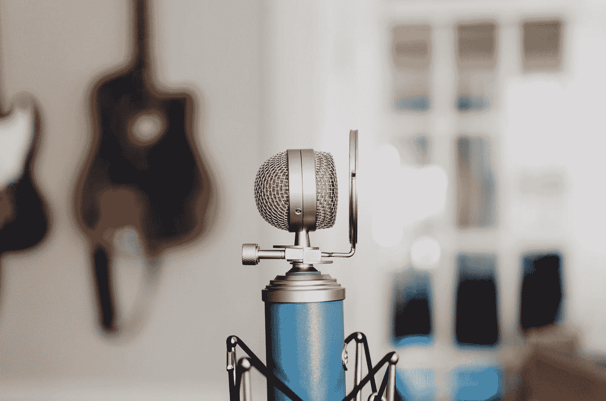
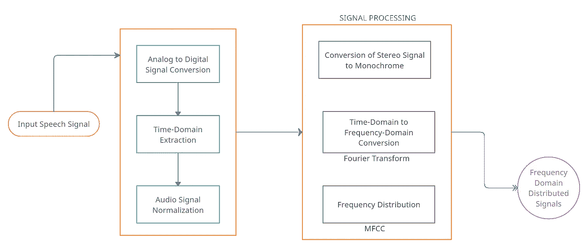
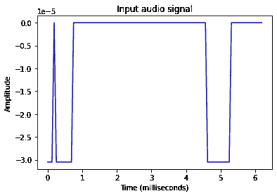
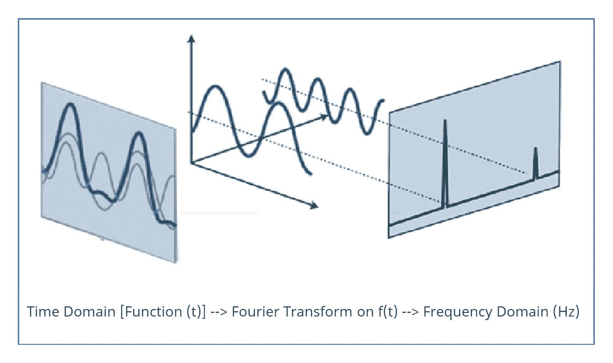
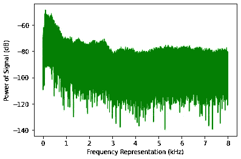
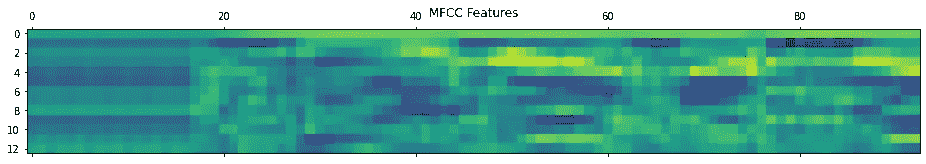
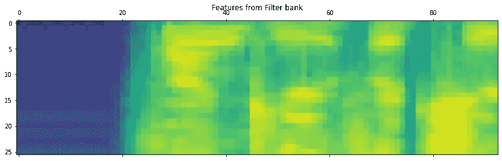
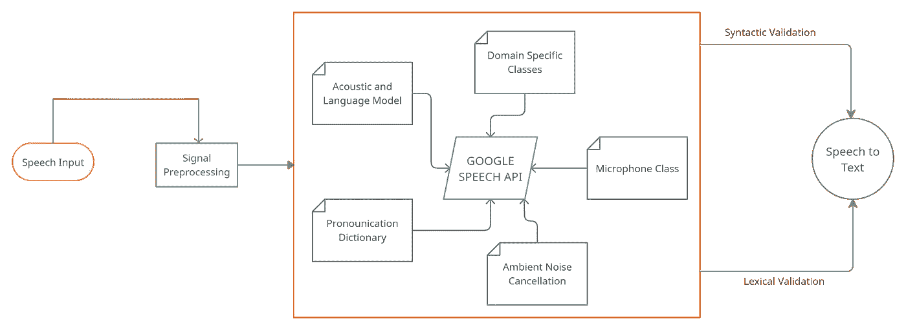

# Python 中语音识别和音频信号处理的分步指南

> 原文：<https://towardsdatascience.com/a-step-by-step-guide-to-speech-recognition-and-audio-signal-processing-in-python-136e37236c24?source=collection_archive---------1----------------------->

## 向机器教授人类词汇的科学



凯利·西克玛在 [Unsplash](https://unsplash.com?utm_source=medium&utm_medium=referral) 上的照片

言语是人类交流的主要形式，也是理解行为和认知的重要组成部分。人工智能中的语音识别是一种部署在计算机程序上的技术，使它们能够理解所说的话。

> 声音和图像、视频一样，也是人类通过感觉器官感知的模拟信号。

对于机器来说，要消耗这些信息，需要将其存储为数字信号，并通过软件进行分析。从模拟到数字的转换包括以下两个过程:

1.  **采样:**是用来将时变(随时间变化)信号 s(t)转换为实数 x(n)的离散级数的过程。采样周期(Ts)是一个术语，定义两个连续离散样本之间的间隔。采样频率(fs = 1/Ts)是采样周期的倒数。常见的采样频率为 8 kHz、16 kHz 和 44.1 kHz。1 Hz 的采样速率意味着每秒一个样本，因此高采样速率意味着更好的信号质量。
2.  **量化:**这是将采样产生的每一个实数用一个近似值代替以获得有限精度(定义在一个比特范围内)的过程。在大多数情况下，每个样本 16 比特用于表示单个量化样本。因此，原始音频样本通常具有-215 到 215 的信号范围，尽管在分析期间，为了更简单的验证和模型训练，这些值被标准化到范围(-1，1)。样本分辨率总是以每个样本的位数来衡量。

通用语音识别系统旨在执行下述任务，并可轻松与[标准数据分析架构](/clean-architecture-of-analyzing-data-7e689da7dd4a)相关联:

1.  捕获人类给出的语音(单词、句子、短语)。你可以将此视为任何通用机器学习工作流程的数据采集部分。
2.  转换音频，使其机器就绪。这个过程是数据预处理部分，在这里我们清除数据的特征，以便机器对其进行处理。
3.  对获取的数据应用自然语言处理(NLP)来理解语音内容。
4.  合成已识别的单词，以帮助机器说出类似的方言。



语音(音频)信号的处理|作者提供的图像

让我们用相应的伪代码逐一详细地介绍所有这些步骤和过程。此外，在我们开始之前，下面是一个完整代码库的链接，可以方便地与本教程一起阅读。

<https://github.com/rjrahul24/ai-with-python-series/tree/main/10.%20AI%20in%20Speech%20Recognition>  

# 步骤 1:读取音频信号文件

***Python 中的文件 I/O(SciPy . io):***SciPy 有很多在 Python 中执行文件操作的方法。包含方法 *read(文件名[，mmap])* 和 *write(文件名，速率，数据)*的 I/O 模块用于读取. wav 文件并以. wav 文件的形式写入 NumPy 数组。我们将使用这些方法读取和写入声音(音频)文件格式。

启动语音识别算法的第一步是创建一个可以读取包含音频文件的系统。wav、. mp3 等。)并理解这些文件中的信息。Python 有一些库，我们可以用它们来读取这些文件，并对它们进行分析。该步骤的目的是将音频信号可视化为结构化的数据点。

*   **记录:**记录是我们给算法作为输入的文件。然后，该算法对该输入进行处理，以分析其内容并建立语音识别模型。这可能是一个保存的文件或一个现场录音，Python 允许两者。
*   **采样:**记录的所有信号都以数字化方式存储。这些数字签名对软件来说很难处理，因为机器只能理解数字输入。 ***采样*** 是用于将这些数字信号转换成离散数字形式的技术。采样以一定的频率进行，并产生数字信号。频率水平的选择取决于人类对声音的感知。例如，选择高频率意味着人类对该音频信号的感知是连续的。

```
# Using IO module to read Audio Files
from scipy.io import wavfile
freq_sample, sig_audio = wavfile.read("/content/Welcome.wav")# Output the parameters: Signal Data Type, Sampling Frequency and Duration
print('\nShape of Signal:', sig_audio.shape)
print('Signal Datatype:', sig_audio.dtype)
print('Signal duration:', round(sig_audio.shape[0] / float(freq_sample), 2), 'seconds')
***>>> Shape of Signal: (645632,) 
>>> Signal Datatype: int16 
>>> Signal duration: 40.35 seconds***# Normalize the Signal Value and Plot it on a graph
pow_audio_signal = sig_audio / np.power(2, 15)
pow_audio_signal = pow_audio_signal [:100]
time_axis = 1000 * np.arange(0, len(pow_audio_signal), 1) / float(freq_sample)plt.plot(time_axis, pow_audio_signal, color='blue')
```



作者图片

*这是输入文件的声音振幅相对于播放持续时间的表示。我们已经成功地从音频中提取了数字数据。wav)文件。*

# 步骤 2:转换音频

我们在第一部分中所做的音频信号表示代表一个**时域音频信号。**显示声波相对于时间的强度(响度或振幅)。振幅= 0 的部分表示静音。

> 就声音工程学而言，振幅= 0 是指当环境中没有其他声音时，静止或运动的空气粒子发出的声音。

**频域表示:**为了更好的理解一个音频信号，有必要通过频域来看。音频信号的这种表示将为我们提供信号中不同频率存在的细节。傅立叶变换是一种数学概念，可用于将连续信号从其原始时域状态转换到频域状态。我们将使用 Python 中的傅立叶变换(FT)将音频信号转换为以频率为中心的表示。

**Python 中的傅立叶变换:**傅立叶变换是一个数学概念，可以分解这个信号，带出各个频率。这对于理解所有组合在一起形成我们听到的声音的频率是至关重要的。傅立叶变换(FT)给出了信号中存在的所有频率，还显示了每个频率的幅度。

> 所有音频信号都是由许多单频声波的集合组成，这些声波一起传播，并在运动介质(例如房间)中产生干扰。捕捉声音本质上是捕捉这些波在空间中产生的振幅。

**NumPy (np.fft.fft):** 这个 NumPy 函数允许我们计算一维离散傅立叶变换。该函数使用快速傅立叶变换(FFT)算法将给定序列转换为离散傅立叶变换(DFT)。在我们正在处理的文件中，我们有一个从音频文件中提取的幅度序列，它最初是从连续信号中采样的。我们将使用该函数将该时域信号转换为离散的频域信号。



音频信号从时域到频域的转换|图片由作者提供

现在让我们浏览一些代码来实现对音频信号的傅立叶变换，目的是用声音的强度(分贝(dB))来表示声音

```
# Working on the same input file
# Extracting the length and the half-length of the signal to input to the foruier transform
sig_length = len(sig_audio)
half_length = np.ceil((sig_length + 1) / 2.0).astype(np.int)# We will now be using the Fourier Transform to form the frequency domain of the signal
signal_freq = np.fft.fft(sig_audio)# Normalize the frequency domain and square it
signal_freq = abs(signal_freq[0:half_length]) / sig_length
signal_freq **= 2
transform_len = len(signal_freq)# The Fourier transformed signal now needs to be adjusted for both even and odd cases
if sig_length % 2:
  signal_freq[1:transform_len] *= 2
else:
  signal_freq[1:transform_len-1] *= 2# Extract the signal's strength in decibels (dB)
exp_signal = 10 * np.log10(signal_freq)
x_axis = np.arange(0, half_length, 1) * (freq_sample / sig_length) / 1000.0plt.plot(x_axis, exp_signal, color='green', linewidth=1)
```



作者图片

*这样，我们就能够对音频输入文件进行傅立叶变换，并随后看到音频的频域(频率对信号强度)表示。*

# 步骤 3:从语音中提取特征

一旦语音从时域信号转换为频域信号，下一步就是将频域数据转换为可用的特征向量。在开始之前，我们必须了解一个叫做 MFCC 的新概念。

## **梅尔频率倒谱系数**

MFCC 是一种旨在从音频信号中提取特征的技术。它使用 MEL 标度来划分音频信号的频带，然后从每个单独的频带中提取系数，从而在频率之间创建分离。MFCC 使用离散余弦变换(DCT)来执行这个操作。MEL 标度建立在人类对声音的感知上，即人脑如何处理音频信号并区分不同的频率。下面让我们来看看梅尔标度的形成。

*   **人声声音感知:**成年人的基本听力范围为 85 Hz 至 255 Hz，并且这可以进一步区分性别(男性为 85Hz 至 180 Hz，女性为 165 Hz 至 255 Hz)。在这些基频之上，还有人耳处理的谐波。谐波是基频的倍数。这些是简单的乘法器，例如，100 Hz 频率的二次谐波将是 200 Hz，三次谐波将是 300 Hz，等等。

> 人类的粗略听觉范围是 20Hz 到 20KHz，这种声音感知也是非线性的。与高频声音相比，我们可以更好地分辨低频声音。例如，我们可以清楚地说出 100 赫兹和 200 赫兹信号之间的区别，但不能区分 15000 赫兹和 15100 赫兹。为了产生不同频率的音调，我们可以使用上面的程序或者使用这个[工具。](http://www.szynalski.com/tone-generator/)

*   **梅尔标度:** Stevens、Volkmann 和 Newmann 在 1937 年提出了一种向世界介绍梅尔标度的方法。它是一种音高音阶(具有不同音高水平的音频信号的音阶),由人类根据它们的距离相等来判断。它基本上是一个源自人类感知的尺度。例如，如果你接触到两个相距很远的声源，大脑会感知到这两个声源之间的距离，而不会实际看到它们。这个标度是基于我们人类如何用听觉测量音频信号距离。因为我们的感知是非线性的，这个尺度上的距离随着频率而增加。
*   **梅尔间隔滤波器组:**为了计算每个频带的功率(强度)，第一步是区分可用的不同特征频带(由 MFCC 完成)。一旦进行了这些分离，我们就使用滤波器组在频率中创建分区并将它们分开。可以使用分区的任何指定频率来创建滤波器组。随着频率的增加，滤波器组中滤波器之间的间距呈指数增长。在代码部分，我们将了解如何分离频带。

## **MFCC 和滤波器组的数学**

MFCC 和滤波器组的创建都是由音频信号的性质所激发，并受到人类感知声音的方式的影响。但是这种处理也需要大量的数学计算，这些计算在其实现过程中是幕后进行的。Python 直接为我们提供了构建滤波器和对声音执行 MFCC 功能的方法，但让我们看一下这些函数背后的数学原理。

> 进入该处理的三个离散数学模型是**离散余弦变换(DCT)** ，用于滤波器组系数的去相关，也称为声音白化，以及**高斯混合模型——隐马尔可夫模型(GMMs-HMMs)** ，它是**自动语音识别(ASR)算法的标准**。

虽然，在今天，当计算成本下降时(由于云计算)，深度学习语音系统对噪声不太敏感，被用于这些技术之上。

> DCT 是一种线性变换算法，因此它会排除许多有用的信号，因为声音是高度非线性的。

```
# Installing and importing necessary libraries
pip install python_speech_features
from python_speech_features import mfcc, logfbank
sampling_freq, sig_audio = wavfile.read("Welcome.wav")*# We will now be taking the first 15000 samples from the signal for analysis* sig_audio = sig_audio[:15000]*# Using MFCC to extract features from the signal* mfcc_feat = mfcc(sig_audio, sampling_freq)
print('\nMFCC Parameters\nWindow Count =', mfcc_feat.shape[0])
print('Individual Feature Length =', mfcc_feat.shape[1])
***>>> MFCC Parameters Window Count = 93 
>>> Individual Feature Length = 13***mfcc_feat = mfcc_feat.T
plt.matshow(mfcc_feat)
```



*每段下面的第一条水平黄线是基频，处于最强状态。黄线上方是谐波，它们之间的频率距离相同。|作者图片*

```
*# Generating filter bank features* fb_feat = logfbank(sig_audio, sampling_freq)
print('\nFilter bank\nWindow Count =', fb_feat.shape[0])
print('Individual Feature Length =', fb_feat.shape[1])
***>>> Filter bank Window Count = 93
>>> Individual Feature Length = 26***fb_feat = fb_feat.T
plt.matshow(fb_feat)
```



作者图片

如果我们看到这两个分布，很明显，低频和高频声音分布在第二个图像中是分开的。

> MFCC 连同滤波器组的应用是分离高频和低频信号的好算法。这加快了分析过程，因为我们可以将声音信号分成两个或多个独立的片段，并根据它们的频率单独进行分析。

# 第四步:识别口语单词

语音识别是理解人类声音并在机器中将其转录为文本的过程。有几个库可用于处理语音到文本，即 Bing 语音、Google 语音、Houndify、IBM 语音到文本等。我们将使用谷歌语音库将语音转换成文本。

## **谷歌语音 API**

关于谷歌语音 API 的更多信息可以从[谷歌云页面](https://cloud.google.com/speech-to-text)和[语音识别](https://pypi.org/project/SpeechRecognition/) PyPi 页面中阅读。Google Speech API 能够实现的几个关键特性是语音的自适应。这意味着 API 理解语音的领域。例如，货币、地址、年份都被规定到语音到文本的转换中。在算法中定义了特定于域的类别，这些类别识别输入语音中的这些出现。在当前的工作环境中，API 既可以处理现场预录制的文件，也可以处理麦克风上的现场录音。在下一节中，我们将通过麦克风输入来分析现场语音。



Google Speech API 的架构流程|作者图片

1.  **使用麦克风:**py audio 开源包允许我们通过连接的麦克风直接录制音频，并使用 Python 进行实时分析。PyAudio 的安装会因操作系统而异(安装说明在下面的代码部分提到)。
2.  **麦克风类:**的实例。microphone()类可以与语音识别器一起使用，直接在工作目录中记录音频。要检查麦克风在系统中是否可用，请使用 list_microphone_names 静态方法。要使用任何列出的可用麦克风，请使用 device_index 方法(实现如下面的代码所示)
3.  **捕获麦克风输入:**listen()函数用于捕获麦克风的输入。所选麦克风接收的所有声音信号都存储在调用 listen()函数的变量中。这种方法持续记录，直到检测到无声(0 振幅)信号。
4.  **降低环境噪音:**任何功能环境都容易产生环境噪音，从而妨碍录音。因此，Recognizer 类中的 adjust_for_ambient_noise()方法有助于自动消除录音中的环境噪音。
5.  **声音识别:**下面的语音识别工作流程解释了信号处理后的部分，其中 API 执行诸如语义和语法纠正的任务，理解声音域、口语，并最终通过将语音转换为文本来创建输出。下面我们还将看到使用 Microphone 类实现 Google 的语音识别 API。

```
# Install the SpeechRecognition and pipwin classes to work with the Recognizer() class
pip install SpeechRecognition
pip install pipwin# Below are a few links that can give details about the PyAudio class we will be using to read direct microphone input into the Jupyter Notebook
# [https://anaconda.org/anaconda/pyaudio](https://anaconda.org/anaconda/pyaudio)
# [https://www.lfd.uci.edu/~gohlke/pythonlibs/#pyaudio](https://www.lfd.uci.edu/~gohlke/pythonlibs/#pyaudio)
# To install PyAudio, Run in the Anaconda Terminal CMD: conda install -c anaconda pyaudio
# Pre-requisite for running PyAudio installation - Microsoft Visual C++ 14.0 or greater will be required. Get it with "Microsoft C++ Build Tools" : [https://visualstudio.microsoft.com/visual-cpp-build-tools/](https://visualstudio.microsoft.com/visual-cpp-build-tools/)
# To run PyAudio on Colab, please install PyAudio.whl in your local system and give that path to colab for installationpip install pyaudio
import speech_recognition as speech_recog# Creating a recording object to store input
rec = speech_recog.Recognizer()# Importing the microphone class to check availabiity of microphones
mic_test = speech_recog.Microphone()# List the available microphones
speech_recog.Microphone.list_microphone_names()# We will now directly use the microphone module to capture voice input. Specifying the second microphone to be used for a duration of 3 seconds. The algorithm will also adjust given input and clear it of any ambient noisewith speech_recog.Microphone(device_index=1) as source: 
    rec.adjust_for_ambient_noise(source, duration=3)
    print("Reach the Microphone and say something!")
    audio = rec.listen(source)***>>> Reach the Microphone and say something!***# Use the recognize function to transcribe spoken words to text
try:
    print("I think you said: \n" + rec.recognize_google(audio))
except Exception as e:
    print(e)
***>>> I think you said: 
>>> hi hello hello hello***
```

我们的语音识别和声音分析文章到此结束。我仍然建议您浏览参考资料部分提到的链接和故事顶部链接的代码库，以便能够在每一步都遵循它。

> 这是一个总结！

# 结论

语音识别是一个人工智能概念，允许机器听人的声音，并从中转录文本。尽管本质上很复杂，但围绕语音识别的用例是很多的。从帮助不同能力的用户访问计算到自动应答机器，自动语音识别(ASR)算法目前正在被许多行业使用。本章简要介绍了声音分析工程，并展示了一些处理音频的基本技巧。虽然不详细，但它将有助于创建一个语音分析在人工智能世界中如何工作的整体画面。


[수안 최](https://unsplash.com/@suanmoo?utm_source=medium&utm_medium=referral) 在 [Unsplash](https://unsplash.com?utm_source=medium&utm_medium=referral) 上拍照

## 关于我

我是 Rahul，目前在研究人工智能，在 Xbox 游戏上实现大数据分析。我在微软工作。除了专业工作之外，我还试图制定一个程序，来理解如何通过使用人工智能来改善世界上发展中国家的经济状况。

我现在在纽约的哥伦比亚大学，你可以通过 [LinkedIn](https://www.linkedin.com/in/rjrahul24/) 和 [Twitter](https://twitter.com/rjrahul24) 与我联系。

## [参考文献]

1.  [https://www.ibm.com/cloud/learn/speech-recognition](https://www.ibm.com/cloud/learn/speech-recognition)
2.  [https://www . science direct . com/topics/engineering/speech-recognition](https://www.sciencedirect.com/topics/engineering/speech-recognition)
3.  [https://signalprocessingsociety . org/publications-resources/blog/what-are-benefits-speech-recognition-technology](https://signalprocessingsociety.org/publications-resources/blog/what-are-benefits-speech-recognition-technology)
4.  [https://www . analyticsvidhya . com/blog/2021/01/自动语音识别和自然语言处理简介/](https://www.analyticsvidhya.com/blog/2021/01/introduction-to-automatic-speech-recognition-and-natural-language-processing/)
5.  [https://cloud.google.com/speech-to-text](https://cloud.google.com/speech-to-text)
6.  [https://www . analyticsvidhya . com/blog/2021/06/MFCC-technique-for-speech-recognition/](https://www.analyticsvidhya.com/blog/2021/06/mfcc-technique-for-speech-recognition/)
7.  【https://www.google.com/intl/en/chrome/demos/speech.html 
8.  https://OCW . MIT . edu/courses/electrical-engineering-and-computer-science/6-345-automatic-speech-recognition-spring-2003/lecture-notes/lecture 5 . pdf
9.  [https://towards data science . com/understanding-audio-data-Fourier-transform-FFT-spectrogram-and-speech-recognition-a 4072d 228520](/understanding-audio-data-fourier-transform-fft-spectrogram-and-speech-recognition-a4072d228520)
10.  [https://haythamfayek . com/2016/04/21/speech-processing-for-machine-learning . html](https://haythamfayek.com/2016/04/21/speech-processing-for-machine-learning.html)