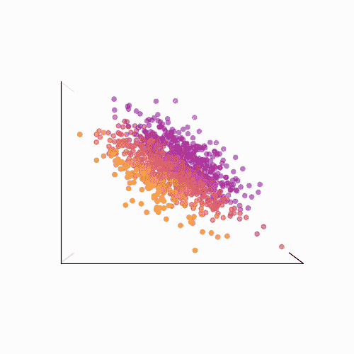
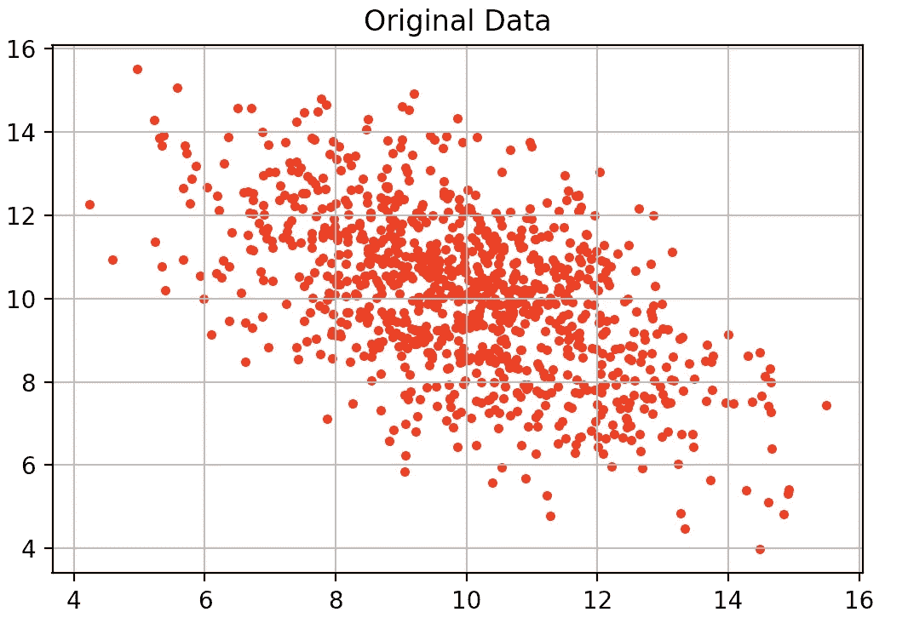
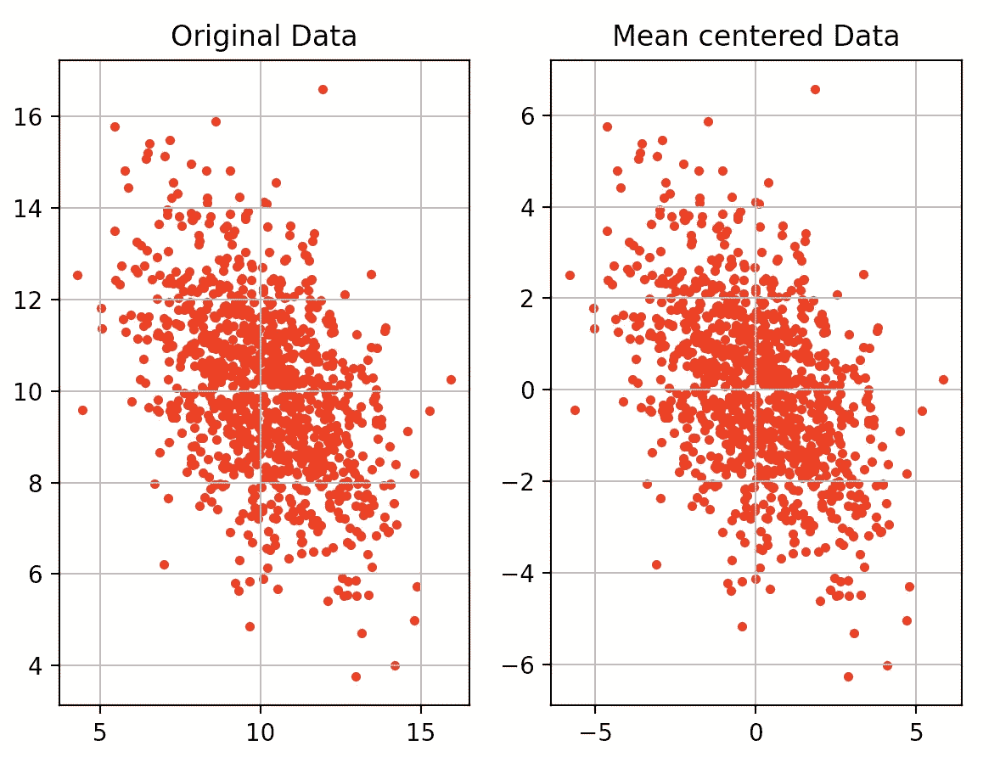
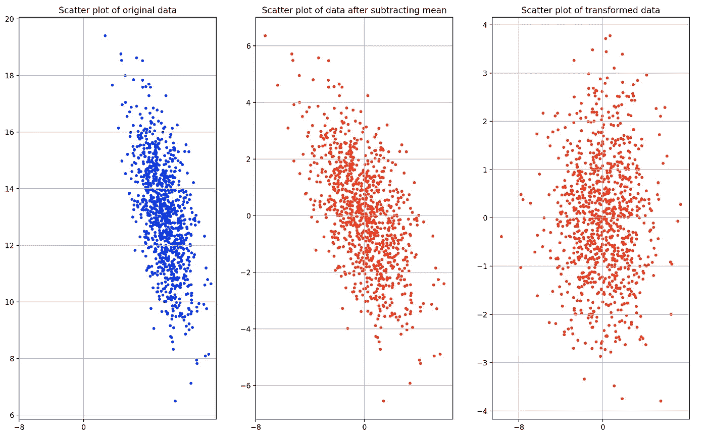
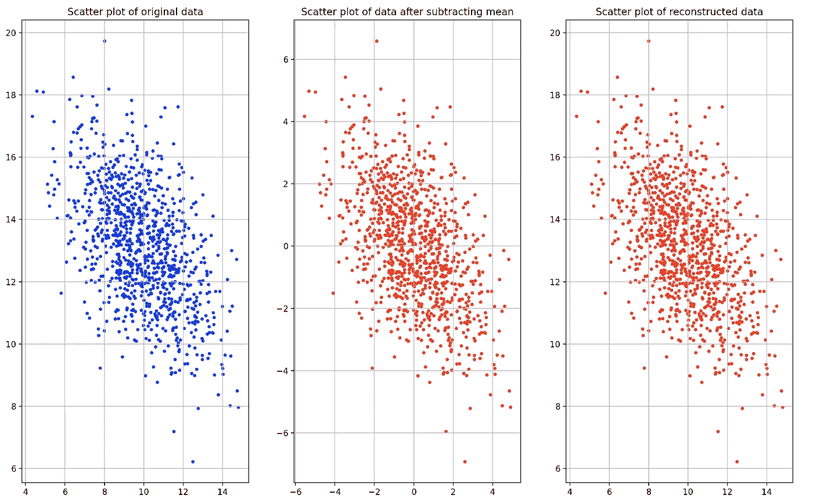

# 主成分分析的逐步实现

> 原文：<https://towardsdatascience.com/a-step-by-step-implementation-of-principal-component-analysis-5520cc6cd598?source=collection_archive---------2----------------------->

## 一个分步教程，解释 PCA 的工作原理，并从头开始用 python 实现它

作者图片

# 介绍

主成分分析(PCA)是一种常用的降维方法。它的工作原理是计算主成分并执行基变换。它保留最大方差方向的数据。减少的特征彼此不相关。这些特征可用于无监督聚类和分类。为了降低维数，自动编码器是另一种常用的方法。但是，自动编码器的潜在空间不一定是不相关的。而 PCA 保证所有特征彼此不相关。

首先，PCA 计算协方差矩阵。然后我们找到协方差矩阵的特征向量和特征值。之后，我们沿着特征向量投影数据。如果原始数据的维数为 **n** ，我们可以将维数减少到 **k，**使得 **k≤ n.**

在本教程中，我们将从头开始实现 PCA，并理解每一步的意义。

# 履行

首先，导入库。

## 步骤 1:创建随机数据

通过从多元正态分布中随机抽取样本来创建数据。我们将从二维数据开始。

意思是，mu 是:[10，13]。

协方差矩阵，sigma 为:[[3.5 -1.8]，[-1.8，3.5]]。

这是数据的散点图:

原始数据散点图

## 步骤 2:均值居中/归一化数据

在 PCA 之前，我们将数据标准化/规范化。

通常，进行归一化是为了使所有要素的比例相同。例如，对于房价预测数据集，我们有不同的功能。价格以美元为单位，而面积以平方为单位。制成现在，该算法将认为数值越高越重要。因此，我们需要在同一范围内对所有特征进行归一化。

进行均值居中以确保第一主分量在最大方差的方向上。

我们将通过从所有特征或通道中减去平均值来进行均值居中。

原始数据(左)和平均值居中数据(右)的散点图

## 步骤 3:计算协方差矩阵

现在，我们计算所有特征维度的协方差。每个协方差矩阵都是对称的和半正定的。它有正交的特征向量。

协方差矩阵的大小将是(2×2)。

## 步骤 4:计算协方差矩阵的特征向量

现在，我们执行协方差矩阵的特征分解，我们将得到特征向量和特征值。(特征值/向量的数量将与特征/通道的数量相同。)

每个特征向量代表一个方差方向。对应于最大特征值的特征向量将给出最大方差的方向。这是第一个主成分。然后，对应于第二大特征值的特征向量将给出第二大方差的方向。这是第二个主成分。诸如此类。

因此，我们需要根据特征值的降序对特征向量进行排序。记住，所有的特征向量都是相互正交的。

## 步骤 5:计算解释的方差并选择 N 个分量

我们可以基于我们想要的压缩程度来选择顶部的 ***k*** 特征向量。

选择组件数量的最佳方法是计算每个特征的解释方差。我们通过将特征值除以所有特征值的总和来计算解释方差。然后，我们取所有特征值的累积和。

这里的特征值是:[5.50，1.72]。

特征值之和为:7.22

解释方差为:[0.76，0.23]

累计解释方差为:[0.76，0.99]

因此，当我们有更高维度的数据时，我们通常以这样一种方式获取 ***k*** 分量，从而得到 0.95 或更大的解释方差。

在本文中，我们将选择这两个组件来解释 PCA 的工作原理。

## 步骤 6:使用特征向量转换数据

现在，我们将我们的数据与特征向量进行点积，以获得我们的数据在这些特征向量方向上的投影。

这是转换数据的散点图:

原始数据的散点图(左)，平均中心数据(中)，PCA 后的转换数据(右)

在散点图中，我们可以看到 PCA 后，y 轴是方差最大的方向。例如，如果我们将 10 维数据简化为 2 维数据，我们将得到沿两个垂直方向的具有最大方差的投影。

## 步骤 7:反转 PCA 并重建原始数据

我们还可以通过取特征向量的转置与变换数据的点积来重构原始数据。请记住，我们在开始时从数据中减去平均值，以使数据居中。所以，现在我们需要加上平均值。

所有的特征向量都是相互正交的。所以，当我们取特征向量的点积时，我们得到一个单位矩阵。

> X = X —平均值
> 
> pca_X = X * V
> 
> recon _ X =(PCA _ X * V ')+mean =((X * V)* V ')+mean =(X *(V * V ')+mean =(X * I)+mean = X+mean

*PCA _ X:PCA 后的变换数据*

*recon_X:重建数据*

*V:特征向量矩阵*

平均值:每个维度/通道的平均值

所以，我们可以从 k 个分量重建 X。

> *如果原始数据的形状为:num_samp x N.*
> 
> *那么，协方差矩阵的形状将是:N×N。特征向量的形状也将是 N×N。*
> 
> *如果我们选择顶部 d 个特征向量，我们得到形状的特征向量:N×k。*
> 
> *现在，我们将原始数据与前 d 个特征向量进行点积。因此，在使用 PCA 转换数据后，我们将得到如下形状:num_samp x k.*
> 
> *当我们将重构数据时，我们用顶部 d 个特征向量的转置来取 pca 数据的点积。因此，我们将有形状:*
> 
> *(num _ samp x k)*(N x k)' =(num _ samp x N)。*

这是重建数据的散点图:

原始数据的散点图(左)，平均中心数据(中)，反转 PCA 后的重建数据(右)

您还可以计算重建损失:

在这种情况下，重建损失为:2.6426840324903897e-32。

它非常低，因为我们使用了所有组件来重建数据。

完整的代码库可从以下网址获得:

<https://github.com/AdityaDutt/PCATutorial/blob/main/PCA_tutorial.ipynb>  

在本教程中，我们没有降低维度。但是我们可以取前 N 个特征向量并计算其与原始数据的点积来获得 PCA 特征。其他都一样。

您可以签出这个库中的代码来减少特性。

# 外卖食品

1.  PCA 是一种正交线性变换。
2.  PCA 给出不相关的特征。(自动编码器将给出相关的特征，它们也可以模拟非线性数据)
3.  协方差矩阵是对称且半正定的。
4.  协方差矩阵的特征向量彼此正交。
5.  PCA 可以被反转以重建数据。
6.  我们还可以使用 PCA 来检测异常值。当我们将使用 k 个分量重建数据时，k≤n，其中 n 是原始维度，异常值将给出更高的重建损失。我们可以计算离群值和非离群值的重建损失直方图。然后选择一个阈值来丢弃异常值。
7.  PCA 特征也可以用于聚类和分类。我们可以将这些简化的特征输入神经网络。

> 我希望这篇文章对你有用。
> 
> *如果您有关于 PCA 和使用 PCA 进行异常值检测的其他问题，并且需要帮助，请告诉我。我将在以后的文章中尝试介绍它们。*

***非常感谢您的阅读！*🙂**